### ***Note: This repo is a fork of [Town of Us Reactivated](https://github.com/eDonnes124/Town-Of-Us-R) and is currently under development.***
### ***Also Note: This mod is NOT for mobile and console versions and is NOT host only either, do not ask for a port or a rewrite.***

-----------------------

    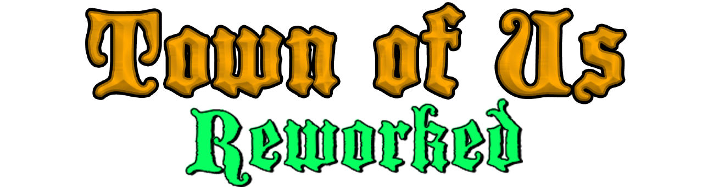
    
Town Of Us but better! (hopefully)

    
    
    
    

An [Among Us](https://store.steampowered.com/app/945360/Among_Us) mod that adds a bunch of features!

This mod is a mish mash of code and ideas from different games, mods and forks, mainly from Town Of Salem, Town Of Us Reactivated and The Other Roles. Enjoy the chaos that comes out as a result!

Join our [Discord](https://discord.gg/cd27aDQDY9) if you have any problems or want to find people to play with!

Check out the mod's [wiki](https://github.com/AlchlcDvl/TownOfUsReworked/wiki) for info!

Quick warning: This mod adds a whole LOT of stuff, and is currently not very beginner friendly. I've added a bunch of helpful wiki entries to make the mod easier to understand, but it's still a lot of reading you're going to have to do.

-----------------------

# Contents

[**Contents**](#contents)

[**Releases**](#releases)

[**Changelogs**](https://github.com/AlchlcDvl/TownOfUsReworked/wiki/Changelog)

[**Installation**](https://github.com/AlchlcDvl/TownOfUsReworked/wiki/Installation)
- [Requirements](https://github.com/AlchlcDvl/TownOfUsReworked/wiki/Installation#requirements)
- [Steam Guide](https://github.com/AlchlcDvl/TownOfUsReworked/wiki/Installation#steam-guide)
- [Epic Games Guide](https://github.com/AlchlcDvl/TownOfUsReworked/wiki/Installation#epic-games-guide)
- [Linux Guide](https://github.com/AlchlcDvl/TownOfUsReworked/wiki/Installation#linux-guide)
- [Results](https://github.com/AlchlcDvl/TownOfUsReworked/wiki/Installation#results)
- [Issues](https://github.com/AlchlcDvl/TownOfUsReworked/wiki/Installation#issues)
- [Fatal Error in GC](https://github.com/AlchlcDvl/TownOfUsReworked/wiki/Installation#fatal-error-in-gc)
- [Uninstallation](https://github.com/AlchlcDvl/TownOfUsReworked/wiki/Installation#uninstallation)

[**Differences**](https://github.com/AlchlcDvl/TownOfUsReworked/wiki/Differences)

[**Player Layers**](#player-layers)

| [Intruders](#intruder-roles)       | [Syndicate](#syndicate-roles) | [Crew](#crew-roles)               | [Neutrals](#neutral-roles)        | [Game Mode](#game-mode-roles) |
|------------------------------------|-------------------------------|-----------------------------------|-----------------------------------|-------------------------------|
| [Ambusher](#ambusher)              | [Anarchist](#anarchist)       | [Altruist](#altruist)             | [Actor](#actor)                   | [Hunted](#hunted)             |
| [Blackmailer](#blackmailer)        | [Banshee](#banshee)           | [Bastion](#bastion)               | [Amnesiac](#amnesiac)             | [Hunter](#hunter)             |
| [Camouflager](#camouflager)        | [Bomber](#bomber)             | [Chameleon](#chameleon)           | [Arsonist](#arsonist)             | [Runner](#runner)             |
| [Consigliere](#consigliere)        | [Collider](#collider)         | [Coroner](#coroner)               | [Betrayer](betrayer)              |                               |
| [Consort](#consort)                | [Concealer](#concealer)       | [Crewmate](#crewmate)             | [Bounty Hunter](#bounty-hunter)   |                               |
| [Disguiser](#disguiser)            | [Crusader](#crusader)         | [Detective](#detective)           | [Cannibal](#cannibal)             |                               |
| [Enforcer](#enforcer)              | [Drunkard](#drunkard)         | [Dictator](#dictator)             | [Cryomaniac](#cryomaniac)         |                               |
| [Ghoul](#ghoul)                    | [Framer](#framer)             | [Engineer](#engineer)             | [Dracula](#dracula)               |                               |
| [Godfather](#godfather)            | [Poisoner](#poisoner)         | [Escort](#escort)                 | [Executioner](#executioner)       |                               |
| [Grenadier](#grenadier)            | [Rebel](#rebel)               | [Mayor](#mayor)                   | [Glitch](#glitch)                 |                               |
| [Impostor](#impostor)              | [Shapeshifter](#shapeshifter) | [Medic](#medic)                   | [Guardian Angel](#guardian-angel) |                               |
| [Janitor](#janitor)                | [Sidekick](#sidekick)         | [Medium](#medium)                 | [Guesser](#guesser)               |                               |
| [Mafioso](#mafioso)                | [Silencer](#silencer)         | [Monarch](#monarch)               | [Jackal](#jackal)                 |                               |
| [Miner/Herbalist](#minerherbalist) | [Spellslinger](#spellslinger) | [Mystic](#mystic)                 | [Jester](#jester)                 |                               |
| [Morphling](#morphling)            | [Stalker](#stalker)           | [Operative](#operative)           | [Juggernaut](#juggernaut)         |                               |
| [Teleporter](#teleporter)          | [Timekeeper](#timekeeper)     | [Retributionist](#retributionist) | [Murderer](#murderer)             |                               |
| [Wraith](#wraith)                  | [Warper](#warper)             | [Revealer](#revealer)             | [Necromancer](#necromancer)       |                               |
|                                    |                               | [Seer](#seer)                     | [Pestilence](#pestilence)         |                               |
|                                    |                               | [Sheriff](#sheriff)               | [Phantom](#phantom)               |                               |
|                                    |                               | [Shifter](#shifter)               | [Plaguebearer](#plaguebearer)     |                               |
|                                    |                               | [Tracker](#tracker)               | [Serial Killer](#serial-killer)   |                               |
|                                    |                               | [Transporter](#transporter)       | [Survivor](#survivor)             |                               |
|                                    |                               | [Trapper](#trapper)               | [Thief](#thief)                   |                               |
|                                    |                               | [Vampire Hunter](#vampire-hunter) | [Troll](#troll)                   |                               |
|                                    |                               | [Veteran](#veteran)               | [Werewolf](#werewolf)             |                               |
|                                    |                               | [Vigilante](#vigilante)           | [Whisperer](#whisperer)           |                               |

| [Modifiers](#modifiers)       | [Abilities](#abilities)       | [Objectifiers](#objectifiers) |
|-------------------------------|-------------------------------|-------------------------------|
| [Astral](#astral)             | [Assassin](#assassin)         | [Allied](#allied)             |
| [Bait](#bait)                 | [Button Barry](#button-barry) | [Corrupted](#corrupted)       |
| [Colorblind](#colorblind)     | [Insider](#insider)           | [Defector](#defector)         |
| [Coward](#coward)             | [Multitasker](#multitasker)   | [Fanatic](#fanatic)           |
| [Diseased](#diseased)         | [Ninja](#ninja)               | [Linked](#linked)             |
| [Drunk](#drunk)               | [Politician](#politician)     | [Lovers](#lovers)             |
| [Dwarf](#dwarf)               | [Radar](#radar)               | [Mafia](#mafia)               |
| [Giant](#giant)               | [Ruthless](#ruthless)         | [Overlord](#overlord)         |
| [Indomitable](#indomitable)   | [Snitch](#snitch)             | [Rivals](#rivals)             |
| [Professional](#professional) | [Swapper](#swapper)           | [Taskmaster](#taskmaster)     |
| [Shy](#shy)                   | [Tiebreaker](#tiebreaker)     | [Traitor](#traitor)           |
| [VIP](#vip)                   | [Torch](#torch)               |                               |
| [Volatile](#volatile)         | [Tunneler](#tunneler)         |                               |
| [Yeller](#yeller)             | [Underdog](#underdog)         |                               |

[**Game Modes**](https://github.com/AlchlcDvl/TownOfUsReworked/wiki/Game-Modes)
- [Vanilla](https://github.com/AlchlcDvl/TownOfUsReworked/wiki/Game-Modes#vanilla)
- [Classic](https://github.com/AlchlcDvl/TownOfUsReworked/wiki/Game-Modes#classic)
- [Killing Only](https://github.com/AlchlcDvl/TownOfUsReworked/wiki/Game-Modes#killing-only)
- [All Any](https://github.com/AlchlcDvl/TownOfUsReworked/wiki/Game-Modes#all-any)
- [Role List](https://github.com/AlchlcDvl/TownOfUsReworked/wiki/Game-Modes#role-list)
- [Custom](https://github.com/AlchlcDvl/TownOfUsReworked/wiki/Game-Modes#custom)
- [Hide And Seek](https://github.com/AlchlcDvl/TownOfUsReworked/wiki/Game-Modes#hide-and-seek)
- [Task Race](https://github.com/AlchlcDvl/TownOfUsReworked/wiki/Game-Modes#task-race)

[**Custom Game Settings**](https://github.com/AlchlcDvl/TownOfUsReworked/wiki/Settings)
- [Layer Settings](https://github.com/AlchlcDvl/TownOfUsReworked/wiki/Settings#layer)
- [Alignment Settings](https://github.com/AlchlcDvl/TownOfUsReworked/wiki/Settings#alignments)
- [Faction Settings](https://github.com/AlchlcDvl/TownOfUsReworked/wiki/Settings#factions)
- [Non-Role Layers Settings](https://github.com/AlchlcDvl/TownOfUsReworked/wiki/Settings#non-role-layers)
- [Crew Settings](#crew-settings)
- [Intruder Settings](#intruder-settings)
- [Syndicate Settings](#syndicate-settings)
- [Neutral Settings](#neutral-settings)
- [Game Settings](https://github.com/AlchlcDvl/TownOfUsReworked/wiki/Settings#game-settings)
- [Game Modifiers](https://github.com/AlchlcDvl/TownOfUsReworked/wiki/Settings#game-modifiers)
- [Game Announcements](https://github.com/AlchlcDvl/TownOfUsReworked/wiki/Settings#game-announcements)
- [Map Settings](https://github.com/AlchlcDvl/TownOfUsReworked/wiki/Settings#map-settings)
- [Better Sabotage Settings](https://github.com/AlchlcDvl/TownOfUsReworked/wiki/Settings#better-sabotage-settings)
- [Better Skeld Settings](https://github.com/AlchlcDvl/TownOfUsReworked/wiki/Settings#better-skeld-settings)
- [Better Mira HQ Settings](https://github.com/AlchlcDvl/TownOfUsReworked/wiki/Settings#better-mira-hq-settings)
- [Better Polus Settings](https://github.com/AlchlcDvl/TownOfUsReworked/wiki/Settings#better-polus-settings)
- [Better Airship Settings](https://github.com/AlchlcDvl/TownOfUsReworked/wiki/Settings#better-airship-settings)
- [Better Fungle Settings](https://github.com/AlchlcDvl/TownOfUsReworked/wiki/Settings#better-fungle-settings)
- [Custom Client Side Options](https://github.com/AlchlcDvl/TownOfUsReworked/wiki/Settings#custom-client-side-options)

[**Mod Info**](https://github.com/AlchlcDvl/TownOfUsReworked/wiki/Mod-Info)
- [Lighter Darker Colors](https://github.com/AlchlcDvl/TownOfUsReworked/wiki/Mod-Info#lighter-darker-colors)
- [Subfactions](https://github.com/AlchlcDvl/TownOfUsReworked/wiki/Mod-Info#subfactions)
- [Syndicate Chaos Drive Role Priority](https://github.com/AlchlcDvl/TownOfUsReworked/wiki/Mod-Info#syndicate-chaos-drive-role-priority)
- [Role List Entries](https://github.com/AlchlcDvl/TownOfUsReworked/wiki/Mod-Info#role-list-entries)
- [New Colors](https://github.com/AlchlcDvl/TownOfUsReworked/wiki/Mod-Info#new-colors)
- [Custom Cosmetics](https://github.com/AlchlcDvl/TownOfUsReworked/wiki/Mod-Info#custom-cosmetics)
- [Bug Reports, Suggestions & Additions](https://github.com/AlchlcDvl/TownOfUsReworked/wiki/Mod-Info#bug--suggestions--additions)
- [Layer Explanation And Assignment](https://github.com/AlchlcDvl/TownOfUsReworked/wiki/Mod-Info#layer-explanation-and-assignment)

[**Credits & Resources**](https://github.com/AlchlcDvl/TownOfUsReworked/wiki/Credits)

[**License**](#license)

-----------------------

# Releases

**Disclaimer: The mod is *not* guaranteed to work on the latest versions of Among Us when the game updates.**

| Among Us           | Mod Version | Download Link                                                                                   |
|--------------------|-------------|-------------------------------------------------------------------------------------------------|
| 2023.11.28 (s & e) | 0.6.4       | [Download](https://github.com/AlchlcDvl/TownOfUsReworked/releases/download/v0.6.4/Reworked.zip) |
| 2023.11.28 (s & e) | 0.6.3       | [Download](https://github.com/AlchlcDvl/TownOfUsReworked/releases/download/v0.6.3/Reworked.zip) |
| 2023.10.24 (s & e) | 0.6.2       | [Download](https://github.com/AlchlcDvl/TownOfUsReworked/releases/download/v0.6.2/Reworked.zip) |
| 2023.10.24 (s & e) | 0.6.1       | [Download](https://github.com/AlchlcDvl/TownOfUsReworked/releases/download/v0.6.1/Reworked.zip) |
| 2023.10.24 (s & e) | 0.6.0       | [Download](https://github.com/AlchlcDvl/TownOfUsReworked/releases/download/v0.6.0/Reworked.zip) |

Older Versions

| Among Us           | Mod Version  | Download Link                                                                                                         |
|--------------------|--------------|-----------------------------------------------------------------------------------------------------------------------|
| 2023.7.12 (s & e)  | 0.5.4        | [Download](https://github.com/AlchlcDvl/TownOfUsReworked/releases/download/v0.5.4/Reworked.zip)                       |
| 2023.7.12 (s & e)  | 0.5.3        | [Download](https://github.com/AlchlcDvl/TownOfUsReworked/releases/download/v0.5.3/Reworked.zip)                       |
| 2023.7.12 (s & e)  | 0.5.2        | [Download](https://github.com/AlchlcDvl/TownOfUsReworked/releases/download/v0.5.2/Reworked.zip)                       |
| 2023.7.12 (s & e)  | 0.5.1        | [Download](https://github.com/AlchlcDvl/TownOfUsReworked/releases/download/v0.5.1/Reworked.zip)                       |
| 2023.7.12 (s & e)  | 0.5.0        | [Download](https://github.com/AlchlcDvl/TownOfUsReworked/releases/download/v0.5.0/Reworked.zip)                       |
| 2023.7.12 (s & e)  | 0.4.5        | [Download](https://github.com/AlchlcDvl/TownOfUsReworked/releases/download/v0.4.5/Reworked.zip)                       |
| 2023.7.12 (s & e)  | 0.4.4        | [Download](https://github.com/AlchlcDvl/TownOfUsReworked/releases/download/v0.4.4/Reworked.zip)                       |
| 2023.7.12 (s & e)  | 0.4.3        | [Download](https://github.com/AlchlcDvl/TownOfUsReworked/releases/download/v0.4.3/Reworked.zip)                       |
| 2023.7.12 (s & e)  | 0.4.2        | [Download](https://github.com/AlchlcDvl/TownOfUsReworked/releases/download/v0.4.2/Reworked.zip)                       |
| 2023.6.13 (s & e)  | 0.4.1        | [Download](https://github.com/AlchlcDvl/TownOfUsReworked/releases/download/v0.4.1/Reworked.zip)                       |
| 2023.6.13 (s & e)  | 0.4.0        | [Download](https://github.com/AlchlcDvl/TownOfUsReworked/releases/download/v0.4.0/Reworked.zip)                       |
| 2023.3.28 (s & e)  | 0.3.1        | [Download](https://github.com/AlchlcDvl/TownOfUsReworked/releases/download/v0.3.1/Reworked.zip)                       |
| 2023.3.28 (s & e)  | 0.3.0        | [Download](https://github.com/AlchlcDvl/TownOfUsReworked/releases/download/v0.3.0/TownOfUsReworked.zip)               |
| 2023.3.28 (s & e)  | 0.2.5        | [Download](https://github.com/AlchlcDvl/TownOfUsReworked/releases/download/v0.2.5/TownOfUsReworked.zip)               |
| 2023.3.28 (s & e)  | 0.2.4        | [Download](https://github.com/AlchlcDvl/TownOfUsReworked/releases/download/v0.2.4/TownOfUsReworked.zip)               |
| 2023.3.28 (s & e)  | 0.2.3        | [Download](https://github.com/AlchlcDvl/TownOfUsReworked/releases/download/v0.2.3/TownOfUsReworked.zip)               |
| 2023.3.28 (s & e)  | 0.2.2        | [Download](https://github.com/AlchlcDvl/TownOfUsReworked/releases/download/v0.2.2/TownOfUsReworked.zip)               |
| 2023.3.28 (s & e)  | 0.2.1        | [Download](https://github.com/AlchlcDvl/TownOfUsReworked/releases/download/v0.2.1/TownOfUsReworked.zip)               |
| 2023.3.28 (s & e)  | 0.2.0        | [Download](https://github.com/AlchlcDvl/TownOfUsReworked/releases/download/v0.2.0/TownOfUsReworked.zip)               |
| 2023.3.28 (s & e)  | 0.1.0-dev1   | [Download](https://github.com/AlchlcDvl/TownOfUsReworked/releases/download/v0.1.0-dev1/TownOfUsReworked.zip)          |
| 2023.3.28 (s & e)  | 0.0.4-dev2   | [Download](https://github.com/AlchlcDvl/TownOfUsReworked/releases/download/v0.0.4-dev2/TownOfUsReworked.zip)          |
| 2023.3.28 (s & e)  | 0.0.4-dev1   | [Download](https://github.com/AlchlcDvl/TownOfUsReworked/releases/download/v0.0.4-dev1/TownOfUsReworked.zip)          |
| 2023.3.28 (s & e)  | 0.0.3-dev3   | [Download](https://github.com/AlchlcDvl/TownOfUsReworked/releases/download/v0.0.3-dev3/TownOfUsReworked.zip)          |
| 2023.3.28 (s & e)  | 0.0.3-dev2   | [Download](https://github.com/AlchlcDvl/TownOfUsReworked/releases/download/v0.0.3-dev2/TownOfUsReworked.zip)          |
| 2023.3.28 (s & e)  | 0.0.3-dev1   | [Download](https://github.com/AlchlcDvl/TownOfUsReworked/releases/download/v0.0.3-dev1/TownOfUsReworked.zip)          |
| 2023.3.28 (s & e)  | 0.0.3        | [Download](https://github.com/AlchlcDvl/TownOfUsReworked/releases/download/v0.0.3/TownOfUsReworked.zip)               |
| 2023.3.28 (s & e)  | 0.0.2dev8.75 | [Download](https://github.com/AlchlcDvl/TownOfUsReworked/releases/download/v0.0.2-dev8.75/TownOfUsReworked.zip)       |
| 2023.3.28 (s & e)  | 0.0.2dev8.5  | [Download](https://github.com/AlchlcDvl/TownOfUsReworked/releases/download/v0.0.2-dev8.5/TownOfUsReworked.zip)        |
| 2023.3.28 (s & e)  | 0.0.2dev8    | [Download](https://github.com/AlchlcDvl/TownOfUsReworked/releases/download/v0.0.2-dev8/TownOfUsReworked.zip)          |
| 2023.2.28 (s & e)  | 0.0.2dev7    | [Download](https://github.com/AlchlcDvl/TownOfUsReworked/releases/download/v0.0.2-dev7/TownOfUsReworked.zip)          |
| 2023.2.28 (s & e)  | 0.0.2dev6    | [Download](https://github.com/AlchlcDvl/TownOfUsReworked/releases/download/v0.0.2-dev6/TownOfUsReworked.zip)          |
| 2023.2.28 (s & e)  | 0.0.2dev5    | [Download](https://github.com/AlchlcDvl/TownOfUsReworked/releases/download/v0.0.2-dev5/TownOfUsReworked.zip)          |
| 2023.2.28 (s & e)  | 0.0.2dev4    | [Download](https://github.com/AlchlcDvl/TownOfUsReworked/releases/download/v0.0.2-dev4/TownOfUsReworked.zip)          |
| 2023.2.28 (s & e)  | 0.0.2dev3    | [Download](https://github.com/AlchlcDvl/TownOfUsReworked/releases/download/v0.0.2-dev3/TownOfUsReworked.zip)          |
| 2023.2.28 (s & e)  | 0.0.2dev2    | [Download](https://github.com/AlchlcDvl/TownOfUsReworked/releases/download/v0.0.2-dev2/ToU-Rew-v0.0.2-dev2.zip)       |
| 2022.12.14 (s & e) | 0.0.1dev19   | [Download](https://github.com/AlchlcDvl/TownOfUsReworked/releases/download/v0.0.1-dev19/ToU-Rew-v0.0.1-dev19.zip)     |
| 2022.12.14 (s & e) | 0.0.1dev18.5 | [Download](https://github.com/AlchlcDvl/TownOfUsReworked/releases/download/v0.0.1-dev18.5/ToU-Rew-v0.0.1-dev18.5.zip) |
| 2022.12.14 (s & e) | 0.0.1dev18   | [Download](https://github.com/AlchlcDvl/TownOfUsReworked/releases/download/v0.0.1-dev18/ToU-Rew-v0.0.1-dev18.zip)     |
| 2022.12.14 (s & e) | 0.0.1dev17   | [Download](https://github.com/AlchlcDvl/TownOfUsReworked/releases/download/v0.0.1-dev17/ToU-Rew-v0.0.1-dev17.zip)     |
| 2022.12.14 (s & e) | 0.0.1dev16   | [Download](https://github.com/AlchlcDvl/TownOfUsReworked/releases/download/v0.0.1-dev16/ToU-Rew-v0.0.1dev16.rar)      |
| 2022.12.14 (s & e) | 0.0.1dev15   | [Download](https://github.com/AlchlcDvl/TownOfUsReworked/releases/download/v0.0.1-dev15/ToU-Rew-v0.0.1dev15.rar)      |
| 2022.12.14 (s & e) | 0.0.1dev14   | [Download](https://github.com/AlchlcDvl/TownOfUsReworked/releases/download/v0.0.1-dev14/ToU-Rew-v0.0.1dev14.rar)      |
| 2022.12.14 (s & e) | 0.0.1dev13.5 | [Download](https://github.com/AlchlcDvl/TownOfUsReworked/releases/download/v0.0.1-dev13.5/ToU-Rew-v0.0.1dev13.5.rar)  |
| 2022.12.14 (s & e) | 0.0.1dev13   | [Download](https://github.com/AlchlcDvl/TownOfUsReworked/releases/download/v0.0.1-dev13/ToU-Rew-v0.0.1dev13.rar)      |

-----------------------

# Player Layers

# Crew Roles

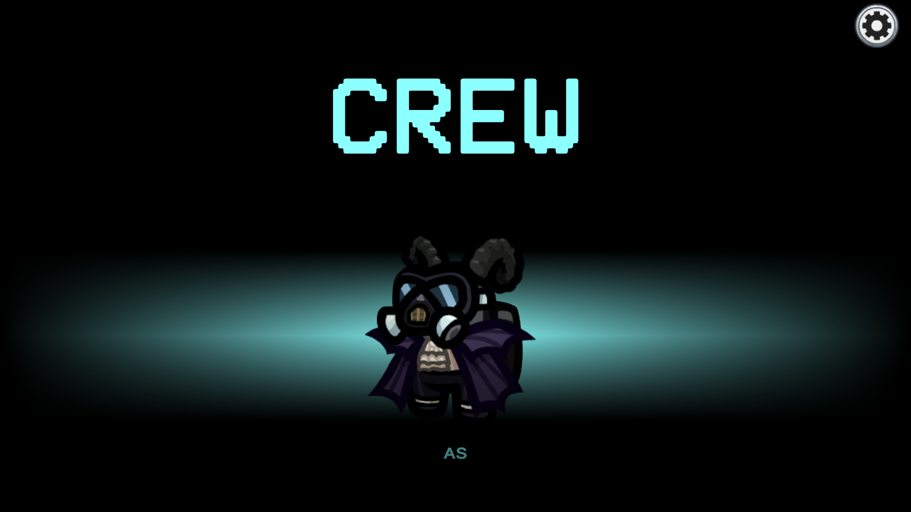

Each member has a special ability which determines who’s who and can help weed out the evils. The main theme of this faction is deduction and goodwill. This faction is an uninformed majority meaning they make up most of the players and don't who the other members are. The Crew can do tasks which sort of act like a timer for non-Crew roles.

### Crew Settings

| Name | Description | Type | Default |
|------|-------------|------|---------|
| Common Tasks | How many common tasks must be assigned | Number | 2 |
| Long Tasks | How many long tasks must be assigned | Number | 1 |
| Short Tasks | How many short tasks must be assigned | Number | 4 |
| Crew Ghost Tasks Count To Win | Dictates whether dead Crew should finish their tasks or not to achieve a task win | Toggle | True |

## Altruist

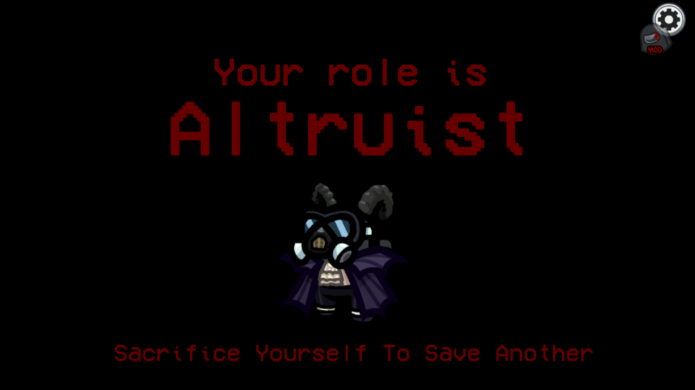

### Alignment: Crew (Protective)
### Origin: Town Of Us, based off of the original Retributionist in Town Of Salem

The Altruist is capable of reviving dead players. After a set period of time, the player will be resurrected, if the revival isn't interrupted. Once a player is revived, all evil players will be notified of the revival and will have an arrow pointing towards the revived player. Once the Altruist uses up all of their ability charges, they sacrifice themselves on the last use of their ability.

### Game Options

| Name | Description | Type | Default |
|------|-------------|------|---------|
| Target's Body Disappears On Beginning Of Revive | Whether the reviving body disappears upon start of the revival | Toggle | False |

## Bastion

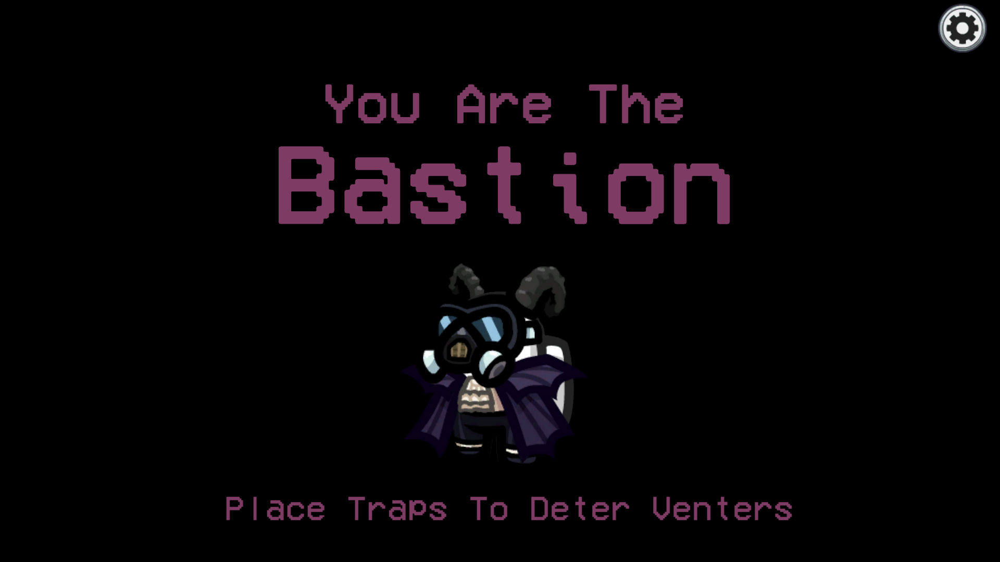

### Alignment: Crew (Killing)
### Origin: Town Of Host: The Other Roles

The Bastion can place bombs in vents. Anyone who tries to interact with the bombed vent will die.

### Game Options

| Name | Description | Type | Default |
|------|-------------|------|---------|
| Bombs Are Removed Upon Kills | Toggles whether the bombs in vents are permanent or not. If not, they disappear after killing someone | Toggle | True |

## Chameleon

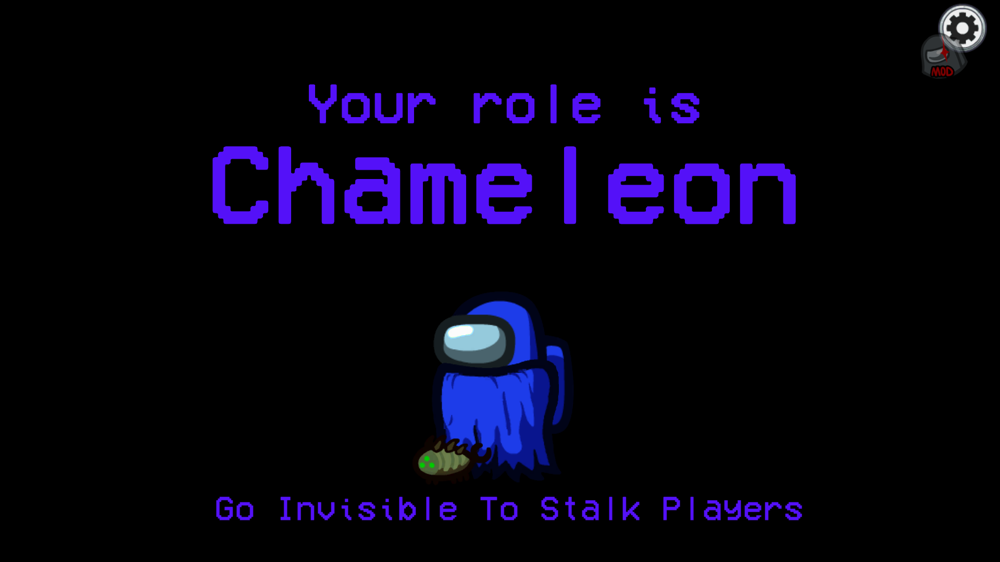

### Alignment: Crew (Support)
### Origin: Town Of Us

The Chameleon can go invisible to stalk players and see what they do when no one is around.

## Coroner

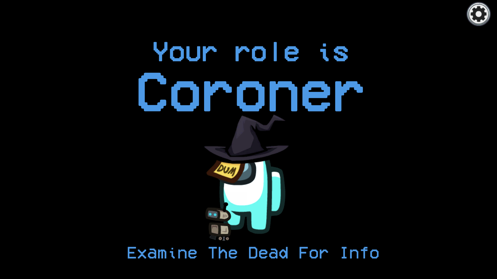

### Alignment: Crew (Investigative)

The Coroner gets an alert when someone dies and briefly gets an arrow pointing in the direction of the body. They can autopsy bodies to get some information. They can then compare that information with players to see if they killed the body or not. The Coroner also gets a body report from the body they reported. The report will include the cause and time of death, player's faction/role, the killer's faction/role and (according to the settings) the killer's name.

### Game Options

| Name | Description | Type | Default |
|------|-------------|------|---------|
| Dead Body Arrow Duration | The duration of the arrows pointing to the bodies | Time | 0.1s |
| Coroner Gets Roles | This dictates whether the Coroner gets the killer's and body's role, otherwise only their factions are revealed | Toggle | False |
| Coroner Gets Killer's Name | This dictates whether the Coroner gets the killer's name from the report | Toggle | False |
| ┗ Coroner Gets Killer's Name Under | This dictates how old must a body be for the Coroner to get the killer's name | Time | 1s |

## Crewmate

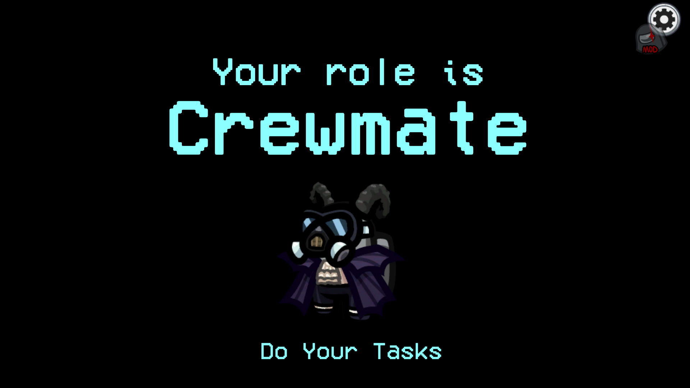

### Alignment: Crew (Utility)
### Origin: Among Us

Just a plain Crew with no abilities and only spawns if all the other roles are taken or set to spawn in Custom mode.

## Detective

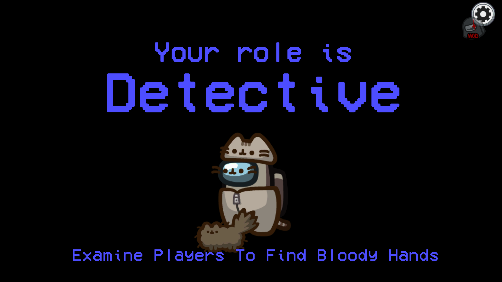

### Alignment: Crew (Investigative)
### Origin: Town Of Us, formed from the fusion of Investigator and Detective and removing body reports

The Detective can examine other players for bloody hands. If the examined player has killed recently, the Detective will be alerted about it. The Detective can also see the footprints of players. All footprints disappear after a set amount of time and only the Detective can see them.

### Game Options

| Name | Description | Type | Default |
|------|-------------|------|---------|
| Bloody Hands Duration | How long players remain bloody after a kill | Time | 10s |
| Footprint Interval | The time interval between two footprints | Time | 0.15s |
| Footprint Duration | The amount of time that the footprint stays on the ground for | Time | 10s |
| Anonymous Footprint | When enabled, all footprints are grey instead of the player's colors | String | Only When Camouflaged |

## Dictator

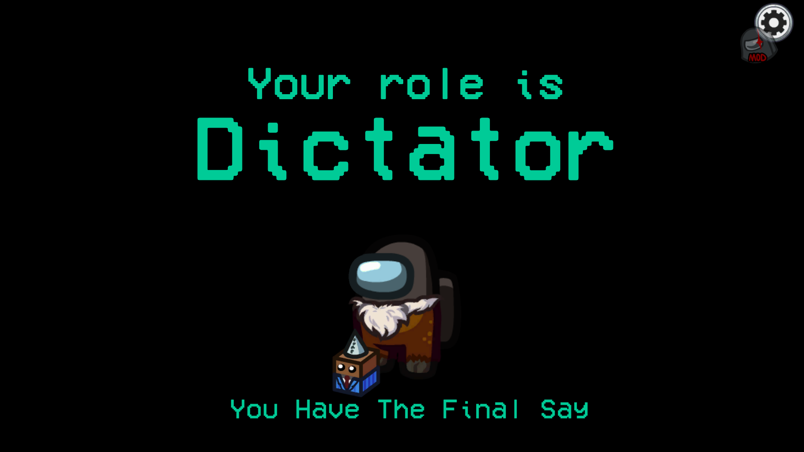

### Alignment: Crew (Sovereign)
### Origin: Better TOS Marshall

The Dictator has no active ability aside from revealing themselves as the Dictator to all players. When revealed, in the next meeting they can pick up to 3 players to be ejected. All 3 players will be killed at the end of the meeting, along with the chosen 4th player everyone else votes on (if any). If any of the 3 killed players happens to be Crew, the Dictator dies with them. The Dictator has no post ejection ability.

### Game Options

| Name | Description | Type | Default |
|------|-------------|------|---------|
| Dictator Cannot Reveal Round One | Self descriptive | Toggle | True |
| Dictator Can Dictate After Voting | Self descriptive | Toggle | True |
| Dictator Can Button | Whether the Dictator can call a meeting | Toggle | True |

## Engineer

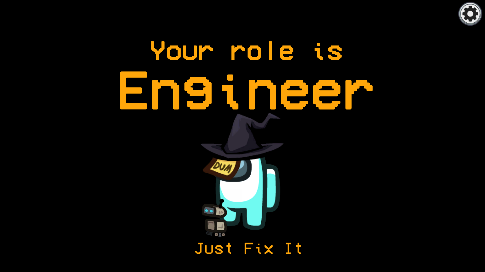

### Alignment: Crew (Support)
### Origin: Town Of Us

The Engineer can fix sabotages from anywhere on the map. They can also use vents to get across the map easily.

## Escort

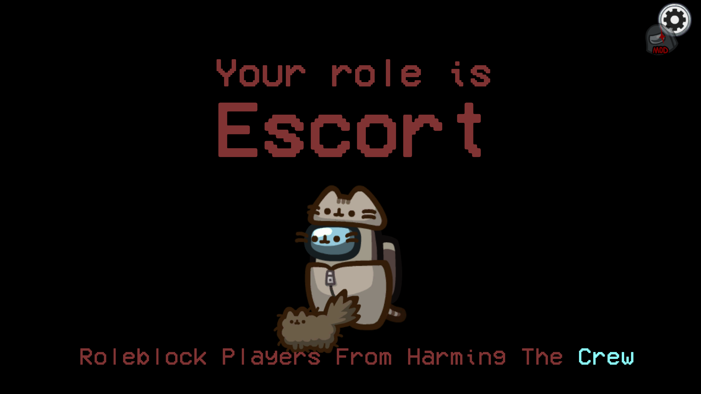

### Alignment: Crew (Support)
### Origin: Town Of Salem

The Escort can roleblock players and prevent them from doing anything for a short while.

## Mayor

### Alignment: Crew (Sovereign)
### Origin: Town Of Salem

The Mayor has no active ability aside from being able to reveal themselves as the Mayor to other players. Upon doing so, the value of their vote increases.

### Game Options

| Name | Description | Type | Default |
|------|-------------|------|---------|
| Mayor Votes Count As | The additional number of votes that are added to the Mayor's vote | Number | 2 |
| Mayor Cannot Reveal Round One | Self descriptive | Toggle | True |
| Mayor Can Button | Whether the Mayor can call a meeting | Toggle | True |

## Medic

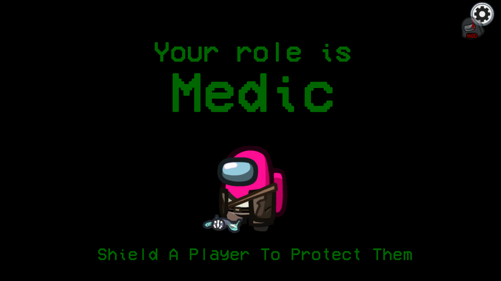

### Alignment: Crew (Protective)
### Origin: Town Of Us

The Medic can give any player a shield that will make them largely immortal as long as the Medic is alive. Some ways of death still go through, like assassination and ignition. Shielded players have a green ✚ next to their names.

### Game Options

| Name | Description | Type | Default |
|------|-------------|------|---------|
| Show Shielded Player | Who should be able to see who is Shielded | String | Self |
| Who Gets Murder Attempt Indicator | Who will receive an indicator when someone tries to Kill them | String | Medic |
| Shield Breaks On Murder Attempt | Whether the Shield breaks when someone attempts to Kill them | Toggle | True |

## Medium

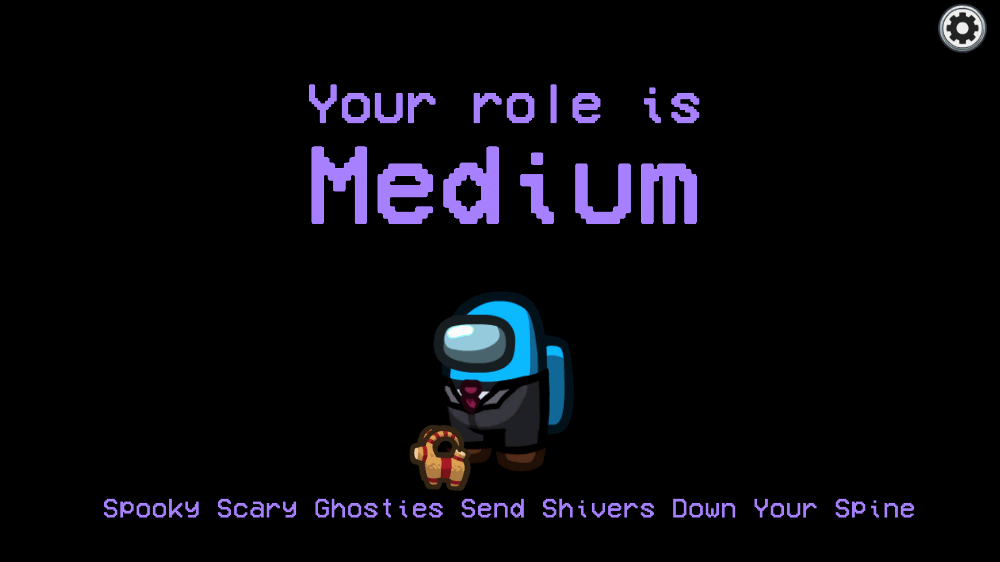

### Alignment: Crew (Investigative)
### Origin: Town Of Us

The Medium can mediate to be able to see ghosts. If the Medium uses this ability, the Medium and the dead player will be able to see each other and communicate from beyond the grave!

### Game Options

| Name | Description | Type | Default |
|------|-------------|------|---------|
| Reveal Appearance Of Mediate Target | Whether the Ghosts will show as themselves, or camouflaged | Toggle | True |
| Reveal The Medium To The Mediate Target | Whether certain ghosts can see that the Medium is the Medium | String | No |
| Who Is Revealed With Mediate | Which players are revealed to the Medium | String | Oldest Dead |

## Monarch

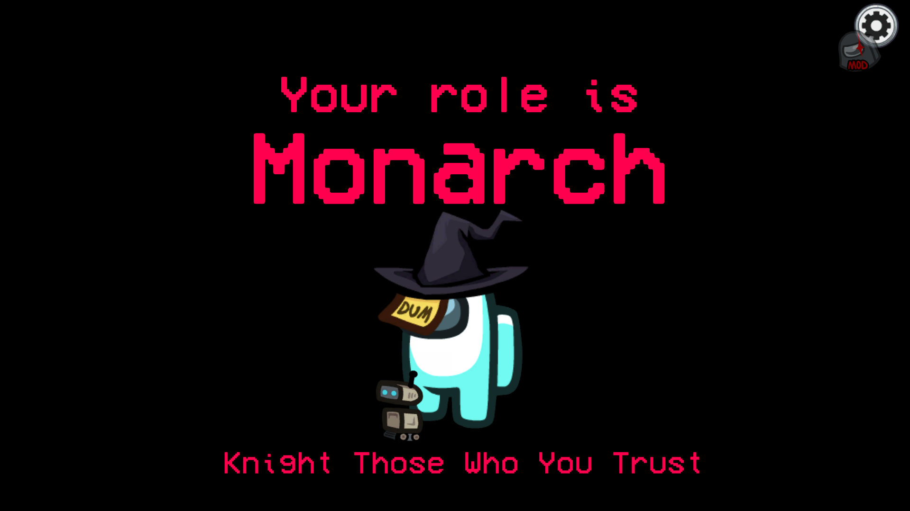

### Alignment: Crew (Sovereign)
### Origin: Traitors In Salem King/Town Of Salem 2

The Monarch can appoint players as knights. When the next meeting is called, all knighted players will be announced. Knighted players will have the value of their votes increased. As long as a Knight is alive, the Monarch cannot be killed. Knighted players have a pinkish red κ next to their names.

### Game Options

| Name | Description | Type | Default |
|------|-------------|------|---------|
| Monarch Cannot Knight Round One | Self descriptive | Toggle | True |
| Knighted Votes Count As | The additional number of votes that are added to a knighted player's vote | Number | 1 |
| Monarch Can Button | Whether the Monarch can call a meeting | Toggle | True |
| Knights Can Button | Whether knighted players can call a meeting | Toggle | True |

## Mystic

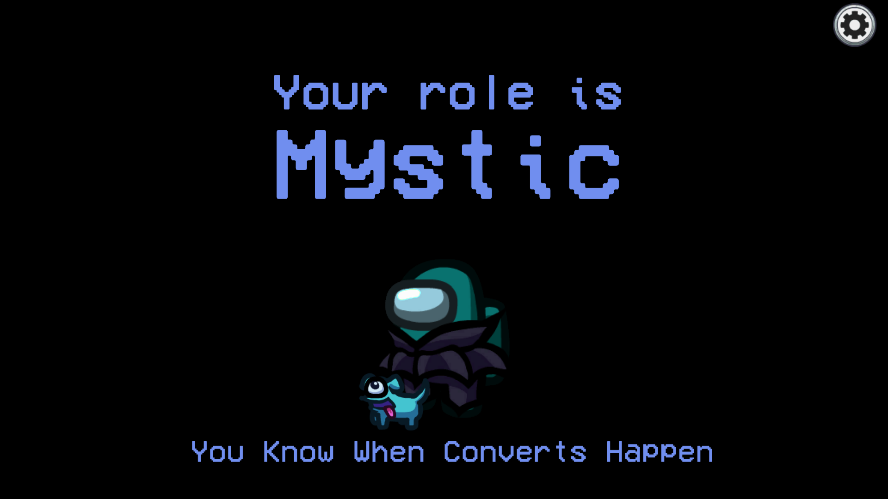

### Alignment: Crew (Auditor)

The Mystic only spawns when there is at least one Neutral (Neophyte) role present in the game. Whenever someone's subfaction is changed, the Mystic will be alerted about it. The Mystic can also investigate players to see if their subfactions have been changed. If the target has a different subfaction from the Mystic's, the Mystic's screen will flash red, otherwise it will flash green. It will not, however, work on the Neutral (Neophyte) roles themselves so even people who flashed green might still be evil. Once all subfactions are dead, the Mystic becomes a Seer. If the player is framed, they will appear to have their subfactions changed.

## Operative

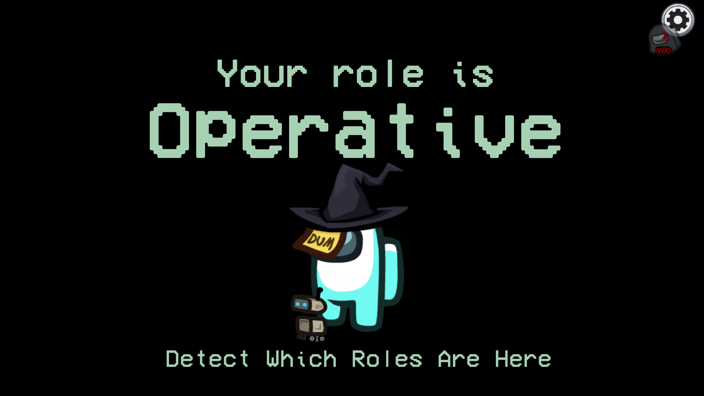

### Alignment: Crew (Investigative)
### Origin: Town Of Us, formed from the fusion of Town Of Us Spy and Trapper

The Operative can place bugs around the map. When players enter the range of the bug and stay within it for a certain amount of time, they trigger it. In the following meeting, all players who triggered a bug will have their role displayed to the Operative. However, this is done so in a random order, not stating who entered the bug, nor what role a specific player is. The Operative also gains more information when on Admin Table and on Vitals. On Admin Table, the Operative can see the colors of every person on the map. When on Vitals, the Operative is shown how long someone has been dead for.

### Game Options

| Name | Description | Type | Default |
|------|-------------|------|---------|
| Min Amount Of Time Required For Bug To Trigger | How long a player must stay in the bug for it to trigger | Time | 0s |
| Bugs Are Removed Each Round | Whether the Operative's bugs are removed after each meeting | Toggle | True |
| Bug Range | The size of each trap | Factor | 0.25x |
| Number Of Roles Required To Trigger Bug | The number of players that must enter the bug for it to be triggered | Number | 1 |
| Who Sees Dead Bodies On Admin | Which players see dead bodies on the admin map | String | Nobody |
| Operative Gets Precise Information | Whether the information from the Operative's bugs are more accurate and precise | Toggle | False |

## Retributionist

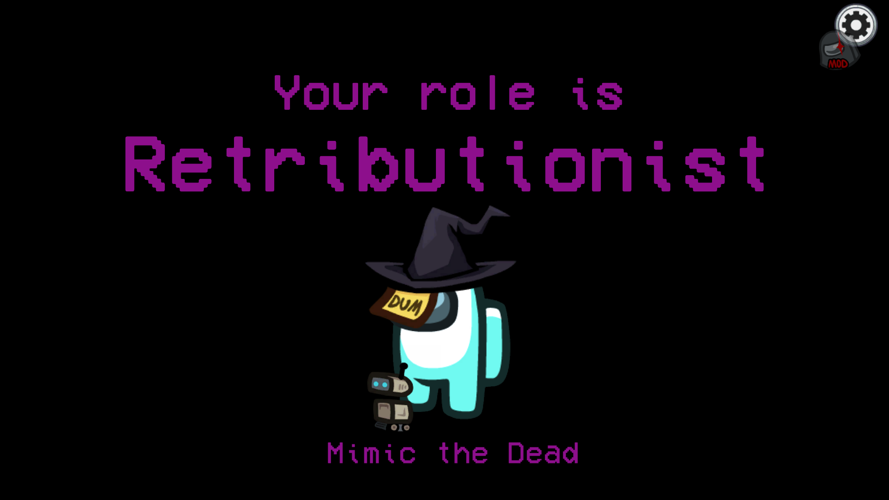

### Alignment: Crew (Support)
### Origin: Town Of Us Imitator

The Retributionist can mimic dead crewmates. During meetings, the Retributionist can select who they are going to mimic for the following round from the dead. It should be noted the Retributionist can not use all Crew roles and cannot use any Non-Crew role. The cooldowns, limits and everything will be set by the settings for their respective roles.

### Game Options

| Name | Description | Type | Default |
|------|-------------|------|---------|
| Retributionist Can Mimic After Voting | Self descriptive | Toggle | True |

## Revealer

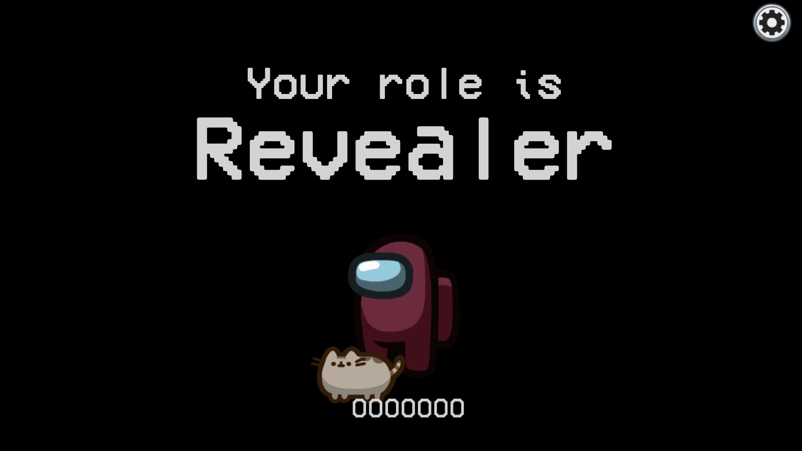

### Alignment: Crew (Utility)
### Origin: Town Of Us Haunter

The Revealer is a dead Crew. Upon finishing all their tasks, the evils, and possibly their roles, will be revealed to all other alive players. However, if the Revealer is clicked they lose their ability to reveal evils and are once again a normal ghost.

### Game Options

| Name | Description | Type | Default |
|------|-------------|------|---------|
| When Can Revealer Be Clicked | The amount of tasks remaining when the Revealer can be clicked | Number | 5 |
| Tasks Remaining When Revealed | The amount of tasks remaining when evils are alerted that the Revealer is nearly finished | Number | 1 |
| Revealer Reveals Neutrals | Whether the Revealer also reveals neutral roles | Toggle | False |
| Revealer Reveals Crew | Whether the Revealer also Reveals crew roles | Toggle | False |
| Revealer Reveals Exact Roles | Whether the Revealer also Reveals all roles | Toggle | False |
| Who Can Click Revealer | Which players can click the Revealer | String | All |

## Seer

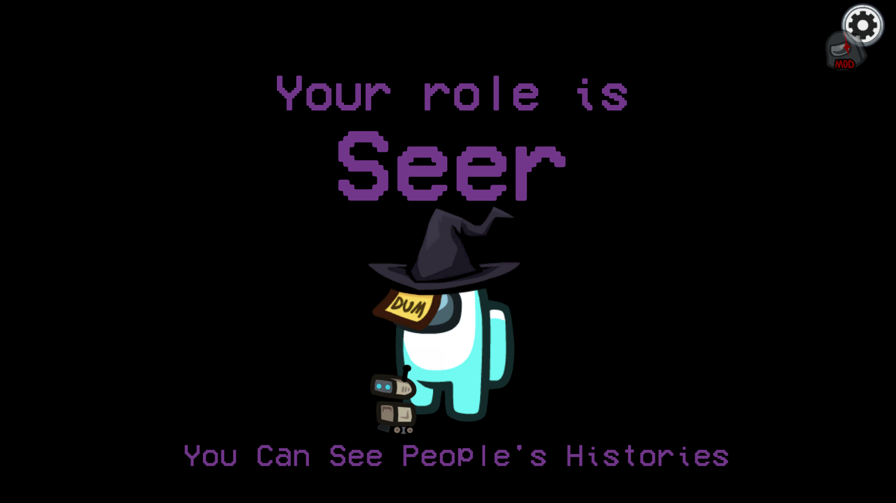

### Alignment: Crew (Investigative)

The Seer only spawns if there are roles capable of changing their initial roles or if there's a [Traitor](#traitor) or [Fanatic](#fanatic) in the game. The Seer can investigate players to see if their role is different from what they started out as. If a player's role has been changed, the Seer's screen will flash red, otherwise it will flash green. This, however, does not work on those whose subfactions have changed so those who flashed green might still be evil. If all players capable of changing or have changed their initial roles are dead, the Seer becomes a Sheriff. If the player is framed, they will appear to have their role changed.

## Sheriff

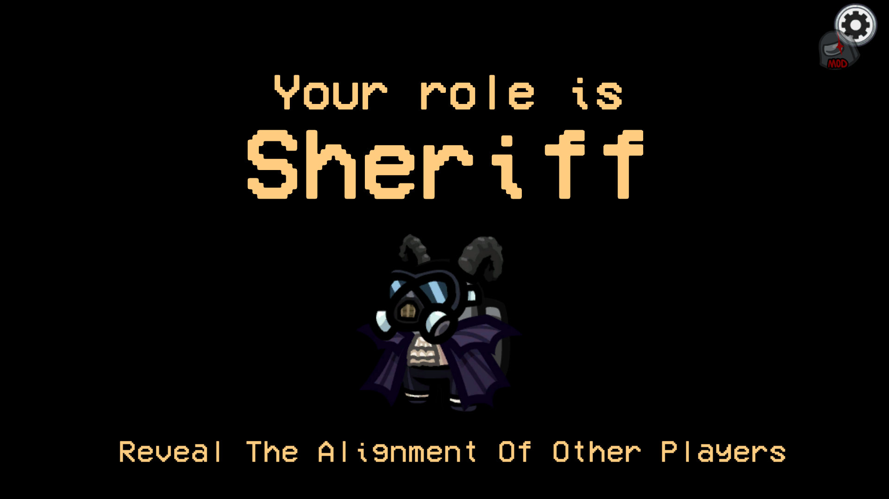

### Alignment: Crew (Investigative)
### Origin: Town Of Us Seer

The Sheriff can reveal the alliance of other players. Based on settings, the Sheriff can find out whether a player is Good or Evil. The Sheriff's screen will flash green or red depending on the results. If the player is framed, they will appear to be evil.

### Game Options

| Name | Description | Type | Default |
|------|-------------|------|---------|
| Neutral Evils Show Up As Evil | Neutral Evil roles show up as Red | Toggle | False |
| Neutral Killing Show Up As Evil | Neutral Killing roles show up as Red | Toggle | False |

## Shifter

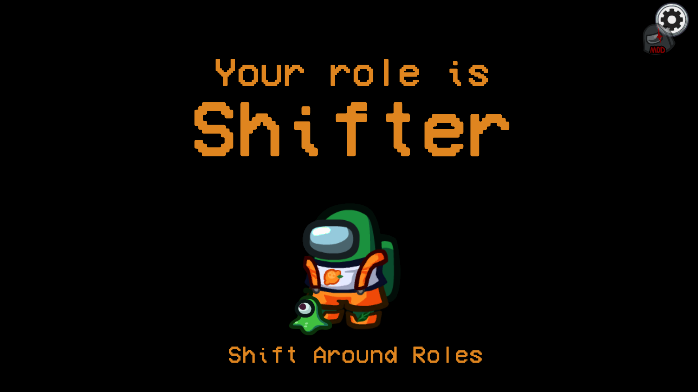

### Alignment: Crew (Support)
### Origin: Town Of Us

The Shifter can swap roles with someone, as long as they are Crew. If the shift is unsuccessful, the Shifter dies.

### Game Options

| Name | Description | Type | Default |
|------|-------------|------|---------|
| Shifted Becomes | Dictates what the shift target becomes after getting shifted | String | Shifter |

## Tracker

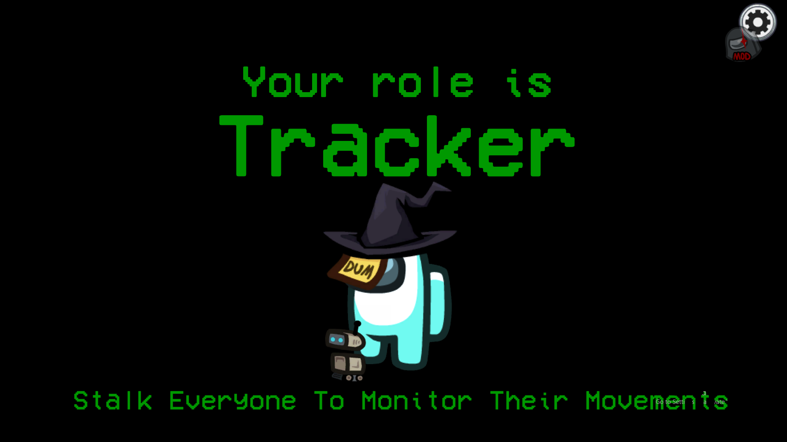

### Alignment: Crew (Investigative)
### Origin: Town Of Us + The Other Roles

The Tracker can track others during a round. Once they track someone, an arrow is continuously pointing to them, which updates in set intervals.

### Game Options

| Name | Description | Type | Default |
|------|-------------|------|---------|
| Tracker Arrows Reset Each Round | Whether Tracker Arrows are removed after each meeting | Toggle | False |
| Arrow Update Interval | The time it takes for the arrow to update to the new location of the tracked player | Time | 5s |

## Transporter

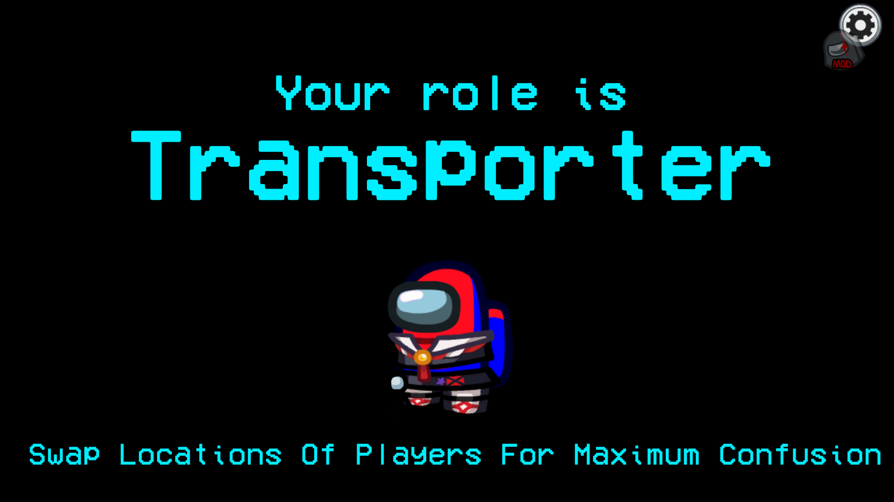

### Alignment: Crew (Support)
### Origin: Town Of Salem

The Transporter can swap the locations of two players at will. Being transported plays an animation that's visible to all players and renderers the targets immobile for the duration of the transportation. During the transportation, they can be targeted by anyone, even those of their own team. This means that the Transporter is capable of making evils attack each other.

### Game Options

| Name | Description | Type | Default |
|------|-------------|------|---------|
| Transporter Can Transport Themselves | Self descriptive | Toggle | False |

## Trapper

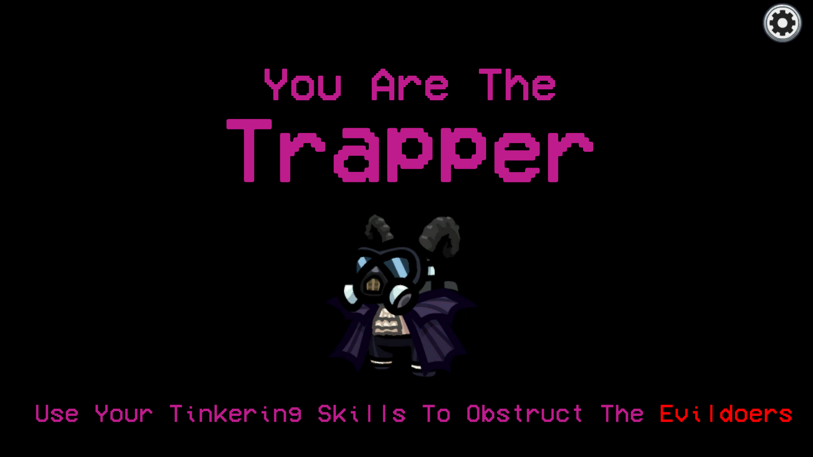

### Alignment: Crew (Protective)
### Origin: Town Of Salem

The Trapper can build traps and place them on other players. These traps will either register in interacter's role, or attack an attacker. At the start of the next meeting, the Trapper is told whether they attacked someone or not. If not, the Trapper gets a role of roles that interacted with the trapped targets.

## Vampire Hunter

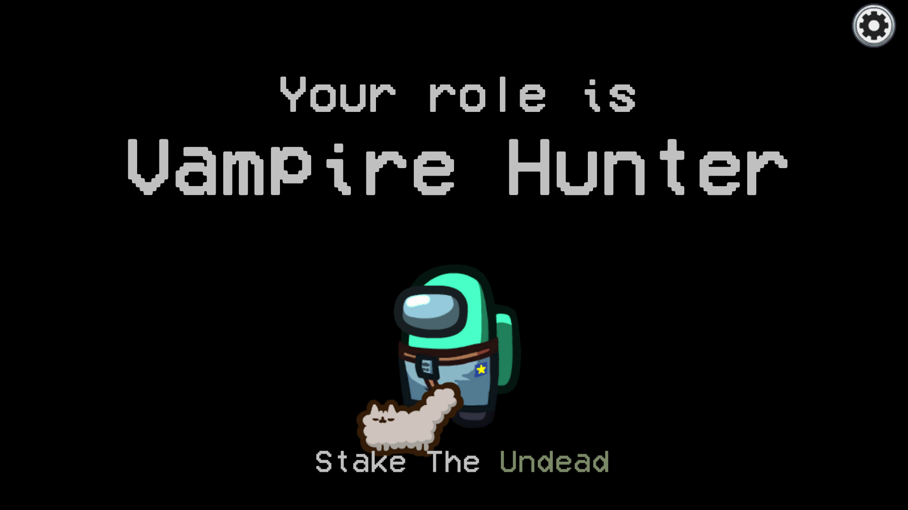

### Alignment: Crew (Auditor)
### Origin: Town Of Salem

The Vampire Hunter only spawns if there are Undead in the game. They can check players to see if they are an Undead. When the Vampire Hunter finds them, the target is killed. Otherwise they only interact and nothing else happens. When all Undead are dead, the Vampire Hunter turns into a Vigilante. Interacting with a Vampire Hunter as an Undead will force the Vampire Hunter to kill you.

## Veteran

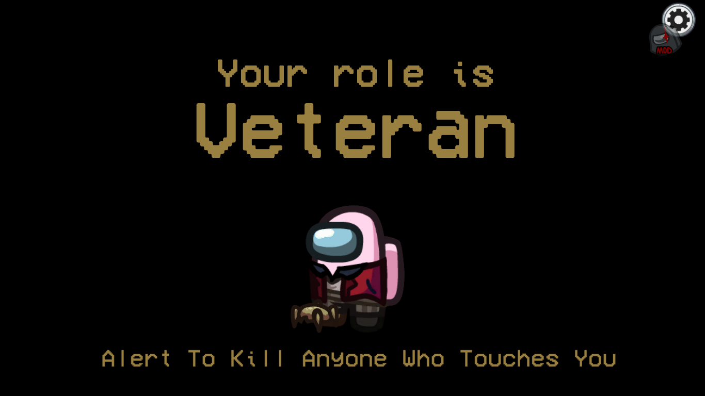

### Alignment: Crew (Killing)
### Origin: Town Of Salem

The Veteran can go on alert. Anyone who interacts with a Veteran on alert will be killed by the Veteran in question.

## Vigilante

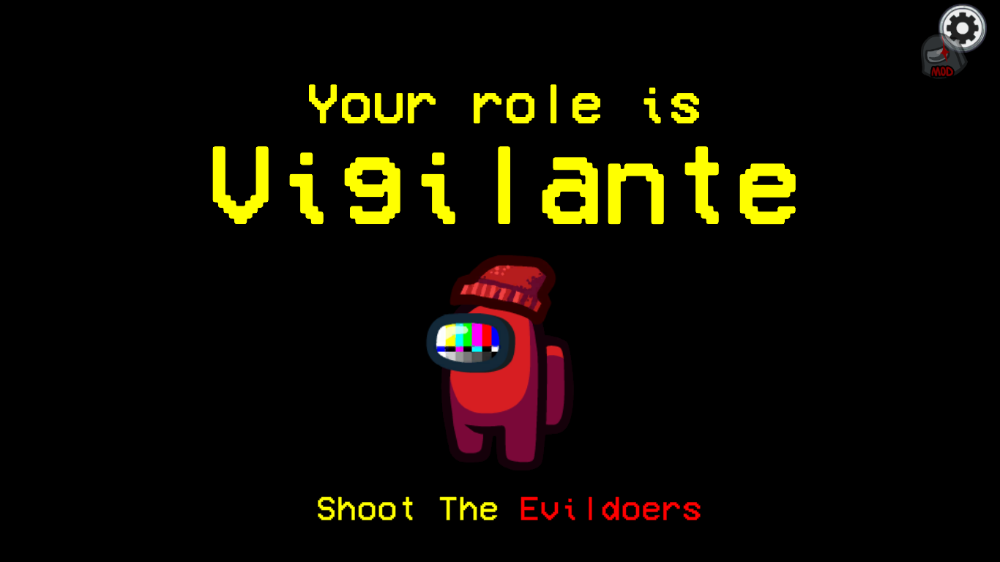

### Alignment: Crew (Killing)
### Origin: Town Of Us Sheriff

The Vigilante can kill. However, if they kill someone they shouldn't, they instead kill themselves.

### Game Options

| Name | Description | Type | Default |
|------|-------------|------|---------|
| Misfire Kills The Target | Whether the target is killed if the Vigilante misfires | Toggle | False |
| Vigilante Can Kill Again If Target Was Innocent | Whether the Vigilante can continue shooting even after getting a shot wrong | Toggle | False |
| Vigilante Cannot Shoot Round One | Self descriptive | Toggle | True |
| How Is The Vigilante Notified Of Their Target's Innocence | Whether the Vigilante is notified of their target's innocent upon misfire | String | Never |
| How Does Vigilante Die | Dictates how does the Vigilante die, should they kill or attempt to kill someone they shouldn't | String | Immediately |

# Neutral Roles

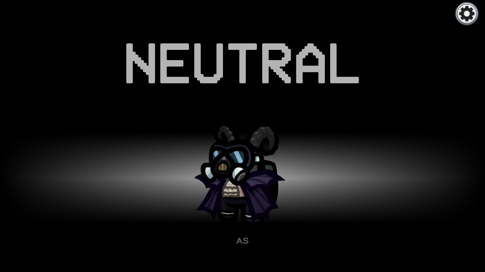

Each member of this faction has their own unique way to win, seperate from the other roles in the same faction. The main theme of this faction is free for all. This faction is an uninformed minority of the game, meaning they make up a small part of the crew while not knowing who the other members are. Each role is unique in its own way, some can be helpful, some exist to destroy others and some just exist for the sake of existing.

### Neutral Settings

| Name | Description | Type | Default |
|------|-------------|------|---------|
| Lights Affect Neutral Vision | Whether the lights sabotage affects Neutrals | Toggle | True |
| Neutrals Together, Strong | Whether Neutrals can win together | String | Never |
| Vigilante Kills Neutral Benigns | Whether Neutral Benign roles are considered evil for the Vigilante | Toggle | True |
| Neutral Killers Have Intruder Vision | Whether Neutral (Killing) roles have higher vision or not | Toggle | False |
| Neutral Killers Know Each Other | If Neutrals can win together, this settings lets Neutral Killers know of each other | Toggle | False |

## Actor

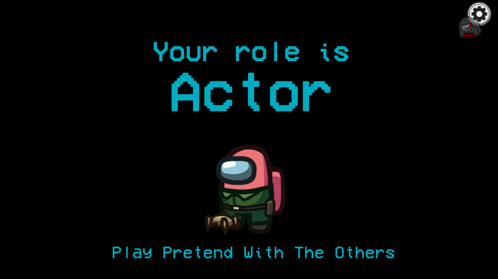

### Alignment: Neutral (Evil)
### Win Condition: Get guessed as a role in their target role list

The Actor gets a list of roles at the start of the game. This list of roles depends on which roles are present in the game so that it's easier for the Actor to pretend with certain events. The Actor must pretend to be and get guessed as one of the roles in order to win.

### Game Options

| Name | Description | Type | Default |
|------|-------------|------|---------|
| Actor Can Choose A Target Role | Whether the Actor can target a player to try and get guessed as their role | Toggle | True |
| Actor Can Button | Whether the Actor call a meeting | Toggle | True |
| Actor Can Hide In Vents | Whether the Actor can vent | Toggle | False |
| ┗ Actor Can Switch Vents | Whether the Actor Can Switch while in Vents | Toggle | False |
| Actor Role List Guess Count | How many roles are included within the Actor's pretend list | Number | 3 |
| Vigilante Kills Actor | Whether the Vigilante is able to kill the Actor | Toggle | False |

## Amnesiac

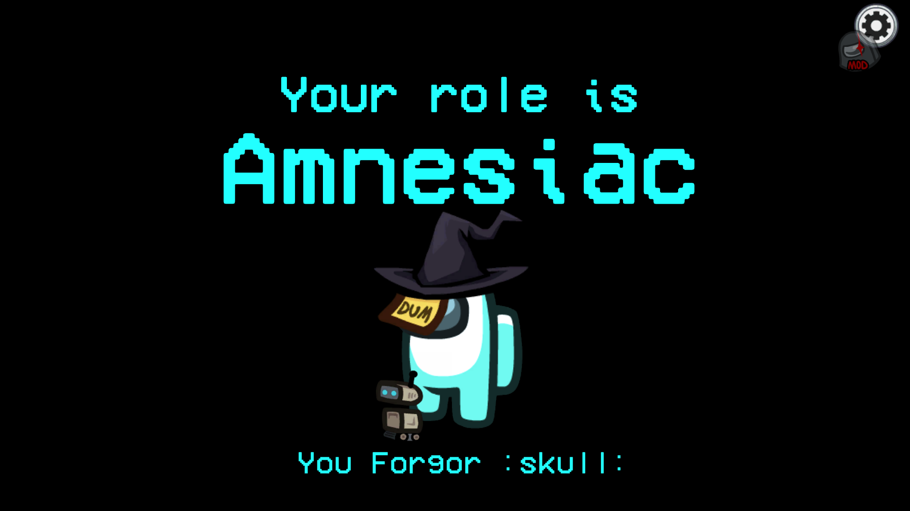

### Alignment: Neutral (Benign)
### Win Condition: Find a dead body, take their role and then win as that role
### Origin: Town Of Salem

The Amnesiac is essentially roleless and cannot win without remembering the role of a dead player. When there is only 6 players left, the Amnesiac becomes a Thief.

### Game Options

| Name | Description | Type | Default |
|------|-------------|------|---------|
| Amnesiac Gets Arrows To Dead Bodies | Self descriptive | Toggle | False |
| Remember Arrow Appearance Delay | The delay of the arrows appearing after the person died | Time | 5s |
| Amnesiac Can Hide In Vents | Decides whether the Amnesiac can vent | Toggle | False |
| ┗ Amnesiac Can Switch Vents | Decides whether the Amnesiac can switch while in vents | Toggle | True |

## Arsonist

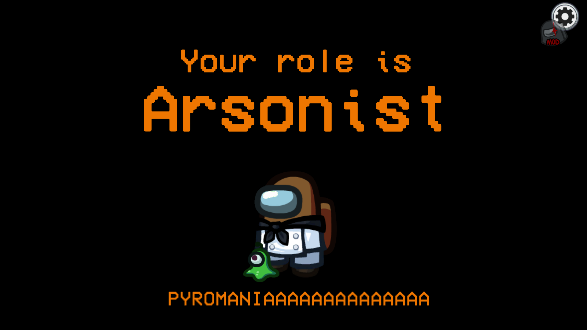

### Alignment: Neutral (Killing)
### Win Condition: Ignite anyone who can oppose them
### Origin: Town Of Salem

The Arsonist can douse players with gasoline. After dousing, the Arsonist can choose to ignite all doused players which kills all doused players at once. Doused players have an orange Ξ next to their names.

### Game Options

| Name | Description | Type | Default |
|------|-------------|------|---------|
| Ignite Cooldown Removed When Arsonist Is Last Killer | Decides whether the Arsonist's Ignite cooldown is reduced to 0s if they happen to be the last killer alive | Toggle | False |
| Ignition Ignites All Doused Players | One Arsonist igniting ignites all doused players of other Arsonists as well | Toggle | False |
| Douse And Ignite Cooldowns Are Linked | Decides whether the Arsonist's cooldowns are linked so that dousing resets ignition and vice versa | Toggle | False |
| Ignition Cremates Bodies | Ignited players have their bodies burnt away, leaving behind unreportable ash | Toggle | False |
| Arsonist Can Vent | Toggles the Arsonist's ability to vent | Toggle | True |

## Betrayer

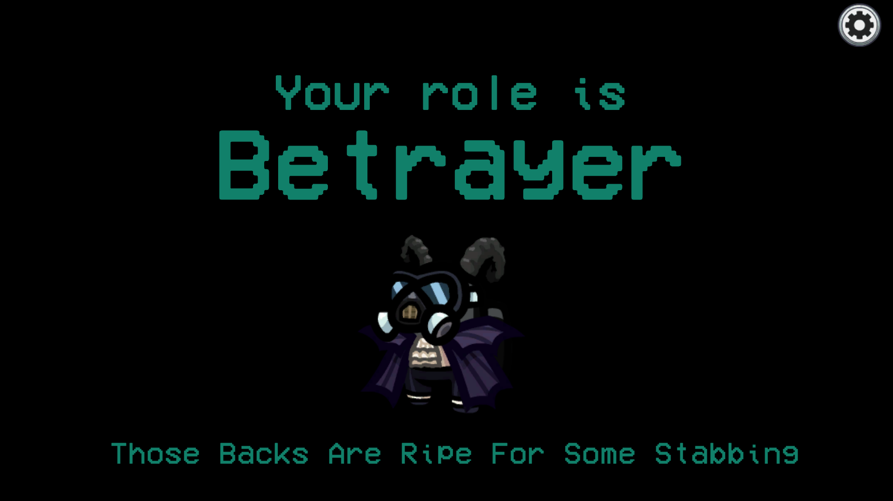

### Alignment: Neutral (Proselyte)
### Win Condition: Kill anyone who opposes the faction they defected to

The Betrayer is a simple killer, who appears after a turned [Traitor](#traitor)/[Fanatic](#fanatic) was the only member of their new faction remaning. This role does not spawn directly.

### Game Options

| Name | Description | Type | Default |
|------|-------------|------|---------|
| Betrayer Can Vent | Toggles the Betrayer's ability to vent | Toggle | True |

## Bounty Hunter

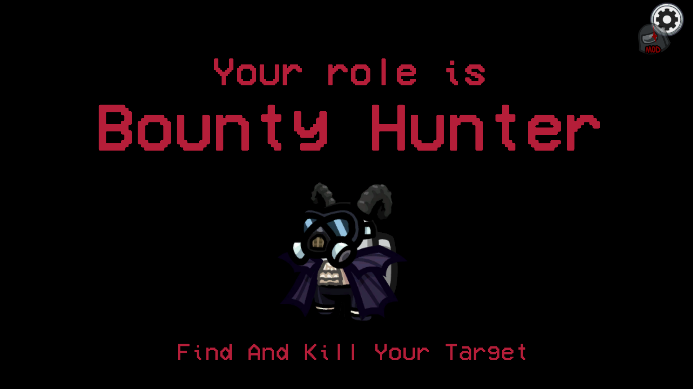

### Alignment: Neutral (Evil)
### Win Condition: Find and kill thier target

The Bounty Hunter is assigned a target as the start of the game. Every meeting, the Bounty Hunter is given clue to who their target might be. They do not know who the target is and must find them via a series of clues and limited guesses. Upon finding their target within the set amount of guesses, the guess button becomes a kill button. The Bounty Hunter's target always knows that there is a bounty on their head. If the Bounty Hunter is unable to find their target within the number of guesses or their target dies not by the Bounty Hunter's hands, the Bounty Hunter becomes a Troll. The target has a red Θ next to their names.

### Game Options

| Name | Description | Type | Default |
|------|-------------|------|---------|
| Bounty Hunter Can Indirectly Pick Their Own Target | Whether the Bounty Hunter can choose a player to pick a target for them | Toggle | False |
| Bounty Hunter Can Vent | Toggles the Bounty Hunter's ability to vent | Toggle | True |
| Vigilante Kills Bounty Hunter | Whether the Vigilante is able to kill the Bounty Hunter | Toggle | False |

## Cannibal

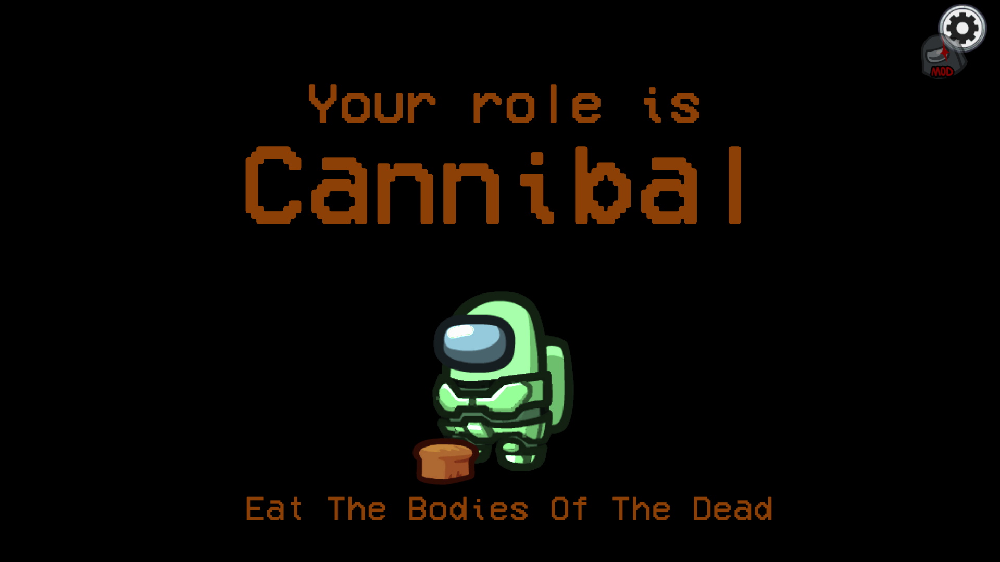

### Alignment: Neutral (Evil)
### Win Condition: Eat a certain number of bodies
### Origin: The Other Roles Vulture

The Cannibal can eat the body which wipes it away, like the Janitor.

### Game Options

| Name | Description | Type | Default |
|------|-------------|------|---------|
| Bodies Needed To Win | Self descriptive | Number | 5 or changes to half the lobby size if not enough players |
| Cannibal Can Vent | Toggles the Cannibal's ability to vent | Toggle | True |
| Cannibal Gets Arrows | Whether the Cannibal has arrows pointing to dead bodies | Toggle | False |
| Hunger Arrow Appearance Delay | The delay of the arrows appearing after the person died | Time | 5s |
| Vigilante Kills Cannibal | Whether the Vigilante is able to kill the Cannibal | Toggle | False |

## Cryomaniac

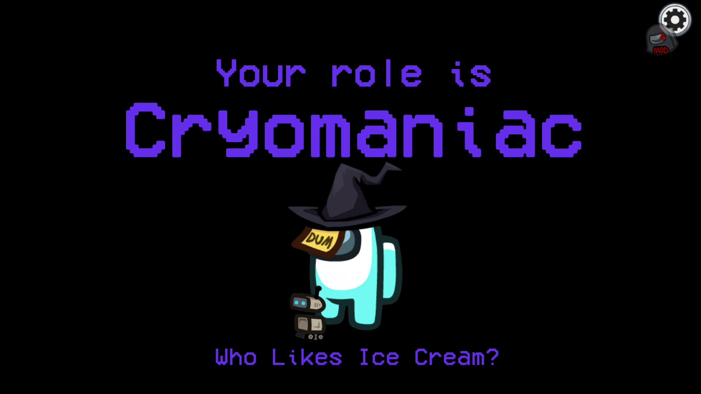

### Alignment: Neutral (Killing)
### Win Condition: Freeze anyone who can oppose them

The Cryomaniac can douse players in coolant and freeze them similar to the Arsonist's dousing in gasoline and ignite. Freezing players does not immediately kill doused targets, instead when the next meeting is called, all currently doused players will die. When the Cryomaniac is the last killer or when the final number of players reaches a certain threshold, the Cryomaniac can also directly kill. Doused players have a purple λ next to their names.

### Game Options

| Name | Description | Type | Default |
|------|-------------|------|---------|
| Freezing Freezes All Doused Players | One Cryomaniac freezing freezes all doused players of other Cryomaniacs as well | Toggle | False |
| Cryomaniac Can Kill Normally When Last Killer | Whether the Cryomaniac is able to kill players directly if they happen to be the last evil alive | Toggle | False |
| Cryomaniac Can Vent | Toggles the Cryomaniac's ability to vent | Toggle | True |

## Dracula

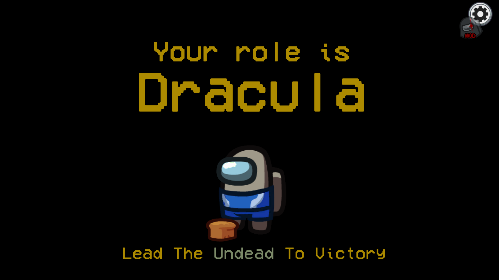

### Alignment: Neutral (Neophyte)
### Win Condition: Convert or kill anyone who can oppose them

The Dracula is the only Undead that spawns in. The Dracula is the leader of the Undead who can convert others into an Undead. If the target cannot be converted, they will be attacked instead. The Dracula must watch out for the Vampire Hunter as attempting to convert them will cause the Vampire Hunter to kill the Dracula. Members of the Undead have a grey γ next to their names.

### Game Options

| Name | Description | Type | Default |
|------|-------------|------|---------|
| Dracula Can Vent | Toggles the Dracula's ability to vent | Toggle | True |
| Undead Can Vent | Toggles the Undead's ability to vent, overriding their role's vent settings | Toggle | False |
| Alive Undead Count | Limits the number of Undead that can be alive, attempting to convert players after this limit has been reached will kill the target player | Number | 3 |

## Executioner

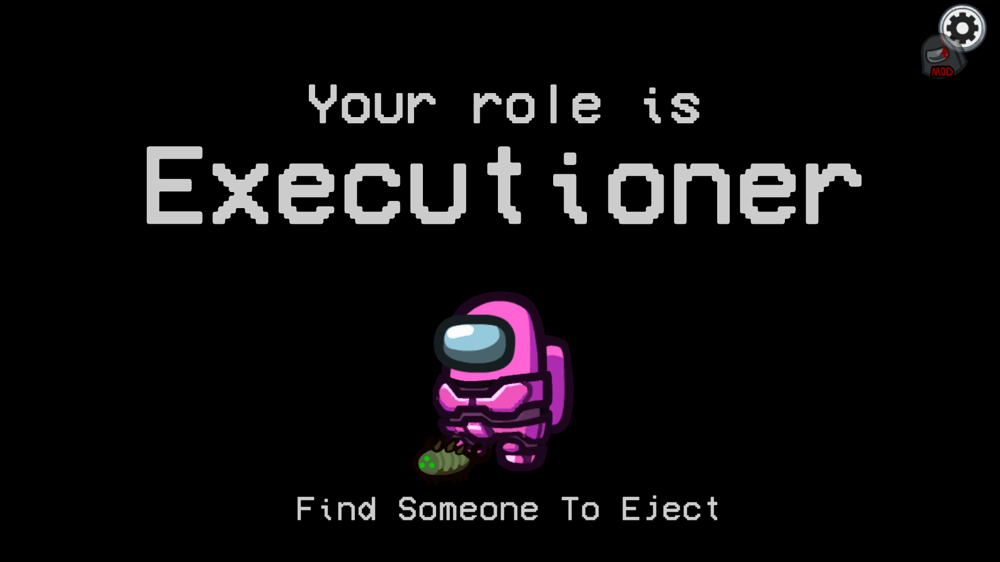

### Alignment: Neutral (Evil)
### Win Condition: Live (or die according to the settings) to see their target get ejected
### Origin: Town Of Salem

The Executioner has no abilities and instead must use gas-lighting techniques to get their target ejected. The Executioner's target, by default, is always non-Crew Sovereign Crew. Once their target is ejected, the Executioner can doom those who voted for their target. If their target dies before ejected, the Executioner turns into a Jester. Targets have a grey § next to their names.

### Game Options

| Name | Description | Type | Default |
|------|-------------|------|---------|
| Executioner Can Pick Their Own Target | Whether the Executioner can choose a player to be ejected | Toggle | False |
| Executioner Can Button | Whether the Executioner can call a meeting | Toggle | True |
| Executioner Can Hide In Vents | Whether the Executioner can vent | Toggle | False |
| ┗ Executioner Can Switch Vents | Whether the Executioner Can Switch while in Vents | Toggle | False |
| Target Knows Executioner Exists | Whether the Executioner's target knows that they have an Executioner for them | Toggle | False |
| Executioner Knows Target's Role | Whether the Executioner knows their target's role | Toggle | False |
| Target Ejection Reveals Existence Of Executioner | Decides if the target is ejected, it will reveal the fact that they were an Executioner's target | Toggle | False |
| Executioner Can Win After Death | Decides if the Executioner can still win if their target has been ejected after they died | Toggle | False |
| Vigilante Kills Executioner | Whether the Vigilante is able to kill the Executioner | Toggle | False |

## Glitch

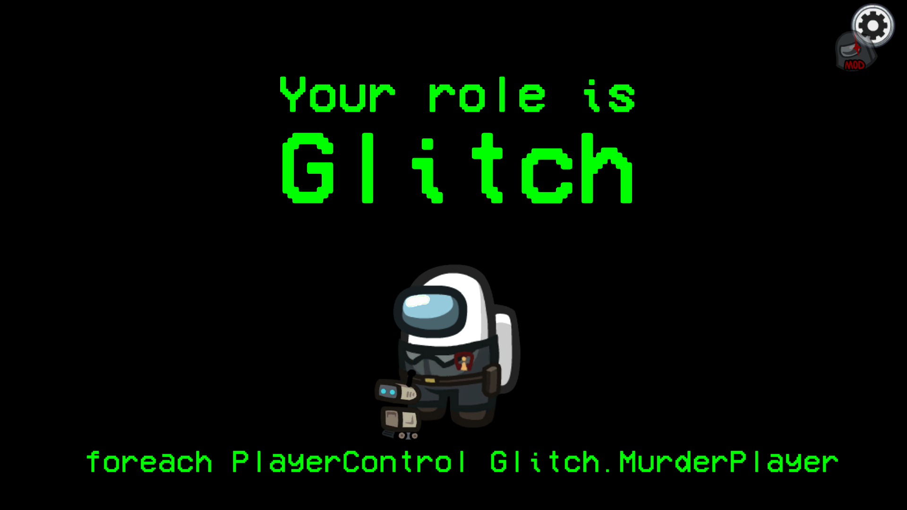

### Alignment: Neutral (Killing)
### Win Condition: Neutralise anyone who can oppose them
### Origin: Town Of Us

The Glitch can hack players, resulting in them being unable to do anything for a set duration or they can also mimic someone, which results in them looking exactly like the other person. The Glitch can kill normally.

### Game Options

| Name | Description | Type | Default |
|------|-------------|------|---------|
| Glitch Can Vent | Toggles the Glitch's ability to vent | Toggle | True |

## Guardian Angel

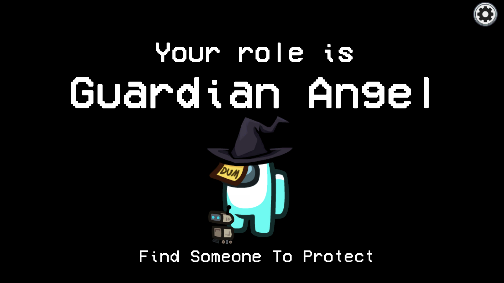

### Alignment: Neutral (Benign)
### Win Condition: Have their target live to see the end of the game
### Origin: Town Of Salem

The Guardian Angel more or less aligns themselves with the faction of their target. The Guardian Angel will win with anyone as long as their target lives to the end of the game, even if their target loses. If the Guardian Angel's target dies, they become a Survivor. Targets have a white ★ and a white η when being protected next to their names.

### Game Options

| Name | Description | Type | Default |
|------|-------------|------|---------|
| Guardian Angel Can Pick Their Own Target | Whether the Guardian Angel can choose a player to be protected | Toggle | False |
| Cooldown Reset Upon Attacking Protected | The attackers kill cooldown after they attacked the protected target | Time | 2.5s |
| Show Protected Player | Who should be able to see who is Protected | String | Self |
| Target Knows Guardian Angel Exists | Whether the Guardian Angel's Target knows they have a Guardian Angel | Toggle | False |
| Guardian Angel Can Protect After Death | Whether the Guardian Angel can continue to protect their target if they happen to die | Toggle | False |
| Guardian Angel Knows Target's Role | Whether the Guardian Angel knows their target's role | Toggle | False |
| Guardian Angel Can Hide In Vents | Whether the Guardian Angel can vent | Toggle | False |
| ┗ Guardian Angel Can Switch Vents | Whether the Guardian Angel Can Switch while in Vents | Toggle | False |

## Guesser

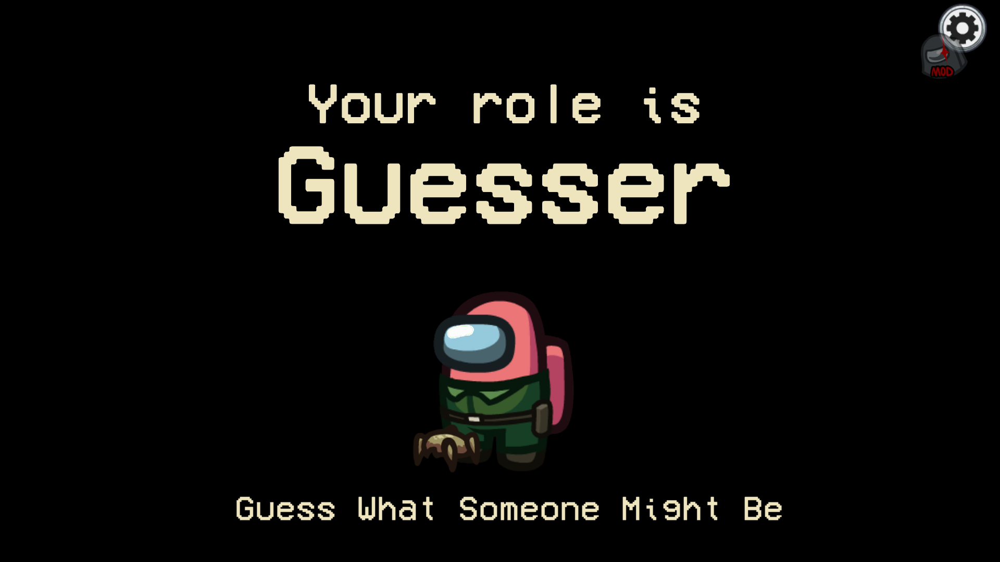

### Alignment: Neutral (Evil)
### Win Condition: Guess their target's role

The Guesser has no abilities aside from guessing only their target. Every meeting, the Guesser is told a hint regarding their target's role. If the target dies not by the Gusser's hands, the Guesser becomes an Actor with the target role list that of their target's role. Upon guessing their target, the Guesser can freely guess anyone. Targets have a beige π next to their names.

### Game Options

| Name | Description | Type | Default |
|------|-------------|------|---------|
| Guesser Can Pick Their Own Target | Whether the Guesser can choose a player to be guessed | Toggle | False |
| Guesser Can Button | Whether the Guesser can call a meeting | Toggle | True |
| Guesser Can Hide In Vents | Whether the Guesser can vent | Toggle | False |
| ┗ Guesser Can Switch Vents | Whether the Guesser Can Switch while in Vents | Toggle | False |
| Target Knows Guesser Exists | Whether the Guesser's target knows that they have a Guesser | Toggle | False |
| Guesser Can Guess Multiple Times | Whether the Guesser's can attempt to guess their target multiple times in a single meeting | Toggle | False |
| Guesser Can Guess After Voting | Whether the Guesser's can continue guessing their target after voting | Toggle | False |
| Vigilante Kills Guesser | Whether the Vigilante is able to kill the Guesser | Toggle | False |

## Jackal

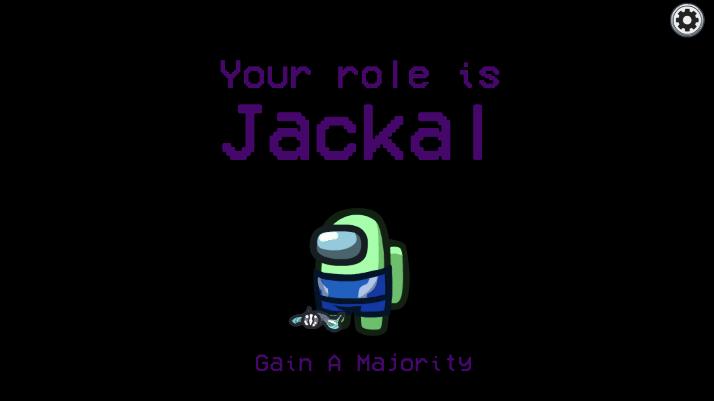

### Alignment: Neutral (Neophyte)
### Win Condition: Bribe the crew into joining their side and eliminate any threats
### Origin: Better TOS

The Jackal is the leader of the Cabal. They spawn in with 2 recruits at the start of the game. One of the recruits is the "good" one, meaning they are Crew or Neutral (Benign). The other is the "evil" recruit, who can be either Intruder, Syndicate or Neutral (Killing) or (Harbinger). When both recruits die, the Jackal can then recruit another player to join the Cabal and become the backup recruit. If the target happens to be a member of a rival subfaction, they will be attacked instead. Members of the Cabal have a dark grey $ next to their names.

### Game Options

| Name | Description | Type | Default |
|------|-------------|------|---------|
| Jackal Can Vent | Toggles the Jackal's ability to vent | Toggle | True |
| Recruits Can Vent | Toggles the Recruited's ability to vent, overriding their role's vent settings | Toggle | False |

## Jester

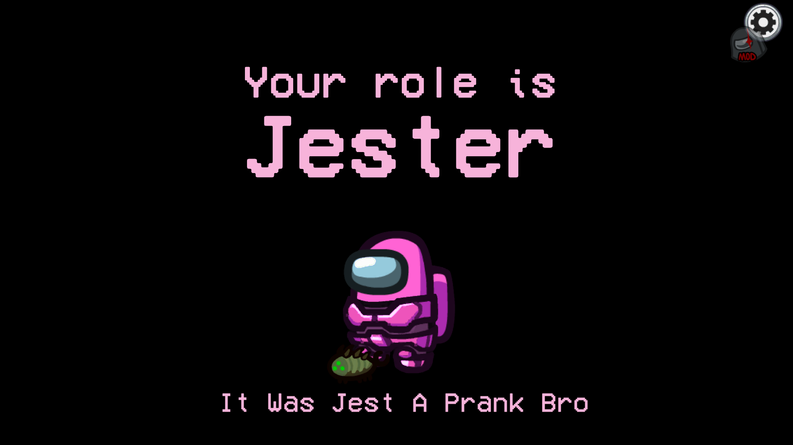

### Alignment: Neutral (Evil)
### Win Condition: Get ejected
### Origin: Town Of Salem

The Jester has no abilities and must make themselves appear to be evil to the Crew and get ejected. After getting ejected, the Jester can haunt those who voted for them, killing them from beyond the grave.

### Game Options

| Name | Description | Type | Default |
|------|-------------|------|---------|
| Jester Can Button | Whether the Jester can call a meeting | Toggle | True |
| Jester Can Hide In Vents | Whether the Jester can vent | Toggle | False |
| ┗ Jester Can Switch Vents | Whether the Jester Can Switch while in Vents | Toggle | False |
| Ejection Reveals Existence Of Jester | Decides if the Jester is ejected, it will reveal the fact that they were a Jester | Toggle | False |
| Vigilante Kills Jester | Whether the Vigilante is able to kill the Jester | Toggle | False |

## Juggernaut

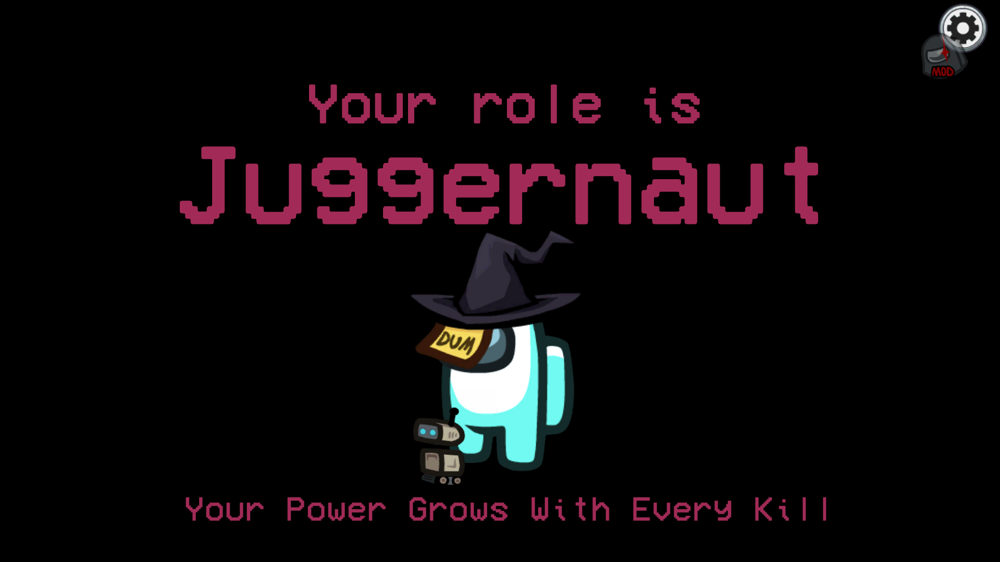

### Alignment: Neutral (Killing)
### Win Condition: Assault anyone who can oppose them
### Origin: Town Of Us + Town Of Salem

The Juggernaut's kill cooldown decreases with every kill they make. When they reach a certain number of kills, the kill cooldown no longer decreases and instead gives them other buffs, like bypassing protections.

### Game Options

| Name | Description | Type | Default |
|------|-------------|------|---------|
| Assault Bonus | By how much the Juggernaut's assault cooldown decreases | Time | 5s |
| Juggernaut Can Vent | Toggles the Juggernaut's ability to vent | Toggle | True |

## Murderer

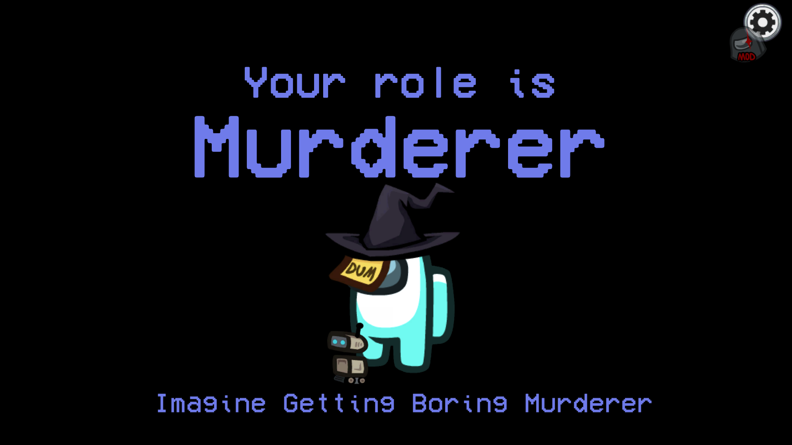

### Alignment: Neutral (Killing)
### Win Condition: Murder anyone who can oppose them

The Murderer is a simple Neutral Killer with no special abilities.

### Game Options

| Name | Description | Type | Default |
|------|-------------|------|---------|
| Murderer Can Vent | Toggles the Murderer's ability to vent | Toggle | True |

## Necromancer

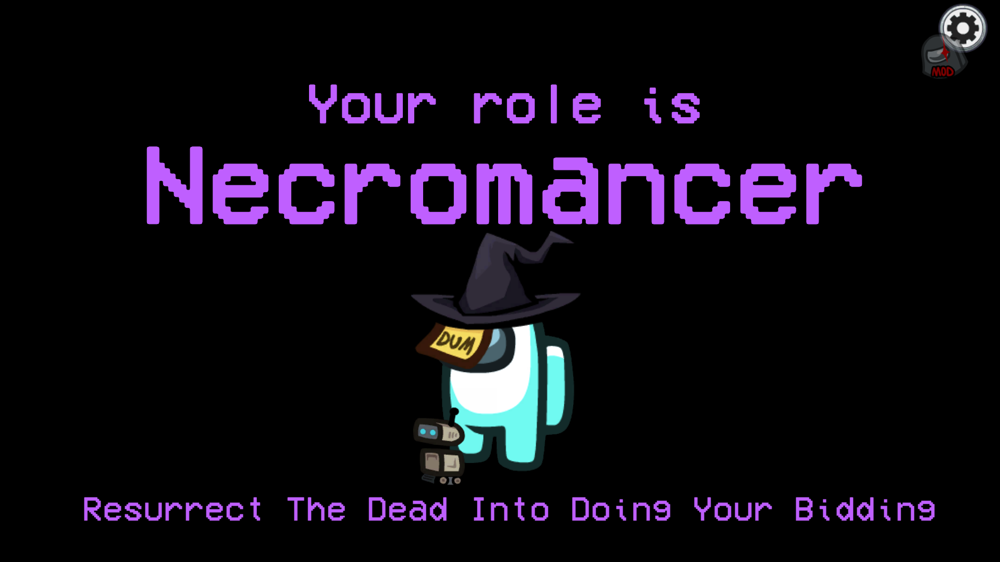

### Alignment: Neutral (Neophyte)
### Win Condition: Bring the dead to their side and gain a majority
### Origin: Partly Town Of Us

The Necromancer is essentially an evil Altruist. They can resurrect dead players and make them join the Necromancer's team, the Reanimated. There is a limit to how many times can the Necromancer can kill and resurrect players. Members of the Reanimated have a dark pink Σ next to their names.

### Game Options

| Name | Description | Type | Default |
|------|-------------|------|---------|
| Resurrect Cooldown Increases | Toggles whether the Necromancer's Resurrect cooldown increases each use | Toggle | True |
| ┗ Resurrect Cooldown Increases By | The increase on the Necromancer's Resurrect cooldown with each use | Time | 5s |
| Sacrifice Cooldown Increases | Toggles whether the Necromancer's sacrifice cooldown increases each use | Toggle | True |
| ┗ Sacrifice Cooldown Increases By | The increase on the Necromancer's sacrifice cooldown with each use | Time | 5s |
| Necromancer Can Vent | Toggles the Necromancer's ability to vent | Toggle | True |
| Sacrifice And Resurrect Cooldowns Are Linked | Decides whether the Necromancer's cooldowns are linked so that killing resets resurrection and vice versa | Toggle | False |
| Resurrect Duration | The time it takes for the Necromancer to resurrect a dead body | Time | 10s |
| Target's Body Disappears On Beginning Of Resurrect | Whether the dead body of the player the Necromancer is resurrecting disappears upon resurrection | Toggle | False |
| Reanimated Can Vent | Toggles the Reanimated's ability to vent, overriding their role's vent settings | Toggle | False |

## Pestilence

### Alignment: Neutral (Apocalypse)
### Win Condition: Obliterate anyone who can oppose them
### Origin: Town Of Salem

The Pestilence is always on permanent alert, where anyone who tries to interact with them will die. Pestilence does not spawn in-game and instead gets converted from Plaguebearer after they infect everyone. Pestilence cannot die unless they have been voted out, and they can't be guessed (usually). This role does not spawn directly, unless it's set to, in which case it will replace the Plaguebearer.

### Game Options

| Name | Description | Type | Default |
|------|-------------|------|---------|
| Pestilence Can Spawn Directly | Dictates whether Pestilence can appear even if no one is infected | Toggle | False |
| Pestilence Transformation Alerts Everyone | Dictates whether everyone is alerted when the Plaguebearer turns into Pestilence | Toggle | False |
| Pestilence Can Vent | Toggles the Pestilence's ability to vent | Toggle | True |

## Phantom

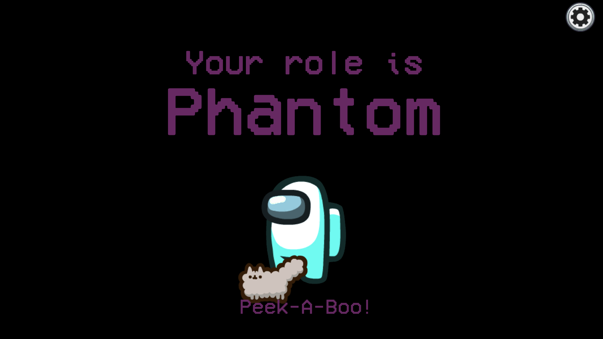

### Alignment: Neutral (Proselyte)
### Win Condition: Finish your tasks without getting clicked or having the game end
### Origin: Ottomated

The Phantom spawns when a Neutral player dies withouth accomplishing their objective. They become half-invisible and have to complete all their tasks without getting clicked on to win.

### Game Options

| Name | Description | Type | Default |
|------|-------------|------|---------|
| Tasks Remaining When Phantom Can Be Clicked | The amount of tasks remaining when the Phantom Can Be Clicked | Number | 5 |
| Players Are Alerted When Phantom Is Clickable | Whether players are alerted to the Phantom's existence and clickability | Toggle | False |

## Plaguebearer

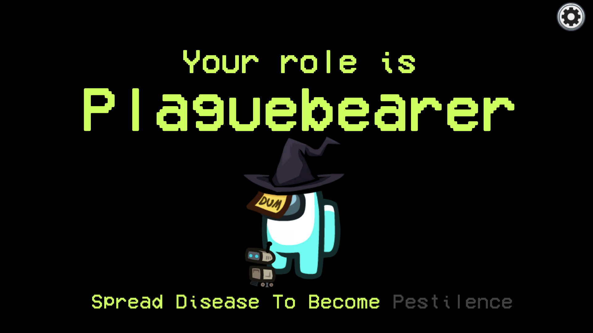

### Alignment: Neutral (Harbinger)
### Win Condition: Infect everyone and turn into Pestilence or live to the end by killing off anyone who can oppose them
### Origin: Town Of Salem

The Plaguebearer can infect other players. Once infected, the infected player can go and infect other players via interacting with them. Once all players are infected, the Plaguebearer becomes Pestilence. Infected players have a pale lime ρ next to their names.

### Game Options

| Name | Description | Type | Default |
|------|-------------|------|---------|
| Plaguebearer Can Vent | Toggles the Plaguebearer's ability to vent | Toggle | True |

## Serial Killer

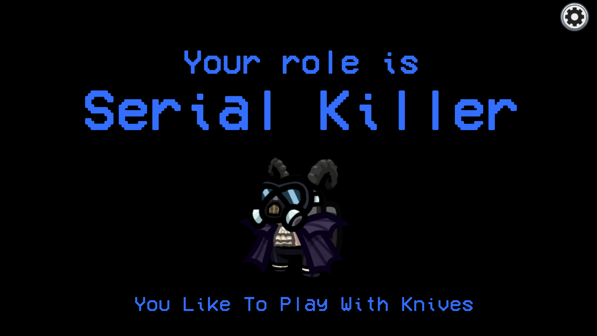

### Alignment: Neutral (Killing)
### Win Condition: Stab anyone who can oppose them
### Origin: Town Of Us Werewolf

Although the Serial Killer has a kill button, they can't use it unless they are in Bloodlust. Once the Serial Killer is in bloodlust they gain the ability to kill. However, unlike most killers, their kill cooldown is really short for the duration of the bloodlust.

### Game Options

| Name | Description | Type | Default |
|------|-------------|------|---------|
| Serial Killer Can Vent | Toggles the Serial Killer's ability to vent | String | Always |

## Survivor

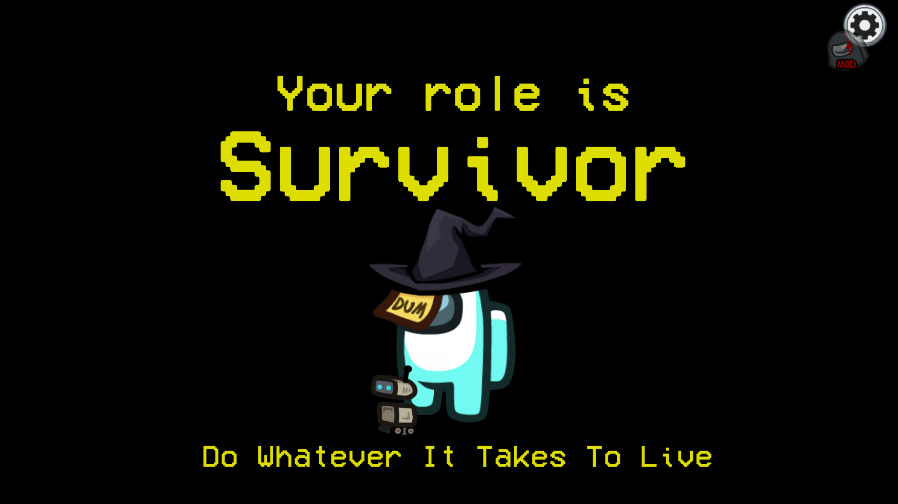

### Alignment: Neutral (Benign)
### Win Condition: Live to see the end of the game
### Origin: Town Of Salem

The Survivor wins by simply surviving. They can vest which makes them immortal for a short duration. Vesting Survivors have a yellow υ next to their names.

### Game Options

| Name | Description | Type | Default |
|------|-------------|------|---------|
| Cooldown Reset Upon Attacking Vested | The attackers kill cooldown after they attack a vested Survivor | Time | 2.5s |
| Survivor Can Hide In Vents | Whether the Survivor can vent | Toggle | False |
| ┗ Survivor Can Switch Vents | Whether the Survivor Can Switch while in Vents | Toggle | False |

## Thief

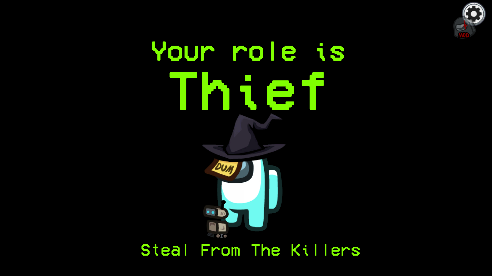

### Alignment: Neutral (Benign)
### Win Condition: Kill a killer and win as their role
### Origin: The Other Roles

The Thief can kill players to steal their roles. The player, however, must be a role with the ability to kill otherwise the Thief will die. After stealing their target's role, the Thief can now win as whatever role they have become. The Thief can also guess players in-meeting to steal their roles.

### Game Options

| Name | Description | Type | Default |
|------|-------------|------|---------|
| Thief Assigns Thief Role To Target | Whether the Thief completely steals their target's role or just copies it | Toggle | False |
| Thief Can Guess To Steal Roles | Self descriptive | Toggle | True |
| Thief Can Guess After Voting | Self descriptive | Toggle | True |
| Thief Can Vent | Toggles the Thief's ability to vent | Toggle | True |

## Troll

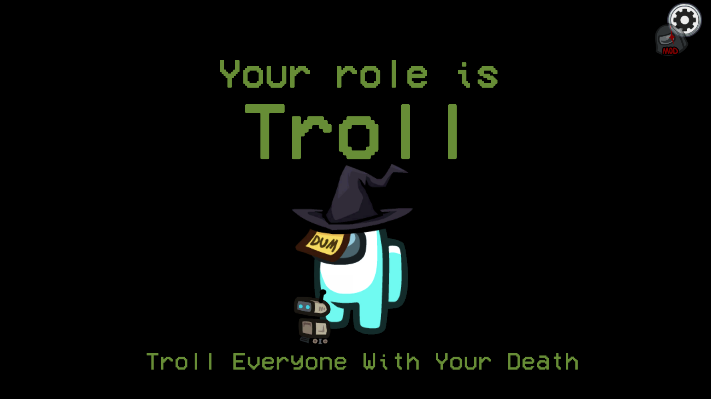

### Alignment: Neutral (Evil)
### Win Condition: Get killed
### Origin: SocksFor1

The Troll just wants to be killed, but not ejected. The Troll can "interact" with players. This interaction does nothing, it just triggers any interaction sensitive roles like Veteran and Pestilence. Killing the Troll makes the Troll kill their killer.

### Game Options

| Name | Description | Type | Default |
|------|-------------|------|---------|
| Troll Can Hide In Vents | Whether the Troll can vent | Toggle | False |
| ┗ Troll Can Switch Vents | Whether the Troll Can Switch while in Vents | Toggle | False |

## Werewolf

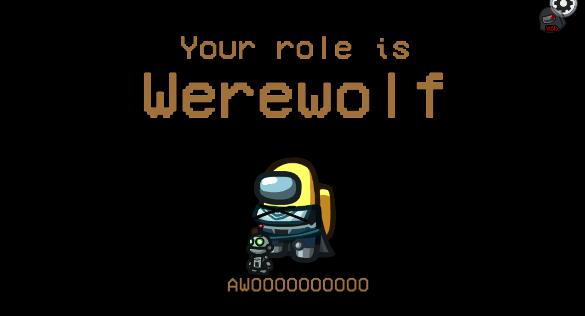

### Alignment: Neutral (Killing)
### Win Condition: Maul anyone who can oppose them

The Werewolf can kill all players within a certain radius.

### Game Options

| Name | Description | Type | Default |
|------|-------------|------|---------|
| Maul Radius | How far must a player be to survive a Werewolf's attack | Factor | 1x |
| Werewolf Can Vent | Toggles the Werewolf's ability to vent | Toggle | True |

## Whisperer

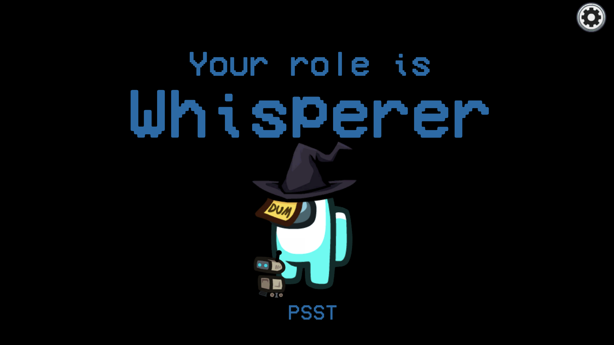

### Alignment: Neutral (Neophyte)
### Win Condition: Persuade others into joining the cult
### Origin: Partly Town Of Us

The Whisperer can whisper to all players within a certain radius. With each whisper, the chances of bringing someone over to the Whisperer's side increases till they do convert.

### Game Options

| Name | Description | Type | Default |
|------|-------------|------|---------|
| Whisper Cooldown Increases | Toggles whether the Whisperer's whisper cooldown increases each use | Time | 5s |
| ┗ Whisper Cooldown Increases By | The increase on the Whisperer's whisper cooldown with each use | Time | 5s |
| Whisper Rate | The inital rate for each whisper | Percentage | 5% |
| Whisper Rate Decreases | Toggles whether the Whisperer's whisper rate decreases each use | Toggle | True |
| ┗ Whisper Rate Decreases By | The decrease on the Whisperer's whisper rate with each use | Percentage | 5% |
| Whisper Radius | How far a player must be to avoid a whisper | Factor | 1x |
| Whisperer Can Vent | Toggles the Whisperer's ability to vent | Toggle | True |
| Persuaded Can Vent | Toggles the Persuaded's ability to vent, overriding their role's vent settings | Toggle | False |

# Intruder Roles

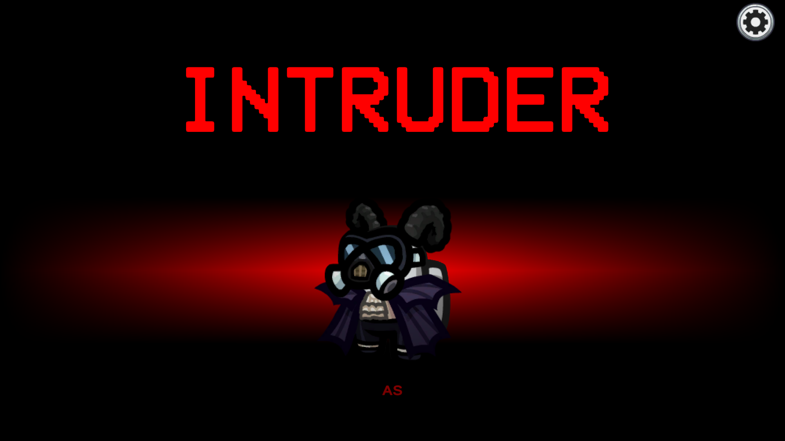

Each member of this faction has the ability to kill alongside an ability pertaining to their role. The main theme of this faction is destruction and raw power. This faction is an informed minority meaning they make up a tiny fraction of the crew and know who the other members are. All members can sabotage to distract the Crew from their tasks.

 

### Intruder Settings

| Name | Description | Type | Default |
|------|-------------|------|---------|
| Intruder Count | How many Intruders can spawn | Number | 1 |
| Intruders Can Sabotage | Self descriptive | Toggle | True |
| Dead Intruders Can Sabotage | Self descriptive | Toggle | False |

## Ambusher

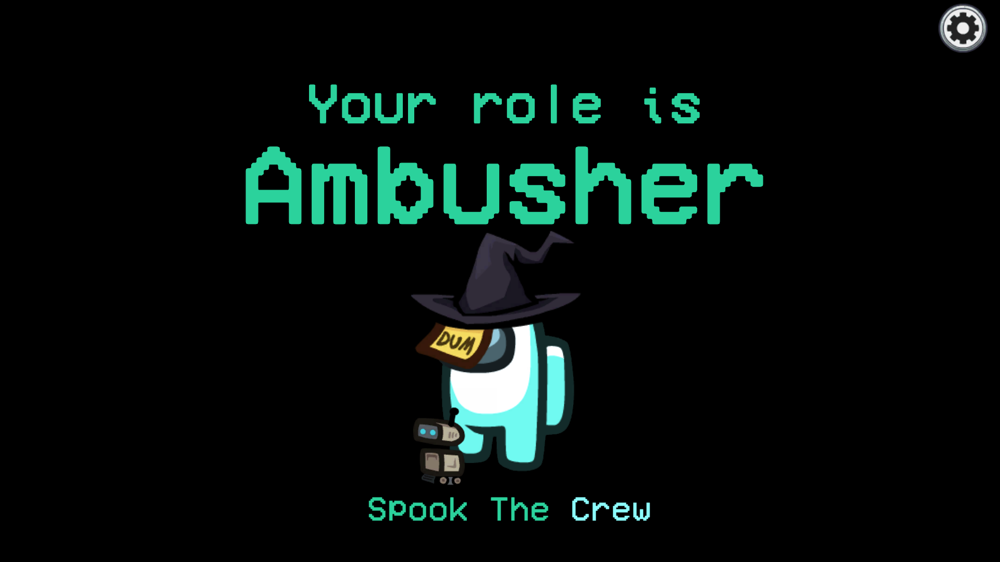

### Alignment: Intruder (Killing)

The Ambusher can temporarily force anyone to go on alert, killing anyone who interacts with the Ambusher's target.

 

### Game Options

| Name | Description | Type | Default |
|------|-------------|------|---------|
| Ambusher Can Ambush Teammates | Dictates whether the Ambusher can target teammates, while also being able to kill them | Toggle | False |

## Blackmailer

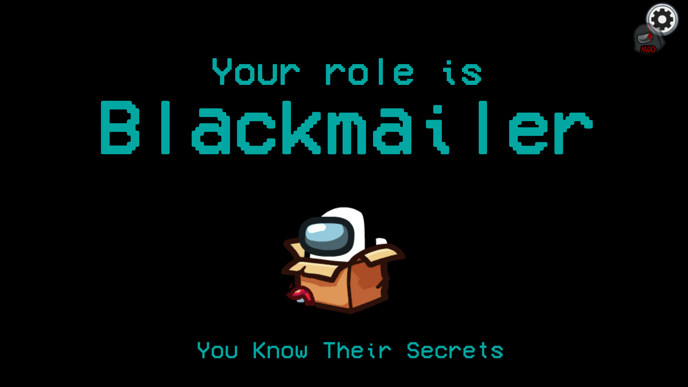

### Alignment: Intruder (Concealing)
### Origin: Town Of Salem

The Blackmailer can blackmail people. Blackmailed players cannot speak during the next meeting.

### Game Options

| Name | Description | Type | Default |
|------|-------------|------|---------|
| Blackmailer Can Read Whispers | Self descriptive | Toggle | False |
| Blackmailer Can Blackmail Teammates | Self descriptive | Toggle | False |
| Blackmail Is Revealed To Everyone | Self descriptive | Toggle | False |

## Camouflager

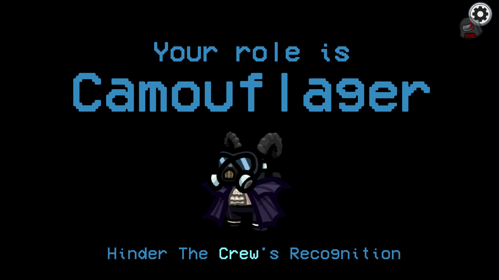

### Alignment: Intruder (Concealing)
### Origin: Town Of Us

The Camouflager does the same thing as the Better Comms Sabotage, but their camouflage can be stacked on top other sabotages. Camouflaged players can kill in front everyone and no one will know who it is.

### Game Options

| Name | Description | Type | Default |
|------|-------------|------|---------|
| Camouflage Hides Size | Whether the camouflage can change a player's size to match that of the other players | Toggle | False |
| Camouflage Hides Speed | Whether the camouflage can change a player's speed to match that of the other players | Toggle | False |

## Consigliere

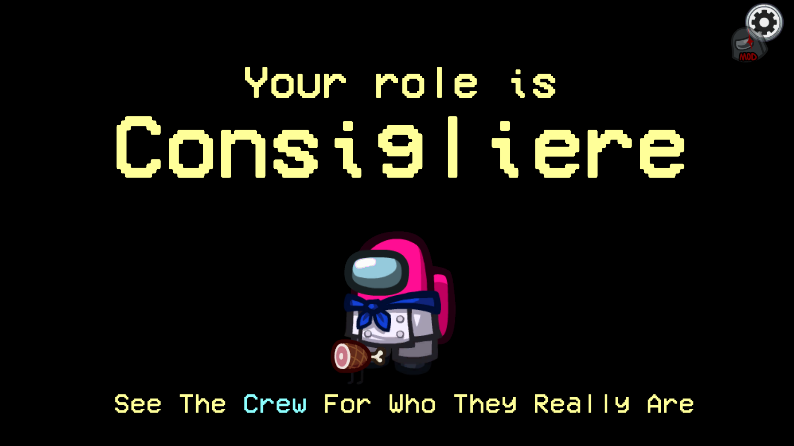

### Alignment: Intruder (Support)
### Origin: Town Of Salem

The Consigliere can reveal people's roles. They cannot guess those they revealed for obvious reasons.

### Game Options

| Name | Description | Type | Default |
|------|-------------|------|---------|
| Info That Consigliere Sees | Decides what the Consigliere gets as a result of checking someone | String | Role |

## Consort

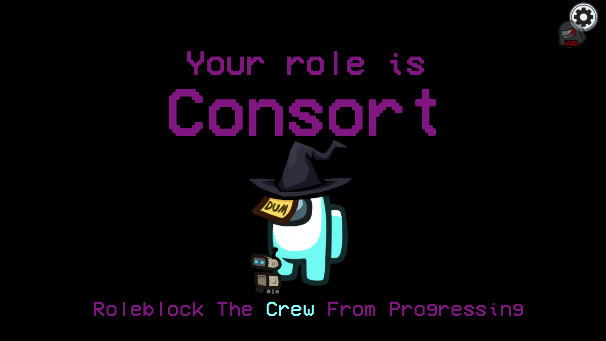

### Alignment: Intruder (Support)
### Origin: Town Of Salem

The Consort can roleblock players and prevent them from doing anything for a short while. They behave just like an [Escort](#escort) but the Consort can roleblock from any range.

## Disguiser

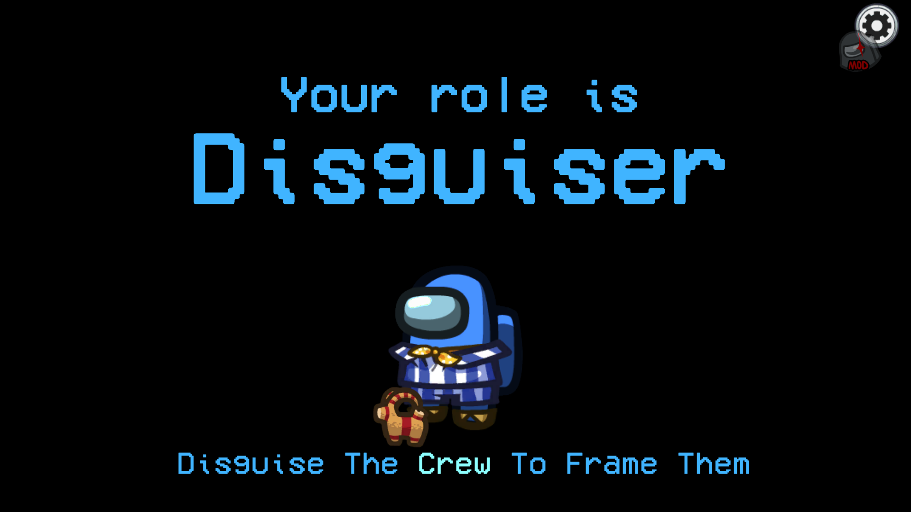

### Alignment: Intruder (Deception)
### Origin: Partly Town Of Salem

The Disguiser can disguise other players. At the beginning of each, they can choose someone to measure. They can then disguise the next nearest person into the measured person for a limited amount of time after a short delay.

### Game Options

| Name | Description | Type | Default |
|------|-------------|------|---------|
| Disguise And Measure Cooldowns Are Linked | Decides whether the Disguiser's cooldowns are linked so that measuring resets disguises and vice versa | Toggle | False |
| Disguise Targets | Who can be disguised by the Disguiser | String | Everyone |

## Enforcer

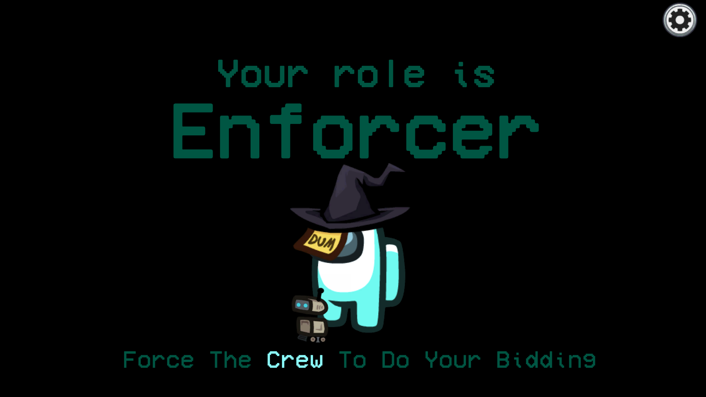

### Alignment: Intruder (Killing)

The Enforcer can plant bombs on players. After a short while, their target will be alerted to the bomb's presence and must kill someone to get rid of it. If they fail to do so within a certain time limit, the bomb will explode, killing everyone within its vicinity.

### Game Options

| Name | Description | Type | Default |
|------|-------------|------|---------|
| Enforce Explosion Radius | Self descriptive | Factor | 0.25m |

## Ghoul

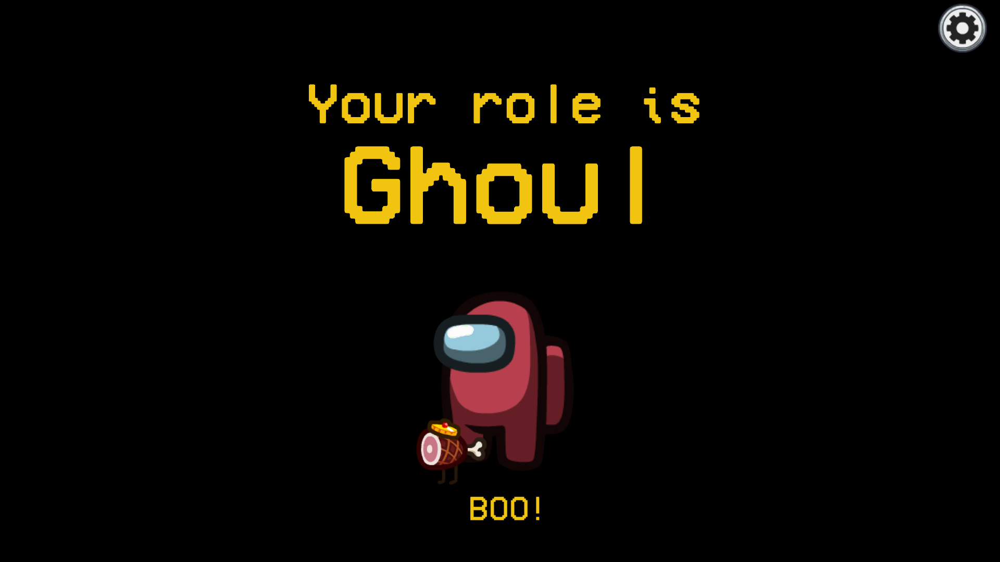

### Alignment: Intruder (Utility)
### Origin: Partly The Other Roles Witch

The Ghoul is a dead Intruder. Every round, the Ghoul can mark a player for death. All players are told who is marked and the marked player will die at the end of the next meeting. The only way to save a marked player is to click the Ghoul that marked them. Marked players have a yellow χ next to their names.

## Godfather

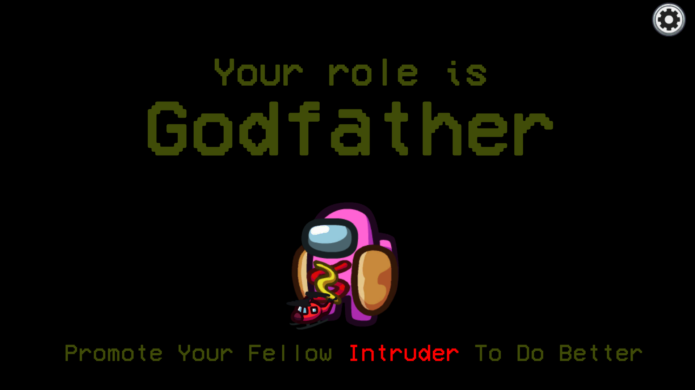

### Alignment: Intruder (Head)

The Godfather can only spawn in 3+ Intruder games. They can choose to promote a fellow Intruder to Mafioso. When the Godfather dies, the Mafioso becomes the new Godfather and has lowered cooldowns.

### Game Options

| Name | Description | Type | Default |
|------|-------------|------|---------|
| Cooldown Bonus | How much do the cooldowns decrease by upon promotion to Godfather | Factor | 0.75x |

## Grenadier

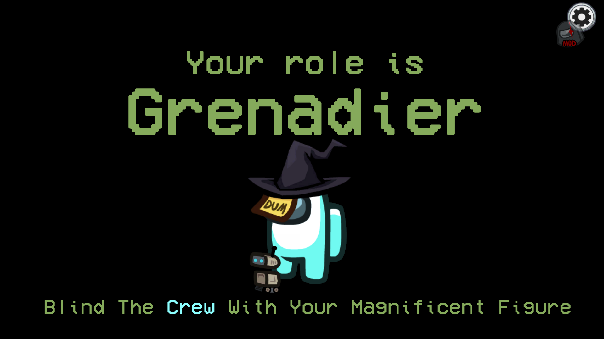

### Alignment: Intruder (Concealing)
### Origin: Town Of Polus

The Grenadier can throw flash grenades which blinds nearby players. However, a sabotage and a flash grenade can not be active at the same time.

### Game Options

| Name | Description | Type | Default |
|------|-------------|------|---------|
| Flash Radius | How wide the flash radius is | Factor | 1x |
| Indicate Flashed Players | Whether the Grenadier can see who has been flashed | Toggle | False |
| Grenadier Can Vent | Toggles the Grenadier's ability to vent | Toggle | True |

## Impostor

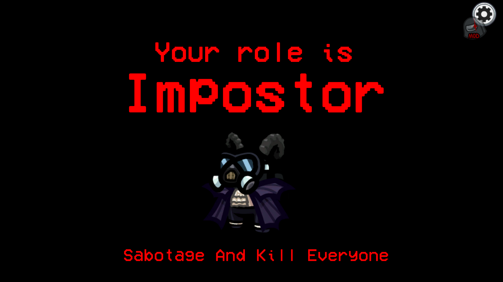

### Alignment: Intruder (Utility)
### Origin: Among Us

Just a plain Intruder with no abilities and only spawns if all the other roles are taken or set to spawn in Custom mode.

## Janitor

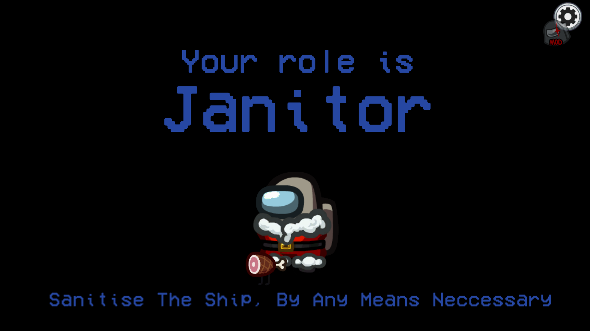

### Alignment: Intruder (Concealing)
### Origin: Fusion of Town Of Us Janitor and Undertaker

The Janitor can drag, drop and clean up bodies. Both their Kill and Clean ability usually have a shared cooldown, meaning they have to choose which one they want to use.

### Game Options

| Name | Description | Type | Default |
|------|-------------|------|---------|
| Janitor Has Lower Clean Cooldown When Solo | Self descriptive | Toggle | False |
| Kill And Clean Cooldowns Are Linked | Decides whether the Janitor's cooldowns are linked so that killing resets cleaning and vice versa | Toggle | False |
| Drag Speed | How fast will the Janitor become when dragging a body | Factor | 0.5x |
| Janitor Can Vent | Toggles the Janitor's ability to vent | String | Never |

## Mafioso

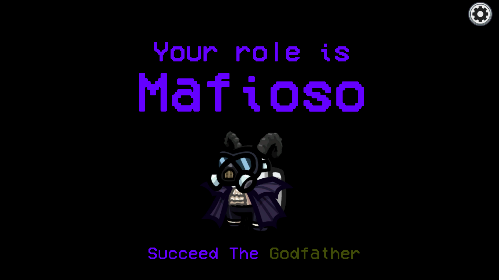

### Alignment: Intruder (Utility)

The Mafioso is promoted from a random non-Godfather Intruder role. The Mafioso by themself is nothing special, but when the Godfather dies, the Mafioso becomes the new Godfather. As a result, the new Godfather has a lower cooldown on all of their original role's abilities.

## Miner/Herbalist

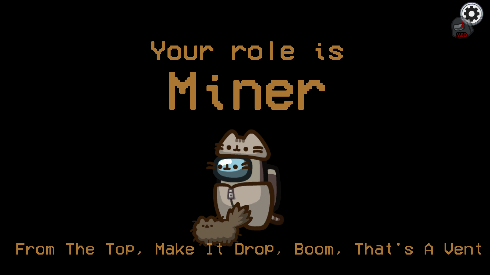

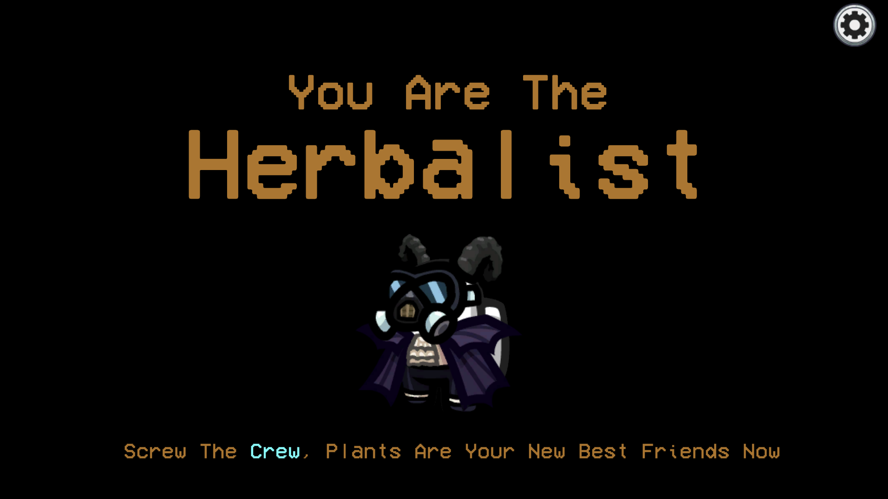

### Alignment: Intruder (Support)
### Origin: Town Of Us

The Miner can create new vents. These vents only connect to each other, forming a new passageway. On the Fungle map, the Miner is named Herbalist for consistency.

## Morphling

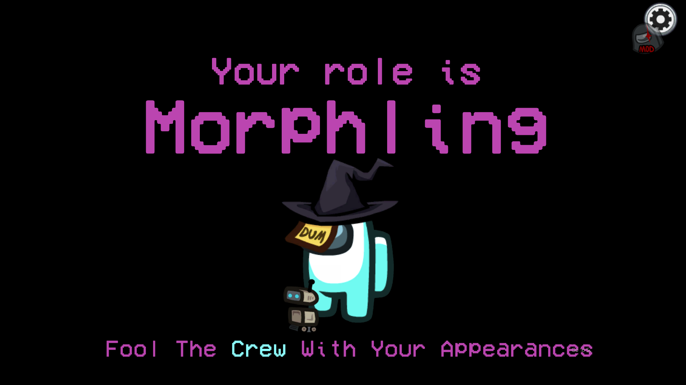

### Alignment: Intruder (Deception)
### Origin: Town Of Us

The Morphling can morph into another player. During the round, they can choose someone to sample. They can then morph into the sampled person at any time for a limited amount of time.

### Game Options

| Name | Description | Type | Default |
|------|-------------|------|---------|
| Morph And Sample Cooldowns Are Linked | Decides whether the Morphling's cooldowns are linked so that morphing resets sampling and vice versa | Toggle | False |
| Morphling Can Vent | Toggles the Morphling's ability to vent | Toggle | True |

## Teleporter

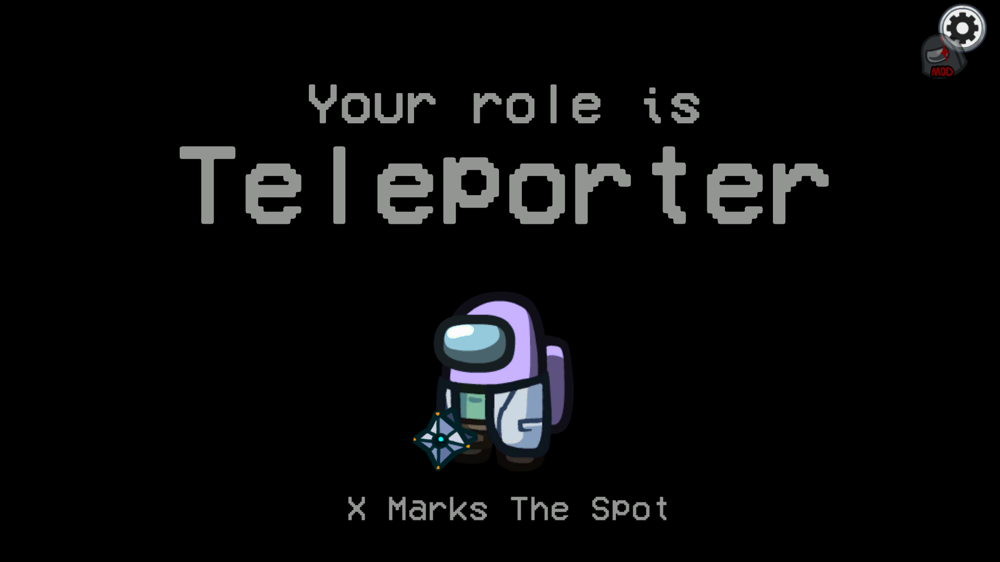

### Alignment: Intruder (Support)
### Origin: Town Of Us Escapist

The Teleporter can mark a location which they can then teleport to later.

### Game Options

| Name | Description | Type | Default |
|------|-------------|------|---------|
| Teleport And Mark Cooldowns Are Linked | Decides whether the Teleporter's cooldowns are linked so that marking resets teleportation and vice versa | Toggle | False |
| Teleporter Can Vent | Toggles the Teleporter's ability to vent | Toggle | True |

## Wraith

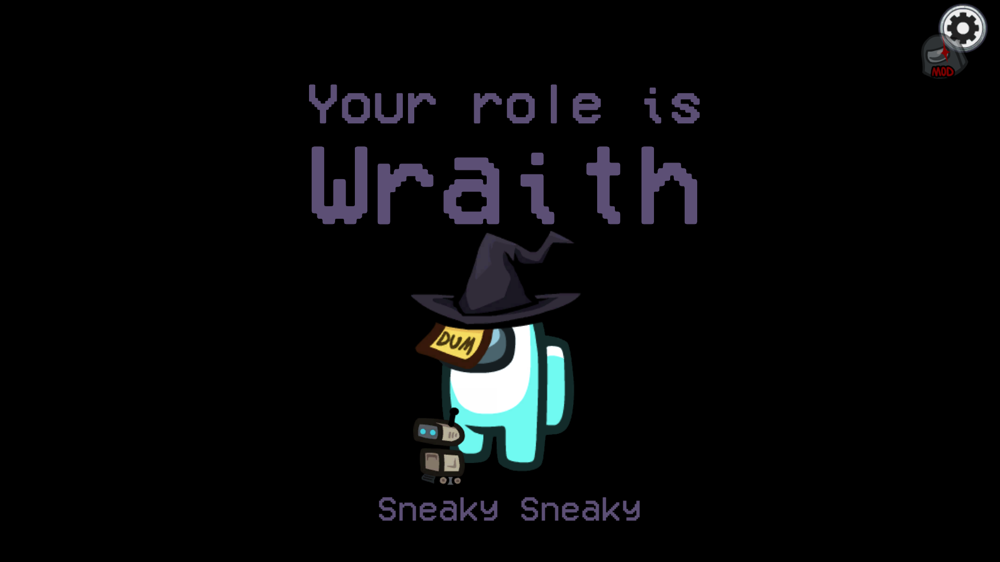

### Alignment: Intruder (Deception)
### Origin: Town Of Us Swooper

The Wraith can temporarily turn invisible.

### Game Options

| Name | Description | Type | Default |
|------|-------------|------|---------|
| Wraith Can Vent | Toggles the Wraith's ability to vent | Toggle | True |

# Syndicate Roles

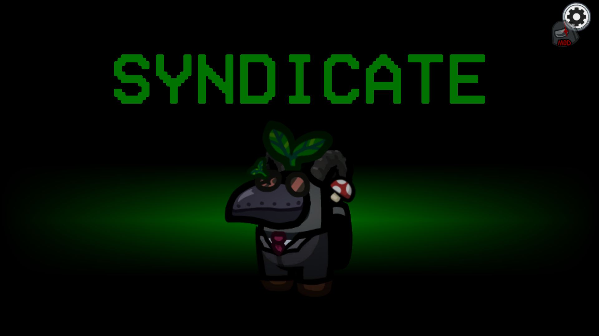

Each member of this faction has a special ability and then after a certain number of meetings, can also kill. The main theme of this faction is chaos. This faction is an informed minority meaning they make up a tiny fraction of the crew and know who the other members are. After a certain number of meetings, the Syndicate can retreive the "Chaos Drive" which gives the holder the ability to kill (if they couldn't already) while also enhancing their existing abilities.

### Syndicate Settings

| Name | Description | Type | Default |
|------|-------------|------|---------|
| Syndicate Count | How many Syndicate can spawn | Number | 1 |
| Syndicate Replaces Intruders | Self descriptive | Toggle | False |
| Chaos Drive Timer | How many meetings must pass before the Chaos Drive is handed out | Number | 3 |
| Chaos Drive Is Global | The Chaos Drive is handed out to every member of the Syndicate rather than only one | Toggle | False |

## Anarchist

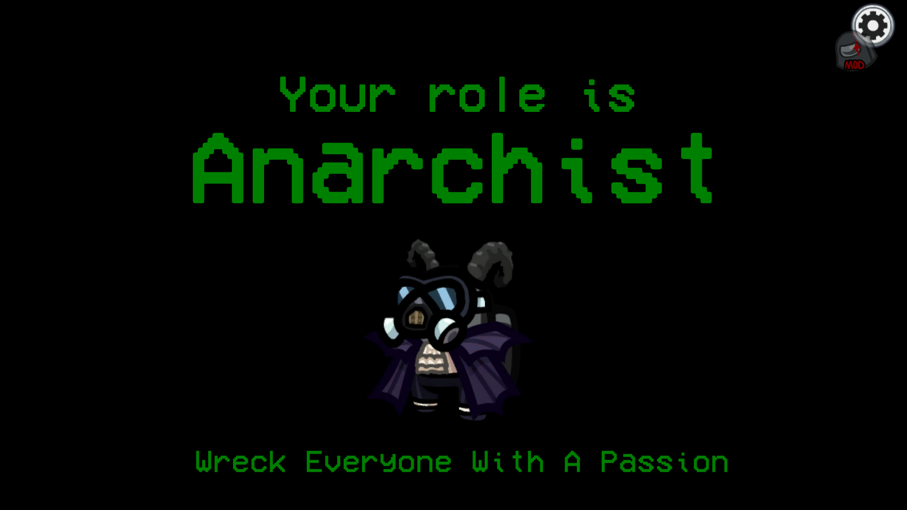

### Alignment: Syndicate (Utility)

Just a plain Syndicate with no abilities and only spawns if all the other roles are taken or set to spawn in Custom mode. Its only benefit is its ability to kill from the beginning of the game.

 

## Banshee

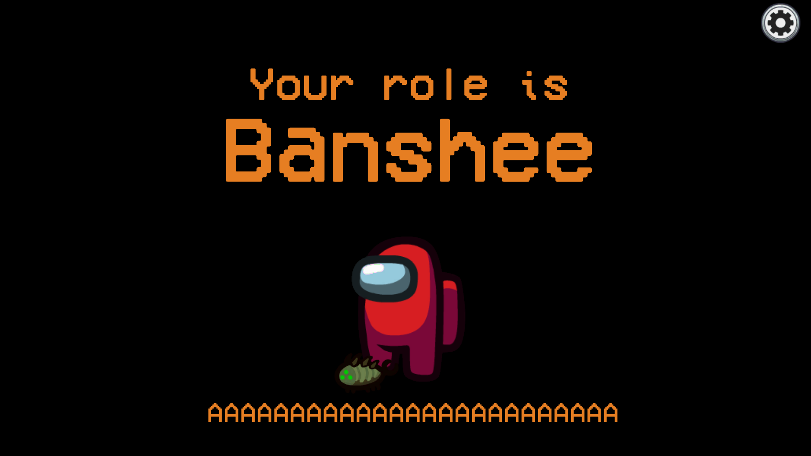

### Alignment: Syndicate (Utility)

The Banshee is a dead Syndicate. The Banshee can block every non-Syndicate player every once in a while. This role cannot get the Chaos Drive.

 

## Bomber

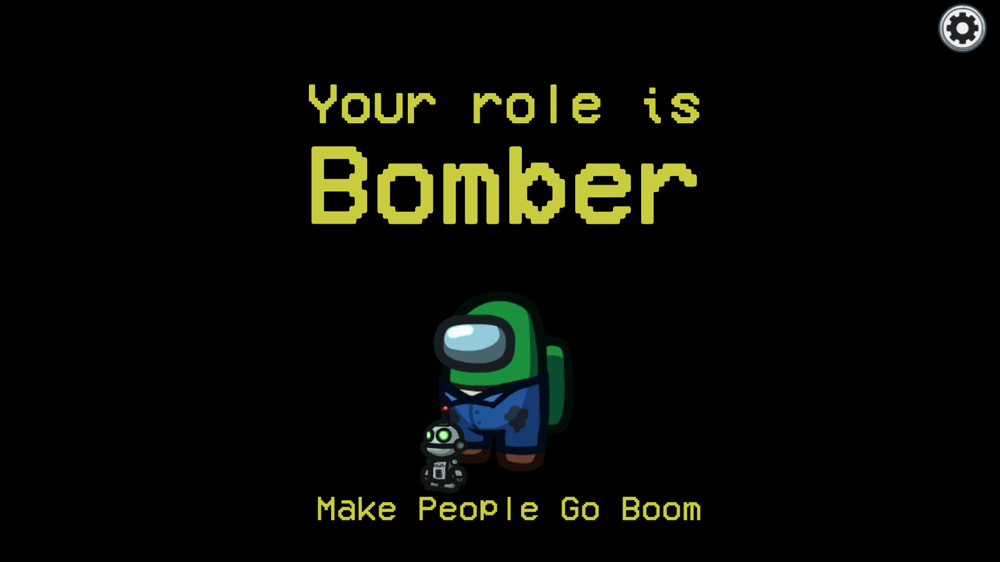

### Alignment: Syndicate (Killing)

The Bomber can place a bomb which can be remotely detonated at any time. Anyone caught inside the bomb's radius at the time of detonation will be killed. Only the latest placed bomb will detonate, unless the Bomber holds the Chaos Drive, with which they can detonate all bombs at once.

### Game Options

| Name | Description | Type | Default |
|------|-------------|------|---------|
| Bomb Radius | The bomb's radius | Distance | 0.25m |
| Chaos Drive Bomb Radius Increase | By how much does the range of the bomb increase | Distance | 0.1m |
| Bomb and Detonate Cooldowns Are Linked | Decides whether the Bomber's cooldowns are linked so that detonating resets placing and vice versa | Toggle | False |
| Bombs Are Cleared Every Meeting | Self descriptive | Toggle | False |
| Bombs Detonate When A Meeting Is Called | Self descriptive | Toggle | False |

## Concealer

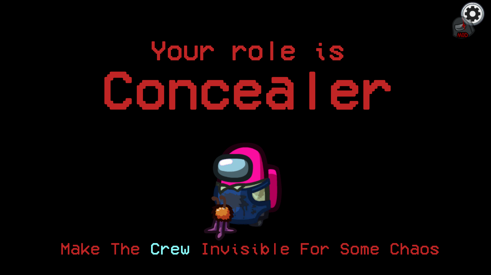

### Alignment: Syndicate (Disruption)

The Concealer can make a player invisible for a short while. With the Chaos Drive, this applies to everyone.

### Game Options

| Name | Description | Type | Default |
|------|-------------|------|---------|
| Concealer Can Conceal Teammates | Self descriptive | Toggle | False |

## Crusader

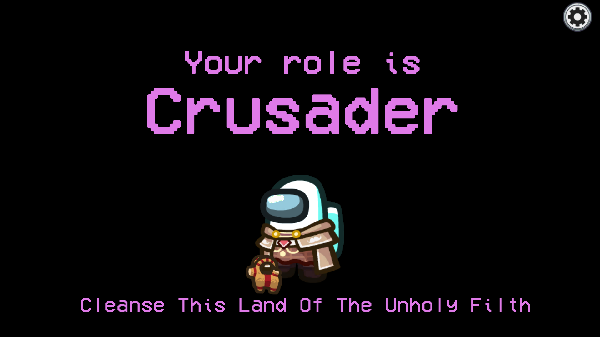

### Alignment: Syndicate (Killing)

The Crusader can temporaily force anyone to go on alert, killing anyone who interacts with the Crusader's target. With the Chaos Drive, attempting to interact with the Crusader's target will cause the target to kill everyone within a certain range, including the target themselves.

### Game Options

| Name | Description | Type | Default |
|------|-------------|------|---------|
| Chaos Drive Crusade Radius | By how much does the range of the charged up crusade effect have | Distance | 0.1m |
| Crusader Can Crusade Teammates | Dictates whether the Crusader can target teammates, while also being able to kill them | Toggle | False |

## Collider

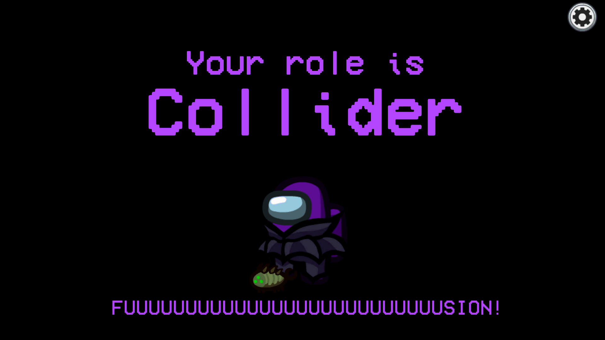

### Alignment: Syndicate (Killing)
### Origin: Partly Las Monjas YinYanger

The Collider can mark players as positive and negative. If these charged players come within a certain distance of each other, they will die together. With the Chaos Drive, the Collider can charge themselves to collide with the other charged players. This only kills the charged victim. The range of collision also increases with the Chaos Drive.

### Game Options

| Name | Description | Type | Default |
|------|-------------|------|---------|
| Collide Radius | How much distance must be between the charged players for them to survive | Distance | 1m |
| Chaos Drive Collide Radius Increase | How much does the collide distance increase by upon receiving the Chaos Drive | Distance | 1m |
| Set Charge Cooldowns Are Linked | Decides whether the Collider's positive and negative button cooldowns are linked | Toggle | False |
| Collision Resets Charge Cooldowns | Decides whether the Collider's positive and negative button cooldowns are reset when a successful collision happens | Toggle | False |

## Drunkard

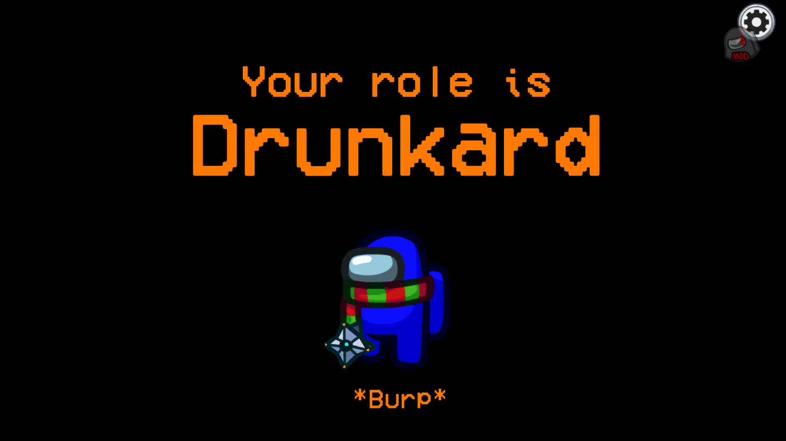

### Alignment: Syndicate (Disruption)

The Drunkard can reverse a player's controls for a short while. With the Chaos Drive, this applies to everyone.

  

### Game Options

| Name | Description | Type | Default |
|------|-------------|------|---------|
| Syndicate Are Immune To Confuse | Self descriptive | Toggle | False |

## Framer

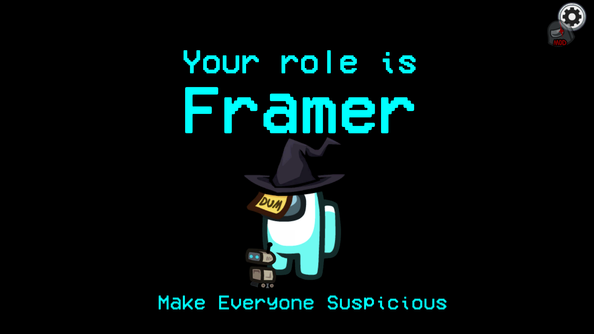

### Alignment: Syndicate (Disruption)
### Origin: Partly Town Of Salem

The Framer can frame players, making them appear to be evil or have wrong results. This effects lasts as long as the Framer is alive. With the Chaos Drive, the Framer can frame players within a certain radius.

### Game Options

| Name | Description | Type | Default |
|------|-------------|------|---------|
| Chaos Drive Frame Radius | How much distance must be between the players to not be framed | Distance | 1m |

## Poisoner

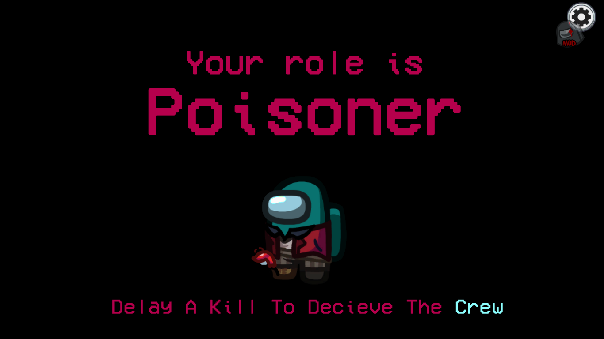

### Alignment: Syndicate (Killing)
### Origin: Town Of Us

The Poisoner can poison a player instead of killing them. When they poison a player, the poisoned player dies either upon the start of the next meeting or after a set duration. With the Chaos Drive, the Poisoner can poison a player from anywhere.

## Rebel

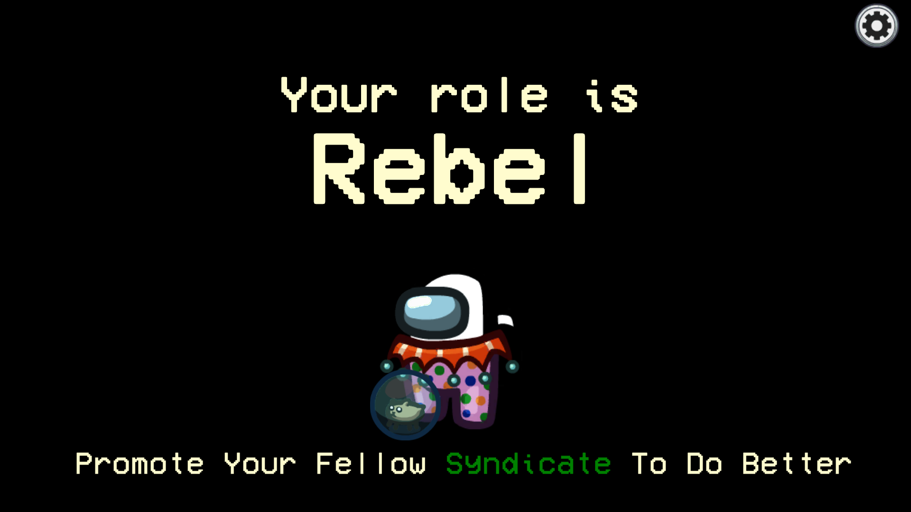

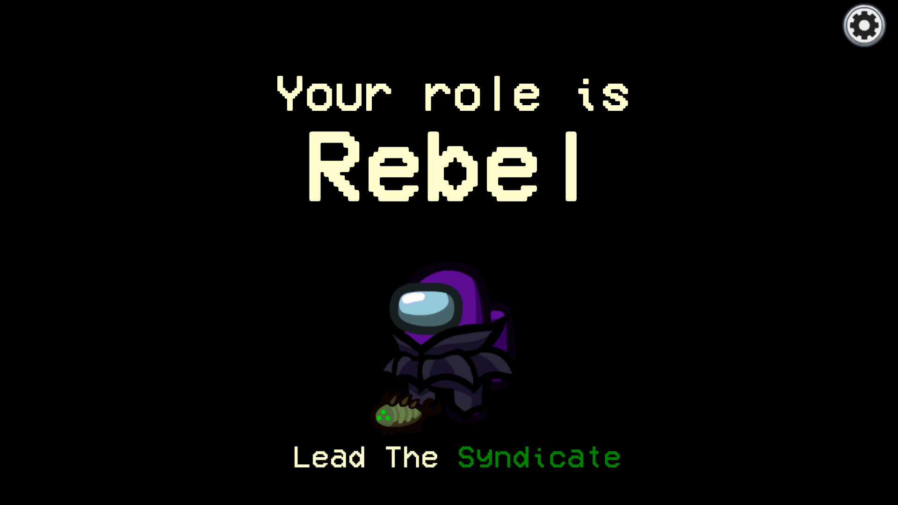

### Alignment: Syndicate (Power)

The Rebel can only spawn in 3+ Syndicate games. They can choose to promote a fellow Syndicate to Sidekick. When the Rebel dies, the Sidekick becomes the new Rebel and has lowered cooldowns. With the Chaos Drive, the Rebel's gains the improved abilities of their former role.

### Game Options

| Name | Description | Type | Default |
|------|-------------|------|---------|
| Cooldown Bonus | How much do the cooldowns decrease by upon promotion | Factor | 0.75x |

## Shapeshifter

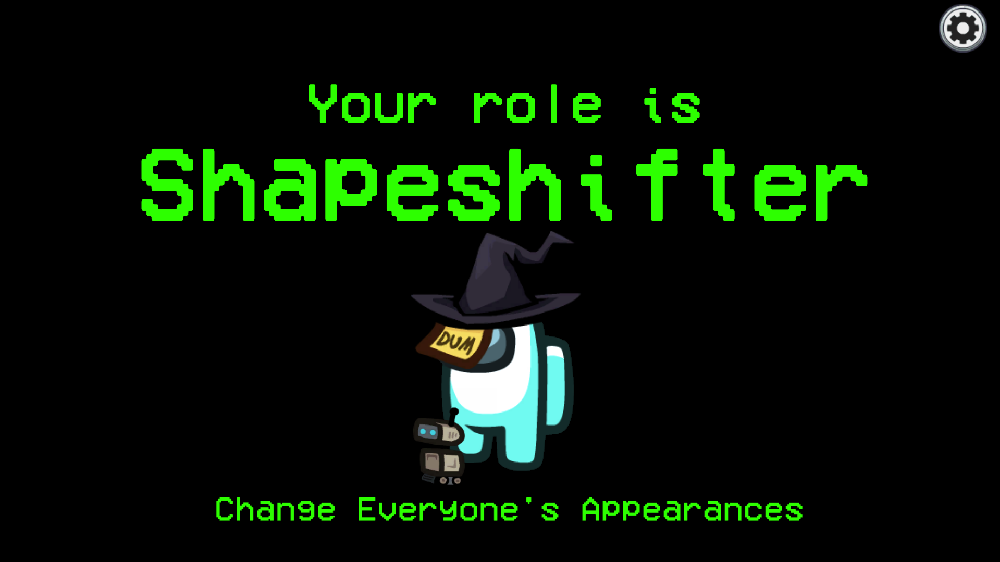

### Alignment: Syndicate (Disruption)

The Shapeshifter can swap the appearances of 2 players. With the Chaos Drive, everyone's appearances are suffled.

  

### Game Options

| Name | Description | Type | Default |
|------|-------------|------|---------|
| Shapeshifter Can Shapeshift Teammates | Self descriptive | Toggle | False |

## Sidekick

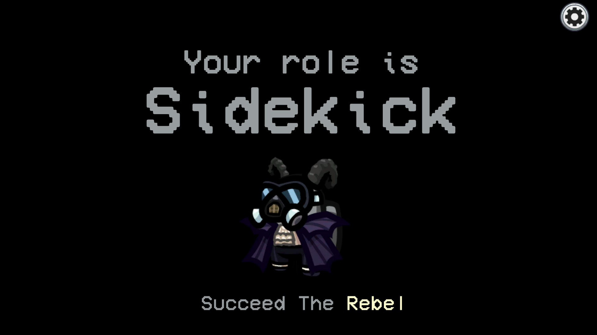

### Alignment: Syndicate (Utility)

The Sidekick is promoted from a random non-Rebel Syndicate role. The Sidekick by themselves is nothing special, but when the Rebel dies, the Sidekick becomes the new Rebel. As a result, the new Rebel has a lower cooldown on all of their original role's abilities.

## Silencer

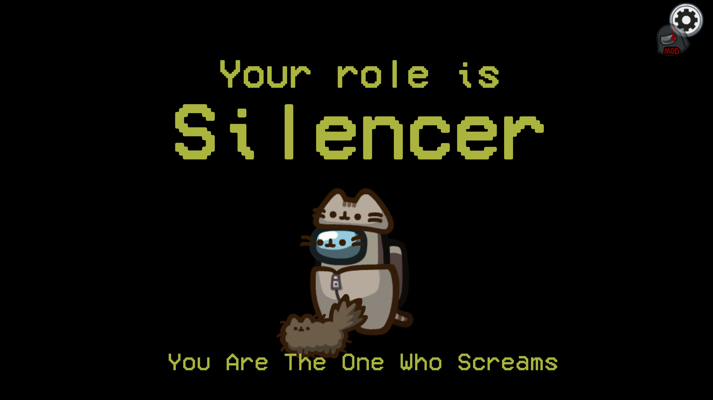

### Alignment: Syndicate (Disruption)
### Origin: Better TOS Banshee

The Silencer can silencer people. Silenced plaeyrs cannot see the messages being sent by others but can still talk. Other players can still talk but can't get their info through to the silenced player. With the Chaos Drive, silence prevents everyone except for the silenced player from talking.

### Game Options

| Name | Description | Type | Default |
|------|-------------|------|---------|
| Silencer Can Read Whispers | Self descriptive | Toggle | False |
| Silencer Can Silence Teammates | Self descriptive | Toggle | False |
| Silence Is Revealed To Everyone | Self descriptive | Toggle | False |

## Spellslinger

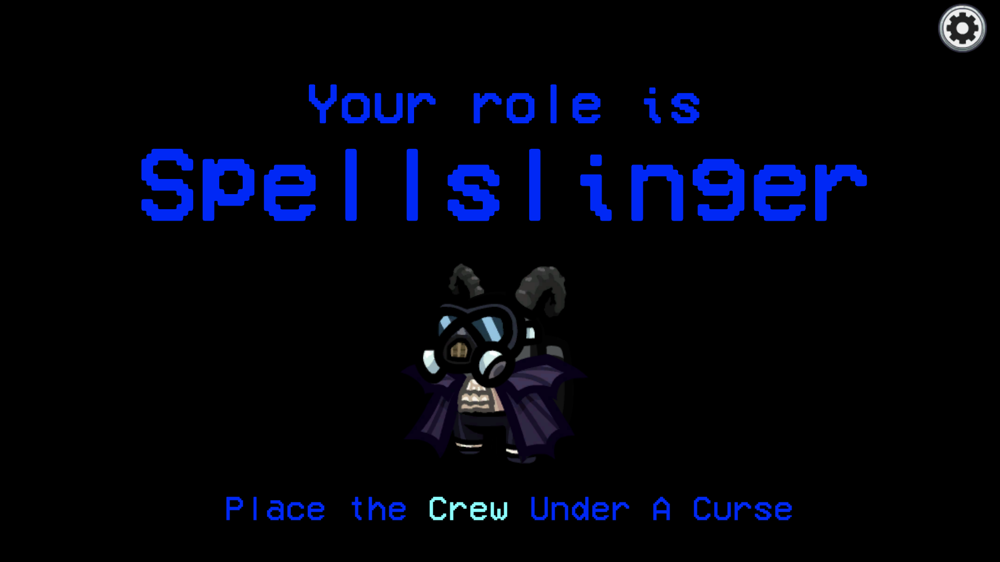

### Alignment: Syndicate (Power)
### Origin: Town Of Salem Hex Master

The Spellslinger is a powerful role who can cast curses on players. When all non-Syndicate players are cursed, the game ends in a Syndicate victory. With each curse cast, the spell cooldown increases. This effect is negated by the Chaos Drive. Spelled players have a blue ø next to their names during a meeting.

### Game Options

| Name | Description | Type | Default |
|------|-------------|------|---------|
| Spell Cooldown Increases By | By how much does the cooldown increase with each curse cast | Time | 5s |

## Stalker

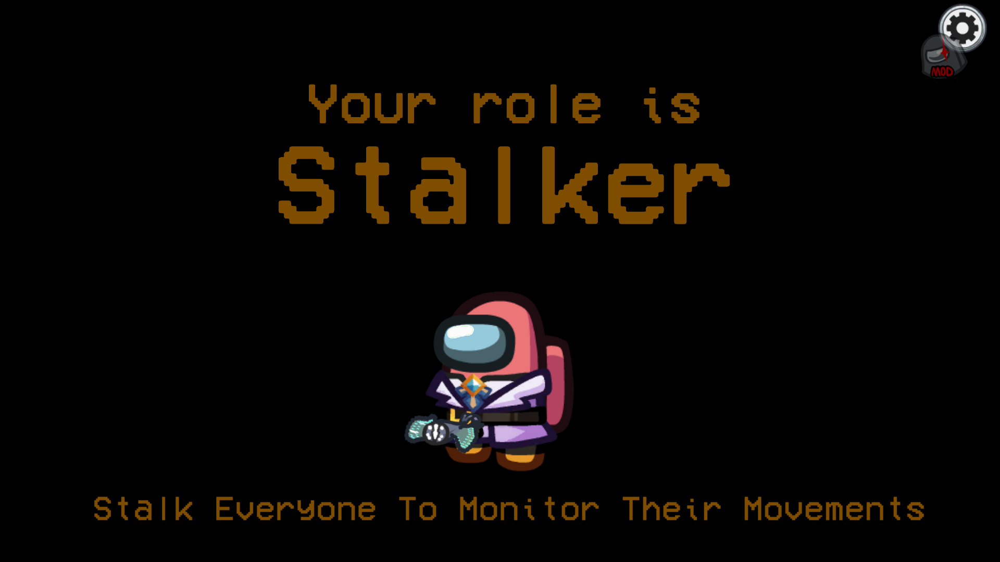

### Alignment: Syndicate (Support)

The Stalker is a buffed Tracker with no update interval. With the Chaos Drive, the arrows are no longer affected by camouflages and all players instantly have an arrow pointing at them.

 

## Timekeeper

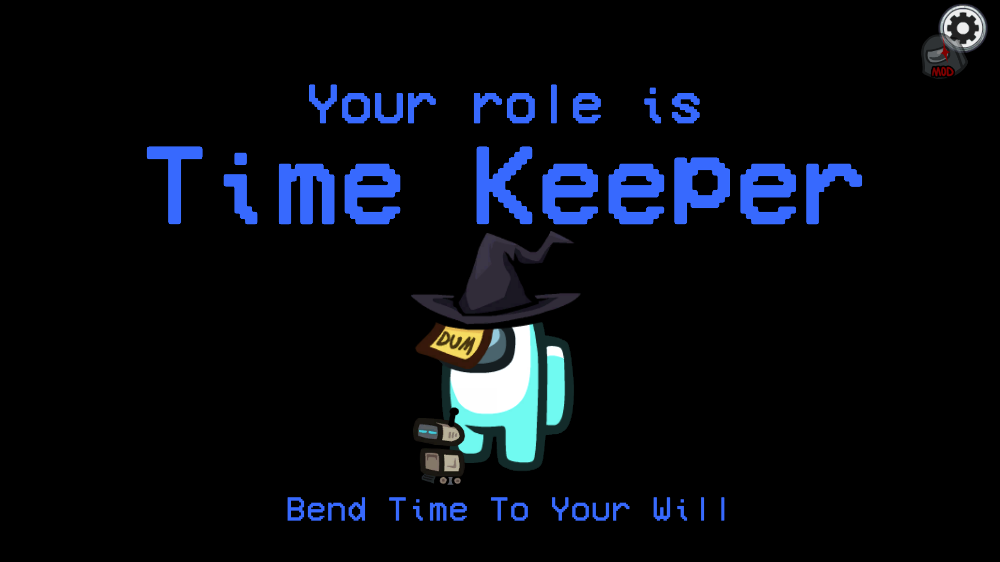

### Alignment: Syndicate (Disruption)
### Origin: Reworked Town Of Us Time Lord

The Timekeeper can control time. Without the Chaos Drive, the Timekeeper can freeze time, making everyone unable to move and with it, the Timekeeper rewinds players instead.

### Game Options

| Name | Description | Type | Default |
|------|-------------|------|---------|
| Syndicate Are Immune To Freeze | Self descriptive | Toggle | False |
| Syndicate Are Immune To Rewind | Self descriptive | Toggle | False |

## Warper

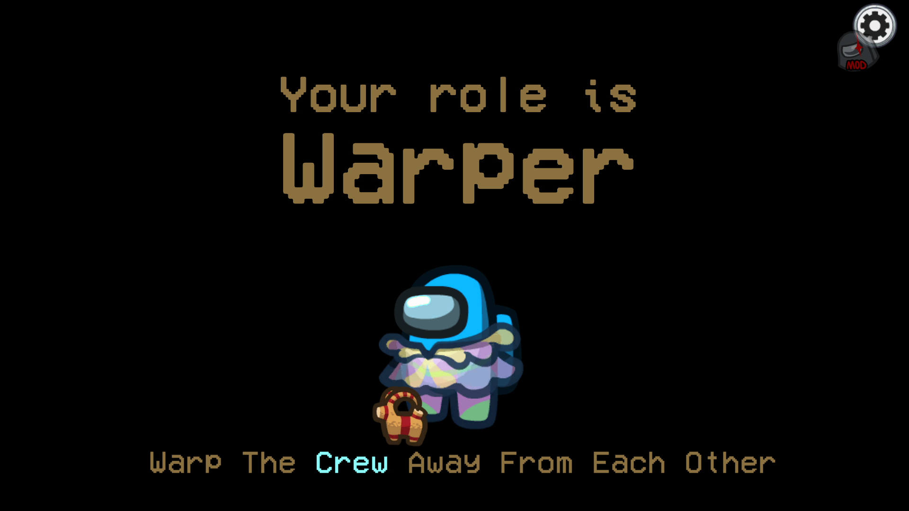

### Alignment: Syndicate (Support)
### Origin: Partly Town Of Us Disperser

The Warper can teleport a player to another player. With the Chaos Drive, the Warper teleports everyone to random positions on the map. Warping a player makes them unable to move and play an animation. During warping, they can be targeted by anyone, opening up the possibility of team killing.

### Game Options

| Name | Description | Type | Default |
|------|-------------|------|---------|
| Warper Can Warp Themselves | Self descriptive | Toggle | False |

# Game Mode Roles

Each role within this group only spawns in certain game modes and come with their own special interactions with the game.

## Hunted

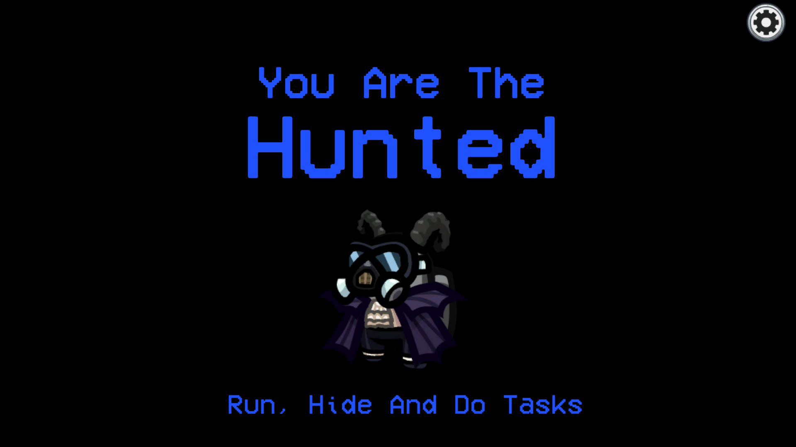

### Game Mode: Hide And Seek
### Win Condition: Finish tasks with the other Hunted before the Hunters kill or convert all of them

The Hunted is one of the two roles that spawn in this mod's version of Hide And Seek. The Hunted has no active abilities and just has a higher vision than the Hunters and might be able to chat.

## Hunter

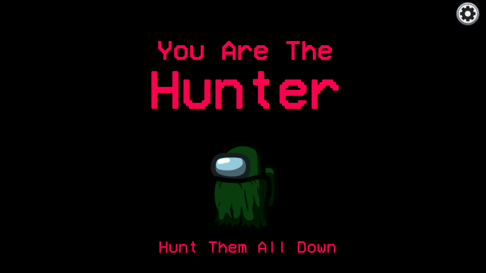

### Game Mode: Hide And Seek
### Win Condition: Kill or convert all of the Hunted

The Hunter is one of the two roles that spawn in this mod's version of Hide And Seek. The Hunter can kill Hunted, or convert them to Hunters. The Hunters also have a higher run speed than Hunters but can barely see in exchange.

## Runner

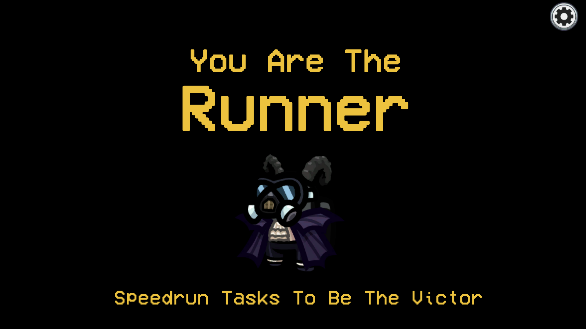

### Game Mode: Task Race
### Win Condition: Finish tasks before the others

The Runner is a role that only spawns in the Task Race game mode. It has no abilities and just ends the game when they are the first to finish.

 

-----------------------

# Objectifiers

Objectifiers are basically a second objective for the player. They can either choose to win the regular way, or win via their Objectifier's condition.

## Allied
### Applied To: Neutral (Killing)
### Win Condition: Win with whichever faction they are aligned with

An Allied Neutral Killer now sides with either the Crew, Intruders or the Syndicate. In the case of the latter two, all faction members are shown who is their Ally, and can no longer kill them. A Crew-Allied will have tasks that they must complete.

### Game Options

| Name | Description | Type | Default |
|------|-------------|------|---------|
| Allied Faction | Which faction the Allied joins | String | Random |

## Corrupted
### Applied to: Crew
### Win Condition: Kill everyone

The Corrupted is a member of the Crew with the alignment of a Neutral Killer. On top of their base role's attributes, they also gain a kill button. Their win condition is so strict that not even Neutral Benigns or Evils can be spared.

### Game Options

| Name | Description | Type | Default |
|------|-------------|------|---------|
| All Corrupted Win Together | Self descriptive | Toggle | False |
| Corrupted Can Vent | Toggles the Corrupted's ability to vent | Toggle | True |

## Defector
### Applied To: Intruders and Syndicate
### Win Condition: Be the last one of thier faction to switch sides

A Defector switches sides when they happen to be the last player alive in their original faction.

### Game Options

| Name | Description | Type | Default |
|------|-------------|------|---------|
| Defector Faction | Which faction the Defector joins | String | Random |
| Defector Knows Who They Are | Whether the Defector knows who they are | Toggle | True |

## Fanatic
### Applied To: Crew
### Win Condition: Get attacked by either the Intruders or the Syndicate to join their team
### Origin: The Other Roles: Community Edition

When attacked, the Fanatic joins whichever faction their attacker belongs to. From then on, their alliance sits with said faction.

### Game Options

| Name | Description | Type | Default |
|------|-------------|------|---------|
| Fanatic Knows Who They Are | Whether the Fanatic knows who they are | Toggle | True |
| Snitch Sees Turned Fanatic | Whether the Snitch sees a turned Fanatic | Toggle | True |
| Revealer Reveals Turned Fanatic | Whether the Revealer reveals a turned Fanatic | Toggle | True |
| Turned Fanatic Swaps Colours for Investigative Roles | Self descriptive | Toggle | False |

## Linked
### Applied To: Neutrals
### Win Condition: Help the other link win

The Linked players are a watered down pair of [Lovers](#lovers). They can help the other player win. As long as one of the links wins, the other does too, regardless of who or how they won.

### Game Options

| Name | Description | Type | Default |
|------|-------------|------|---------|
| Enable Linked Chat | Whether the Linked get a private chat in-between meetings | Toggle | True |
| Linked Know Each Other's Roles | Self descriptive | Toggle | True |

## Lovers
### Applied To: Everyone
### Win Condition: Be 2 of the 3 final players
### Origin: Town Of Us

The Lovers are two players who are linked together. They gain the primary objective to stay alive together. In order to so, they gain access to a private chat, only visible by them in between meetings. However, they can also win with their respective team.

### Game Options

| Name | Description | Type | Default |
|------|-------------|------|---------|
| Enable Lovers Chat | Whether the Lovers get a private chat in-between meetings | Toggle | True |
| Both Lovers Die | Whether the a Lover automatically dies if the other does | Toggle | True |
| Lovers Know Each Other's Roles | Self descriptive | Toggle | True |

## Mafia
### Applied To: Everyone
### Win Condition: Kill off anyone who is not a Mafia member

The Mafia are a group of players with a linked win condition. They must kill anyone who is not a member of the Mafia. All Mafia win together.

### Game Options

| Name | Description | Type | Default |
|------|-------------|------|---------|
| Mafia Know Each Other's Roles | Self descriptive | Toggle | True |
| Mafia Can Vent | Toggles the Mafia's ability to vent, this overrides their role's vent settings | Toggle | True |

## Overlord
### Applied To: Neutrals
### Win Condition: Survive a set amount of meetings

Every meeting, for as long as an Overlord is alive, players will be alerted to their existence. The game ends if the Overlord lives long enough. All alive Overlords win together.

### Game Options

| Name | Description | Type | Default |
|------|-------------|------|---------|
| Overlord Knows Who They Are | Whether the Overlord knows who they are | Toggle | True |
| Overlord Meeting Timer | How many meetings the Overlord must survive | Number | 2 |

## Rivals
### Applied To: Everyone
### Win condition: Get the other rival killed without directly interfering, then live to the final 2

The Rivals cannot do anything to each other and must get the other one killed.

### Game Options

| Name | Description | Type | Default |
|------|-------------|------|---------|
| Enable Rivals Chat | Whether the Rivals get a private chat in-between meetings (this is just a troll setting lol) | Toggle | True |
| Rivals Know Each Other's Roles | Self descriptive | Toggle | True |

## Taskmaster
### Applied To: Neutrals
### Win Condition: Finish tasks before the game ends or dying

The Taskmaster is basically a living Phantom. When a certain number of tasks are remaining, the Taskmaster is revealed to Intruders and the Syndicate and the Crew only sees a flash to indicate the Taskmaster's existence.

### Game Options

| Name | Description | Type | Default |
|------|-------------|------|---------|
| Tasks Remaining When Revealed | How many tasks be remain when the Taskmaster's existence is revealed | Number | 1 |

## Traitor
### Applied To: Crew
### Win Condition: Finish tasks to join either the Intruders or Syndicate

The Traitor is a member of the Crew who must finish their tasks to switch sides. Upon doing so, they will either join the Intruders or the Syndicate, and will win with that faction. If the Traitor is the only person in their new faction, they become a Betrayer, losing their original role's abilities and gaining the ability to kill in the process.

### Game Options

| Name | Description | Type | Default |
|------|-------------|------|---------|
| Traitor Knows Who They Are | Whether the Traitor knows who they are | Toggle | True |
| Snitch Sees Turned Traitor | Whether the Snitch sees a turned Traitor | Toggle | True |
| Revealer Reveals Turned Traitor | Whether the Revealer reveals a turned Traitor | Toggle | True |
| Turned Traitor Swaps Colours for Investigative Roles | Self descriptive | Toggle | False |

-----------------------

# Modifiers

Modifiers are passive afflictions that change a player's gameplay.

## Astral
### Applied To: Everyone
### Origin: The Other Roles Anti-Teleport

An Astral player is not teleported to the meeting table.

## Bait
### Applied To: Everyone
### Origin: Town Of Us

Killing the Bait makes the killer auto self-report the Bait's body.

### Game Options

| Name | Description | Type | Default |
|------|-------------|------|---------|
| Bait Knows Who They Are | Whether a player knows they are Bait at the start of a game | Toggle | True |
| Bait Minimum Delay | The minimum time the killer of the Bait reports the body | Time | 0s |
| Bait Maximum Delay | The maximum time the killer of the Bait reports the body | Time | 1s |

## Colorblind
### Applied To: Everyone
### Origin: Partly Town Of Us Aurial

A colorblind player cannot tell the difference between players.

## Coward
### Applied To: Everyone
### Origin: Partly Town Of Us Blind

The Coward cannot report bodies.

## Diseased
### Applied To: Everyone
### Origin: Town Of Us

Killing the Diseased increases all of the killer's cooldowns.

### Game Options

| Name | Description | Type | Default |
|------|-------------|------|---------|
| Diseased Knows Who They Are | Whether a player knows they are Diseased at the start of a game | Toggle | True |
| Cooldown Multiplier | How much the Cooldowns of the killer is increased by | Factor | 3x |

## Drunk
### Applied To: Everyone
### Origin: Town Of Us

The Drunk player's controls are inverted.

### Game Options

| Name | Description | Type | Default |
|------|-------------|------|---------|
| Drunk Knows Who They Are | Whether a player knows they are Drunk at the start of a game | Toggle | True |
| Drunk Controls Swap Over Time | Self descriptive | Toggle | True |
| ┗ Swap Interval | How much time must pass before the controls swap | Time | 15s |

## Dwarf
### Applied To: Everyone
### Origin: Partly Town Of Us Flash

The Dwarf travels at increased speed and has a much smaller body.

### Game Options

| Name | Description | Type | Default |
|------|-------------|------|---------|
| Dwarf Speed | How fast the Dwarf moves in comparison to normal | Factor | 1.3x |
| Dwarf Scale | How small the Dwarf is in comparison to normal | Factor | 0.5x |

## Giant
### Applied To: Everyone
### Origin: Town Of Us

The Giant is a gigantic player that has a decreased walk speed.

### Game Options

| Name | Description | Type | Default |
|------|-------------|------|---------|
| Giant Speed | How slow the Giant moves in comparison to normal | Factor | 0.75x |
| Giant Scale | How big the Giant is in comparison to normal | Factor | 1.5x |

## Indomitable
### Applied To: Everyone
### Origin: The Other Roles: Community Edition

The Indomitable player cannot be guessed.

### Game Options

| Name | Description | Type | Default |
|------|-------------|------|---------|
| Indomitable Knows Who They Are | Whether a player knows they are Indomitable at the start of a game | Toggle | True |

## Professional
### Applied To: Assassins
### Origin: Town Of Us Double Shot

The Professional has an extra life when guessing.

### Game Options

| Name | Description | Type | Default |
|------|-------------|------|---------|
| Professional Knows Who They Are | Whether a player knows they are a Professional at the start of a game | Toggle | True |

## Shy
### Applied To: Everyone

The Shy player cannot call meetings.

## VIP
### Applied To: Everyone
### Origin: Las Monjas

Everyone is alerted of the VIP's death through a flash of the VIP's role color and will have an arrow poiting towards the VIP's body.

### Game Options

| Name | Description | Type | Default |
|------|-------------|------|---------|
| VIP Knows Who They Are | Whether a player knows they are a VIP at the start of a game | Toggle | True |

## Volatile
### Applied To: Everyone
### Origin: Town Of H

A Volatile player will see and hear random things happen to them and cannot distinguish real kills and flashes from the fake ones.

### Game Options

| Name | Description | Type | Default |
|------|-------------|------|---------|
| Volatile Knows Who They Are | Whether a player knows they are Volatile at the start of a game | Toggle | True |
| Volatile Interval | How much time must pass before something happens | Time | 10s |

## Yeller
### Applied To: Everyone

The Yeller's location is always revealed to others.

-----------------------

# Abilities

Abilities give you extra perks on top of your role's regular powers.

## Assassin
### Applied To: Intruders, Crew, Syndicate, Neutral (Killing), Neutral (Harbinger) and Neutral (Neophyte)
### Origin: Town Of Us

The Assassin can guess the layers of others. If they guess right, the target is killed mid-meeting and if they guess wrong, they die instead. The name of the Assassin ability depends on the faction it affects. Bullseye is for Crew, Hitman is for Intruders, Slayer is for Neutrals and Sniper is for the Syndicate.

### Game Options

| Name | Description | Type | Default |
|------|-------------|------|---------|
| Assassin Guess Limit | The number of kills Assassins can do with his ability | Number | 1 |
| Assassin Multiple Kill | Whether the Assassin can kill more than once per meeting | Toggle | False |
| Assassin Guess Neutral Evils | Whether the Assassin can Guess Neutral (Evil) roles | Toggle | False |
| Assassin Guess Neutral Benigns | Whether the Assassin can Guess Neutral (Benign) roles | Toggle | False |
| Assassin Guess Crew Investigatives | Whether the Assassin can Guess Crew (Investigative) roles | Toggle | False |
| Assassin Guess Pestilence | Whether the Assassin can Guess Pestilence | Toggle | False |
| Assassin Guess Select Modifiers | Whether the Assassin can Guess some non-obvious Modifiers | Toggle | False |
| Assassin Guess Select Objectifiers | Whether the Assassin can Guess some non-obvious Objectifiers | Toggle | False |
| Assassin Guess Select Abilities | Whether the Assassin can Guess some non-obvious Abilities | Toggle | False |
| Assassin Can Guess After Voting | Whether the Assassin can Guess after voting | Toggle | False |

## Button Barry
### Applied To: Everyone
### Origin: Town Of Us

The Button Barry can call a meeting from anywhere on the map, even during sabotages. Calling a meeting during a sabotage will fix the sabotage.

## Insider
### Applied To: Crew

The Insider will be able to view everyone's votes in meetings upon finishing their tasks. Only spawns if Anonymous Votes is turn on.

### Game Options

| Name | Description | Type | Default |
|------|-------------|------|---------|
| Insider Knows Who They Are | Whether a player knows they are a Insider at the start of a game | Toggle | True |

## Multitasker
### Applied to: Roles with tasks
### Origin: The Other Roles: Community Edition Paranoid

When doing tasks, the Multitasker's task window is transparent.

### Game Options

| Name | Description | Type | Default |
|------|-------------|------|---------|
| Transperency | Decides how well can someone see when opening a task | Percentage | 50% |

## Ninja
### Applied To: Killers

Ninjas don't lunge when killing.

## Politician
### Applied To: Crew, Intruders, Syndicate, Neutral (Killing) and Neutral (Harbinger)
### Origin: Fused Town Of Us Mayor and Project Lotus Pickpocket

The Politician can vote multiple times. If the Politician cannot kill, they gain a new button called the abstain button which stores their vote for later use. On the other hand, if the Politician can kill, they lose the Abstain button and instead gain a vote for each player they kill.

### Game Options

| Name | Description | Type | Default |
|------|-------------|------|---------|
| Politician Initial Vote Bank | The amount of votes the Politician has at the start of the game | Number | 1 |
| Politician Can Button | Whether the Politician can call a meeting | Toggle | True |

## Radar
### Applied To: Everyone
### Origin: Town Of Us

The Radar always has an arrow pointing towards the nearest player.

## Ruthless
### Applied To: Killers
### Origin: All The Roles

A Ruthless killer can bypass all forms of protection. Although they bypass alert protection, they will still die to a player on alert.

### Game Options

| Name | Description | Type | Default |
|------|-------------|------|---------|
| Ruthless Knows Who They Are | Whether a player knows they are Ruthless at the start of a game | Toggle | True |

## Snitch
### Applied To: non-Traitor or Fanatic Crew
### Origin: Town Of Us

The Snitch is an ability which allows any member of the Crew to get arrows pointing towards the Intruders and the Syndicate once all their tasks are finished. The names of the Intruders and Syndicate will also show up as red on their screen. However, when they only have a certain amount of tasks left, the Intruders and the Syndicate get an arrow pointing towards the Snitch.

### Game Options

| Name | Description | Type | Default |
|------|-------------|------|---------|
| Snitch Knows Who They Are | Whether a player knows they are a Snitch at the start of a game | Toggle | True |
| Snitch Sees Neutral Roles | Whether the Snitch also Reveals Neutral Roles | Toggle | False |
| Snitch Sees Crew Roles | Whether the Snitch also Reveals Crew Roles | Toggle | False |
| Snitch Sees Exact Roles | Whether the Snitch also Reveals all Roles | Toggle | False |
| Tasks Remaining When Revealed | The number of tasks remaining when the Snitch is revealed to Impostors | Number | 1 |
| Snitch Sees Evils in Meetings | Whether the Snitch sees the evil players' names red in Meetings | Toggle | True |

## Swapper
### Applied To: Crew
### Origin: Town Of Us

The Swapper can swap the votes on 2 players during a meeting. All the votes for the first player will instead be counted towards the second player and vice versa.

### Game Options

| Name | Description | Type | Default |
|------|-------------|------|---------|
| Swapper Can Button | Whether the Swapper can call a meeting | Toggle | True |
| Swapper Can Swap After Voting | Whether the Swapper can continue players to swap even after they have voted | Toggle | True |
| Swapper Can Swap Themself | Self descriptive | Toggle | True |

## Tiebreaker
### Applied To: Everyone
### Origin: Town Of Us

During the event of a tie vote, the tied player who the Tiebreaker voted for will be ejected. In the case of a Politician, this applies to their *first* vote.

### Game Options

| Name | Description | Type | Default |
|------|-------------|------|---------|
| Tiebreaker Knows Who They Are | Whether a player knows they are a Tiebreaker at the start of a game | Toggle | True |

## Torch
### Applied To: Non-Killers
### Origin: Town Of Us

The Torch has Intruder vision at all times and can see the silhouettes of invisible players.

## Tunneler
### Applied To: Crew excluding Engineer
### Origin: The Other Roles: Community Edition

The Tunneler will be able to vent when they finish their tasks.

### Game Options

| Name | Description | Type | Default |
|------|-------------|------|---------|
| Tunneler Knows Who They Are | Whether a player knows they are a Tunneler at the start of a game | Toggle | True |

## Underdog
### Applied To: Intruders and Syndicate
### Origin: Town Of Us

The Underdog is an Intruder or Syndicate with prolonged cooldowns when with a teammate. When they are the only remaining member, they will have their cooldowns shortened.

### Game Options

| Name | Description | Type | Default |
|------|-------------|------|---------|
| Underdog Knows Who They Are | Whether a player knows they are a Underdog at the start of a game | Toggle | True |
| Kill Cooldown Bonus | The amount of time added or removed from the Underdog's Kill Cooldown | Time | 5s |
| Increased Kill Cooldown | Whether the Underdog's Kill Cooldown is Increased when they aren't alone | Toggle | True |

-----------------------

# License
This software is distributed under the GNU GPLv3 License. BepInEx is distributed under LGPL-2.1 License.

-----------------------

#

This mod is not affiliated with Among Us or Innersloth LLC, and the content contained therein is not endorsed or otherwise sponsored by Innersloth LLC. Portions of the materials contained herein are property of Innersloth LLC.

© Innersloth LLC.

