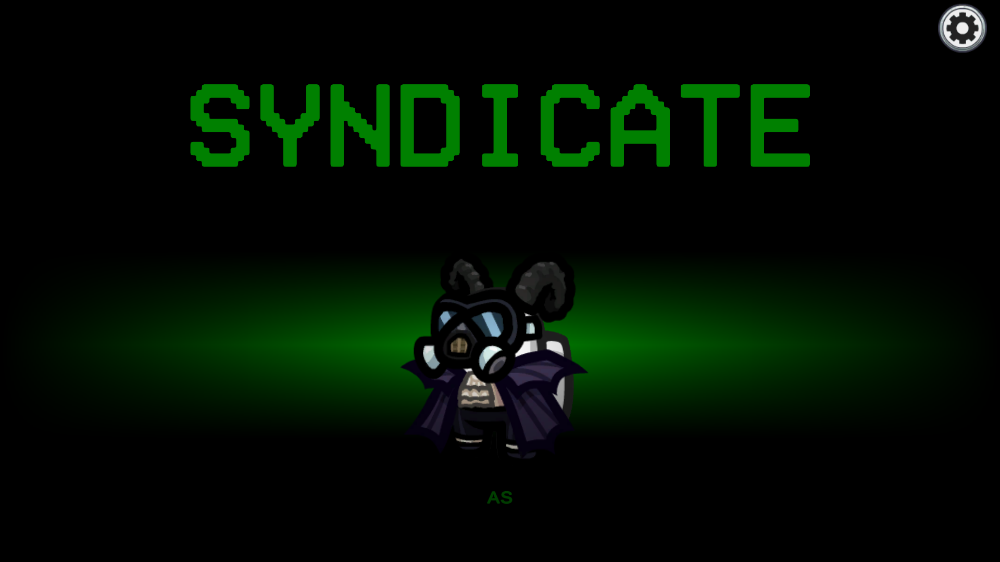

### ***Note: This repo is a fork of [Town of Us Reactivated](https://github.com/eDonnes124/Town-Of-Us-R) and is currently under development.***
### ***Also Note: This mod is NOT for mobile and console versions, do not ask for a port.***
### ***Also Also Note: This README page is currently under editing, most things here are either missing or subject to change.***

An [Among Us](https://store.steampowered.com/app/945360/Among_Us) mod that adds a bunch of roles, modifiers, objectifiers, abilities and game settings.

Join our [Discord](https://discord.gg/cd27aDQDY9) if you have any problems or want to find people to play with!

# ***Contents***

[**Contents**](#contents)

[**Releases**](#releases)

[**Changelogs**](#changelogs)

[**Installation**](#installation)
- [Requirements](#requirements)
- [Steam Guide](#steam-guide)
- [Epic Games Guide](#epic-games-guide)
- [Linux Guide](#linux-guide)
- [Issues](#issues)

[**Uninstallation**](#uninstallation)

[**Player Layers**](#player-layers)

| [Intruders](#intruder-roles) | [Syndicate](#syndicate-roles) | [Crew](#crew-roles)               | [Neutrals](#neutral-roles)        |
|------------------------------|-------------------------------|-----------------------------------|-----------------------------------|
| [Ambusher](#ambusher)        | [Anarchist](#anarchist)       | [Altruist](#altruist)             | [Actor](#actor)                   |
| [Blackmailer](#blackmailer)  | [Banshee](#banshee)           | [Chameleon](#chameleon)           | [Amnesiac](#amnesiac)             |
| [Camouflager](#camouflager)  | [Bomber](#bomber)             | [Coroner](#coroner)               | [Arsonist](#arsonist)             |
| [Consigliere](#consigliere)  | [Concealer](#concealer)       | [Crewmate](#crewmate)             | [Betrayer](betrayer)              |
| [Consort](#consort)          | [Crusader](#crusader)         | [Detective](#detective)           | [Bounty Hunter](#bounty-hunter)   |
| [Disguiser](#disguiser)      | [Framer](#framer)             | [Engineer](#engineer)             | [Cannibal](#cannibal)             |
| [Enforcer](#enforcer)        | [Poisoner](#poisoner)         | [Escort](#escort)                 | [Cryomaniac](#cryomaniac)         |
| [Ghoul](#ghoul)              | [Politician](#politician)     | [Inspector](#inspector)           | [Dracula](#dracula)               |
| [Godfather](#godfather)      | [Rebel](#rebel)               | [Mayor](#mayor)                   | [Executioner](#executioner)       |
| [Grenadier](#grenadier)      | [Shapeshifter](#shapeshifter) | [Medic](#medic)                   | [Glitch](#glitch)                 |
| [Impostor](#impostor)        | [Sidekick](#sidekick)         | [Medium](#medium)                 | [Guardian Angel](#guardian-angel) |
| [Janitor](#janitor)          | [Warper](#warper)             | [Mystic](#mystic)                 | [Guesser](#guesser)               |
| [Mafioso](#mafioso)          |                               | [Operative](#operative)           | [Jackal](#jackal)                 |
| [Miner](#miner)              |                               | [Retributionist](#retributionist) | [Jester](#jester)                 |
| [Morphling](#morphling)      |                               | [Revealer](#revealer)             | [Juggernaut](#juggernaut)         |
| [Teleporter](#teleporter)    |                               | [Seer](#seer)                     | [Murderer](#murderer)             |
| [Wraith](#wraith)            |                               | [Sheriff](#sheriff)               | [Necromancer](#necromancer)       |
|                              |                               | [Shifter](#shifter)               | [Pestilence](#pestilence)         |
|                              |                               | [Swapper](#swapper)               | [Phantom](#phantom)               |
|                              |                               | [Tracker](#tracker)               | [Plaguebearer](#plaguebearer)     |
|                              |                               | [Transporter](#transporter)       | [Serial Killer](#serial-killer)   |
|                              |                               | [Vampire Hunter](#vampire-hunter) | [Survivor](#survivor)             |
|                              |                               | [Veteran](#veteran)               | [Thief](#thief)                   |
|                              |                               | [Vigilante](#vigilante)           | [Werewolf](#werewolf)             |
|                              |                               |                                   | [Whisperer](#whisperer)           |

| [Modifiers](#modifiers)       | [Abilities](#abilities)       | [Objectifiers](#objectifiers) |
|-------------------------------|-------------------------------|-------------------------------|
| [Bait](#bait)                 | [Assassin](#assassin)         | [Allied](#allied)             |
| [Coward](#coward)             | [Button Barry](#button-barry) | [Corrupted](#corrupted)       |
| [Diseased](#diseased)         | [Insider](#insider)           | [Fanatic](#fanatic)           |
| [Drunk](#drunk)               | [Multitasker](#multitasker)   | [Lovers](#lovers)             |
| [Dwarf](#dwarf)               | [Ninja](#ninja)               | [Overlord](#overlord)         |
| [Flincher](#flincher)         | [Radar](#radar)               | [Rivals](#rivals)             |
| [Giant](#giant)               | [Ruthless](#ruthless)         | [Taskmaster](#taskmaster)     |
| [Indomitable](#indomitable)   | [Snitch](#snitch)             | [Traitor](#traitor)           |
| [Professional](#professional) | [Tiebreaker](#tiebreaker)     |                               |
| [Shy](#shy)                   | [Torch](#torch)               |                               |
| [VIP](#vip)                   | [Tunneler](#tunneler)         |                               |
| [Volatile](#volatile)         | [Underdog](#underdog)         |                               |

[**Custom Game Settings**](#custom-game-settings)
- [Common Settings](#common-settings)
- [Global Settings](#global-settings)
- [Game Mode Settings](#game-mode-settings)
- [Killing Only Mode Settings](#killing-only-mode-settings)
- [All Any Mode Settings](#all-any-mode-settings)
- [Game Modifiers](#game-modifiers)
- [Game Announcements](#game-announcements)
- [Quality Changes](#quality-changes)
- [Map Settings](#map-settings)
- [Better Skeld Settings](#better-skeld-settings)
- [Better Polus Settings](#better-polus-settings)
- [Better Airship Settings](#better-airship-settings)

[**Extras**](#extras)
- [New Colors](#new-colors)
- [Custom Hats](#custom-hats)
- [Bug Reports, Suggestions & Additions](#bug--suggestions--additions)

[**Game Info**](#game-info)
- [Lighter Darker Colors](#lighter-darker-colors)
- [Inspector Results](#inspector-results)
- [Factions](#factions)
- [Subfactions](#subfactions)
- [Syndicate Chaos Drive Role Priority](#syndicate-chaos-drive-role-priority)

[**Credits & Resources**](#credits--resources)

[**License**](#license)

# Releases

**Disclaimer: The mod is *not* guaranteed to work on the latest versions of Among Us when it updates.**

| Among Us - Version | Mod Version | Link |
|--------------------|-------------|------|
| 2023.3.28 (s & e) | v0.1.0-dev1 | [Download](https://github.com/AlchlcDvl/TownOfUsReworked/releases/download/v0.1.0-dev1/TownOfUsReworked.zip) |
| 2023.3.28 (s & e) | v0.0.4-dev2 | [Download](https://github.com/AlchlcDvl/TownOfUsReworked/releases/download/v0.0.4-dev2/TownOfUsReworked.zip) |
| 2023.3.28 (s & e) | v0.0.4-dev1 | [Download](https://github.com/AlchlcDvl/TownOfUsReworked/releases/download/v0.0.4-dev1/TownOfUsReworked.zip) |
| 2023.3.28 (s & e) | v0.0.3-dev3 | [Download](https://github.com/AlchlcDvl/TownOfUsReworked/releases/download/v0.0.3-dev3/TownOfUsReworked.zip) |
| 2023.3.28 (s & e) | v0.0.3-dev2 | [Download](https://github.com/AlchlcDvl/TownOfUsReworked/releases/download/v0.0.3-dev2/TownOfUsReworked.zip) |
| 2023.3.28 (s & e) | v0.0.3-dev1 | [Download](https://github.com/AlchlcDvl/TownOfUsReworked/releases/download/v0.0.3-dev1/TownOfUsReworked.zip) |
| 2023.3.28 (s & e) | v0.0.3 | [Download](https://github.com/AlchlcDvl/TownOfUsReworked/releases/download/v0.0.3/TownOfUsReworked.zip) |
| 2023.3.28 (s & e) | v0.0.2dev8.75 | [Download](https://github.com/AlchlcDvl/TownOfUsReworked/releases/download/v0.0.2-dev8.75/TownOfUsReworked.zip) |
| 2023.3.28 (s & e) | v0.0.2dev8.5 | [Download](https://github.com/AlchlcDvl/TownOfUsReworked/releases/download/v0.0.2-dev8.5/TownOfUsReworked.zip) |
| 2023.3.28 (s & e) | v0.0.2dev8 | [Download](https://github.com/AlchlcDvl/TownOfUsReworked/releases/download/v0.0.2-dev8/TownOfUsReworked.zip) |
| 2023.2.28 (s & e) | v0.0.2dev7 | [Download](https://github.com/AlchlcDvl/TownOfUsReworked/releases/download/v0.0.2-dev7/TownOfUsReworked.zip) |
| 2023.2.28 (s & e) | v0.0.2dev6 | [Download](https://github.com/AlchlcDvl/TownOfUsReworked/releases/download/v0.0.2-dev6/TownOfUsReworked.zip) |
| 2023.2.28 (s & e) | v0.0.2dev5 | [Download](https://github.com/AlchlcDvl/TownOfUsReworked/releases/download/v0.0.2-dev5/TownOfUsReworked.zip) |
| 2023.2.28 (s & e) | v0.0.2dev4 | [Download](https://github.com/AlchlcDvl/TownOfUsReworked/releases/download/v0.0.2-dev4/TownOfUsReworked.zip) |
| 2023.2.28 (s & e) | v0.0.2dev3 | [Download](https://github.com/AlchlcDvl/TownOfUsReworked/releases/download/v0.0.2-dev3/TownOfUsReworked.zip) |
| 2023.2.28 (s & e) | v0.0.2dev2 | [Download](https://github.com/AlchlcDvl/TownOfUsReworked/releases/download/v0.0.2-dev2/ToU-Rew-v0.0.2-dev2.zip) |
| 2022.12.14 (s & e) | v0.0.1dev19 | [Download](https://github.com/AlchlcDvl/TownOfUsReworked/releases/download/v0.0.1-dev19/ToU-Rew-v0.0.1-dev19.zip) |
| 2022.12.14 (s & e) | v0.0.1dev18.5 | [Download](https://github.com/AlchlcDvl/TownOfUsReworked/releases/download/v0.0.1-dev18.5/ToU-Rew-v0.0.1-dev18.5.zip) |
| 2022.12.14 (s & e) | v0.0.1dev18 | [Download](https://github.com/AlchlcDvl/TownOfUsReworked/releases/download/v0.0.1-dev18/ToU-Rew-v0.0.1-dev18.zip) |
| 2022.12.14 (s & e) | v0.0.1dev17 | [Download](https://github.com/AlchlcDvl/TownOfUsReworked/releases/download/v0.0.1-dev17/ToU-Rew-v0.0.1-dev17.zip) |
| 2022.12.14 (s & e) | v0.0.1dev16 | [Download](https://github.com/AlchlcDvl/TownOfUsReworked/releases/download/v0.0.1-dev16/ToU-Rew-v0.0.1dev16.rar) |
| 2022.12.14 (s & e) | v0.0.1dev15 | [Download](https://github.com/AlchlcDvl/TownOfUsReworked/releases/download/v0.0.1-dev15/ToU-Rew-v0.0.1dev15.rar) |
| 2022.12.14 (s & e) | v0.0.1dev14 | [Download](https://github.com/AlchlcDvl/TownOfUsReworked/releases/download/v0.0.1-dev14/ToU-Rew-v0.0.1dev14.rar) |
| 2022.12.14 (s & e) | v0.0.1dev13.5 | [Download](https://github.com/AlchlcDvl/TownOfUsReworked/releases/download/v0.0.1-dev13.5/ToU-Rew-v0.0.1dev13.5.rar) |
| 2022.12.14 (s & e) | v0.0.1dev13 | [Download](https://github.com/AlchlcDvl/TownOfUsReworked/releases/download/v0.0.1-dev13/ToU-Rew-v0.0.1dev13.rar) |

# Changelogs

  
Changelog

  

    
v0.1.0-dev1

    <ul> <li>Buff: Altruist can now revive players multiple times and sacrifices themselves on the last revive</li> </ul>
    <ul> <li>Update: Updated Crowded to fix the double click issue</li> </ul>
    <ul> <li>Update: Updated the role info from the recent updates in the in-game wiki</li> </ul>
    <ul> <li>Improvement: Improved player targetting</li> </ul>
    <ul> <li>Improvement: Settings now open to the last tab you were on, and keybinds for page jumping also work in there</li> </ul>
    <ul> <li>Critical Fix: Fixed the Haunt button not working</li> </ul>
    <ul> <li>Visual Fix: Fixed Poisoner having 2 buttons</li> </ul>
    <ul> <li>Visual Fix: Fixed the sheer amount of ability buttons spawning (hopefully)</li> </ul>
    <ul> <li>Visual Fix: Fixed buttons not disappearing when a meeting is called</li> </ul>
    <ul> <li>Visual Fix: Fixed the spectate button looking a little cut off</li> </ul>
    <ul> <li>Bug Fix: Fixed Vitals immediately closing upon opening</li> </ul>
    <ul> <li>Bug Fix: Fixed staying zoomed out during a meeting</li> </ul>
    <ul> <li>Bug Fix: Fixed the issue with targets not being higlighted at the times they are supposed to be</li> </ul>
    <ul> <li>Bug Fix: Fixed settings looping incorrectly</li> </ul>
    <ul> <li>Bug Fix: Fixed the issue with friendly fire</li> </ul>
    <ul> <li>Objectifier Fix: Fixed Corrupted not ending the game when it is supposed to</li> </ul>
    <ul> <li>Modifier Fix: Fixed continuously walking when being fake killed as Volatile</li> </ul>
    <ul> <li>Ability Fix: Button Barry no longer bugs out a meeting for themselves</li> </ul>
    <ul> <li>Role + Ability Fix: Fixed not being able to guess Crusader (for Assassin and Guesser)</li> </ul>
    <ul> <li>Role Fix: Fixed Arsonist buttons not working</li> </ul>
    <ul> <li>Role Fix: Fixed footprints not disappearing after a meeting for Detectives and Retributionist-Detectives</li> </ul>
    <ul> <li>Role Fix: Fixed Rebel not being able to promote anyone</li> </ul>
    <ul> <li>Role Fix: Fixed Disguiser not being able to disguise players</li> </ul>
    <ul> <li>Role Fix: Fixed Syndicate roles having a kill button from the start</li> </ul>
    <ul> <li>Role Fix: Fixed Troll screwing with the end game upon dying</li> </ul>
    <ul> <li>Role Fix: Fixed Godfather-Janitors not dropping bodies when being warped/transported</li> </ul>
    <ul> <li>Removed: Time Lord, Time Master and Drunkard because they break the game often, they'll return when I find a way to fix that</li> </ul>
    <ul> <li>Removed: Removed the /setname chat command because it visually bugs out a lot (thanks to a certain group of people)</li> </ul>
  

  

    
v0.0.4-dev2

    <ul> <li>Addition: Added a disconnect handler to hopefully reduce future errors</li> </ul>
    <ul> <li>Improvement: Added support for multiple Swappers swapping</li> </ul>
    <ul> <li>Visual Fix: Fixed Whisperer not being able to see how much someone is left to be converted for</li> </ul>
    <ul> <li>Bug Fix: Fixed a random log spam caused by players leaving</li> </ul>
    <ul> <li>Potential Fix: Lag spikes</li> </ul>
    <ul> <li>Role Fix: Fixed Medic-Retributionists not actually protecting anyone</li> </ul>
    <ul> <li>Role Fix: Fixed Guardian Angel having 2 buttons</li> </ul>
    <ul> <li>Role Fix: An attempt at fixing Retributionist and Swapper meeting buttons</li> </ul>
    <ul> <li>Role Fix: Fixed Politician-Rebels not having their votes refunded on assassinations</li> </ul>
  

  

    
v0.0.4-dev1

    <ul> <li>Buff: Framer frames work on Vampire Hunters as well and framed Vigilantes can shoot anyone</li> </ul>
    <ul> <li>Buff: Coroner-Retributionists also get meeting info like Coroners do</li> </ul>
    <ul> <li>Buff: Diseased now applies to every cooldown for the rest of the round</li> </ul>
    <ul> <li>Nerf: Reporting bodies no longer spreads douses or infections (because they often break the game rather than be helpful)</li> </ul>
    <ul> <li>Nerf: Werewolf mauls can now be stopped if the target is on alert among other things</li> </ul>
    <ul> <li>Update: Added changes from v4.0.4 and v4.0.5 of ToU-R</li> </ul>
    <ul> <li>Change: Sheriff now sees flashes as indicator for guilt, rather than name changes</li> </ul>
    <ul> <li>Recode: The mod was recoded a lot, so you know what that means! more bugs! (kill me please)</li> </ul>
    <ul> <li>Improvement: Moved the status text from the intro screen to the too splash screen for better readability</li> </ul>
    <ul> <li>Improvement: Improved how buttons work...for like the 20th time but I promise it gets better</li> </ul>
    <ul> <li>Improvement: Made the mod a little more lightweight; fingers crossed it also fixes the issue of lag spikes</li> </ul>
    <ul> <li>Improvement: Improved spawn code for Revealer, Phantom, Ghoul and Banshee</li> </ul>
    <ul> <li>Improvement: Optimised how blackmails work</li> </ul>
    <ul> <li>Critical Fix: Fixed not being able to enter codes or names</li> </ul>
    <ul> <li>Visual Fix: Fixed player outlines appearing too thin</li> </ul>
    <ul> <li>Visual Fix: Fixed the issue with custom buttons not disappearing during meetings</li> </ul>
    <ul> <li>Visual Fix: Fixed the Use button having the Haunt sprite when dead</li> </ul>
    <ul> <li>Bug Fix: Fixed revived players still having their death reports being sent</li> </ul>
    <ul> <li>Bug Fix: Fixed players becoming Revealer, Banshee, Phantom or Ghouls after being revived</li> </ul>
    <ul> <li>Bug Fix: Fixed votes being calculated incorrectly</li> </ul>
    <ul> <li>Bug Fix: Fixed the end game screen showing the wrong role for players whose roles changed</li> </ul>
    <ul> <li>Bug Fix: Fixed the log spam because of the Debugger window</li> </ul>
    <ul> <li>Objectifier Fix: Fixed Allied sometimes breaking the game upon start</li> </ul>
    <ul> <li>Role Fix: Fixed Godfather being unable to promote Consorts</li> </ul>
    <ul> <li>Role Fix: Fixed Godfathers and Rebels being able to promote other Godfather, Rebels, Mafiosos and Sidekicks to...Mafioso or Sidekick</li> </ul>
    <ul> <li>Role Fix: Fixed Ambusher/Enforcer-Godfathers from being unable to use their abilities</li> </ul>
    <ul> <li>Role Fix: Fixed Bounty Hunter crashing the game on hunting their target</li> </ul>
    <ul> <li>Role Fix: Fixed Bounty Hunter cooldowns not resetting upon usage</li> </ul>
    <ul> <li>Role Fix: Fixed Bounty Hunter sometimes killing themselves</li> </ul>
    <ul> <li>Role Fix: Fixed Cannibal not winning properly</li> </ul>
    <ul> <li>Role Fix: Fixed Necromancer's resurrect sometimes crashing the game</li> </ul>
    <ul> <li>Role Fix: Fixed the issue with Glitch staying permanently mimicked</li> </ul>
  

  

    
v0.0.3-dev3

    <ul> <li>Addition: All Syndicate roles now have Chaos Drive abilities</li> </ul>
    <ul> <li>Merge: Beamer has been merged into Warper</li> </ul>
    <ul> <li>Buff: Consort can roleblock a player from anywhere (to differentiate it from Escort)</li> </ul>
    <ul> <li>Buff: Godfather can now promote a Consort to eventually become the new Godfather</li> </ul>
    <ul> <li>Buff: Rebel can now promote a Politician to eventually become the new Rebel</li> </ul>
    <ul> <li>Buff: Retributionists can use the dead bodies as many times as they want and can also use Transporters and Escorts</li> </ul>
    <ul> <li>Nerf: Chameleon and Retributionist now have a limited number of uses for their swoop ability</li> </ul>
    <ul> <li>Nerf: Bomber now only detonates their latest bomb and the their Chaos Drive ability is to detonate all placed bombs</li> </ul>
    <ul> <li>Nerf: Syndicate (Killing) roles not longer get an extra kill button, their kill abilities just become more powerful</li> </ul>
    <ul> <li>Nerf: Retributionist does not know if a player is Crew and must attempt to use them to find out</li> </ul>
    <ul> <li>Nerf: The Chaos Drive is no longer global and is instead assigned to a random player within a specific order, the global Chaos Drive is instead an option</li> </ul>
    <ul> <li>Change: Concealer can now select a player to make them invisible and its chaos drive ability is its former ability</li> </ul>
    <ul> <li>Change: Shapeshifter can now select 2 players to swap appearances and its chaos drive ability is its former ability</li> </ul>
    <ul> <li>Change: Poisoner has been moved into the Syndicate (Killing) alignment</li> </ul>
    <ul> <li>Improvement: Improved how Transporter and Beamer buttons work</li> </ul>
    <ul> <li>Improvement: Moved the MCI keybinds into a tiny debug menu of their own (based off of Reactor Debugger code)</li> </ul>
    <ul> <li>Improvement: Roles with shapeshifter menus can deselect players by prassing backspace</li> </ul>
    <ul> <li>Improvement: Game announcements are heavily improved on</li> </ul>
    <ul> <li>Improvement: Godfather and Rebel are now optimised and rewritten for less bugs</li> </ul>
    <ul> <li>Improvement: Lobby size has been moved from a chat command to an actual setting</li> </ul>
    <ul> <li>Improvement: Improved how conversions work to fix the occasional lag spike</li> </ul>
    <ul> <li>Visual Fix: Fixed the issue where the Use button would appear to be deepfried</li> </ul>
    <ul> <li>Visual Fix: Fixed the issue with revived players being able to see the spectate button</li> </ul>
    <ul> <li>Bug Fix: Fixed Retributionist arrows sometimes popping up in lobby</li> </ul>
    <ul> <li>Bug Fix: Potential fix for roles not spawning correctly on lower player counts</li> </ul>
    <ul> <li>Bug Fix: Fixed being able to zoom out while in a meeting</li> </ul>
    <ul> <li>Bug Fix: Fixed the issue with /setname not letting you change your name properly</li> </ul>
    <ul> <li>Bug Fix: Fixed games sometimes crashing on end game</li> </ul>
    <ul> <li>Bug Fix: Fixed the issue with multiple Overlord and Chaos Drive related messages being sent</li> </ul>
    <ul> <li>Bug Fix: Fixed the issue with votes being doubled</li> </ul>
    <ul> <li>Bug Fix: Fixed being able to whisper with alive players</li> </ul>
    <ul> <li>Role Fix: Retributionist ability use limits actually work this time</li> </ul>
    <ul> <li>Modifier Fix: Fixed Shy sometimes being able to button</li> </ul>
    <ul> <li>Role Fix: Fixed the issue where Poisoner would occasionally directly kill their target</li> </ul>
    <ul> <li>Role Fix: Prevented Jackal from spawning on lower player counts to prevent errors</li> </ul>
    <ul> <li>Role Fix: Fixed Jackal not spawning with recruits</li> </ul>
    <ul> <li>Role Fix: Fixed Framer framing players not registering for others</li> </ul>
    <ul> <li>Removed: Gorgon because of the countless bugs it has</li> </ul>
    <ul> <li>Removed: Custom Airship spawns because they break the game</li> </ul>
    <ul> <li>Temporary Removal: Sound effects have been temporarily removed, they'll make a return when there's a sound for everything</li> </ul>
  

  

    
v0.0.3-dev2

    <ul> <li>Critical Fix: Fixed the issue where the game would crash when someone was ejected</li> </ul>
  

  

    
v0.0.3.1

    <ul> <li>Changes: Forgot to do a couple of things</li> </ul>
  

  

    
v0.0.3

    <ul> <li>New Role: Politician [Syndicate (Power)]</li> </ul>
    <ul> <li>New Role: Enforcer [Intruder (Killing)]</li> </ul>
    <ul> <li>Merge: Agent has been merged into Operative, yet another soldier down :saluting_face:</li> </ul>
    <ul> <li>Update: Updated the presets</li> </ul>
    <ul> <li>Improvement: Task lists are finally finished</li> </ul>
    <ul> <li>Improvement: Improved how certain functions work and are called</li> </ul>
    <ul> <li>Improvement: Winning Guessers can now guess anyone after guessing their target's role</li> </ul>
    <ul> <li>Bug Fix: Fixed the issue where an Amnesiac/Thief/Shifter changing roles reset everyone's cooldowns</li> </ul>
    <ul> <li>Bug Fix: Fixed where bots would spawn in a public lobby after turning on persistance for robots in a local lobby</li> </ul>
    <ul> <li>Bug Fix: Fixed the occasional log spam when assassinating which leads to lag spikes</li> </ul>
    <ul> <li>Bug Fix: Fixed incorrect Torch assignment</li> </ul>
    <ul> <li>Role Fix: Fixed the issue where shapeshift morphed multiple players into the same player</li> </ul>
    <ul> <li>Role Fix: Fixed the issue where an assassinated player who is also blackmailed by the Godfather-Blackmailer would bug out</li> </ul>
    <ul> <li>Role Fix: Fixed the issue with Murderer being unable to kill</li> </ul>
    <ul> <li>Temporary Removal: Removed the second Spectate button till I figure out why you can't haunt</li> </ul>
  

  

    
v0.0.2dev8.75

    <ul> <li>Critical Fix: Fixed the issue of the mod not being recognised by BepInEx</li> </ul>
  

  

    
v0.0.2dev8.5

    <ul> <li>Removed: Removed a couple things I forgot to</li> </ul>
  

  

    
v0.0.2dev8

    <ul> <li>Merge: Janitor and Undertaker were merged because Undertaker was a bit weak, farewell Undertaker, you will be remembered soldier :saluting_face:</li> </ul>
    <ul> <li>Update: Updated the mod to v2023.3.28</li> </ul>
    <ul> <li>Changes: Made minor changes to how emergency buttons can be called (credits to @whichtwix)</li> </ul>
    <ul> <li>Changes: Transporter, Beamer and Glitch had minor changes on how their buttons work</li> </ul>
    <ul> <li>Improvement: Reworked layer gen *again* to squash more bugs (and hopefully not create new ones)</li> </ul>
    <ul> <li>Improvement: Improved RPC handling between players</li> </ul>
    <ul> <li>Improvement: Migrated to using the vanilla Shapeshifter menu over chats for menu usage (thanks to @Zeo666 from All The Roles for help)</li> </ul>
    <ul> <li>Improvement: Improved how roleblocks work internally by a bit</li> </ul>
    <ul> <li>Improvement: Minor improvements to Amnesiac/Shifter/Thief interactions</li> </ul>
    <ul> <li>Visual Fix: Fixed the issue where hidden player layers would still sometimes show up for players</li> </ul>
    <ul> <li>Bug Fix: Fixed Button Barry cooldown not setting correctly if they don't have an Objectifier</li> </ul>
    <ul> <li>Bug Fix: Fixed the issue with  and odd number of Lovers or Rivals spawning in</li> </ul>
    <ul> <li>Bug Fix: Potential fix for ability buttons sometimes disabling with comms being turned on</li> </ul>
    <ul> <li>Bug Fix: Potential fix for null errors regarding player layers</li> </ul>
    <ul> <li>Role Fix: Fixed buttons not disappearing when changing roles</li> </ul>
    <ul> <li>Role Fix: Potential fix for Godfather and Janitor being unable to move when dragging bodies</li> </ul>
  

  

    
v0.0.2dev7

    <ul> <li>Addition: Some Lore</li> </ul>
    <ul> <li>Addition: Added framework for translations, feel free to let me know when you want to add a language</li> </ul>
    <ul> <li>Addition: 1 new nameplate</li> </ul>
    <ul> <li>Code Change: Chat commands have been optimised</li> </ul>
    <ul> <li>Code Change: The code was reorganised for better functionality</li> </ul>
    <ul> <li>Improvement: The in-game wiki is now complete</li> </ul>
    <ul> <li>Improvement: Improved how game cooldowns work by a bit (with lesser lag hopefully)</li> </ul>
    <ul> <li>Improvement: Flashes were changed to inclulde text and work like The Other Roles flashes</li> </ul>
    <ul> <li>Improvement: Optimised spawn code for Revealers, Phantoms, Ghouls and Banshees</li> </ul>
    <ul> <li>Bug Fix: Fixed the win screens not showing up properly</li> </ul>
    <ul> <li>Visual Fix: Fixed body outlines not disappearing if they are no longer the main target for roles who interact with dead bodies</li> </ul>
    <ul> <li>Visual Fix: Fixed outros sometimes not loading correctly</li> </ul>
    <ul> <li>Modifier Fix: Stopped giving Shy to someone with the Button Barry ability</li> </ul>
    <ul> <li>Modifier Fix: Fixed the issue where the game nulls out if you kill a Diseased as a Werewolf or Vigilante</li> </ul>
    <ul> <li>Ability Fix: Stopped giving Button Barry to someone who cannot button</li> </ul>
    <ul> <li>Ability Fix: Stopped giving Torch to Neutrals or Neutral Killers when their respective lights settings are off</li> </ul>
    <ul> <li>Role Fix: Fixed Revealers, Phantoms, Ghouls and Banshees sometimes not being able to leave vents</li> </ul>
  

  

    
v0.0.2dev6

    <ul> <li>Critical Fix: Fixed buttons not working</li> </ul>
    <ul> <li>Code Change: Changed how outros work</li> </ul>
  

  

    
v0.0.2dev5

    <ul> <li>WARNING THIS UPDATE IS EXPERIMENTAL</li> </ul>
    <ul> <li>Changes: Information now passes from one to another when an Amnesiac, Shifter or Thief changes roles</li> </ul>
    <ul> <li>Code Change: The code was optimised again for better functionality (this means there might be new bugs :cri:)</li> </ul>
    <ul> <li>Critical Fix: Fixed the issue where you could keep clikcing the button and it would perform its function, regardless of cooldown</li> </ul>
    <ul> <li>Bug Fix: There were a lot of misc bug fixes, most annoying errors should be gone</li> </ul>
    <ul> <li>Role Fix: Fixed the Glitch's mimic list not closing when they start mimicing</li> </ul>
    <ul> <li>Role Fix: Fixed players crusaded by a Rebel-Crusader not killing upon interacting</li> </ul>
  

  

    
v0.0.2dev4

    <ul> <li>Addition: Added a zooming button for dead players</li> </ul>
    <ul> <li>Code Change: Changed how games end to squash bugs; past, present and future</li> </ul>
    <ul> <li>Critical Fix: Fixed the the issue with turned Traitors and Fanatics not letting the game end</li> </ul>
    <ul> <li>Critical Fix: Fixed games not ending correctly again</li> </ul>
    <ul> <li>Role Fix: Fixed Juggernaut not being able to bypass protections after getting a certain number of kills</li> </ul>
    <ul> <li>Role Fix: Clamped Juggernaut kill cooldown so that it does not become too op</li> </ul>
  

  

    
v0.0.2dev3

    <ul> <li>New Role: Ambusher [Intruder (Killing)]</li> </ul>
    <ul> <li>New Role: Crusader [Syndicate (Killing)]</li> </ul>
    <ul> <li>New Role: Ghoul [Intruder (Utility)]</li> </ul>
    <ul> <li>New Role: Beamer [Syndicate (Support)]</li> </ul>
    <ul> <li>New Role: Banshee [Syndicate (Utility)]</li> </ul>
    <ul> <li>New Role: Betrayer [Neutral (Proselyte)]</li> </ul>
    <ul> <li>Addition: New keybind settings</li> </ul>
    <ul> <li>Addition: Added a proper in-game wiki that can be accessed from /[type]info chat commands (WIP)</li> </ul>
    <ul> <li>Addition: Added setting pages for easier browsing while in lobby</li> </ul>
    <ul> <li>Addition: Added a semi functioning profanity filter to the /setname chat command</li> </ul>
    <ul> <li>Update: Merged features from v4.0.3 of Town Of Us</li> </ul>
    <ul> <li>Changes: Guardian Angel turned Survivor will have the same number of vests as the number of protects they had as Guardian Angels</li> </ul>
    <ul> <li>Critical Fix: Fixed Crew roles not spawning under certain conditions</li> </ul>
    <ul> <li>Visual Fix: All buttons now have consistent fonts</li> </ul>
    <ul> <li>Visual Fix: Fixed the Report button lighting up incorrectly</li> </ul>
    <ul> <li>Visual Fix: Potential fix for color flashes preventing reactor/oxygen flashes from showing up</li> </ul>
    <ul> <li>Bug Fix: Fixed Button Barry being unable to spawn</li> </ul>
    <ul> <li>Bug Fix: Fixed Neutral Killing roles from not being able to win properly, nor their proper win screens showing up</li> </ul>
    <ul> <li>Bug Fix: Fixed sound effects not working the way they were supposed to, now some roles have an intro sound</li> </ul>
    <ul> <li>Bug Fix: Fixed dynamic lobbies not allowing you to set the lobby max or min to 127 and 1 respectively</li> </ul>
    <ul> <li>Role Fix: Fixed Executioner being unable to doom players</li> </ul>
    <ul> <li>Role Fix: Fixed Glitch being unable to mimic players</li> </ul>
    <ul> <li>Role Fix: Fixed Arsonist breaking the game</li> </ul>
    <ul> <li>Role Fix: Fixed Transporter's button not lighting up or working properly</li> </ul>
    <ul> <li>Role Fix: Fixed Guardian Angels randomly bugging out</li> </ul>
    <ul> <li>Role Fix: Fixed winning Neutrals becoming Phantom when they are the first dead neutral</li> </ul>
    <ul> <li>Role Fix: Fixed the limits on Necromancer not decreasing properly</li> </ul>
    <ul> <li>Role Fix: Fixed Godfather-Undertaker being unable to drag bodies</li> </ul>
    <ul> <li>Role Fix: Fixed Revealer and Phantom being unable to leave vents</li> </ul>
    <ul> <li>Role Fix: Fixed Phantom and Revealer clicking themselves into losing</li> </ul>
    <ul> <li>Role Fix: Fixed Guesser interactions with other meeting-based roles/abilities</li> </ul>
    <ul> <li>Role Fix: Fixed Revealer not being able to reveal players upon finishing their tasks</li> </ul>
    <ul> <li>Role Fix: Fixed Rebel-Poisoner from not being able to poison players</li> </ul>
    <ul> <li>Removed: Vanilla setting tabs since their options have been moved into custom settings</li> </ul>
    <ul> <li>Removed: BepInEx updater because...just no</li> </ul>
  

  

    
v0.0.2dev2

    <ul> <li>Update: Updated to v2023.2.28</li> </ul>
    <ul> <li>Addition: New colors</li> </ul>
    <ul> <li>Addition: Better sabotages</li> </ul>
    <ul> <li>Addition: Some more settings for game customisation</li> </ul>
    <ul> <li>Addition: Version control - Having the wrong/modified versions of the mod compared to the host's will boot you out of the lobby</li> </ul>
    <ul> <li>Improvement: Role buttons are now dynamic, meaning they appear and disappear based on certain actions</li> </ul>
    <ul> <li>Improvement: Camouflages are now a little more fun now</li> </ul>
    <ul> <li>Improvement: Ability uses now appear a little differently than how they used to originally</li> </ul>
    <ul> <li>Buff: Torch ability has been fused with Lighter (mainly because I couldn't get Imp vision affected by lights to work)</li> </ul>
    <ul> <li>Nerf: Retributionist can only use a dead player once</li> </ul>
    <ul> <li>Critical Fix: Fixed Killing Only crashing the game for the host and nulling everyone else's roles</li> </ul>
    <ul> <li>Critical Fix: Fixed All Any nulling roles when not a single role is turned on</li> </ul>
    <ul> <li>Critical Fix: Fixed Modifiers not spawning in Classic or Custom mode</li> </ul>
    <ul> <li>Critical Fix: Roleblocks actually work now!</li> </ul>
    <ul> <li>Critical Fix: Fixed Intruder roles sometimes killing their targets upon using their abilities</li> </ul>
    <ul> <li>Vanilla Fix: Fixed Report button being visible in lobby</li> </ul>
    <ul> <li>Visual Fix: Fixed footprints sometimes being stupidly small</li> </ul>
    <ul> <li>Visual Fix: Corrected some more color names</li> </ul>
    <ul> <li>Visual Fix: Fixed haunting players not showing their objectifier symbols as being colored</li> </ul>
    <ul> <li>Visual Fix: Fixed kill buttons not having text</li> </ul>
    <ul> <li>Visual Fix: Fixed all nks winning not having a win screen</li> </ul>
    <ul> <li>Visual Fix: Fixed Poisoner and Gorgon buttons being in the centre of the screen rather than the side</li> </ul>
    <ul> <li>Role Fix: Fixed Bounty Hunter winning regardless of who they kill and then proceeding to be able to kill with no cooldown</li> </ul>
    <ul> <li>Role Fix: Fixed Retributionist being unable to use a Mystic or Seer</li> </ul>
    <ul> <li>Role Fix: Fixed Bomber placing bomb not reseting the detonate button with the linked cooldown setting being on</li> </ul>
    <ul> <li>Role Fix: Fixed Retributionist unable to interact sometimes</li> </ul>
    <ul> <li>Role Fix: Fixed Engineer and Retributionist-Engineer unable to fix sabotages on Skeld</li> </ul>
    <ul> <li>Role Fix: Fixed Time Master's time freeze not stopping</li> </ul>
    <ul> <li>Role Fix: Fixed Drunkard's invert controls staying inverted forever</li> </ul>
    <ul> <li>ROle Fix: Fixed Time Master and Drunkard lag spiking the game when their abilities are active</li> </ul>
    <ul> <li>Role Fix: Fixed Teleporter clipping through walls if they place their teleport points just right</li> </ul>
    <ul> <li>Role Fix: Fixed Godfather and Rebel not being able to promote fellow team mates</li> </ul>
    <ul> <li>Role Fix: Attempt no. 23 in fixing Glitch, here's to hoping it works</li> </ul>
    <ul> <li>Objectifier Fix: Fixed Amnesiac/Thief Taskmaster turned Intruder/Syndicate being unable to do tasks to win</li> </ul>
    <ul> <li>Objectifier Fix: Fixed the bug where alive Overlords did not win together</li> </ul>
    <ul> <li>Objectifier Fix: Fixed Lovers and Rivals nulling when spawning in</li> </ul>
    <ul> <li>Objectifier Fix: Fixed Traitor, Fanatic and Allied not winning with their selected factions</li> </ul>
    <ul> <li>Code Change: Redid layer generation yet again to squash any hidden bugs + optimisation</li> </ul>
    <ul> <li>Code Change: Player HUDs were redone again</li> </ul>
    <ul> <li>Code Change: Disguiser, Morphling, Teleporter and Undertaker were recoded a little</li> </ul>
    <ul> <li>Code Change: MCI was changed up a bit, the controls are redone and for some reason I'm yet to post controls smh</li> </ul>
    <ul> <li>Removed: Retributionist can no longer use a Time Lord because of the countless bugs it creates</li> </ul>
    <ul> <li>Removed: Lighter ability</li> </ul>
  

  

    
v0.0.1dev19

    <ul> <li>Addition: New 'Default' preset for those who want to reset their settings to default</li> </ul>
    <ul> <li>Addition: New 'Vanilla' gamemode, no idea why I added it so just roll with it</li> </ul>
    <ul> <li>Addition: Added LevelImpostor compatibility</li> </ul>
    <ul> <li>Improvement: Settings now loop (for example if the setting allows for the range 1 to 10, moving beyond 10 will result in the setting becoming 1)</li> </ul>
    <ul> <li>Changes: None of the Neutral (Evil) roles end the game anymore, instead making them win brings about a penalty to players</li> </ul>
    <ul> <li>Critical Fix: Another attempt at fixing games not ending properly</li> </ul>
    <ul> <li>Critical Fix: MCI works now (albiet with some bugs of its own)! Controls will be coming later so until then, just press random buttons</li> </ul>
    <ul> <li>Bug Fix: Presets can now be loaded properly</li> </ul>
    <ul> <li>Bug Fix: Fixed changelogs appearing as "Fetching..." always</li> </ul>
    <ul> <li>Bug Fix: Fixed the Corrupted kill button not lighting up properly</li> </ul>
    <ul> <li>Bug Fix: Fixed the Speci vent not having the proper vent connections</li> </ul>
    <ul> <li>Visual Fix: Fixed Detective footprints being absolutely huge</li> </ul>
    <ul> <li>Role Fix: Fixed Retributionist mediate button not showing up</li> </ul>
    <ul> <li>Role Fix: Fixed Poisoner returning an Intruder win rather than a Syndicate one</li> </ul>
    <ul> <li>Removal: Removed the 'Footprint Size' settings because it's kind of useless</li> </ul>
  

  

    
v0.0.1dev18.5

    <ul> <li>Critical Fix: Fixed games not ending correctly (hopefully)</li> </ul>
  

  

    
v0.0.1dev18

    <ul> <li>New Ability: Ninja</li> </ul>
    <ul> <li>Addition: Chaos drive abilities! Earlier it only added a kill button but now the Syndicate also has buffed abilities (only some roles have it as of right now)</li> </ul>
    <ul> <li>Addition: Added an announcements and updates button for those who are too lazy to check the changelogs</li> </ul>
    <ul> <li>Buff: Coroner can now autopsy dead bodies and compare them to players to find the killers</li> </ul>
    <ul> <li>Changes: Seer now turns into Sheriff if all players whose roles can change/have changed are dead</li> </ul>
    <ul> <li>Changes: The Main Menu was changed a bit</li> </ul>
    <ul> <li>Improvement: Better task lists</li> </ul>
    <ul> <li>Improvement: All the non-role layer details are finally complete</li> </ul>
    <ul> <li>Improvement: Removed the "Sabotage and kill everyone" text that all Intruders have (to make way for the new task lists)</li> </ul>
    <ul> <li>Bug Fix: Fixed the report button not showing for some reason</li> </ul>
    <ul> <li>Bug Fix: Fixed Modifiers, Objectifiers and Abilities from sometimes not spawning</li> </ul>
    <ul> <li>Bug Fix: Fixed Shy being assigned to roles who cannot button (like Mayor with the Mayor Button settings turned off)</li> </ul>
    <ul> <li>Visual Fix: Fixed Janitor's clean button incorrectly lighting up</li> </ul>
    <ul> <li>Visual Fix: Fixed the good recruit not showing up on your screen if you are the Serial Killer recruit</li> </ul>
    <ul> <li>Objectifier Fix: Fixed Allied not winning with and displaying their decided faction</li> </ul>
    <ul> <li>Objectifier Fix: Fixed Fanatic not changing factions properly</li> </ul>
    <ul> <li>Role Fix: Fixed Bounty Hunter not being able to check for targets</li> </ul>
    <ul> <li>Role Fix: Fixed Vampire Hunter not killing an Undead interactor</li> </ul>
  

  

    
v0.0.1dev17

    <ul> <li>Addition: Custom nameplates and visors</li> </ul>
    <ul> <li>Addition: New 'Casual' preset</li> </ul>
    <ul> <li>Addition: You minimap now reflects the color of your role</li> </ul>
    <ul> <li>Addition: Polus Reactor countdown can be changed now</li> </ul>
    <ul> <li>Improvement: The end game screen shows your role under your name if you win</li> </ul>
    <ul> <li>Internal: The code recieved yet another restructuring</li> </ul>
    <ul> <li>Internal: The code for custom hats and role names was changed</li> </ul>
    <ul> <li>Changes: Some buttons have their art now</li> </ul>
    <ul> <li>Bug Fix: Fixed Seer not spawning when Godfather and Plaguebearer are on</li> </ul>
    <ul> <li>Bug Fix: Fixed Seer not flashing when someone's role changes</li> </ul>
    <ul> <li>Bug Fix: Fixed Revealers and Phantoms being unable to leave vents (WIP)</li> </ul>
    <ul> <li>Bug Fix: Fixed Plaguebearer turning Pestilence not appearing on the end game summary</li> </ul>
    <ul> <li>Bug Fix: Fixed Indomitable messing with role gen</li> </ul>
    <ul> <li>Bug Fix: Fixed Inspector not being able to use their buttons</li> </ul>
    <ul> <li>Visual Fix: Fixed Turquoise and Lilac having the wrong names</li> </ul>
    <ul> <li>Visual Fix: Fixed role names not appearing under people's names if they are not the player themselves</li> </ul>
    <ul> <li>Role Fix: Another attempt at unglitching Glitch</li> </ul>
  

  

    
v0.0.1dev16

    <ul> <li>Addition: Added dynamic lobby size changing</li> </ul>
    <ul> <li>Role Fix: Time Lord and Retributionist-Time Lord getting stuck when rewinding</li> </ul>
    <ul> <li>Role Fix: Bounty Hunter, Guesser and Actor hints not being sent</li> </ul>
    <ul> <li>Bug Fix: Fixed Time Lord and Retributionist-Time Lord rewind not reviving those who were poisoned by the Rebel-Poisoner</li> </ul>
    <ul> <li>Bug Fix: Fixed being able to whisper to dead players and dead players being able to whisper to the living</li> </ul>
    <ul> <li>Bug Fix: Fixed Ruthless messing with role gen</li> </ul>
    <ul> <li>Bug Fix: Conceal not working</li> </ul>
    <ul> <li>Visual Fix: Changed Necromancer's color because it was too similar to Impostor Red</li> </ul>
    <ul> <li>Buff: Blackmailer and dead players can read whispers now (both of which are togglable)</li> </ul>
    <ul> <li>Changes: Changed how do the Undead work</li> </ul>
    <ul> <li>Changes: Changed the appearance of footprints</li> </ul>
    <ul> <li>Update: Updated CrowdedMod code</li> </ul>
    <ul> <li>Removed: Dampyr and Vampire</li> </ul>
  

  

    
v0.0.1dev15

    <ul> <li>Addition: Preset settings (WIP).</li> </ul>
    <ul> <li>Addition: Custom intro screen sounds (WIP).</li> </ul>
    <ul> <li>Addition: Whispering system.</li> </ul>
    <ul> <li>RoleFix: Fixed the issue with Bomber count messing with role gen.</li> </ul>
    <ul> <li>Role Fix: Fixed Bounty Hunter not winning.</li> </ul>
    <ul> <li>Visual Fix: Fixed Chameleon not appearing semi-invisible for themselves.</li> </ul>
  

  

    
v0.0.1dev14

    <ul> <li>Fixed Necromancer not being able to kill.</li> </ul>
    <ul> <li>Fixed the uses count on the Necromancer's buttons.</li> </ul>
    <ul> <li>Fixed Necromancer's settings being misplaced.</li> </ul>
    <ul> <li>Fixed some more cooldown issues (jeez they are one too many).</li> </ul>
    <ul> <li>Bomber now works!</li> </ul>
  

  

    
v0.0.1dev13.5

    <ul> <li>Fixed some cooldowns.</li> </ul>
  

  

    
v0.0.1dev13

    <ul> <li>New Roles, Modifiers and Abilities!</li> </ul>
    <ul> <li>Introducing Objectifiers! They are essentially secondary roles for you!</li> </ul>
    <ul> <li>New Faction: The Syndicate! Can you survive the chaos they bring?</li> </ul>
    <ul> <li>New Subfactions: Undead, Cabal, Reanimated and Sect! Stop them from over taking the mission!</li> </ul>
    <ul> <li>New Features! Chat scrolling, chat commands and more!</li> </ul>
    <ul> <li>Reworks, renames, buffs and nerfs! A lot of roles are different from the base mod, can you guess which ones were which?</li> </ul>
    <ul> <li>New Settings with room for even more customisation!</li> </ul>
    <ul> <li>New Mode: Custom! Allow multiple of the same roles to spawn, all at your discretion!</li> </ul>
    <ul> <li>Modifiers, Abilities and Objectifiers can now also spawn in Killing Only mode!</li> </ul>
    <ul> <li>New Game Modifiers! Spice up your game with settings that can drastically change the outcome of a game!</li> </ul>
    <ul> <li>(Most) Vanilla settings have been integrated into the Custom Settings!</li> </ul>
    <ul> <li>All Any is now truly All Any!</li> </ul>
    <ul> <li>Brought back old and forgotten features from previous versions!</li> </ul>
    <ul> <li>Improved features like better end game summaries!</li> </ul>
    <ul> <li>Improved the win conditions of a lot of roles!</li> </ul>
    <ul> <li>More QoL features!</li> </ul>
    <ul> <li>A lot of internal code changes for smoother (and hopefully less buggy) game experiences!</li> </ul>
  

# Installation

## Requirements 
- Among Us
- Steam or Epic Games

## Steam Guide
1. [Download](#releases) the Town of Us Reworked file corresponding to the installed Among Us version.
2. Go to your Steam library.
3. Right-click Among Us > click `Manage` > click `Browse local files`.
4. In the File Explorer, delete the entire `Among Us` folder.
5. Go back to your Steam library.
6. Right-Click Among Us > click `Properties...` > click `LOCAL FILES`.
7. Click on `VERIFY INTEGRITY OF GAME FILES...`.
8. Wait for Steam to download a clean version of Among Us.
9. Duplicate the new Among Us Folder.
10. Rename it to `Among Us - ToU-Rew`.
11. Double-click on the zip file you downloaded.
12. Drag all the files from the zip file in the new ToU folder.
13. Finally, launch `Among Us.exe` from that folder.

## Epic Games Guide
1. [Download](#releases) the Town of Us Reworked file corresponding to the installed Among Us version.
2. Go to your Epic Games library.
3. Find Among Us and click on the 3 dots `...` > click `Uninstall`.
4. Confirm you want to Uninstall Among Us.
5. In the Epic library, click on Among Us to install.
6. Copy the Folder Path.
7. Uncheck Auto-Update.
8. Click on Install.
9. Click Yes on the Windows pop up.
10. Paste the folder path in Windows search bar.
11. Click on Enter.
12. Copy or move the contents of the Town Of Us zip file into the AmongUs folder.
13. Finally, launch Among Us from Epic Games library.

## Linux Guide
1. Install Among Us via Steam
2. Download newest [release](https://github.com/AlchlcDvl/TownOfUsReworked/latest) and extract it to ~/.steam/steam/steamapps/common/Among Us
3. Enable `winhttp.dll` via the proton winecfg (https://docs.bepinex.dev/articles/advanced/steam_interop.html#open-winecfg-for-the-target-game)
4. Launch the game via Steam

Your game folder should look something like this.

The first launch may take a while, so be patient if it doesn't launch immediately. If the mod still does not work, download and install [vc_redist](https://aka.ms/vs/16/release/vc_redist.x86.exe) and try again.

## Issues
If you have issues installing Town of Us Reworked, you can join our [Discord](https://discord.gg/cd27aDQDY9) to receive help.

# Uninstallation

For Epic Games users, delete these files and you're good to go!

For Steam users, delete the `Among Us - ToU-Rew` that you created.

# Common Settings
## Each role, modifier, objectifier and ability has these settings

| Name | Description | Type | Default |
|------|-------------|------|---------|
| Role/Modifier/Objectifier/Ability | The percentage probability of the specified type appearing in game | Percentage | 0% |
| Role/Modifier/Objectifier/Ability Count | How many instances of the specified type should spawn in Custom Mode, for Lovers and Rivals it's the number of pairs | Number | 1 |
| Role/Modifier/Objectifier/Ability Is Unique In All Any | Dictates whether only one of the specified type should spawn in All Any | Toggle | Off |

## Each alignment has these settings

| Name | Description | Type | Default |
|------|-------------|------|---------|
| Max Count | Dictates the maximum number of roles from the alignment will spawn | Number | 5 |
| Min Count | Dictates the minimum number of roles from the alignment will spawn | Number | 5 |

## Each faction has these settings

| Name | Description | Type | Default |
|------|-------------|------|---------|
| Max Count | Dictates the maximum number of roles from the faction will spawn | Number | 5 |
| Min Count | Dictates the minimum number of roles from the faction will spawn | Number | 5 |
| Faction Can Vent | Dictates whether members of this faction can vent, this is overriden by the specific venting settings for the roles | Toggle | True if not Crew |
| Custom Faction Colors | Purely a visual thing, dictates whether players want each role color to only match the color of their respective factions | Toggle | True |

# Roles

# Crew Roles

## Altruist
### **Alignment: Crew (Protective)**

The Altruist is capable of reviving dead players. After a set period of time, the player will be resurrected, if the revival isn't interrupted. Once a player is revived, all evil players will be notified of the revival and will have an arrow pointing towards the revived player. Once the Altruist uses up all of their ability charges, they sacrifice themselves on the last use of their ability.

### Game Options

| Name | Description | Type | Default |
|------|-------------|------|---------|
| Altruist Revive Duration | The time it takes for the Altruist to revive a dead body | Time | 10s |
| Target Body Disappears On Beginning Of Revive | Whether the dead body of the player the Altruist is reviving disappears upon revival | Toggle | False |

## Chameleon
### **Alignment: Crew (Support)**

The Chameleon can go invisible to stalk players and see what they do when no one is around.

### Game Options

| Name | Description | Type | Default |
|------|-------------|------|---------|
| Swoop Cooldown | The cooldown on the Chameleon's Swoop button | Time | 25s |
| Swoop Duration | The duration of the Chameleon's Swoop | Time | 10s |

## Coroner
### **Alignment: Crew (Investigative)**

The Coroner gets an alert when someone dies. On top of this, the Coroner briefly gets an arrow pointing in the direction of the body. They can autopsy bodies to get some information. They can then compare that information with players to see if they killed the body or not. The Coroner also gets a body report from the player they reported. The report will include the cause and time of death, player's faction/role, the killer's faction/role and (according to the settings) the killer's name.

### Game Options

| Name | Description | Type | Default |
|------|-------------|------|---------|
| Arrow Duration | The duration of the arrows pointing to the bodies | Time | 0.1s |
| Coroner Gets Roles | This dictates whether the Coroner gets the killer's and body's role, otherwise only their factions are revealed | Toggle | False |
| Coroner Gets Killer's Name | This dictates whether the Coroner gets the killer's name from the report | Toggle | False |
| Coroner Gets Killer's Name Under | This dictates how old must a body be for the Coroner to get the killer's name | Time | 1s |
| Compare Cooldown | The cooldown on the Coroner's Compare button | Time | 25s |
| Compare Limit | The number of times the Coroner can compare players to a body before it goes stale | Number | 5 |

## Crewmate
### **Alignment: Crew (Utility)**

Just a plain Crew with no abilities and only spawns if all the other roles are taken or set to spawn in Custom mode.

## Detective
### **Alignment: Crew (Investigative)**

The Detective can examine other players for bloody hands. If the examined player has killed recently, the Detective will be alerted about it. The Detective can also see the footprints of players. All footprints disappear after a set amount of time and only the Detective can see them.

### Game Options

| Name | Description | Type | Default |
|------|-------------|------|---------|
| Examine Cooldown | The cooldown on the Detective's Examine button | Time | 10s |
| Bloody Duration | How long players remain bloody after a kill | Time | 25s |
| Footprint Interval | The time interval between two footprints | Time | 0.1s |
| Footprint Duration | The amount of time that the footprint stays on the ground for | Time | 10s |
| Anonymous Footprint | When enabled, all footprints are grey instead of the player's colors | Toggle | False |
| Footprint Vent Visible | Whether footprints near vents are shown | Toggle | False |

## Engineer
### **Alignment: Crew (Support)**

The Engineer can fix sabotages from anywhere on the map. They can also use vents to get across the map easily.

### Game Options

| Name | Description | Type | Default |
|------|-------------|------|---------|
| Maximum Number Of Fixes | How many times can the Engineer fix sabotages | Number | 5 |

## Escort
### **Alignment: Crew (Support)**

The Escort can roleblock players and prevent them from doing anything for a short while.

### Game Options

| Name | Description | Type | Default |
|------|-------------|------|---------|
| Roleblock Cooldown | The cooldown on the Escort's Roleblock button | Time | 25s |
| Roleblock Duration | The duration of the Escort's Roleblock | Time | 10s |

## Inspector
### **Alignment: Crew (Investigative)**

The Inspector can check players for their roles. Upon being checked, the targets' names will be updated to give a list of what roles could the target possibly be.

### Game Options

| Name | Description | Type | Default |
|------|-------------|------|---------|
| Inspect Cooldown | The cooldown on the Inspector's Inspect button. | Time | 25s |

### Inspector Results
- Meddles With Dead - Janitor, Cannibal, Altruist, Necromancer
- Deals With Dead - Coroner, Amnesiac, Retributionist
- Preserves Life - Medic, Guardian Angel, Ambusher, Crusader
- Leads The Group - Mayor, Godfather, Rebel, Dracula
- Brings Chaos - Swapper, Shifter, Thief, Jackal, Camouflager, Whisperer, Politician
- Seeks To Destroy - Arsonist, Cryomaniac, Plaguebearer, Pestilence
- Wants To Explore - Transporter, Teleporter, Warper, Beamer
- Is Basic - Crewmate, Impostor, Murderer, Anarchist
- New Lens - Engineer, Time Lord, Time Master, Miner
- Gains Information - Sheriff, Seer, Blackmailer, Detective, Consigliere, Inspector
- Is Manipulative - Jester, Executioner, Actor, Troll, Framer
- Unseen - Chameleon, Wraith, Concealer, Poisoner
- Is Cold - Veteran, Vigilante, Sidekick, Bounty Hunter, Guesser, Mafioso
- Tracks Others - Tracker, Mystic, Vampire Hunter, Enforcer
- Is Aggressive - Betrayer, Werewolf, Juggernaut, Serial Killer
- Causes Confusion - Morphling, Disguiser, Shapeshifter, Drunkard
- Drops Items - Bomber, Operative, Grenadier
- Ghostly - Revealer, Phantom, Ghoul, Banshee
- Hinders People - Escort, Consort, Glitch

## Mayor
### **Alignment: Crew (Sovereign)**

The Mayor can vote multiple times. The Mayor has a Vote Bank, which is the number of times they can vote. They have the option to abstain their vote during a meeting, adding that vote to the Vote Bank. As long as not everyone has voted, the Mayor can use as many votes from their Vote Bank as they please.

### Game Options

| Name | Description | Type | Default |
|------|-------------|------|---------|
| Initial Mayor Vote Bank | The number of votes in the Vote Bank at the start of a game | Number | 1 |
| Anonymous Mayor Votes | Whether the Mayor's extra votes will show up anonymously | Toggle | False |
| Mayor Can Button | Whether the Mayor can press the emergency button | Toggle | True |

## Medic
### **Alignment: Crew (Protective)**

The Medic can give any player a shield that will make them immortal until the Medic is dead. A shielded player cannot be killed by anyone, unless it's a suicide.

### Game Options

| Name | Description | Type | Default |
|------|-------------|------|---------|
| Show Shielded Player | Who should be able to see who is Shielded | String | Self |
| Who Gets Murder Attempt Indicator | Who will receive an indicator when someone tries to Kill them | String | Medic |
| Shield Breaks On Murder Attempt | Whether the Shield breaks when someone attempts to Kill them | Toggle | False |

## Medium
### **Alignment: Crew (Investigative)**

The Medium can mediate to be able to see ghosts. If the Medium uses this ability, the Medium and the dead player will be able to see each other and communicate from beyond the grave!

### Game Options

| Name | Description | Type | Default |
|------|-------------|------|---------|
| Mediate Cooldown | The cooldown on the Medium's Mediate button | Time | 10s |
| Mediate Duration | The duration of the Medium's Mediate | Time | 10s |
| Reveal Appearance Of Mediate Target | Whether the Ghosts will show as themselves, or camouflaged | Toggle | True |
| Reveal The Medium To The Mediate Target | Whether the ghosts can see that the Medium is the Medium | Toggle | True |
| Who Is Revealed | Which players are revealed to the Medium | String | Oldest Dead |

## Mystic
### **Alignment: Crew (Auditor)**

The Mystic only spawns when there is at least one Neutral (Neophyte) role present in the game. Whenever someone's subfaction is changed, the Mystic will be alerted about it. The Mystic can also investigate players to see if their subfactions have been changed. If the target has a different subfaction, the Mystic's screen will flash red, otherwise it will flash green. It will not, however, work on the Neutral (Neophyte) roles themselves so even people who flashed green might be a converter. Once all subfactions are dead, the Mystic becomes a Seer.

### Game Options

| Name | Description | Type | Default |
|------|-------------|------|---------|
| Investigate Cooldown | The cooldown on the Medium's Investigate button | Time | 10s |

## Operative
### **Alignment: Crew (Investigative)**

The Operative can place bugs around the map. When players enter the range of the bug, they trigger it. In the following meeting, all players who triggered a bug will have their role displayed to the Operative. However, this is done so in a random order, not stating who entered the bug, nor what role a specific player is. The Operative also gains more information when on Admin Table and on Vitals. On Admin Table, the Operative can see the colors of every person on the map. When on Vitals, the Operative is shown how long someone has been dead for.

### Game Options

| Name | Description | Type | Default |
|------|-------------|------|---------|
| Minimum Amount Of Time Required For Bug To Trigger | How long a player must stay in the bug for it to trigger | Time | 1s |
| Bug Cooldown | The cooldown on the Operative's Bug button | Time | 25s |
| Bugs Removed Each Round | Whether the Operative's bugs are removed after each meeting | Toggle | True |
| Maximum Number Of Bugs Per Game | The number of bgus they can place in a game | Number | 5 |
| Bug Range | The size of each trap | Factor | 1x |
| Minimum Number Of Roles Required To Trigger Bug | The number of players that must enter the bug for it to be triggered | Number | 3 |

## Retributionist
### **Alignment: Crew (Support)**

The Retributionist can resurrect dead crewmates. During meetings, the Retributionist can select who they are going to ressurect and use for the following round from the dead. They can choose to use each dead players only once. It should be noted the Retributionist can not use all Crew roles and cannot use any Non-Crew role. The cooldowns, limits and everything will be set by the settings for their respective roles.

## Revealer
### **Alignment: Crew (Utility)**

The Revealer can reveal evils if they finish all their tasks. Upon finishing all of their tasks, Intruders, Syndicate and sometimes Neutrals are revealed to alive Crew after a meeting is called. However, if the Revealer is clicked they lose their ability to reveal evils and are once again a normal ghost.

### Game Options

| Name | Description | Type | Default |
|------|-------------|------|---------|
| When Revealer Can Be Clicked | The amount of tasks remaining when the Revealer Can Be Clicked | Number | 5 |
| Revealer Alert | The amount of tasks remaining when the Impostors are alerted that the Revealer is nearly finished | Number | 1 |
| Revealer Reveals Neutral Roles | Whether the Revealer also Reveals Neutral Roles | Toggle | False |
| Revealer Reveals Crew Roles | Whether the Revealer also Reveals Crew Roles | Toggle | False |
| Revealer Reveals Exact Roles | Whether the Revealer also Reveals all Roles | Toggle | False |
| Who can Click Revealer | Whether even other Crewmates can click the Revealer | String | All |

## Seer
### **Alignment: Crew (Investigative)**

The Seer only spawns if there are roles capable of changing their initial roles. The Seer can investigate players to see if their role is different from what they started out as. If a player's role has been changed, the Seer's screen will flash red, otherwise it will flash green. This, however, does not work on those whose subfactions have changed so those who flashed green might still be evil. If all players capable of changing or have changed their initial roles are dead, the Seer becomes a Sheriff.

### Game Options

| Name | Description | Type | Default |
|------|-------------|------|---------|
| Investigate Cooldown | The cooldown on the Seer's Investigate button | Time | 25s |

## Sheriff
### **Alignment: Crew (Investigative)**

The Sheriff can reveal the alliance of other players. Based on settings, the Sheriff can find out whether a role is Good or Evil. A player's name will change color according to their results.

### Game Options

| Name | Description | Type | Default |
|------|-------------|------|---------|
| Interrogate Cooldown | The cooldown on the Sheriff's Interrogate button | Time | 25s |
| Neutral Evils Show Up As Evil | Neutral Evil roles show up as Red | Toggle | False |
| Neutral Killing Show Up As Evil | Neutral Killing roles show up as Red | Toggle | False |

## Shifter
### **Alignment: Crew (Support)**

The Shifter can swap roles with someone, as long as they are Crew. If the shift is unsuccessful, the Shifter will die.

### Game Options

| Name | Description | Type | Default |
|------|-------------|------|---------|
| Shift Cooldown | The cooldown on the Shifter's Shift button | Time | 25s |
| Shifted Becomes | Dictates what the shift target becomes after getting shifted | String | Shifter |

## Swapper
### **Alignment: Crew (Sovereign)**

The Swapper can swap the votes on 2 players during a meeting. All the votes for the first player will instead be counted towards the second player and vice versa.

### Game Options

| Name | Description | Type | Default |
|------|-------------|------|---------|
| Swapper Can Button | Whether the Swapper can press the emergency button | Toggle | True |
| Swapper Can Swap After Voting | Whether the Swapper Can Press the Button | Toggle | True |
| Swapper Can Swap Themself | Whether the Swapper Can Press the Button | Toggle | True |

## Tracker
### **Alignment: Crew (Investigative)**

The Tracker can track other during a round. Once they track someone, an arrow is continuously pointing to them, which updates in set intervals.

### Game Options

| Name | Description | Type | Default |
|------|-------------|------|---------|
| Arrow Update Interval | The time it takes for the arrow to update to the new location of the tracked player | Time | 5s |
| Track Cooldown | The cooldown on the Tracker's Track button | Time | 25s |
| Tracker Arrows Reset Each Round | Whether Tracker Arrows are removed after each meeting | Toggle | False |
| Maximum Number of Tracks Per Round | The number of new people they can track each round | Number | 3 |

## Transporter
### **Alignment: Crew (Support)**

The Transporter can swap the locations of two players at will. Players who have been transported are alerted with a blue flash on their screen.

### Game Options

| Name | Description | Type | Default |
|------|-------------|------|---------|
| Transport Cooldown | The cooldown on the Transporter's Transport ability | Time | 25s |
| Max Uses | The amount of times the Transport ability can be used | Number | 5 |

## Vampire Hunter
### **Alignment: Crew (Auditor)**

The Vampire Hunter only spawns if there are Undead in the game. They can check players to see if they are an Undead. When the Vampire Hunter finds them, the target is killed. Otherwise they only interact and nothing else happens. When all Undead are dead, the Vampire Hunter turns into a Vigilante.

### Game Options

| Name | Description | Type | Default |
|------|-------------|------|---------|
| Stake Cooldown | The cooldown on the Vampire Hunter's Stake button. | Time | 5s |

## Veteran
### **Alignment: Crew (Killing)**

The Veteran can go on alert. Anyone who interacts with a Veteran on alert will be killed by the Veteran in question.

### Game Options

| Name | Description | Type | Default |
|------|-------------|------|---------|
| Alert Cooldown | The cooldown on the Veteran's Alert button. | Time | 5s |
| Alert Duration | The duration of the Veteran's Alert | Time | 25s |
| Maximum Number Of Alerts | The number of times the Veteran can alert throughout the game | Number | 3 |

## Vigilante
### **Alignment: Crew (Killing)**

The Vigilante can kill. However, if they kill someone they shouldn't, they instead die themselves.

### Game Options

| Name | Description | Type | Default |
|------|-------------|------|---------|
| Vigilante Misfire Kills The Innocent Target | Whether the target is killed if the Vigilante misfires | Toggle | False |
| How Is The Vigilante Notified Of Their Target's Innocence | Whether the Vigilante is notified of their target's innocent upon misfire | String | Never |
| Vigilante Can Kill Again If Target Was Innocent | Whether the Vigilante can continue shooting even after getting a shot wrong | Toggle | False |
| How Does Vigilante Die | Dictates how does the Vigilante die, should they kill or attempt to kill someone they shouldn't | String | Immediately |
| Shoot Cooldown | The cooldown on the Vigilante's kill button | Time | 25s |

# Neutral Roles

## Actor
### **Alignment: Neutral (Evil)**
### Win Condition: Get guessed as a role in their target role list

The Actor gets a list of roles at the start of the game. This list of roles depends on which roles are present in the game so that it's easier for the Actor to pretend with certain events. The Actor must pretend to be and get guessed as one of the roles in order to win.

### Game Options

| Name | Description | Type | Default |
|------|-------------|------|---------|
| Actor Can Button | Whether the Actor Can Press the emergency Button | Toggle | True |
| Actor Can Hide In Vents | Whether the Actor Can Vent | Toggle | False |
| Actor Can Switch Vents | Whether the Actor Can Switch while in Vents | Toggle | False |
| Vigilante Kills Actor | Whether the Vigilante is able to kill the Actor | Toggle | False |

## Amnesiac
### **Alignment: Neutral (Benign)**
### Win Condition: Find a dead body, take their role and then win as that role

The Amnesiac is essentially roleless and cannot win without remembering the role of a dead player.

### Game Options

| Name | Description | Type | Default |
|------|-------------|------|---------|
| Amnesiac Gets Arrows | Whether the Amnesiac has arrows pointing to dead bodies | Toggle | False |
| Arrow Appear Delay | The delay of the arrows appearing after the person died | Time | 5s |
| Amnesiac Can Become Assassin | Decides if the Amnesiac can get the Assassin ability of their remember target was also an Assassin | Toggle | True |
| Amnesiac Can Hide In Vents | Decides whether the Amnesiac can vent | Toggle | False |
| Amnesiac Can Switch Vents | Decides whether the Amnesiac can switch while in vents | Toggle | True |

## Arsonist
### **Alignment: Neutral (Killing)**
### Win Condition: Ignite anyone who opposes them

The Arsonist can douse other players with gasoline. After dousing, the Arsonist can choose to ignite all doused players which kills all doused players at once.

### Game Options

| Name | Description | Type | Default |
|------|-------------|------|---------|
| Douse Cooldown | The cooldown of the Arsonist's douse button | Time | 25s |
| Ignite Cooldown | The cooldown of the Arsonist's ignite button | Time | 25s |
| Ignite Cooldown Removed When Arsonist Is Last Killer | Decides whether the Arsonist's Ignite cooldown is reduced to 0s if they happen to be the last killer alive | Toggle | True |
| Arsonist Douse And Ignite Cooldowns Are Linked | Decides whether the Arsonist's cooldowns are linked so that dousing resets ignition and vice versa | Toggle | True |
| Arsonist Can Vent | Decides whether the Arsonist can vent | Toggle | True |

## Betrayer
### **Alignment: Neutral (Proselyte)**
### Win Condition: Kill anyone who opposes the faction they defected to

The Betrayer is a simple killer, who turned after a turned Traitor/Fanatic was the only member of their new faction remaning. This role does not spawn directly.

### Game Options

| Name | Description | Type | Default |
|------|-------------|------|---------|
| Kill Cooldown | The cooldown of the Betrayer's kill button | Time | 25s |
| Betrayer Can Vent | Decides whether the Betrayer can vent | Toggle | True |

## Bounty Hunter
### **Alignment: Neutral (Evil)**
### Win Condition: Find and kill thier target

The Bounty Hunter is assigned a target as the start of the game. They do not know who the target is and must find them via a series of clues and limited guesses. Upon finding their target within the set amount of guesses, the guess button becomes a kill button after the next meeting. The Bounty Hunter's target always knows that there is a bounty on their head. If the Bounty Hunter is unable to find their target within the number of guesses or their target dies not by the Bounty Hunter's hands, the Bounty Hunter turns into a Troll.

### Game Options

| Name | Description | Type | Default |
|------|-------------|------|---------|
| Bounty Hunter Can Vents | Whether the Bounty Hunter Can Vent | Toggle | False |
| Vigilante Kills Bounty Hunter | Whether the Vigilante is able to kill the Bounty Hunter | Toggle | False |

## Cannibal
### **Alignment: Neutral (Evil)**
### Win Condition: Eat a certain number of bodies

The Cannibal can eat the body which wipes away the body, like the Janitor.

### Game Options

| Name | Description | Type | Default |
|------|-------------|------|---------|
| Eat Cooldown | The cooldown of the Cannibal's eat button | Time | 25s |
| Bodies Needed To Win | How many bodies must the Cannibal consume to win | Number | 5 (or changes to half the lobby size if not enough players) |
| Cannibal Can Vent | Decides whether the Cannibal can vent | Toggle | False |
| Cannibal Gets Arrows | Whether the Cannibal has arrows pointing to dead bodies | Toggle | False |
| Time After Death Arrow Appears | The delay of the arrows appearing after the person died | Time | 5s |
| Vigilante Kills Cannibal | Whether the Vigilante is able to kill the Cannibal | Toggle | False |

## Cryomaniac
### **Alignment: Neutral (Killing)**
### Win Condition: Freeze all non-Neutral Benign roles

The Cryomaniac can douse in coolant and freeze players similar to the Arsonist's dousing in gasoline and ignite. Freezing players does not immediately kill doused targets, instead when the next meeting is called, all currently doused players will die. When the Cryomaniac is the last killer or when the final number of players reaches a certain threshold, the Cryomaniac can also directly kill.

### Game Options

| Name | Description | Type | Default |
|------|-------------|------|---------|
| Douse Cooldown | The cooldown of the Cryomaniac's douse button | Time | 25s |
| Cryomaniac Can Vent | Decides whether the Cryomaniac can vent | Toggle | False |

## Dracula
### **Alignment: Neutral (Neophyte)**
### Win Condition: Convert or kill anyone who can oppose them

The Dracula is the only Undead that spawns in. The Dracula is the leader of the Undead who can convert others into Undead. If the target cannot be converted, they will be attacked instead. The Dracula must watch out for the Vampire Hunter as attempting to convert them will cause the Vampire Hunter to kill the Dracula.

### Game Options

| Name | Description | Type | Default |
|------|-------------|------|---------|
| Bite Cooldown | The cooldown of the Dracula's bite button | Time | 25s |
| Dracula Can Vent | Decides whether the Dracula can vent | Toggle | False |
| Alive Undead Count | Limits the number of Undead that can be alive, attempting to convert player after this limit has been reached will kill the target player | Number | 3 |

## Executioner
### **Alignment: Neutral (Evil)**
### Win Condition: Live (or die according to the settings) to see their target get ejected

The Executioner has no abilities and instead must use gas-lighting techniques to get their target ejected. The Executioner's target, by default, is always non-Crew Sovereign Crew. Once their target is ejected, the Executioner can doom those who voted for their target. If their target dies before ejected, the Executioner turns into a Jester.

### Game Options

| Name | Description | Type | Default |
|------|-------------|------|---------|
| Executioner Becomes On Target Dead | Which role the Executioner becomes when their target dies | String | Crewmate |
| Executioner Can Button | Whether the Executioner Can Press the emergency Button | Toggle | True |
| Executioner Knows Target's Role | Whether the Executioner knows their target's role | Toggle | False |
| Target Knows Executioner Exists | Whether the Executioner's target knows that they have an Executioner for them | Toggle | False |
| Target Ejection Reveals Existence Of Executioner | Decides if the target is ejected, it will reveal the fact that they were an Executioner's target | Toggle | False |
| Executioner Can Have Intruder Targets | Decides if the Executioner can have an Intruder as a target | Toggle | False |
| Executioner Can Have Syndicate Targets | Decides if the Executioner can have a Syndicate as a target | Toggle | False |
| Executioner Can Have Neutral Targets | Decides if the Executioner can have a Neutral as a target | Toggle | False |
| Executioner Can Win After Death | Decides if the Executioner can still win if their target has been ejected after they died | Toggle | False |
| Executioner Can Hide In Vents | Whether the Executioner Can Vent | Toggle | False |
| Executioner Can Switch Vents | Whether the Executioner Can Switch while in Vents | Toggle | False |
| Vigilante Kills Executioner | Whether the Vigilante is able to kill the Executioner | Toggle | False |

## Glitch
### **Alignment: Neutral (Killing)**
### Win Condition: Erase the data of all non-Neutral Benign roles

The Glitch can hack players, resulting in them being unable to do anything for a set duration or they can also mimic someone, which results in them looking exactly like the other person. The Glitch can kill normally.

### Game Options

| Name | Description | Type | Default |
|------|-------------|------|---------|
| Mimic Cooldown | The cooldown of Glitch's Mimic button | Time | 30s |
| Mimic Duration | How long Glitch can Mimic a player | Time | 10s |
| Hack Cooldown | The cooldown of Glitch's Hack button | Time | 30s |
| Hack Duration | How long Glitch can Hack a player | Time | 10s |
| Glitch Kill Cooldown | The cooldown of Glitch's Kill button | Time | 30s |
| Glitch Can Vent | Whether Glitch can Vent | Toggle | False |

## Guardian Angel
### **Alignment: Neutral (Benign)**
### WIn Condition: Have your target live to see the end of the game

The Guardian Angel more or less aligns themselves with the faction of their target. The Guardian Angel will win with anyone as long as their target lives to the end of the game, even if their target loses. If the Guardian Angel's target dies, they become a Survivor.

### Game Options

| Name | Description | Type | Default |
|------|-------------|------|---------|
| Protect Cooldown | The cooldown of the Guardian Angel's Protect button | Time | 25s |
| Protect Duration | How long The Guardian Angel's Protect lasts | Time | 10s |
| Kill Cooldown Reset on Attack | The attackers kill cooldown after they attacked the protected target | Time | 2.5s |
| Max Number Of Protects | The amount of times the Protect ability can be used | Number | 5 |
| Show Protected Player | Who should be able to see who is Protected | String | Self |
| Guardian AngelCan Protect After Death | Whether the Guardian Angel can continue to protect their target if they happen to die | Toggle | False |
| Guardian Angel Knows Target's Role | Whether the Guardian Angel knows their target's role | Toggle | False |
| Target Knows Guardian Angel Exists | Whether the Guardian Angel's Target knows they have a Guardian Angel | Toggle | False |
| Guardian Angel Can Hide In Vents | Whether the Guardian Angel Can Vent | Toggle | False |
| Guardian Angel Can Switch Vents | Whether the Guardian Angel Can Switch while in Vents | Toggle | False |

## Guesser
### **Alignment: Neutral (Evil)**
### Win Condition: Guess your target's role

The Guesser has no abilities aside from guessing only their target. Every meeting, the Guesser is told a hint regarding their target's role.

### Game Options

| Name | Description | Type | Default |
|------|-------------|------|---------|
| Guesser Can Button | Whether the Guesser Can Press the emergency Button | Toggle | True |
| Target Knows Guesser Exists | Whether the Guesser's target knows that they have a Guesser for them | Toggle | False |
| Guesser Can Hide In Vents | Whether the Guesser Can Vent | Toggle | False |
| Guesser Can Switch Vents | Whether the Guesser Can Switch while in Vents | Toggle | False |
| Vigilante Kills Guesser | Whether the Vigilante is able to kill the Guesser | Toggle | False |

## Jackal
### **Alignment: Neutral (Neophyte)**
### Win Condition: Bribe the crew into joining your side and eliminate any threats

The Jackal is the leader of the Cabal. They spawn in with 2 recruits at the start of the game. One of the recruits is the "good" one, meaning they are Crew. The other is the "evil" recruit, who can be either Intruder, Syndicate or Neutral (Killing). When both recruits die, the Jackal can then recruit another player to join the Cabal and become the backup recruit. If the target happens to be a member of a rival subfaction, they will be attacked instead and the Jackal will still lose their ability to recruit.

### Game Options

| Name | Description | Type | Default |
|------|-------------|------|---------|
| Recruit Cooldown | The cooldown of the Jackal's Recruit button | Time | 25s |
| Jackal Can Vent | Whether the Jackal Can Vent | Toggle | False |
| Recruits Can Vent | Whether the Jackal's recruits Can Vent, overriding their role's vent settings | Toggle | False |

## Jester
### **Alignment: Neutral (Evil)**
### Win Condition: Get ejected

The Jester has no abilities and must make themselves appear to be evil to the Crew and get ejected. After getting ejected, the Jester can haunt those who voted for them, killing them from beyond the grave.

### Game Options

| Name | Description | Type | Default |
|------|-------------|------|---------|
| Jester Can Button | Whether the Jester Can Press the emergency Button | Toggle | True |
| Jester Can Hide In Vents | Whether the Jester Can Vent | Toggle | False |
| Jester Can Switch Vents | Whether the Jester Can Switch while in Vents | Toggle | False |
| Haunt Cooldown | The initial cooldown on the Jester's Haunt button | Time | 25s |
| Haunt Count | The number of times the Jester can haunt | Number | 3 |
| Ejection Reveals Existence Of Jester | Decides if the Jester is ejected, it will reveal the fact that they were a Jester | Toggle | False |
| Vigilante Kills Jester | Whether the Vigilante is able to kill the Jester | Toggle | False |

## Juggernaut
### **Alignment: Neutral (Killing)**
### Win Condition: Kill all non-Neutral Benign roles

The Juggernaut's kill cooldown decreases with every kill they make. When they reach a certain number of kills, the kill cooldown no longer decreases and instead gives them other buffs, like bypassing protections.

### Game Options

| Name | Description | Type | Default |
|------|-------------|------|---------|
| Kill Cooldown | The initial cooldown on the Juggernaut's Kill button | Time | 25s |
| Kill Bonus | By how much the Juggernaut's kill cooldown decreases | Time | 5s |
| Juggernaut Can Vent | Toggle's the Juggernaut's ability to vent | Toggle | False|

## Murderer
### **Alignment: Neutral (Killing)**
### Win Condition: Kill all non-Neutral Benign roles

The Murderer is a simple Neutral Killer with no special abilities.

### Game Options

| Name | Description | Type | Default |
|------|-------------|------|---------|
| Murderer Kill Cooldown | The cooldown on the Murderer's kill button | Time | 25s |
| Murderer Can Vent | Toggles the Murderer's ability to vent | Toggle | False|

## Necromancer
### **Alignment: Neutral (Neophyte)**
### Win Condition: Bring the undead to your side

The Necromancer is essentially an evil Altruist. They can revive dead players and make them join the Necromancer's team, the Reanimated. There is a limit to how many times can the Necromancer can kill and revive players.

### Game Options

| Name | Description | Type | Default |
|------|-------------|------|---------|
| Necromancer Kill Cooldown | The cooldown on the Necromancer's kill button | Time | 25s |
| Necromancer Kill Cooldown Increase | The increase on the Necromancer's kill cooldown with each use | Time | 5s |
| Necromancer Kill Count | The number of times the Necromancer can kill | Number | 3 |
| Necromancer Resurrect Cooldown | The cooldown on the Necromancer's Resurrect button | Time | 25s |
| Necromancer Resurrect Cooldown Increase | The increase on the Necromancer's Resurrect cooldown with each use | Time | 5s |
| Necromancer Resurrect Count | The number of times the Necromancer can Resurrect | Number | 3 |
| Necromancer Can Vent | Toggles the Necromancer's ability to vent | Toggle | False|
| Necromancer Resurrect Duration | The time it takes for the Necromancer to resurrect a dead body | Time | 10s |
| Reanimated Can Vent | Whether the Necromancer's reanimated Can Vent, overriding their role's vent settings | Toggle | False |

## Pestilence
### **Alignment: Neutral (Proselyte)**
### Win Condition: Kill all non-Neutral Benign roles

Pestilence is always on permanent alert, where anyone who tries to interact with them will die. Pestilence does not spawn in-game and instead gets converted from Plaguebearer after they infect everyone. Pestilence cannot die unless they have been voted out, and they can't be guessed (usually). This role does not spawn directly, unless it's set to, in which case it will replace the Plaguebearer.

### Game Options

| Name | Description | Type | Default |
|------|-------------|------|---------|
| Pestilence Can Spawn Directly | Dictates whether Pestilence can appear even if no one is infected | Toggle | False |
| Pestilence Transform Alerts Everyone | Dictates whether everyone is alerted when the Plaguebearer turns into Pestilence | Toggle | False |
| Pestilence Kill Cooldown | The cooldown on Pestilence's kill cooldown | Timer | 25s |
| Pestilence Can Vent | Whether Pestilence Can Vent | Toggle | False |

## Phantom
### **Alignment: Neutral (Proselyte)**
### Win Condition: Finish your tasks without getting clicked or having the game end

The Phantom spawns when a Neutral player dies withouth accomplishing their objective. They become half-invisible and have to complete all their tasks without getting clicked on to win.

### Game Options

| Name | Description | Type | Default |
|------|-------------|------|---------|
| When Phantom Can Be Clicked | The amount of tasks remaining when the Phantom Can Be Clicked | Number | 5 |

## Plaguebearer
### **Alignment: Neutral (Killing)**
### Win Condition: Infect everyone and turn into Pestilence or live to the end by killing off all Non-Neutral Benign roles

The Plaguebearer can infect other players. Once infected, the infected player can go and infect other players via interacting with them. Once all players are infected, the Plaguebearer becomes Pestilence.

### Game Options

| Name | Description | Type | Default |
|------|-------------|------|---------|
| Infect Cooldown | The cooldown of the Plaguebearer's Infect button | Time | 25s |
| Plaguebearer can Vent | Whether the Plaguebearer can Vent | Toggle | False |

## Serial Killer
### **Alignment: Neutral (Killing)**
### Win Condition: Kill all non-Neutral Benign roles

Although the Serial Killer has a kill button, they can't use it unless they are in Bloodlust. Once the Serial Killer is in bloodlust they gain the ability to kill. However, unlike most killers, their kill cooldown is really short for the duration of the bloodlust.

### Game Options

| Name | Description | Type | Default |
|------|-------------|------|---------|
| Bloodlust Cooldown | The cooldown of the Serial Killer's bloodlust button | Time | 25s |
| Bloodlust Duration | The duration of the Serial Killer's bloodlust | Time | 25s |
| Stab Cooldown | The cooldown of the Serial Killer's Kill button | Time | 10s |
| Serial Killer Can Vent | Whether the Serial Killer can Vent when Rampaged | Always / Bloodlust / Never | Always |

## Survivor
### **Alignment: Neutral (Benign)**
### Win Condition: Live to see the end of the game

The Survivor wins by simply surviving. They can vest which makes them immortal for a short duration.

### Game Options
| Name | Description | Type | Default |
|----------|---------------|--------|--------|
| Vest Cooldown | The cooldown of the Survivor's Vest button | Time | 25s |
| Vest Duration | How long The Survivor's Vest lasts | Time | 10s |
| Kill Cooldown Reset on Attack | The attackers kill cooldown after they attack a vested Survivor | Time | 2.5s |
| Max Uses | The amount of times the Vest ability can be used | Number | 5 |
| Survivor Can Hide In Vents | Whether the Survivor Can Vent | Toggle | False |
| Survivor Can Switch Vents | Whether the Survivor Can Switch while in Vents | Toggle | False |

## Thief
### **Alignment: Neutral (Benign)**
### Win Condition: Kill a killer and win as their role

The Thief can kill players to steal their roles. The player, however, must be a role with the ability to kill otherwise the Thief will die. After stealing their target's role, the Thief can now win as whatever role they have become.

### Game Options

| Name | Description | Type | Default |
|------|-------------|------|---------|
| Thief Kill Cooldown | The cooldown of the Thief's kill button | Time | 25s |
| Thief Can Vent | Whether Thief Can Vent | Toggle | False |

## Troll
### **Alignment: Neutral (Evil)**
### Win Condition: Get killed

The Troll just wants to be killed, but not ejected. The Troll can "interact" with players. This interaction does nothing, it just triggers any interaction sensitive roles like Veteran and Pestilence.

### Game Options

| Name | Description | Type | Default |
|------|-------------|------|---------|
| Troll Can Interact | Toggles the Troll's ability to interact with players | Toggle | False |
| Interaction Cooldown | The cooldown of the Troll's interact button | Time | 25s |
| Troll Can Vent | Whether Troll Can Vent | Toggle | False |

## Werewolf
### **Alignment: Neutral (Killing)**
### Win Condition: Kill all non-Neutral Benign roles

The Werewolf can kill all players within a certain radius.

### Game Options

| Name | Description | Type | Default |
|------|-------------|------|---------|
| Maul Cooldown | The cooldown on the Werewolf's kill button | Time | 30s |
| Maul Radius | How far must a player be to survive a Werewolf's attack | Factor | 1x |
| Werewolf Can Vent | Toggles the Murderer's ability to vent | Toggle | False|

## Whisperer
### **Alignment: Neutral (Neophyte)**
### Win Condition: Persuade others into joining the cult

The Whisperer can whisper to all players within a certain radius. With each whisper, the chances of bringing someone over to the Whisperer's side increases till they do convert.

### Game Options

| Name | Description | Type | Default |
|------|-------------|------|---------|
| Whisper Cooldown | The cooldown on the whisper button | Time | 30s |
| Whisper Rate Decrease | Self descriptive | Percentage | 5% |
| Whisper Radius | How far a player must be to avoid a whisper | Factor | 1x |
| Whisper Cooldown Increase | The increase on the Whisperer's whisper cooldown with each use | Time | 5s |
| Whisperer Can Vent | Toggles the Necromancer's ability to vent | Toggle | False |
| Persuaded Can Vent | Whether the Whisperer's Sect Can Vent, overriding their role's vent settings | Toggle | False |

# Intruder Roles

## Ambusher
### **Alignment: Intruder (Killing)**

The Ambusher can temporaily force anyone to go on alert, killing anyone who interacts with the Ambusher's target.

### Game Options

| Name | Description | Type | Default |
|------|-------------|------|---------|
| Ambush Cooldown | The cooldown of the Ambusher's Ambush button | Time | 10s |
| Ambush Duration | The duration of the Ambusher target's Alert | Time | 25s |

## Blackmailer
### **Alignment: Intruder (Concealing)**

The Blackmailer can silence people in meetings. During each round, the Blackmailer can go up to someone and blackmail them. This prevents the blackmailed person from speaking during the next meeting.

### Game Options

| Name | Description | Type | Default |
|------|-------------|------|---------|
| Blackmail Cooldown | The cooldown of the Blackmailer's Blackmail button | Time | 10s |

## Camouflager
### **Alignment: Intruder (Concealing)**

The Camouflager does the same thing as the Comms Sabotage, but their camouflage can be stacked on top other sabotages. Camouflaged players can kill in front everyone and no one will know who it is.

### Game Options

| Name | Description | Type | Default |
|------|-------------|------|---------|
| Camouflage Cooldown | The cooldown of the Camouflager's Camouflage button | Time | 25s |
| Camouflage Duration | How long the Camouflage lasts for | Time | 10s |
| Camouflage Hides Size | Whether the camouflage can change a player's size to match that of the other players | Toggle | False |
| Camouflage Hides Speed | Whether the camouflage can change a player's speed to match that of the other players | Toggle | False |

## Consigliere
### **Alignment: Intruder (Support)**

The Consigliere can reveal people's roles. They cannot get Assassin unless they see factions for obvious reasons.

### Game Options

| Name | Description | Type | Default |
|------|-------------|------|---------|
| Reveal Cooldown | The initial cooldown of the Consigliere's reveal button | Time | 10s |
| Info That Consigliere Sees | Decides what the Consigliere gets as a result of checking someone | String | Role |

## Consort
### **Alignment: Intruder (Support)**

The Consort can roleblock players and prevent them from doing anything for a short while.

### Game Options

| Name | Description | Type | Default |
|------|-------------|------|---------|
| Roleblock Cooldown | The cooldown of the Consort's roleblock button | Time | 25s |
| Roleblock Duration | The duration of the Consort's roleblock | Time | 10s |

## Disguiser
### **Alignment: Intruder (Deception)**

The Disguiser can disguise into other players. At the beginning of each, they can choose someone to measure. They can then disguise the next nearest person into the measured person for a limited amount of time after a short delay.

### Game Options

| Name | Description | Type | Default |
|------|-------------|------|---------|
| Disguiser | The percentage probability of the Disguiser appearing | Percentage | 0% |
| Disguise Cooldown | The cooldown of the Disguiser's disguise button | Time | 25s |
| Disguise Duration | How long the disguise lasts for | Time | 10s |
| Disguise Delay | The time it takes for the disguise to take place | Time | 25s |
| Disguise Targets | Who can be disguised by the Disguiser | String | Everyone |

## Enforcer
### **Alignment: Intruder (Killing)**

The Enforcer can plant bombs on players. After a short while, their target will be alerted to the bomb's presence and must kill someone to get rid of it. If they fail to do so in a time limit, the bomb will explode, killing everyone within its vicinity.

### Game Options

| Name | Description | Type | Default |
|------|-------------|------|---------|
| Enforce Cooldown | The cooldown of the Enforce button | Time | 25s |
| Enforce Duration | The duration of the bomb's presence | Time | 10s |
| Enforce Delay | Amount of time the target has to kill someone | Time | 5s |
| Enforce Explosion Radius | Self descriptive | Factor | 0.25m |

## Ghoul
### **Alignment: Intruder (Utility)**

Every round, the Ghoul can mark a player for death. All players are told who is marked and the marked player will die at the end of the next meeting. The only way to save a marked player is to click the Ghoul that marked them.

### Game Options

| Name | Description | Type | Default |
|------|-------------|------|---------|
| Mark Cooldown | The cooldown of the Ghoul's Mark button | Time | 25s |

## Godfather
### **Alignment: Intruder (Support)**

The Godfather can only spawn in 3+ Intruder games. They can choose to promote a fellow Intruder to Mafioso. When the Godfather dies, the Mafioso becomes the new Godfather and has lowered cooldowns.

### Game Options

| Name | Description | Type | Default |
|------|-------------|------|---------|
| Promote Cooldown | The cooldown of the Godfather's promote button | Time | 10s |
| Cooldown Bonus | How much do the cooldowns decrease by upon promotion to Godfather | Factor | 0.75x |

## Grenadier
### **Alignment: Intruder (Concealing)**

The Grenadier can throw flash grenades which blinds nearby players. However, a sabotage and a flash grenade can not be active at the same time.

### Game Options

| Name | Description | Type | Default |
|------|-------------|------|---------|
| Flash Grenade Cooldown | The cooldown of the Grenadier's Flash button | Time | 25s |
| Flash Grenade Duration | How long the Flash Grenade lasts for | Time | 10s |
| Flash Radius | How wide the flash radius is | Factor | 1x |
| Indicate Flashed Crewmates | Whether the Grenadier can see who has been flashed | Toggle | False |
| Grenadier can Vent | Whether the Grenadier can Vent | Toggle | False |

## Impostor
### **Alignment: Intruder (Utility)**

Just a plain Intruder with no abilities and only spawns if all the other roles are taken or set to spawn in Custom mode.

## Janitor
### **Alignment: Intruder (Concealing)**

The Janitor can drag, drop and clean up bodies. Both their Kill and Clean ability usually have a shared cooldown, meaning they have to choose which one they want to use.

### Game Options

| Name | Description | Type | Default |
|------|-------------|------|---------|
| Clean Cooldown | The cooldown on the Janitor's Clean button | Time | 25s |
| Janitor Has Lower Clean Cooldown When Solo | Self explanatory | Toggle | False |
| Janitor Kill And Clean Cooldowns Are Linked | Self explanatory | Toggle | False |
| Drag Cooldown | The cooldown of the Janitor Drag ability | Time | 25s |
| Janitor Can Vent | Whether the Janitor can Vent | String | Never |
| Drag Speed | How fast will the Janitor become when dragging a body | Factor | x0.5 |

## Mafioso
### **Alignment: Intruder (Utility)**

The Mafioso is promoted from a random non-Godfather Intruder role. The Mafioso by themself is nothing special, but when the Godfather dies, the Mafioso becomes the new Godfather. As a result, the new Godfather has a lower cooldown on all of their original role's abilities.

## Miner
### **Alignment: Intruder (Support)**

The Miner can create new vents. These vents only connect to each other, forming a new passageway.

### Game Options

| Name | Description | Type | Default |
|------|-------------|------|---------|
| Mine Cooldown | The cooldown of the Miner's Mine button | Time | 25s |

## Morphling
### **Alignment: Intruder (Deception)**

The Morphling can morph into another player. At the beginning of each round, they can choose someone to sample. They can then morph into that person at any time for a limited amount of time.

### Game Options

| Name | Description | Type | Default |
|------|-------------|------|---------|
| Morph Cooldown | The cooldown of the Morphling's Morph button | Time | 25s |
| Morph Duration | How long the Morph lasts for | Time | 10s |
| Morphling can Vent | Whether the Morphling can Vent | Toggle | False |

## Teleporter
### **Alignment: Intruder (Support)**

The Teleporter can teleport to a marked positions. The Teleporter can mark a location which they can then teleport to later.

### Game Options
| Name | Description | Type | Default |
|----------|---------------|--------|--------|
| Recall Cooldown | The cooldown of the Teleporter's teleport button | Time | 25s |
| Teleporter can Vent | Whether the Teleporter can Vent | Toggle | False |

## Wraith
### **Alignment: Intruder (Concealing)**

The Wraith can temporarily turn invisible.

### Game Options

| Name | Description | Type | Default |
|------|-------------|------|---------|
| Invisibility Cooldown | The cooldown of the Wraith's Invis button | Time | 25s |
| Invisibility Duration | How duration of the Wraith's invisibility | Time | 10s |
| Wraith can Vent | Whether the Wraith can Vent | Toggle | False |

# Syndicate Roles

## Anarchist
### **Alignment: Syndicate (Utility)**

Just a plain Syndicate with no abilities and only spawns if all the other roles are taken or set to spawn in Custom mode. Its only benefit is its ability to kill from the beginning of the game. With the Chaos Drive, the Anarchist's kill cooldown decreases.

## Banshee
### **Alignment: Syndicate (Utility)**

The Banshee can block every non-Syndicate player every once in a while. This role cannot get the Chaos Drive.

### Game Options

| Name | Description | Type | Default |
|------|-------------|------|---------|
| Scream Cooldown | The cooldown of the Banshee's Scream button | Time | 25s |

## Bomber
### **Alignment: Syndicate (Killing)"

The Bomber can place a bomb which can be remotely detonated at any time. Anyone caught inside the bomb's radius at the time of detonation will be killed. Only the latest placed bomb will detonate, unless the Bomber holds the Chaos Drive, with which they can detonate all bombs at once.

### Game Options

| Name | Description | Type | Default |
|------|-------------|------|---------|
| Bomb Cooldown | The cooldown on the Bomber's Bomb button | Time | 25s |
| Detonate Cooldown | The cooldown on the Bomber's Detonate button | Time | 25s |
| Bomb Radius | The bomb's radius | Distance | 0.25m |
| Chaos Drive Bomb Radius Increase | Self descriptive | Distance | 0.1m |
| Bomb and Detonate Cooldowns Are Linked | Self descriptive | Toggle | False |
| Bombs Are Cleared Every Meeting | Self descriptive | Toggle | False |
| Bombs Detonate When A Meeting Is Called | Self descriptive | Toggle | False |

## Concealer
### **Alignment: Syndicate (Disruption)**

The Concealer can make a player invisible for a short while. With the Chaos Drive, this applies to everyone.

### Game Options

| Name | Description | Type | Default |
|------|-------------|------|---------|
| Conceal Cooldown | The cooldown on the Concealer's conceal button | Time | 25s |
| Conceal Duration | The duration of the Concealer's conceal | Time | 10s |

## Crusader
### **Alignment: Syndicate (Killing)**

The Crusader can temporaily force anyone to go on alert, killing anyone who interacts with the Crusader's target. With the Chaos Drive, attempting to interact with the Crusader's target will cause the target to kill everyone within a certain range, including the target themselves.

### Game Options

| Name | Description | Type | Default |
|------|-------------|------|---------|
| Crusade Cooldown | The cooldown of the Crusader's Crusade button | Time | 25s |
| Crusade Duration | The duration of the Crusader target's Crusade | Time | 10s |

## Framer
### **Alignment: Syndicate (Disruption)**

The Framer can frame players, making them appear to have wrong results and be easily killed by Vigilantes and Assassins. This effects lasts as long as the Framer is alive. With the Chaos Drive, the Framer can frame players within a certain radius.

### Game Options

| Name | Description | Type | Default |
|------|-------------|------|---------|
| Frame Cooldown | The cooldown of the Framer's frame button | Time | 25s |

## Poisoner
### **Alignment: Syndicate (Killing)**

The Poisoner can poison another player instead of killing. When they poison a player, the poisoned player dies either upon the start of the next meeting or after a set duration. With the Chaos Drive, the Poisoner can poison a player from anywhere.

### Game Options

| Name | Description | Type | Default |
|------|-------------|------|---------|
| Poison Cooldown | The cooldown of the Poisoner's Poison button | Time | 25s |
| Poison Kill Delay | The delay of the kill after being poisoned | Time | 5s |
| Poisoner can Vent | Whether the Poisoner can Vent | Toggle | False |

## Politician
### **Alignment: Syndicate (Power)**

The Politician can vote multiple times like the Mayor, however they do not gain votes in their vote bank and must kill to gain votes. With the Chaos Drive, the Politician gains a passive vote increase, similar to the Mayor's.

### Game Options

| Name | Description | Type | Default |
|------|-------------|------|---------|
| Politician Initial Vote Bank | The amount of votes the Politician has at the start of the game | Number | 0 |
| Chaos Drive Vote Bank Increase | The amount of votes added to the vote bank post-Chaos Drive | Number | 1 |
| Politician Anonymous Votes | Self descriptive | Toggle | False |
| Politician Can Button | Self descriptive | Toggle | True |

## Rebel
### **Alignment: Syndicate (Support)**

The Rebel can only spawn in 3+ Syndicate games. They can choose to promote a fellow Syndicate to Sidekick. When the Rebel dies, the Sidekick becomes the new Rebel and has lowered cooldowns. With the Chaos Drive, the Rebel's gains the improved abilities of their former role. A promoted Rebel has the highest priority when recieving the Chaos Drive and the original Rebel as the lowest priority.

### Game Options

| Name | Description | Type | Default |
|------|-------------|------|---------|
| Sidekick Cooldown | The cooldown of the Rebel's sidekick button | Time | 10s |
| Cooldown Bonus | How much do the cooldowns decrease by upon promotion | Factor | x0.75x |

## Shapeshifter
### **Alignment: Syndicate (Support)**

The Shapeshifter can swap the appearances of 2 players. WIth the Chaos Drive, everyone's appearances are suffled.

### Game Options

| Name | Description | Type | Default |
|------|-------------|------|---------|
| Shapeshift Cooldown | The cooldown on the Shapeshifter's shapeshift button | Time | 25s |
| Shapeshift Duration | The duration of the Shapeshifter's shapeshift | Time | 10s |

## Sidekick
### **Alignment: Syndicate (Utility)**

The Sidekick is promoted from a random non-Rebel Syndicate role. The Sidekick by themselves is nothing special, but when the Rebel dies, the Sidekick becomes the new Rebel. As a result, the new Rebel has a lower cooldown on all of their original role's abilities.

## Warper
### **Alignment: Syndicate (Support)**

The Warper can teleport a player to another player. With the Chaos Drive, the Warper teleports everyone to random positions on the map.

### Game Options

| Name | Description | Type | Default |
|------|-------------|------|---------|
| Warp Cooldown | The cooldown on the Warper's Warp button | Time | 25s |

-----------------------

# Objectifiers
Objectifiers are basically a second objective for the player. They can either choose to win the regular way, or win via their Objectifier's condition.

## Allied
### Applied To: Neutral (Killing)
### Win Condition: Win with whichever faction they are aligned with.

An Allied Neutral Killer now sides with either the Crew, the Intruders or the Syndicate. In the case of the latter two, all faction members are shown the Allied player's role, and can no longer kill them.

### Game Options

| Name | Description | Type | Default |
|------|-------------|------|---------|
| Allied Faction | Which faction the Allied joins | String | Random |

## Corrupted
### Applied to: Crew
### Win Condition: Kill everyone.

The Corrupted is a Crewmate with the alignment of a Neutral Killer. On top of their base role's attributes, they also gain a kill button. Their win condition is so strict that not even Neutral Benigns or Evils can be spared.

### Game Options

| Name | Description | Type | Default |
|------|-------------|------|---------|
| Corrupted Kill Cooldown | Self descriptive | Time | 25s |

## Fanatic
### Applied To: Crew
### Win Condition: Get attacked by either the Intruders or the Syndicate to join their team.

When attacked, the Fanatic joins whichever faction their attacker belongs to. From then on, their alliance sits with said faction.

### Game Options

| Name | Description | Type | Default |
|------|-------------|------|---------|
| Fanatic knows who they are on game start | Whether the Fanatic knows who they are | Toggle | True |
| Snitch Sees Fanatic | Whether the Snitch sees a turned Fanatic | Toggle | True |
| Revealer reveals Fanatic | Whether the Revealer reveals a turned Fanatic | Toggle | True |
| Turned Fanatic Swaps Colours for Investigative Roles | The Fanatic switches colours | Toggle | False |

## Lovers
### Applied To: Everyone
### Win Condition: Be 2 of the 3 final players.

The Lovers are two players who are linked together. They gain the primary objective to stay alive together. If they are both among the last 3 players, they win as a Lover pair. In order to so, they gain access to a private chat, only visible by them in between meetings. However, they can also win with their respective team, hence why the Lovers do not know the role of the other Lover.

### Game Options

| Name | Description | Type | Default |
|------|-------------|------|---------|
| Enable Lovers Chat | Whether the Lovers get a private chat in-between meetings | Toggle | True |
| Both Lovers Die | Whether the other Lover automatically dies if the other does | Toggle | True |

## Overlord
### Applied To: Neutrals
### Win Condition: Survive a set amount of meetings.

Every meeting, for as long as an Overlord is alive, players will be alerted to their existence. The game ends if the Overlord lives long enough.

### Game Options

| Name | Description | Type | Default |
|------|-------------|------|---------|
| Overlord knows who they are on game start | Whether the Overlord knows who they are | Toggle | True |
| Overlord Meeting Timer | How many meetings the Overlord must survive | Number | 2 |

## Rivals
### Applied To: Everyone
### Win condition: Get the other rival killed without directly interfering, then live to the final 2.

The Rivals cannot do anything to each other and must get the other one killed.

### Game Options

| Name | Description | Type | Default |
|------|-------------|------|---------|
| Enable Rivals Chat | Whether the Rivals get a private chat in-between meetings (this is just a troll setting lol) | Toggle | True |
| Rivals can be from the same faction | Whether both Rivals can be from the same faction | Toggle | False |
| Rivals know each other's roles | Whether Rivals know each other's roles | Toggle | True |

## Taskmaster
### Applied To: Neutrals
### Win Condition: Finish tasks before the game ends or dying.

The Taskmaster is basically a living Phantom. When a certain number of tasks are remaining, the Taskmaster is revealed to Intruders and the Syndicate and the Crew only sees a flash to indicate the Taskmaster's existence.

### Game Options

| Name | Description | Type | Default |
|------|-------------|------|---------|
| Tasks Remaining When Revealed | How many tasks be remain when the Taskmaster's existence is revealed | Number | 1 |

## Traitor
### Applies To: Crew
### Win Condition: Finish tasks to join either the Intruders or Syndicate.

The Traitor is a Crewmate who must finish their tasks to switch sides. Upon doing so, they will either join the Intruders or the Syndicate, and will win with that faction. If the Traitor is the only person in their new faction, they become a Betrayer, losing their original role's abilities and gaining the ability to kill in the process.

### Game Options

| Name | Description | Type | Default |
|------|-------------|------|---------|
| Traitor knows who they are on game start | Whether the Traitor knows who they are | Toggle | True |
| Snitch Sees Turned Intuder Traitor | Whether the Snitch sees a turned Traitor who has joined the Intruders | Toggle | True |
| Revealer reveals Turned Traitor | Whether the Rvealer reveals a turned Traitor who has joined the Intruders | Toggle | True |
| Turned Traitor Swaps Colours for Investigative Roles | The Traitor switches colours | Toggle | False |

-----------------------

# Modifiers
Modifiers are passive afflictions that change a player's gameplay.

## Bait
### Applied To: Everyone

Killing the Bait makes the killer auto self-report.

### Game Options

| Name | Description | Type | Default |
|------|-------------|------|---------|
| Bait Minimum Delay | The minimum time the killer of the Bait reports the body | Time | 0s |
| Bait Maximum Delay | The maximum time the killer of the Bait reports the body | Time | 1s |

## Coward
### Applied To: Everyone

The Coward cannot report bodies.

## Diseased
### Applied To: Everyone

Killing the Diseased increases the killer's kill cooldown.

### Game Options

| Name | Description | Type | Default |
|------|-------------|------|---------|
| Kill Multiplier | How much the Kill Cooldown of the killer is increased by | Factor | 3x |

## Professional
### **Applied To: Assassins**

You have one extra life used when you guess incorrectly.

### Game Options

| Name | Description | Type | Default |
|------|-------------|------|---------|
| Professional knows who they are on game start | Whether a player knows they are a Professional at the start of a game | Toggle | True |

## Indomitable

You cannot be guessed/assassinated in meetings.

### Game Options

| Name | Description | Type | Default |
|------|-------------|------|---------|
| Indomitable knows who they are on game start | Whether a player knows they are Indomitable at the start of a game | Toggle | False |

## Drunk
### Applied To: Everyone

The Drunk player's controls are inverted.

### Game Options

| Name | Description | Type | Default |
|------|-------------|------|---------|
| Drunk Controls Revese Over Time | Just to make people hate Drunk even more | Toggle | False |
| Reverse Control Interval | How much time must pass before the controls reverse | Time | 10s |

## Shy
### **Applied To: Everyone**

Anyone with this modifier loses their ability to call emergency meetings.

## VIP

Everyone is alerted of the VIP's death through a flash.

### Game Options

| Name | Description | Type | Default |
|------|-------------|------|---------|
| VIP knows who they are on game start | Self descriptive | Toggle | True |

## Dwarf
### **Applied To: Everyone**

The Dwarf travels at increased speed and has a much smaller body.

### Game Options

| Name | Description | Type | Default |
|------|-------------|------|---------|
| Dwarf Speed | How fast the Dwarf moves in comparison to normal | Factor | 1.3x |
| Dwarf Scale | How small the Dwarf is in comparison to normal | Factor | 0.5x |

## Giant
### **Applied To: Everyone**

The Giant is a gigantic player that has a decreased walk speed.

### Game Options

| Name | Description | Type | Default |
|------|-------------|------|---------|
| Giant Speed | How slow the Giant moves in comparison to normal | Factor | 0.75x |
| Giant Scale | How big the Giant is in comparison to normal | Factor | 1.5x |

## Volatile
### **Applied To: Everyone**

You see and hear things and might lash out on others.

### Game Options

| Name | Description | Type | Default |
|------|-------------|------|---------|
| Volatile | The percentage probability of the Volatile appearing | Percentage | 0% |

-----------------------

# Abilities
Abilities give you extra perks on top of your role's regular powers.

## Assassin
### Applied To: Intruders, Crew, Syndicate, Neutral (Killing) and Neutral (Neophyte)

The Assassin is given to a certain number of Intruders, Syndicate and/or Neutral Killers. This ability gives the Intruder, Syndicate or Neutral Killer a chance to kill during meetings by guessing the roles or modifiers of others. If they guess wrong, they die instead.

### Game Options

| Name | Description | Type | Default |
|------|-------------|------|---------|
| Number of Intruder Assassins | How many Intruders can Assassinate | Number | 1 |
| Number of Syndicate Assassins | How many Syndicate members can Assassinate | Number | 1 |
| Number of Neutral Killing Assassins | How many Neutral Killers can Assassinate | Number | 1 |
| Number of Crew Assassins | How many Crewmates can Assassinate | Number | 1 |
| Traitor Can Assassinate | If the Traitor can Assassinate | Toggle | False |
| Assassin Kill Count | The number of kill the Assassin can do with his ability | Number | 1 |
| Assassin Multiple Kill | Whether the Assassin can kill more than once per meeting | Toggle | False |
| Assassinate Snitch via Crewmate Guess | Whether the Assassin can kill the Snitch by Guessing Crewmate | Toggle | False |
| Assassin Guess Neutral Evil | Whether the Assassin can Guess Neutral Evil roles | Toggle | False |
| Assassin Guess Certain Modifiers | Whether the Assassin can Guess Crewmate Modifiers | Toggle | False |
| Assassin Can Guess Lovers | Whether the Assassin can Guess Lovers | Toggle | False |
| Assassin Can Guess After Voting | Whether the Assassin can Guess after voting | Toggle | False |

## Button Barry
### Applied To: Everyone

Button Barry has the ability to call a meeting from anywhere on the map, even during sabotages. Calling a meeting during a non-critical sabotage will fix the sabotage.

### Game Options

| Name | Description | Type | Default |
|------|-------------|------|---------|
| Button Cooldown | How much time must pass since the last meeting to be able to call a meeting | Percentage | 0% |

## Insider
### **Applied To: Crew**

The Insider will be able to view everyone's votes in meetings upon finishing their tasks. Only spawns if Anonymous Votes is turn on.

## Multitasker
### Applied to: Roles with tasks

When doing tasks, the Multitasker's task window is transparent.

### Game Options
| Name | Description | Type | Default |
|------|-------------|------|---------|
| Transperency | Decides how well can someone see when opening a task | Percentage | 50% |

## Ninja
### Applied To: Killers

Ninjas don't lunge when killing.

### Game Options

| Name | Description | Type | Default |
|------|-------------|------|---------|
| Ninja knows who they are on game start | Whether the Ninja knows who they are | Toggle | True |

## Radar
### Applied To: Everyone

The Radar always has an arrow pointing towards the nearest player.

## Ruthless
### Applied To: Killers

A Ruthless killer can bypass all forms of protection. Although they bypass alert protection, they will still die to a player on alert.

### Game Options

| Name | Description | Type | Default |
|------|-------------|------|---------|
| Ruthless knows who they are on game start | Whether the Ruthless knows who they are | Toggle | True |

## Snitch
### Applied To: Crew

The Snitch is an ability which allows any Crewmate to get arrows pointing towards the Intruders once all their tasks are finished. The names of the Intruders will also show up as red on their screen. However, when they only have a single task left, the Intruders get an arrow pointing towards the Snitch.

### Game Options

| Name | Description | Type | Default |
|------|-------------|------|---------|
| Snitch Sees Neutral Roles | Whether the Snitch also Reveals Neutral Roles | Toggle | False |
| Snitch Sees Crew Roles | Whether the Snitch also Reveals Crew Roles | Toggle | False |
| Snitch Sees Exact Roles | Whether the Snitch also Reveals all Roles | Toggle | False |
| Snitch Sees Turned Traitor | Whether the Snitch sees a turned Traitor | Toggle | True |
| Tasks Remaining When Revealed | The number of tasks remaining when the Snitch is revealed to Impostors | Number | 1 |
| Snitch Sees Evils in Meetings | Whether the Snitch sees the evil players' names red in Meetings | Toggle | True |

## Tiebreaker
### Applied To: Everyone

If any vote is a draw, the Tiebreaker's vote will go through. If they voted another player, they will get voted out. If the Tiebreaker is the Mayor, it applies to the Mayor's __first__ vote.

### Game Options

| Name | Description | Type | Default |
|------|-------------|------|---------|
| Tiebreaker | The percentage probability of the Tiebreaker appearing | Percentage | 0% |

## Torch
### Applied To: Non-Killers

The Torch has Intruder vision at all times.

### Game Options

| Name | Description | Type | Default |
|------|-------------|------|---------|
| Torch | The percentage probability of the Torch appearing | Percentage | 0% |

## Tunneler
### Applied To: Crew excluding Engineer

The Tunneler will be able to vent when they finish their tasks.

## Underdog
### Applied To: Intruders

The Underdog is an Intruder with a prolonged kill cooldown when with a teammate. When they are the only remaining Intruder, they will have their kill cooldown shortened.

### Game Options

| Name | Description | Type | Default |
|------|-------------|------|---------|
| Kill Cooldown Bonus | The amount of time added or removed from the Underdog's Kill Cooldown | Time | 5s |
| Increased Kill Cooldown  | Whether the Underdog's Kill Cooldown is Increased when 2+ Imps are alive | Toggle | True |

-----------------------

# Custom Game Settings

## Game Mode Settings
| Name | Description | Type | Default |
|------|-------------|------|---------|
| Game Mode | What game mode the next game will be | String | Classic |

## All Any Mode Settings
| Name | Description | Type | Default |
|------|-------------|------|---------|
| Enable Uniques | Decide whether roles can be toggled to have only one spawn or not | Toggle | True |

## Killing Only Mode Settings
| Name | Description | Type | Default |
|------|-------------|------|---------|
| Neutral Roles | How many neutrals roles will spawn | Number | 1 |
| Add Arsonist | Whether Arsonist will be added to the role list | Toggle | True |
| Add Plaguebearer | Whether Plaguebearer will be added to the role list | Toggle | True |
| Add Cryomaniac | Whether Cryomaniac will be added to the role list | Toggle | True |

## Map Settings
| Name | Description | Type | Default |
|------|-------------|------|---------|
| Map | Selects the next map | String | Skeld |
| Choose Random Map | Whether the Map is randomly picked at the start of the game | Toggle | False |
| Skeld Chance | The percentage probability of the Skeld map being chosen | Percentage | 0% |
| Mira HQ Chance | The percentage probability of the Mira HQ map being chosen | Percentage | 0% |
| Polus Chance | The percentage probability of the Polus map being chosen | Percentage | 0% |
| Airship Chance | The percentage probability of the Airship map being chosen | Percentage | 0% |
| Submerged Chance | The percentage probability of the Submerged map being chosen | Percentage | 0% |
| Auto Adjust Settings | Whether the Settings of the game are auto adjusted depending on the map | Toggle | False |
| Half Vision on Skeld/Mira HQ | Whether the Vision is automatically halved on Skeld/Mira HQ | Toggle | False |
| Mira HQ Decreased Cooldowns | How much less time the cooldowns are set to for Mira HQ | Time | 0s |
| Airship Increased Cooldowns | How much more time the cooldowns are set to for Airship | Time | 0s |
| Skeld/Mira HQ Increased Short Tasks | How many extra short tasks when the map is Skeld/Mira HQ | Number | 0 |
| Skeld/Mira HQ Increased Long Tasks | How many extra long tasks when the map is Skeld/Mira HQ | Number | 0 |
| Airship Decreased Short Tasks | How many less short tasks when the map is Airship | Number | 0 |
| Airship Decreased Long Tasks | How many less long tasks when the map is Airship | Number | 0 |

## Better Polus Settings
| Name | Description | Type | Default |
|------|-------------|------|---------|
| Better Polus Vent Layout | Optimizes Vent Layout on Polus | Toggle | False |
| Vitals Moved to Lab | Whether the Vitals panel is moved into the Laboratory | Toggle | False |
| Cole Temp Moved to Death Valley | Whether the cold temperature task is moved to death valley | Toggle | False |
| Reboot Wifi and Chart Course Swapped | Whether the Reboot Wifi and Chart Course swap locations | Toggle | False |

## Game Modifiers
| Name | Description | Type | Default |
|------|-------------|------|---------|
| Camouflaged Comms | Whether everyone becomes camouflaged when Comms are sabotaged | Toggle | False |
| Camouflaged Meetings | Whether everyone becomes camouflaged when a meeting is called when Comms are sabotaged | Toggle | False |
| Serial Venters | Whether everyone, no one or the default roles can vent | Default / Everyone / No One | Default |
| All Crew Must Die | Win conditions for killing roles become more sophisticated and specific | Toggle | False |

## Custom Game Options
| Name | Description | Type | Default |
|------|-------------|------|---------|
| Game Start Cooldowns | The cooldown for all roles at the start of the game | Time | 10s |

## Quality Changes
| Name | Description | Type | Default |
|------|-------------|------|---------|
| Impostors can see the roles of their team | Whether Impostors are able to see which Impostor roles their teammates have | Toggle | False |
| Dead can see everyone's roles and Votes | Whether dead players are able to see the roles and votes of everyone else | Toggle | False |
| Parallel Medbay Scans | Whether players have to wait for others to scan | Toggle | False |
| Disable Meeting Skip Button | Whether the meeting button is disabled | No / Emergency / Always | No |
| Disable Level Icons | Whether all level icons are removed in meetings | Toggle | False |
| Disable Player Nameplates | Whether all decorative nameplates are disabled in meetings | Toggle | False |
| Enable Custom Crew Colors | Whether all Crew roles will have their colors unique or not | Toggle | True |
| Enable Custom Intruder Colors | Whether all Intruder roles will have their colors unique or not | Toggle | True |
| Enable Custom Neutral Colors | Whether all Neutral roles will have their colors unique or not | Toggle | False |
| Enable Custom Modifier Colors | Whether all Modifier will have their colors unique or not | Toggle | True |

-----------------------

# Extras

## New Colors!
New colors are added for crewmates to pick from.

## Custom Cosmetics!
Custom hats, nameplates and visors have been added, made by some very talented artists. These are mostly for streamers.

## Bug / Suggestions / Additions
If you have any bugs or any need to contact me, join the [Discord](https://discord.gg/cd27aDQDY9) or create an issue or pull request on GitHub.

-----------------------

# Game Info

## Lighter Darker Colors

- Red - Darker
- Blue - Darker
- Green - Darker
- Pink - Lighter
- Orange - Lighter
- Yellow - Lighter
- Black - Darker
- White - Lighter
- Purple - Darker
- Brown - Darker
- Cyan - Lighter
- Lime - Lighter
- Maroon - Darker
- Rose - Lighter
- Banana - Lighter
- Gray - Darker
- Tan - Darker
- Coral - Lighter
- Watermelon - Darker
- Chocolate - Darker
- Sky Blue - Lighter
- Beige - Lighter
- Hot Pink - Lighter
- Turquoise - Lighter
- Lilac - Lighter
- Olive - Darker
- Azure - Lighter
- Plum - Darker
- Jungle - Darker
- Mint - Lighter
- Chartreuse - Lighter
- Macau - Darker
- Tawny - Darker
- Gold - Lighter
- Rainbow - Lighter
- Panda - Lighter
- Contrast - Darker
- Chroma - Darker
- Galaxy - Lighter
- Fire - Lighter
- Monochrome - Lighter
- Mantle - Darker

## Factions

**Crew**
- Each member has a special ability which determines whos who and can help weed out the evils
- The main theme of this faction is deduction and goodwill
- This faction is an uninformed majority meaning they make up most of the crew and don't who the other members are
- The Crew can do tasks which sort of act like a timer for non-Crew roles

**Intruders**
- Each member of this faction has the ability to kill alongside an ability pertaining to their role
- The main theme of this faction is destruction and raw power
- This faction is an informed minority meaning they make up a tiny fraction of the crew and know who the other members are
- All members can sabotage to distract the Crew from their tasks

**Syndicate**
- Each member of this faction has a special ability and then after a certain number of meetings, can also kill
- The main theme of this faction is chaos
- This faction is an informed minority meaning they make up a tiny fraction of the crew and know who the other members are
- After a certain number of meetings, the Syndicate can retreive the "Chaos Drive" which gives all members the ability to kill while also enhancing their existing abilities

**Neutrals**
- Each member of this faction has their own unique way to win, seperate from the other roles in the same faction
- The main theme of this faction is free for all
- This faction is an uninformed minority of the game, meaning they make up a small part of the crew while not knowing who the other members are
- Each role is unique in its own way, some can be helpful, some exist to destroy others and some just exist for the sake of existing

## Subfactions

**Undead**
- This subfaction is led by the Dracula
- There is a limit of how many can be alive in the subfaction
- If a Vampire Hunter interacts with an Undead, the Undead will be killed
- Attempting to interact with a Vampire Hunter as an Undead will force them to kill you

**Sect**
- This subfaction is led by the Whisperer
- The Whisperer can bring in as many people as they want, provided they have the cooldown and the % for it
- The whispers are precious so the Whisperer must whisper near as many people as possible

**Cabal**
- This subfaction is led by the Jackal
- There can be a maximum of 4 members in this subfaction, the Jackal and their 3 recruits
- The Cabal starts off strong with 3 guaranteed members with the 4th one coming along if both the original recruits die

**Reanimated**
- This subfaction is led by the Necromancer
- The only condition for becoming a member of this faction is the need to die so that the Necromancer can resurrect you

## Syndicate Chaos Drive Role Priority
### This list shows which Syndicate role alignments/roles gain the Chaos Drive first if "Chaos Drive Is Global" is turned off.

1. Promoted Rebel
2. Syndicate (Disruption)
3. Syndicate (Support)
4. Syndicate (Power)
5. Syndicate (Killing)
6. Original Rebel, Sidekick, Anarchist

### **If there are multiple active roles from the same alignment, the Chaos Drive is randomly given to one of those roles.**

-----------------------

# Credits & Resources

[Reactor](https://github.com/NuclearPowered/Reactor) - The framework of the mod\
[BepInEx](https://github.com/BepInEx) - For hooking game functions\
[Among-Us-Sheriff-Mod](https://github.com/Woodi-dev/Among-Us-Sheriff-Mod) - For the Sheriff role\
[Among-Us-Love-Couple-Mod](https://github.com/Woodi-dev/Among-Us-Love-Couple-Mod) - For the inspiration of Lovers objectifier\
[ExtraRolesAmongUs](https://github.com/NotHunter101/ExtraRolesAmongUs) - For the Engineer & Medic roles\
[TooManyRolesMods](https://github.com/Hardel-DW/TooManyRolesMods) - For the Investigator & Time Lord roles\
[Evan91380](https://github.com/Evan91380/BetterAirShip) & [Hardel](https://github.com/Hardel-DW) - For Better Airship code\
[TorchMod](https://github.com/tomozbot/TorchMod) - For the inspiration of the Torch ability\
[XtraCube](https://github.com/XtraCube) - For the CustomColors\
[TheOtherRoles](https://github.com/Eisbison/TheOtherRoles) - For the inspiration of the Tracker role and the Bait modifier and a lot of code that I shamelessly yoinked\
[Las Monjas](https://github.com/KiraYamato94/LasMonjas) - For the code for custom cosmetics\
[5up](https://www.twitch.tv/5uppp) and the Submarine Team - For the inspiration of the Grenadier role\
[MyDragonBreath](https://github.com/MyDragonBreath) - For Submerged Compatibility, MultiClientInstancing and the Operative role\
[Guus](https://github.com/OhMyGuus) - For support for the old Among Us versions (v2021.11.9.5 and v2021.12.15)\
[ItsTheNumberH](https://github.com/itsTheNumberH/Town-Of-H) - For Coward, Volatile and Bait modifiers, Poisoner and Cannibal roles, partially for Tracker and Coroner roles and bug fixes\
[Ruiner](https://github.com/ruiner189/Town-Of-Us-Redux) - For Lovers being changed into an objectifier and Task Tracking\
[Term](https://www.twitch.tv/termboii) - For creating Transporter, Medium, Blackmailer and Plaguebearer and porting v2.5.0 to the new Among Us version (v2021.12.15)\
[Zeo](https://github.com/Zeo666/AllTheRoles) - For the idea of Ruthless and help with migrating to the use of shapeshifter menus\
[BryBry16](https://github.com/Brybry16/BetterPolus) - For the code used for Better Polus\
[Polus.gg Team](https://github.com/SubmergedAmongUs/Submerged) - For the Submerged map\
[Slushigoose](https://github.com/slushiegoose) - For making the mod in the first place\
[eDonnes](https://github.com/eDonnes124/) - For continuing the mod after it was discontinued\
[TownOfHost-TheOtherRoles](https://github.com/music-discussion/TownOfHost-TheOtherRoles) - For a lot of the QoL code plus some chat command ideas\
[Essentials](https://github.com/DorCoMaNdO/Reactor-Essentials) - For creating custom game options which are now embedded into the mod\
[VincentVision](https://github.com/VincentVision) - For some code here and there from his version of Town Of Us (which was deleted sadly)\
[Lunastellia](https://github.com/Lunastellia) - For Better Skeld code\
[CrowdedMod](https://github.com/CrowdedMods/CrowdedMod) - For allowing to bypass the 15 player limit and is embedded into the mod\
[Town Of Salem](https://www.blankmediagames.com/TownOfSalem/) & [Traitors In Salem](https://www.traitorsinsalem.com) - For multiple role ideas

-----------------------

# License
This software is distributed under the GNU GPLv3 License. BepInEx is distributed under LGPL-2.1 License.

#

This mod is not affiliated with Among Us or Innersloth LLC, and the content contained therein is not endorsed or otherwise sponsored by Innersloth LLC. Portions of the materials contained herein are property of Innersloth LLC.

 Innersloth LLC.

