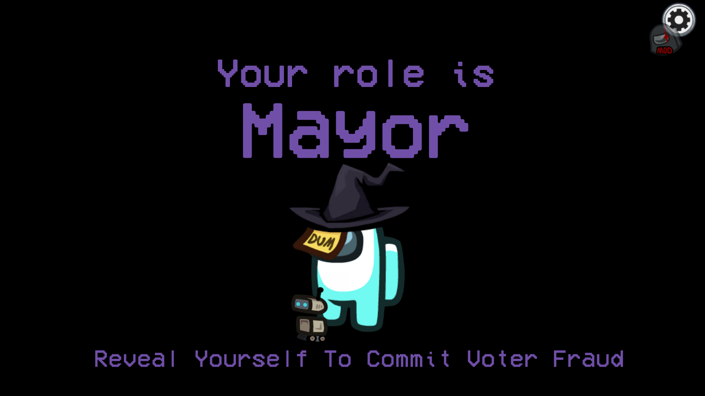
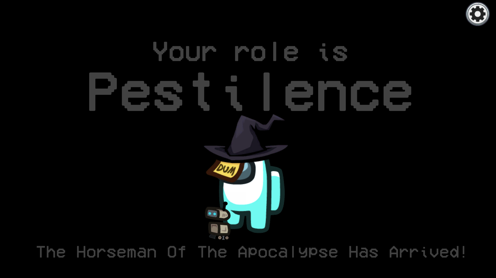
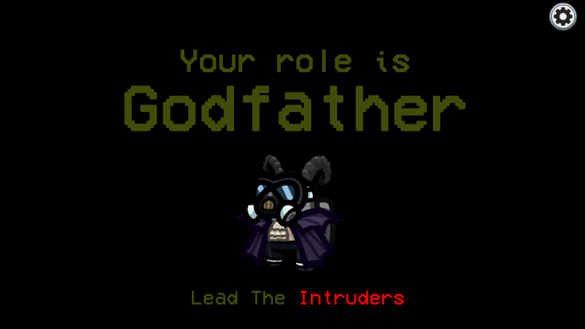

### ***Note: This repo is a fork of [Town of Us Reactivated](https://github.com/eDonnes124/Town-Of-Us-R) and is currently under development.***
### ***Also Note: This mod is NOT for mobile and console versions and is NOT host only either, do not ask for a port or a rewrite.***

-----------------------

An [Among Us](https://store.steampowered.com/app/945360/Among_Us) mod that adds a bunch of features!

Join our [Discord](https://discord.gg/cd27aDQDY9) if you have any problems or want to find people to play with!

Quick warning: This mod adds a whole LOT of stuff, and is currently not very beginner friendly. I've added a bunch of helpful wiki entries to make the mod easier to understand, but it's still a lot of reading you're going to have to do.

-----------------------

# Contents

[**Contents**](#contents)

[**Releases**](#releases)

[**Changelogs**](#changelogs)

[**Installation**](#installation)
- [Requirements](#requirements)
- [Steam Guide](#steam-guide)
- [Epic Games Guide](#epic-games-guide)
- [Linux Guide](#linux-guide)
- [Results](#results)
- [Issues](#issues)
- [Fatal Error in GC](#fatal-error-in-gc)

[**Uninstallation**](#uninstallation)

[**Differences**](#differences)

[**Player Layers**](#player-layers)

| [Intruders](#intruder-roles)       | [Syndicate](#syndicate-roles) | [Crew](#crew-roles)               | [Neutrals](#neutral-roles)        | [Game Mode](#game-mode-roles) |
|------------------------------------|-------------------------------|-----------------------------------|-----------------------------------|-------------------------------|
| [Ambusher](#ambusher)              | [Anarchist](#anarchist)       | [Altruist](#altruist)             | [Actor](#actor)                   | [Hunted](#hunted)             |
| [Blackmailer](#blackmailer)        | [Banshee](#banshee)           | [Bastion](#bastion)               | [Amnesiac](#amnesiac)             | [Hunter](#hunter)             |
| [Camouflager](#camouflager)        | [Bomber](#bomber)             | [Chameleon](#chameleon)           | [Arsonist](#arsonist)             | [Runner](#runner)             |
| [Consigliere](#consigliere)        | [Collider](#collider)         | [Coroner](#coroner)               | [Betrayer](betrayer)              |                               |
| [Consort](#consort)                | [Concealer](#concealer)       | [Crewmate](#crewmate)             | [Bounty Hunter](#bounty-hunter)   |                               |
| [Disguiser](#disguiser)            | [Crusader](#crusader)         | [Detective](#detective)           | [Cannibal](#cannibal)             |                               |
| [Enforcer](#enforcer)              | [Drunkard](#drunkard)         | [Dictator](#dictator)             | [Cryomaniac](#cryomaniac)         |                               |
| [Ghoul](#ghoul)                    | [Framer](#framer)             | [Engineer](#engineer)             | [Dracula](#dracula)               |                               |
| [Godfather](#godfather)            | [Poisoner](#poisoner)         | [Escort](#escort)                 | [Executioner](#executioner)       |                               |
| [Grenadier](#grenadier)            | [Rebel](#rebel)               | [Mayor](#mayor)                   | [Glitch](#glitch)                 |                               |
| [Impostor](#impostor)              | [Shapeshifter](#shapeshifter) | [Medic](#medic)                   | [Guardian Angel](#guardian-angel) |                               |
| [Janitor](#janitor)                | [Sidekick](#sidekick)         | [Medium](#medium)                 | [Guesser](#guesser)               |                               |
| [Mafioso](#mafioso)                | [Silencer](#silencer)         | [Monarch](#monarch)               | [Jackal](#jackal)                 |                               |
| [Miner/Herbalist](#minerherbalist) | [Spellslinger](#spellslinger) | [Mystic](#mystic)                 | [Jester](#jester)                 |                               |
| [Morphling](#morphling)            | [Stalker](#stalker)           | [Operative](#operative)           | [Juggernaut](#juggernaut)         |                               |
| [Teleporter](#teleporter)          | [Timekeeper](#timekeeper)     | [Retributionist](#retributionist) | [Murderer](#murderer)             |                               |
| [Wraith](#wraith)                  | [Warper](#warper)             | [Revealer](#revealer)             | [Necromancer](#necromancer)       |                               |
|                                    |                               | [Seer](#seer)                     | [Pestilence](#pestilence)         |                               |
|                                    |                               | [Sheriff](#sheriff)               | [Phantom](#phantom)               |                               |
|                                    |                               | [Shifter](#shifter)               | [Plaguebearer](#plaguebearer)     |                               |
|                                    |                               | [Tracker](#tracker)               | [Serial Killer](#serial-killer)   |                               |
|                                    |                               | [Transporter](#transporter)       | [Survivor](#survivor)             |                               |
|                                    |                               | [Vampire Hunter](#vampire-hunter) | [Thief](#thief)                   |                               |
|                                    |                               | [Veteran](#veteran)               | [Werewolf](#werewolf)             |                               |
|                                    |                               | [Vigilante](#vigilante)           | [Whisperer](#whisperer)           |                               |

| [Modifiers](#modifiers)       | [Abilities](#abilities)       | [Objectifiers](#objectifiers) |
|-------------------------------|-------------------------------|-------------------------------|
| [Astral](#astral)             | [Assassin](#assassin)         | [Allied](#allied)             |
| [Bait](#bait)                 | [Button Barry](#button-barry) | [Corrupted](#corrupted)       |
| [Colorblind](#colorblind)     | [Insider](#insider)           | [Defector](#defector)         |
| [Coward](#coward)             | [Multitasker](#multitasker)   | [Fanatic](#fanatic)           |
| [Diseased](#diseased)         | [Ninja](#ninja)               | [Linked](#linked)             |
| [Drunk](#drunk)               | [Politician](#politician)     | [Lovers](#lovers)             |
| [Dwarf](#dwarf)               | [Radar](#radar)               | [Mafia](#mafia)               |
| [Giant](#giant)               | [Ruthless](#ruthless)         | [Overlord](#overlord)         |
| [Indomitable](#indomitable)   | [Snitch](#snitch)             | [Rivals](#rivals)             |
| [Professional](#professional) | [Swapper](#swapper)           | [Taskmaster](#taskmaster)     |
| [Shy](#shy)                   | [Tiebreaker](#tiebreaker)     | [Traitor](#traitor)           |
| [VIP](#vip)                   | [Torch](#torch)               |                               |
| [Volatile](#volatile)         | [Tunneler](#tunneler)         |                               |
| [Yeller](#yeller)             | [Underdog](#underdog)         |                               |

[**Game Modes**](#game-modes-1)
- [Vanilla](#vanilla)
- [Classic](#classic)
- [Killing Only](#killing-only)
- [All Any](#all-any)
- [Role List](#role-list)
- [Custom](#custom)
- [Hide And Seek](#hide-and-seek)
- [Task Race](#task-race)

[**Custom Game Settings**](#custom-game-settings)
- [Common Settings](#common-settings)
- [Crew Settings](#crew-settings)
- [Intruder Settings](#intruder-settings)
- [Syndicate Settings](#syndicate-settings)
- [Neutral Settings](#neutral-settings)
- [Game Settings](#game-settings)
- [Game Modifiers](#game-modifiers)
- [Game Announcements](#game-announcements)
- [Map Settings](#map-settings)
- [Better Sabotage Settings](#better-sabotage-settings)
- [Better Skeld Settings](#better-skeld-settings)
- [Better Mira HQ Settings](#better-mira-hq-settings)
- [Better Polus Settings](#better-polus-settings)
- [Better Airship Settings](#better-airship-settings)
- [Better Fungle Settings](#better-fungle-settings)
- [Custom Client Side Options](#custom-client-side-options)

[**Game Info**](#game-info)
- [Lighter Darker Colors](#lighter-darker-colors)
- [Inspector Results](#inspector-results)
- [Subfactions](#subfactions)
- [Syndicate Chaos Drive Role Priority](#syndicate-chaos-drive-role-priority)
- [Role List Entries](#role-list-entries)

[**Extras**](#extras)
- [New Colors](#new-colors)
- [Custom Cosmetics](#custom-cosmetics)
- [Bug Reports, Suggestions & Additions](#bug--suggestions--additions)

[**Layer Explanation And Assignment**](#layer-explanation-and-assignment)

[**Credits & Resources**](#credits--resources)

[**License**](#license)

-----------------------

# Releases

**Disclaimer: The mod is *not* guaranteed to work on the latest versions of Among Us when the game updates.**

| Among Us           | Mod Version | Link                                                                                            |
|--------------------|-------------|-------------------------------------------------------------------------------------------------|
| 2023.10.24 (s & e) | 0.6.0       | [Download](https://github.com/AlchlcDvl/TownOfUsReworked/releases/download/v0.6.0/Reworked.zip) |

Older Versions

| Among Us           | Mod Version  | Link                                                                                                                  |
|--------------------|--------------|-----------------------------------------------------------------------------------------------------------------------|
| 2023.7.12 (s & e)  | 0.5.4        | [Download](https://github.com/AlchlcDvl/TownOfUsReworked/releases/download/v0.5.4/Reworked.zip)                       |
| 2023.7.12 (s & e)  | 0.5.3        | [Download](https://github.com/AlchlcDvl/TownOfUsReworked/releases/download/v0.5.3/Reworked.zip)                       |
| 2023.7.12 (s & e)  | 0.5.2        | [Download](https://github.com/AlchlcDvl/TownOfUsReworked/releases/download/v0.5.2/Reworked.zip)                       |
| 2023.7.12 (s & e)  | 0.5.1        | [Download](https://github.com/AlchlcDvl/TownOfUsReworked/releases/download/v0.5.1/Reworked.zip)                       |
| 2023.7.12 (s & e)  | 0.5.0        | [Download](https://github.com/AlchlcDvl/TownOfUsReworked/releases/download/v0.5.0/Reworked.zip)                       |
| 2023.7.12 (s & e)  | 0.4.5        | [Download](https://github.com/AlchlcDvl/TownOfUsReworked/releases/download/v0.4.5/Reworked.zip)                       |
| 2023.7.12 (s & e)  | 0.4.4        | [Download](https://github.com/AlchlcDvl/TownOfUsReworked/releases/download/v0.4.4/Reworked.zip)                       |
| 2023.7.12 (s & e)  | 0.4.3        | [Download](https://github.com/AlchlcDvl/TownOfUsReworked/releases/download/v0.4.3/Reworked.zip)                       |
| 2023.7.12 (s & e)  | 0.4.2        | [Download](https://github.com/AlchlcDvl/TownOfUsReworked/releases/download/v0.4.2/Reworked.zip)                       |
| 2023.6.13 (s & e)  | 0.4.1        | [Download](https://github.com/AlchlcDvl/TownOfUsReworked/releases/download/v0.4.1/Reworked.zip)                       |
| 2023.6.13 (s & e)  | 0.4.0        | [Download](https://github.com/AlchlcDvl/TownOfUsReworked/releases/download/v0.4.0/Reworked.zip)                       |
| 2023.3.28 (s & e)  | 0.3.1        | [Download](https://github.com/AlchlcDvl/TownOfUsReworked/releases/download/v0.3.1/Reworked.zip)                       |
| 2023.3.28 (s & e)  | 0.3.0        | [Download](https://github.com/AlchlcDvl/TownOfUsReworked/releases/download/v0.3.0/TownOfUsReworked.zip)               |
| 2023.3.28 (s & e)  | 0.2.5        | [Download](https://github.com/AlchlcDvl/TownOfUsReworked/releases/download/v0.2.5/TownOfUsReworked.zip)               |
| 2023.3.28 (s & e)  | 0.2.4        | [Download](https://github.com/AlchlcDvl/TownOfUsReworked/releases/download/v0.2.4/TownOfUsReworked.zip)               |
| 2023.3.28 (s & e)  | 0.2.3        | [Download](https://github.com/AlchlcDvl/TownOfUsReworked/releases/download/v0.2.3/TownOfUsReworked.zip)               |
| 2023.3.28 (s & e)  | 0.2.2        | [Download](https://github.com/AlchlcDvl/TownOfUsReworked/releases/download/v0.2.2/TownOfUsReworked.zip)               |
| 2023.3.28 (s & e)  | 0.2.1        | [Download](https://github.com/AlchlcDvl/TownOfUsReworked/releases/download/v0.2.1/TownOfUsReworked.zip)               |
| 2023.3.28 (s & e)  | 0.2.0        | [Download](https://github.com/AlchlcDvl/TownOfUsReworked/releases/download/v0.2.0/TownOfUsReworked.zip)               |
| 2023.3.28 (s & e)  | 0.1.0-dev1   | [Download](https://github.com/AlchlcDvl/TownOfUsReworked/releases/download/v0.1.0-dev1/TownOfUsReworked.zip)          |
| 2023.3.28 (s & e)  | 0.0.4-dev2   | [Download](https://github.com/AlchlcDvl/TownOfUsReworked/releases/download/v0.0.4-dev2/TownOfUsReworked.zip)          |
| 2023.3.28 (s & e)  | 0.0.4-dev1   | [Download](https://github.com/AlchlcDvl/TownOfUsReworked/releases/download/v0.0.4-dev1/TownOfUsReworked.zip)          |
| 2023.3.28 (s & e)  | 0.0.3-dev3   | [Download](https://github.com/AlchlcDvl/TownOfUsReworked/releases/download/v0.0.3-dev3/TownOfUsReworked.zip)          |
| 2023.3.28 (s & e)  | 0.0.3-dev2   | [Download](https://github.com/AlchlcDvl/TownOfUsReworked/releases/download/v0.0.3-dev2/TownOfUsReworked.zip)          |
| 2023.3.28 (s & e)  | 0.0.3-dev1   | [Download](https://github.com/AlchlcDvl/TownOfUsReworked/releases/download/v0.0.3-dev1/TownOfUsReworked.zip)          |
| 2023.3.28 (s & e)  | 0.0.3        | [Download](https://github.com/AlchlcDvl/TownOfUsReworked/releases/download/v0.0.3/TownOfUsReworked.zip)               |
| 2023.3.28 (s & e)  | 0.0.2dev8.75 | [Download](https://github.com/AlchlcDvl/TownOfUsReworked/releases/download/v0.0.2-dev8.75/TownOfUsReworked.zip)       |
| 2023.3.28 (s & e)  | 0.0.2dev8.5  | [Download](https://github.com/AlchlcDvl/TownOfUsReworked/releases/download/v0.0.2-dev8.5/TownOfUsReworked.zip)        |
| 2023.3.28 (s & e)  | 0.0.2dev8    | [Download](https://github.com/AlchlcDvl/TownOfUsReworked/releases/download/v0.0.2-dev8/TownOfUsReworked.zip)          |
| 2023.2.28 (s & e)  | 0.0.2dev7    | [Download](https://github.com/AlchlcDvl/TownOfUsReworked/releases/download/v0.0.2-dev7/TownOfUsReworked.zip)          |
| 2023.2.28 (s & e)  | 0.0.2dev6    | [Download](https://github.com/AlchlcDvl/TownOfUsReworked/releases/download/v0.0.2-dev6/TownOfUsReworked.zip)          |
| 2023.2.28 (s & e)  | 0.0.2dev5    | [Download](https://github.com/AlchlcDvl/TownOfUsReworked/releases/download/v0.0.2-dev5/TownOfUsReworked.zip)          |
| 2023.2.28 (s & e)  | 0.0.2dev4    | [Download](https://github.com/AlchlcDvl/TownOfUsReworked/releases/download/v0.0.2-dev4/TownOfUsReworked.zip)          |
| 2023.2.28 (s & e)  | 0.0.2dev3    | [Download](https://github.com/AlchlcDvl/TownOfUsReworked/releases/download/v0.0.2-dev3/TownOfUsReworked.zip)          |
| 2023.2.28 (s & e)  | 0.0.2dev2    | [Download](https://github.com/AlchlcDvl/TownOfUsReworked/releases/download/v0.0.2-dev2/ToU-Rew-v0.0.2-dev2.zip)       |
| 2022.12.14 (s & e) | 0.0.1dev19   | [Download](https://github.com/AlchlcDvl/TownOfUsReworked/releases/download/v0.0.1-dev19/ToU-Rew-v0.0.1-dev19.zip)     |
| 2022.12.14 (s & e) | 0.0.1dev18.5 | [Download](https://github.com/AlchlcDvl/TownOfUsReworked/releases/download/v0.0.1-dev18.5/ToU-Rew-v0.0.1-dev18.5.zip) |
| 2022.12.14 (s & e) | 0.0.1dev18   | [Download](https://github.com/AlchlcDvl/TownOfUsReworked/releases/download/v0.0.1-dev18/ToU-Rew-v0.0.1-dev18.zip)     |
| 2022.12.14 (s & e) | 0.0.1dev17   | [Download](https://github.com/AlchlcDvl/TownOfUsReworked/releases/download/v0.0.1-dev17/ToU-Rew-v0.0.1-dev17.zip)     |
| 2022.12.14 (s & e) | 0.0.1dev16   | [Download](https://github.com/AlchlcDvl/TownOfUsReworked/releases/download/v0.0.1-dev16/ToU-Rew-v0.0.1dev16.rar)      |
| 2022.12.14 (s & e) | 0.0.1dev15   | [Download](https://github.com/AlchlcDvl/TownOfUsReworked/releases/download/v0.0.1-dev15/ToU-Rew-v0.0.1dev15.rar)      |
| 2022.12.14 (s & e) | 0.0.1dev14   | [Download](https://github.com/AlchlcDvl/TownOfUsReworked/releases/download/v0.0.1-dev14/ToU-Rew-v0.0.1dev14.rar)      |
| 2022.12.14 (s & e) | 0.0.1dev13.5 | [Download](https://github.com/AlchlcDvl/TownOfUsReworked/releases/download/v0.0.1-dev13.5/ToU-Rew-v0.0.1dev13.5.rar)  |
| 2022.12.14 (s & e) | 0.0.1dev13   | [Download](https://github.com/AlchlcDvl/TownOfUsReworked/releases/download/v0.0.1-dev13/ToU-Rew-v0.0.1dev13.rar)      |

-----------------------

# Changelogs

Changelog

v0.6.0

<ul>
    <li>Update: Updated the mod to 2023.10.24 and updated BepInEx to 6.0.0-be.674</li>
    <li>Update: Updated presets</li>
    <li>Mega Addition: dlekS is back! (credits to Galster from CrowdedMod, vents do not work and so Bastion and Miner won't spawn here for now)</li>
    <li>Addition: Bastion has button art now (on maps that are not Fungle)</li>
    <li>Addition: Anonymous Votes have been changed a bit</li>
    <li>Change: You can now whisper in lobby</li>
    <li>Change: Some hats have been turned into visors</li>
    <li>Change: Miner will be named Herbalist on Fungle (for consistency)</li>
    <li>Change: Miner and Bastion can no longer spawn when the Serial Venters option is set to no one</li>
    <li>Change: The role list for the Ranked preset has been changed</li>
    <li>Critical Fix: Fixed deaths just not deathing sometimes</li>
    <li>Bug Fix: Fixed meeting ability buttons weirding out when hovering over them</li>
    <li>Bug Fix: Fixed a minor bug with custom hats</li>
    <li>Bug Fix: Fixed Amnesiac and Thief weirding out when changing roles</li>
    <li>Bug Fix: Fixed role generation not sorting correctly</li>
    <li>Visual Fix: Fixed the task list showing the incorrect task location</li>
    <li>Role Fix: Fixed Miners and Godfather-Miners not having cooldowns</li>
</ul>

v0.5.4

<ul>
    <li>New Role: Bastion [Crew (Killing)]</li>
    <li>Addition: Added night vision cameras</li>
    <li>Addition: You can now optionally download Submerged right from the main menu (LevelImpostor soon to follow)</li>
    <li>Return: Sounds effects are back</li>
    <li>Improvement: The death popup in Hide And Seek mode now changes to match the mode (X was converted/killed)</li>
    <li>Improvement: There can be multiple chat notifications for every player that chats now</li>
    <li>Improvement: Improved how the intro screen appears</li>
    <li>Improvement: The Level Impostor map option now changes to match the custom map you loaded (to be tested)</li>
    <li>Change: Actor can now get a randomised list (instead of a fixed one) of roles present in the game to be guessed as</li>
    <li>Change: Actor can no longer spawn in Role List (because it depends on Assasin which cannot spawn in Role List either)</li>
    <li>Change: The Assassin ability's name now changes depending on the faction it's applied to</li>
    <li>Change: As the Assassin, you now have to specify what ype of Assassin someone is to correctly guess them</li>
    <li>Change: Detective now has to examine players to be able to see their footprints</li>
    <li>Optimisation: Improved more code handling</li>
    <li>Bug Fix: Fixed role generation breaking on one player</li>
    <li>Bug Fix: Fixed tasks not resetting properly on LevelImpostor maps (when turning into Revealer/Phantom)</li>
    <li>Bug Fix: Fixed games incorrectly ending</li>
    <li>Bug Fix: Fixed targets not being set properly</li>
    <li>Bug Fix: Fixed some data desync between roles</li>
    <li>Visual Fix: Buttons now correctly appear and disappear when opening tasks or other interactibles</li>
    <li>Visual Fix: Fixed vanilla color names being capitalised when using colorblind mode</li>
    <li>Role Fix: Fixed Werewolf being able to maul at the wrong times</li>
    <li>Removed: Inspector (as I've come to realise, locking players to certain claims is not healthy for the mod)</li>
</ul>

v0.5.3

<ul>
    <li>New Game Mode: Task Race - See who's the best at finishing their tasks!</li>
    <li>New Game Mode: Hide And Seek - Hunt or be hunted!</li>
    <li>New Modifier: Colorblind</li>
    <li>New Alignment: Intruder (Head)</li>
    <li>Addition: Added an intro splash text</li>
    <li>Addition: Added new selection options for the Role List game mode</li>
    <li>Addition: Added some animations for morphing and camouflaging</li>
    <li>Return: Custom nameplates are back</li>
    <li>Revert: Reverted the changes made to the auto updater</li>
    <li>Improvement: Improved how the player numbers and the lighter darker mentions appear</li>
    <li>Improvement: Improved how settings are loaded (might lead to loading issues with previously set settings)</li>
    <li>Improvement: Improved the sorting on role generation again</li>
    <li>Improvement: Improved how the invisibility animation is handled</li>
    <li>Change: The following alignment changes have been made - Godfather => Intruder (Head), Rebel => Syndicate (Power), Timekeeper => Syndicate (Disruption)</li>
    <li>Change: Seers no longer require other Seers to die in order to become Sheriffs</li>
    <li>Bug Fix: Fixed the side buttons overlapping with the Submerged floor change button (To be tested)</li>
    <li>Role Fix: Fixed Ghoul being able to kill Pestilence</li>
    <li>Role Fix: Fixed being unable to guess as Guesser</li>
    <li>Role Fix: Fixed Werewolf unable to kill</li>
    <li>Role Fix: Fixed Jackal being able to recruit players at the start of the game, even if they have both spawning recruits</li>
    <li>Potential Fix: Attempt number 4 at trying to reduce the "Fatal Error in GC" error</li>
</ul>

v0.5.2

<ul>
    <li>Return: Custom visors are back</li>
    <li>Recode: Recoded how buttons are handled</li>
    <li>Recode: Recoded the many RPCs between roles</li>
    <li>Change: Being revived/resurrected now resets your cooldowns (to avoid the revived people killing their killers immediately)</li>
    <li>Change: Bugs and Bombs can no longer overlap ranges</li>
    <li>Change: Changed the abbreviation of "Crew (Protective)" to "CrP" because the original abbreviation is a practice no one supports</li>
    <li>Change: Warper can now spawn in Airship, Submerged and LevelImpostor maps</li>
    <li>Nerf: Jesters and Executioners can no longer kill more than one player</li>
    <li>Improvement: Postmortal roles that are not clicked will only see camouflaged players</li>
    <li>General Fix: Fixed some issues with game logic</li>
    <li>Visual Fix: Fixed Retibutionist and Operative seeing double numbers when whispering is turned on</li>
    <li>Visual Fix: Fixed the meeting timer sometimes being spammed with the page count</li>
    <li>Visual Fix: Fixed Janitor having the incorrect intro text</li>
    <li>Visual Fix: Fixed text run off in the hats and visors menus</li>
    <li>Visual Fix: Fixed appearance changes not changing the players names</li>
    <li>Role Fix: Fixed Vigilantes being unable to target Crew</li>
</ul>

v0.5.1

<ul>
    <li>Update: Updated BepInEx to 6.0.0-be.673</li>
    <li>Addition: Ability delays animate the button a little differently</li>
    <li>Improvement: Improved how custom options and buttons are visually handled</li>
    <li>Improvement: Improved how layers are sorted for even more guaranteed randomness</li>
    <li>Optimisation: The code was optimised even more</li>
    <li>Critical Fix: Fixed games sometimes not starting properly</li>
    <li>Role Fix: Fixed Medium and Retributionist-Medium mediates behaving weirdly</li>
</ul>

v0.5.0

<ul>
    <li>Mega Addition: Translations (WIP)</li>
    <li>Addition: Added free ban slots for Crewmate, Impostor and Anarchist for the Role List game mode</li>
    <li>Addition: Phantom, Ghoul, Banshee and Revealer spawns can now be toggled on for the Role List game mode</li>
    <li>Addition: Added a game filter tag for modded games on the official servers</li>
    <li>Overhaul: Overhauled how custom options work</li>
    <li>Nerf: Retributionists using a Vigilante's ability will also decrease their ability usage upon killing someone</li>
    <li>Nerf: Reviving a winning Troll now disables their win (meaning they have to be killed again to win :trol)</li>
    <li>Change: Crewmate, Anarchist and Impostor are now included in the Random Faction slot</li>
    <li>Change: Pestilence/Plaguebearer win screen has been changed (to make way for future roles of similar types)</li>
    <li>Change: Dying and getting revived now resets your status as a doused/infected/spelled player</li>
    <li>Change: Warper no longer spawns on Submerged or on Level Impostor maps (mainly because it's hard to set precise locations for post-CD warping there)</li>
    <li>Improvement: Improved how the meeting button appears to those who cannot call a meeting</li>
    <li>Improvement: Pressing A, D or the Right/Left arrows will now cycle through the cameras on Polus</li>
    <li>Improvement: Improved how chat commands are handled (and are even dynamic now!)</li>
    <li>Improvement: Task outlines now match the color of your role</li>
    <li>Improvement: Improved how the auto updater works (and removed Submerged auto updater for now)</li>
    <li>Improvement: Added an aborter for if the mod detects any other mods that are not Submerged or LevelImpostor (mainly to avoid having games breaking/corrupting because of conflicting mods)</li>
    <li>Improvement: Added some code here and there to improve performance</li>
    <li>Critical Fix: Fixed games not ending when everyone died</li>
    <li>Critical Fix: Fixed the issue where the game would end in no one's victory when 0 crew spawned and a meeting is called</li>
    <li>Vanilla Fix: The colorblind text now updates according properly regarding seeing them through walls</li>
    <li>General Fix: Corrected some parts of the mod</li>
    <li>Bug Fix: Fixed even more log spam</li>
    <li>Bug Fix: Fixed failed conversions sometimes appearing to be converted to non-host players</li>
    <li>Bug Fix: Fixed some issues with other win conditions</li>
    <li>Bug Fix: Fixed chat messages not color coding properly when needed</li>
    <li>Bug Fix: Fixed the chaos preset breaking settings if you don't have LevelImposter or Submerged</li>
    <li>Bug Fix: Fixed the issue where the scrollbar would freak out</li>
    <li>Bug Fix: Fixed the strange desync with rpcs and strings (like issues with whispering and guesses)</li>
    <li>Bug Fix: Fixed shapeshifts not working (for like the 10th time)</li>
    <li>Visual Fix: Fixed the highlight staying permanent for some reason on the role lists menu button in the game settings menu</li>
    <li>Visual Fix: Fixed the mod logo being visible when the credits screen is active</li>
    <li>Visual Fix: Fixed Drunkard appearing to have 2 colors in the wiki entries</li>
    <li>Visual Fix: Fixed the Sabotage and Vent buttons not disappearing when the minimap is opened</li>
    <li>Role Fix: Fixed Amnesiacs and Thieves from not winning or ending the game when they change roles</li>
    <li>Role Fix: Fixed Rebel-Crusaders not actually being able to crusade</li>
    <li>Role Fix: Fixed Spellslinger somehow winning the game beyond death without doing anything</li>
    <li>Role Fix: Fixed Plaguebearers being unable to infect the host by any way (and thus being unable to transform into Pestilence)</li>
    <li>Potential Fix: Attempted fix for the occasional "Fatal Error In GC" error</li>
</ul>

v0.4.5

<ul>
    <li>Addition: Added Better Mira HQ options</li>
    <li>Addition: You are are told who is the host (for situations where people start asking who's the host)</li>
    <li>Buff: Vampire Hunters are now notified if the one they killed was actually an Undead or not</li>
    <li>Buff: Coroners are no longer fooled by frames</li>
    <li>Optimisation: The code was optimised a bit more</li>
    <li>Change: Random maps option has been merged into the Map option (it's the last one in the set of values)</li>
    <li>Completion: The mod is now fully compatible with Submerged</li>
    <li>Improvement: Role generation is now even more randomisable (meaning repetitive games are less likely to happen)</li>
    <li>Improvement: Your discord activity presence now reflects the mod being active</li>
    <li>Improvement: Improved how other better map options are handled</li>
    <li>General Fix: Fixed some inconsistencies within the settings</li>
    <li>Bug Fix: Fixed the win condition of objectifiers not showing up on their wiki pages</li>
    <li>Bug Fix: Fixed ability buttons stacking when switching between robots during a meeting</li>
    <li>Bug Fix: Fixed weird target assignment for Lovers, Linked and Rivals</li>
    <li>Bug Fix: Fixed being able to guess even after voting has been completed</li>
    <li>Bug Fix: Fixed the occasional log spam</li>
    <li>Visual Fix: Fixed Swapper swaps not appearing to swap</li>
    <li>Visual Fix: Fixed sabotage flashes not occurring after a custom flash</li>
    <li>Role Fix: Fixed Retributionist actions not being up to date with the roles they are mimicking</li>
    <li>Removal: Removed some Better Airship settings</li>
</ul>

v0.4.4

<ul>
    <li>Change: The numbers on the admin table now reflect the player's ID rather than their outfit color id for Operative and Retributionist (to avoid confusion with multiple same color players)</li>
    <li>Change: Operative and Retributionist color blind help is now tied to the vanilla colorblind setting</li>
    <li>Optimisation: The code for all layers have been improved</li>
    <li>Improvement: You are now told if you are recruited in the intro screen</li>
    <li>Improvement: Whisperers and members of the Sect now know how much percentage is left to convert someone</li>
    <li>Improvement: Improved how cooldowns are handled</li>
    <li>Big Critical Fix: Fixed being unable to play on any servers (only impostor servers right now, official servers fix is soon to come)</li>
    <li>Critical Fix: Fixed Whisperer being unable to convert players</li>
    <li>Visual Fix: Fixed some mod options layering issues in the main menu</li>
    <li>Objectifier Fix: Fixed Allied Neutral Killers being unable the sabotage when they should</li>
    <li>Objectifier Fix: Fixed Traitor and Defector conversions being inconsistent between players</li>
    <li>Removal: Removed Flincher because it's boring now, farewell soldier :saluting_face:</li>
</ul>

v0.4.3

<ul>
    <li>Update: Updated presets</li>
    <li>Optimisation: The code was optimised in certain parts</li>
    <li>Improvement: Improved how Operative bugs and Bomber bombs are handled</li>
    <li>Critical Fix: Fixed teleporting crashing games</li>
    <li>Bug Fix: Fixed meeting results not being sent to roles with meeting info (like Operative and Coroner)</li>
</ul>

v0.4.2

<ul>
    <li>New Game Mode: New way to edit the role generation yourself! Role Lists! (also includes the ability to ban the spawning of up to 5 roles)</li>
    <li>New Objectifier: Linked</li>
    <li>Addition: Added a custom cursor</li>
    <li>Addition: Added a welcoming message to get started when joining a lobby</li>
    <li>Addition: Added Warper lore</li>
    <li>Addition: Added some more settings</li>
    <li>Addition: Added even more parameters for hat customisation</li>
    <li>Completion: Finished compatibility with LevelImpostor (Submerged refuses to work with the mod)</li>
    <li>Update: Updated dependencies, updated mod to v2023.7.12 and merged fixes from v5.0.0</li>
    <li>Merge: Merged the Region Install mod into this mod</li>
    <li>Rework: Certain NE roles with targets now have toggle-able options for letting rng decide their targets</li>
    <li>Buff: Assassin can now be given to Neutral (Harbinger) roles</li>
    <li>Buff: With the Chaos Drive, the Collider can now charge themselves to kill those they marked</li>
    <li>Buff: Blocking players now renders them unable to open anything, not just not letting them use their abilities (yes I just want to be a troll)</li>
    <li>Buff: Bounty Hunters can now request players to set a target for them (only if the options for letting them pick a target is on)</li>
    <li>Buff: Made Actor more likely to win by making them able to win by being guessed as a role that's not in the game and their inspector results change based on their target role</li>
    <li>Nerf: Intruders/Syndicate can no longer sabotage if everyone from their faction is dead</li>
    <li>Nerf: Crew can no longer win by tasks if all of them are dead</li>
    <li>Change: Juggernaut can no longer get the Ruthless ability (because it already gets the ability when reaching 4 kills)</li>
    <li>Change: Radar will now also point towards the closest body if it happens to be closer than the closest alive player</li>
    <li>Change: Split the "Assassin Is Unique" setting into settings for each faction</li>
    <li>Change: A Retributionist's inspector results now change based on the role they are mimicking</li>
    <li>Recode: The in-game wiki has received a full recode (WIP)</li>
    <li>Recode: The role gen has been slightly recoded again for like the 30th time (I promise they get better with each change)</li>
    <li>Return: Executioner, Guardian Angel and Guesser automatically get their targets again, but can be toggled to pick their own targets</li>
    <li>Return: Custom hats are back (nameplates and visors soon to follow)</li>
    <li>Big Improvement: Added a stalemate detector to avoid unwinnable situations</li>
    <li>Improvement: Improved how ability buttons are handled in online games and fixed a couple of bugs relating to them</li>
    <li>Improvement: Slightly improved version control to be a bit more lightweight</li>
    <li>Improvement: Added page counters to the custom player selection menus and the vitals menus (bottom right)</li>
    <li>Improvement: Changed up how game settings look like in lobby (inspired by the game options in Project Lotus)</li>
    <li>Improvement: You can now move backwards in the settings pages by pressing the Backspace button</li>
    <li>Improvement: Clicking on players/dead bodies will trigger the first clickable button before executing the rest (for the mouse point and click players)</li>
    <li>Improvement: Random Spawns now also include vent positions, so people are less likely to be sent to the same place</li>
    <li>Improvement: Improved how custom meeting ability buttons and their cooldowns are handled</li>
    <li>Improvement: Messages are now color coded if possible</li>
    <li>Improvement: Settings now auto update their visibility based on which settings are active</li>
    <li>Improvement: Heavily worked on how information between players are handled, hopefully this fixes some lag/desync issues</li>
    <li>Optimisation: Improved some code here and there to smoothen out the mod</li>
    <li>Critical Fix: Fixed several bugs with playing on Hide And Seek (not sure why you'd want to play Hide And Seek on this mod but ok)</li>
    <li>Critical Fix: Added rate limits to role gen to prevent hosts from occasionally crashing on lower player numbers</li>
    <li>Critical Fix: Fixed games ending even with Neutral (Harbinger) and (Apocalypse) roles still alive against other factions</li>
    <li>Critical Fix: Fixed Syndicate (Killing) roles getting kills buttons when recieving the Chaos Drive</li>
    <li>Vanilla Fix: Players who dc now update in the meeting correctly</li>
    <li>Vanilla Fix: Fixed dying/game starting not updating the hud correctly</li>
    <li>Bug Fix: Fixed a couple of underlying issues with button cooldowns</li>
    <li>Bug Fix: Fixed being unable to set the lobby size below 5 in the lobby making menu</li>
    <li>Bug Fix: Fixed Oxygen sabotage slowing down players forever</li>
    <li>Bug Fix: Fixed random arrows appearing to trail you</li>
    <li>Bug Fix: Fixed the count settings incorrectly updating for Lovers, Rivals and Mafia</li>
    <li>Bug Fix: Fixed Bounty Hunters getting their own Mafia members as targets</li>
    <li>Bug Fix: Fixed a couple of minor bugs here and there</li>
    <li>Bug Fix: Fixed being able to talk before the game announcements begin</li>
    <li>Bug Fix: Fixed switching between Robots not disabling the chat</li>
    <li>Bug Fix: Fixed the 'Task Bar Updates' settings being wrong</li>
    <li>Bug Fix: Fixed chat not disappearing when switching between dead and alive players</li>
    <li>Bug Fix: Fixed the kick and ban chat commands from not working as intended</li>
    <li>Bug Fix: Fixed Plaguebearer/Pestilence somehow spawning way too often</li>
    <li>Visual Fix: The roleblock icons no longer appear to drag on the screen</li>
    <li>Visual Fix: Fixed a couple of layering issues with the spectate, help and game settings buttons</li>
    <li>Visual Fix: Fixed the intro screens for some roles being a little off</li>
    <li>Visual Fix: Fixed player names sometimes not updating correctly for Mafia, Lovers and Rivals in meetings</li>
    <li>Visual Fix: Fixed Assassin menus having transparent buttons and the exit button being blown out of proportion</li>
    <li>Role Fix: Fixed Promoted Godfather effects never ending</li>
    <li>Role Fix: Fixed Collider bypassing basically every form of defense</li>
    <li>Role Fix: Fixed Consort and Consort-Godfathers not being able to deselect targets</li>
    <li>Removal: Removed some debugging statements I forgot to remove earlier</li>
</ul>

v0.4.1

<ul>
    <li>Update: Updated MCI</li>
    <li>Addition: A lot more buttons have their sprites now</li>
    <li>Addition: There can now be multiple Revealers, Banshees, Ghouls and Phantoms</li>
    <li>Buff: Actor now becomes a role from the role list they were supposed to be guessed as when all guessing capable players have died</li>
    <li>Improvement: Layer count and chance settings have been merged into one setting type</li>
    <li>Critical Fix: Fixed Crew-Allied Neutral Killers being shown who the other Crew are in the intro screen</li>
    <li>Critical Fix: Fixed Spellslinger not ending the game when needed</li>
    <li>Critical Fix: Fixed games not ending with a Guardian Angel without a target active</li>
    <li>Visual Fix: Fixed the vent button disappearing when role blocked</li>
    <li>Visual Fix: Fixed the Engrish in some parts of the mod</li>
    <li>Visual Fix: Fixed outlines persisting on targets after death</li>
    <li>Bug Fix: Fixed decreasing the lobby size not kicking players when needed</li>
    <li>Bug Fix: Fixed arrows not updating correctly</li>
    <li>Bug Fix: Fixed being unable to change the lobby size when opening up a lobby</li>
    <li>Bug Fix: Fixed Footprints only spawning the left/right foot for each person</li>
    <li>Bug Fix: Fixed some issues with button targeting</li>
    <li>Bug Fix: Fixed the Chat Cooldown option not actually changing up the chat cooldown</li>
    <li>Role Fix: Fixed Neutral (Neophyte) roles being appointed as the Jackal's Recruits</li>
    <li>Role Fix: Fixed Ghouls not spawning in</li>
    <li>Role Fix: Fixed Shifters constantly dying upon failing to shift</li>
    <li>Objectifier Fix: Fixed unturned Defectors appearing twice on the Victory screen</li>
    <li>Ability Fix: Fixed the sheer amount of Assassins being assigned in All Any</li>
    <li>Ability Fix: Fixed Neutral Assassins not spawning</li>
</ul>

v0.4.0

<ul>
    <li>Update: Merged changes from v4.0.6 of ToU-R</li>
    <li>Update: Updated the mod to v2023.6.13</li>
    <li>Update: Updated BepInEx to be.670</li>
    <li>Update: Updated Reactor to 2.2.0-ci.234</li>
    <li>Addition: Added the "Avoid Neutral Kingmakers" option which disables Survivors and Guardian Angels and kills off any Neutral (Evil) role after finishing their objective</li>
    <li>Recode: Role generation and Chat commands have been recoded</li>
    <li>Recode: Roleblocks have also received a slight recode</li>
    <li>Buff: Coroner reference bodies now stack on top of each other and there is no longer a compare limit</li>
    <li>Buff: Executioners, Guessers and Guardian Angels can pick their own targets within the first 2 rounds (to avoid having their chosen targets die early)</li>
    <li>Nerf: Medics who haven't shielded yet can no longer shield revealed Mayors and Dictators</li>
    <li>Improvement: Improved how players and chat messages are handled</li>
    <li>Improvement: Added meeting compatibility to MCI so that switching between players during meetings is possible</li>
    <li>Improvement: Disconnected players are now also added to the end game summary</li>
    <li>Visual Fix: Fixed player visors sometimes being blue in color in meetings</li>
    <li>Visual Fix: Fixed the Use button inverting colors when near a non-task interactable</li>
    <li>Visual Fix: Fixed the intro fade sometimes disappearing</li>
    <li>Bug Fix: Fixed shields not breaking properly</li>
    <li>Bug Fix: Fixed colors occasionally bugging out</li>
    <li>Bug Fix: Fixed Janitor and Godfather-Janitors teleporting bodies when dragging them</li>
    <li>Bug Fix: Fixed incorrect guessing results being displayed</li>
    <li>Bug Fix: Fixed players being warped into walls</li>
    <li>Role Fix: Fixed Amnesiac, Shifter and Thief role changing bugging out buttons</li>
    <li>Role Fix: Fixed Godfather and Rebel being able promote those they shouldn't</li>
    <li>Temporary Removal: Custom cosmetics have been removed on account of the update, they'll return when I can fix the bugs relating to them</li>
    <li>Removal: Removed the "Min" setting for all role alignments, they bug out role gen a lot so only the min setting for the factions and layers exist</li>
</ul>

v0.3.1

<ul>
    <li>Addition: Added /subfactioninfo and /otherinfo commands for more details about the mod</li>
    <li>Addition: Added an FPS tracker</li>
    <li>Change: Players being transported/warped are now susceptible to everything during the animation (that means team killing is possible)</li>
    <li>Improvement: Improved how body reports, role cards and colors are handled</li>
    <li>Improvement: Added more parameters to customise cosmetics</li>
    <li>Improvement: Updated the info in the in-game wiki to include meanings of the symbols next to players' names</li>
    <li>Improvement: Improved how shield breaking is handled</li>
    <li>Critical Fix: Fixed role cards crashing the game upon opening</li>
    <li>Critical Fix: Fixed the end game summary not showing sometimes and therefore making the game unplayable</li>
    <li>Vanilla Fix: Fixed the horrid log spam during games and potential stuttering</li>
    <li>Bug Fix: Fixed being able to zoom out on game start</li>
    <li>Bug Fix: Fixed non-role layers having their texts appear strange in the role card</li>
    <li>Bug Fix: Fixed roles not changing when they are supposed to (Like Executioner to Jester)</li>
    <li>Bug Fix: Fixed postmortal roles sometimes weirding out while doing tasks</li>
    <li>Bug Fix: Fixed arrow blips being updated on other people's maps</li>
    <li>Visual Fix: Fixed the skip button always being visible</li>
    <li>Visual Fix: Fixed typos in the wiki</li>
    <li>Visual Fix: Fixed Dictator hammer icons being the other way round</li>
    <li>Role Fix: Fixed Thief not stealing the roles of those they guessed</li>
    <li>Role Fix: Fixed Monarch knighting cooldown not resetting</li>
    <li>Role Fix: Fixed the incorrect scaling of the transport animation</li>
    <li>Role Fix: Fixed Rebel/Godfather promotions behaving weirdly</li>
    <li>Role Fix: Fixed non former Drunkard Rebels being able to confuse players</li>
    <li>Role Fix; Fixed Banshee's role history being spammed</li>
    <li>Ability Fix: Fixed Assassins being unable to guess after playing for a while</li>
</ul>

v0.3.0

<ul>
    <li>New Modifiers: Astral, Yeller</li>
    <li>Buff: Dead bodies are now camouflaged along with players</li>
    <li>Buff: Jackal can now spawn with Neutral (Benign) roles as the good recruits and Neutral (Evil) and (Harbinger) roles as the evil recruits</li>
    <li>Nerf: Assassin and Guesser can no longer guess Crew (Investigative) roles and has been made optional for Assassin (to actually make the game social deduction and not "stfu and play")</li>
    <li>Change: Monarch protection now extends to as long as someone is knighted and not that any of the knighted players is Crew</li>
    <li>Change: Guardian Angels can no longer have Neutral (Evil) targets</li>
    <li>Change: Guesser can no longer get Crew (Investigative) targets</li>
    <li>Change: Mystic's subfaction checks now compare to the Mystic's own subfaction, rather than the default one (in case of a converted Mystic)</li>
    <li>Improvement: Swapping animation now swaps everything</li>
    <li>Improvement: Minor improvements were made to the role card and the task</li>
    <li>Improvement: Custom cosmetics now update (in case I ever decide to change up how a hat appears)</li>
    <li>Improvement: Improved how roles with targets are assigned their targets</li>
    <li>Improvement: String options now looks like the vanilla map option</li>
    <li>Improvement: Improved how Role Cards are handled</li>
    <li>Visual Fix: Fixed the sabotage button being visible when in a meeting</li>
    <li>Critical Fix: Fixed the mod sometimes not loading</li>
    <li>Bug Fix: Fixed being able to see the roles of players right after dying using the Haunt Menu</li>
    <li>Bug Fix: Fixed colorblind support for Operative being applied to all roles</li>
    <li>Bug Fix: Fixed the issue where the options menu would spasm out of control and then stop letting you switch tabs</li>
    <li>Bug Fix: Fixed some Neutral (Evil) roles ending the game even with the Neutral Evils End Game setting is off</li>
    <li>Bug Fix: Fixed Lovers and Rivals not spawning</li>
    <li>Bug Fix: Fixed the local player's colors not updating for themselves but for everyone else</li>
    <li>Role Fix: Fixed Silencer and Promoted Rebel cooldowns from not resetting correctly</li>
    <li>Role Fix: Fixed Actor getting role lists that cannot be guessed</li>
    <li>Role Fix: Fixed Survivors and Guardian Angels not winning</li>
    <li>Potential Fix: Fixed the updater not working as intended</li>
    <li>Removed: Removed the outline around the role names because it makes them look a little bloated during the intro scene</li>
</ul>

v0.2.5

<ul>
    <li>New Role: Silencer [Syndicate (Disruption)]</li>
    <li>Return: Time Lord and Time Master are back, and more vengeful then ever as the Timekeeper [Syndicate (Power)]!</li>
    <li>Return: Neutral (Evil) roles now end the game again, but this is togglable</li>
    <li>Addition: Added a credits button to the main menu</li>
    <li>Finished: Role cards are now complete</li>
    <li>Buff: Players with the Torch ability can now see the silhouette of invisible players</li>
    <li>Buff: VIP dying will now create an arrow pointing towards the VIP's body</li>
    <li>Buff: Thief can now guess players as killing roles to steal their roles (yes, I took the idea from The Other Roles)</li>
    <li>Change: Collider's Inspector results are now Unseen rather than MovesAround</li>
    <li>Recode: Medium has been recoded a little bit for better functionality</li>
    <li>Recode: Shapeshifts have been recoded again along with appearances being handled even better than before</li>
    <li>Improvement: Transport and Warp animation sizes now scale with the size of the teleported player</li>
    <li>Improvement: Improved how arrows and map blips are handled</li>
    <li>Improvement: Some parts were improved internally</li>
    <li>Improvement: Improved how kills are handled</li>
    <li>Improvement: Improved Level Impostor compatibility (WIP)</li>
    <li>Visual Fix: Fixed the intro messages being clipped off screen for some roles</li>
    <li>Critical Fix: Fixed Giant and Dwarf crashing the game upon game start</li>
    <li>Critical Fix: Fixed cosmetics not loading correctly</li>
    <li>Bug Fix: Fixed Radar and Tiebreaker not being assigned</li>
    <li>Bug Fix: Fixed only one player being shaken when blackmailed players are revealed</li>
    <li>Bug Fix: Fixed some rpc spamming regarding kills</li>
    <li>Role Fix: Fixed Glitch being unable to hack</li>
    <li>Role Fix: Fixed Drunkard-Rebels not inverting players' controls</li>
    <li>Role Fix: Fixed Drunkard inverting controls of players forever</li>
    <li>Role Fix: Fixed winning Cannibals not showing up on the win screen</li>
    <li>Role Fix: Guardian Angel, Bounty Hunter, Execuioner and Guesser can no longer get their Lover/Rival as targets</li>
    <li>Role Fix: Fixed Dictator not dying for all players upon misfiring on Crew</li>
    <li>Objectifier Fix: Fixed Syndicate defected Intruders being able to see the sabotage button</li>
    <li>Objectifier Fix: Fixed Defectors not letting the games end properly</li>
    <li>Objectifier Fix: Fixed only 1 Mafia spawning</li>
</ul>

v0.2.4

<ul>
    <li>New Objectifier: Defector
    <li>New Alignments: Neutral (Harbinger) and Neutral (Apocalypse)</li>
    <li>Addition: Added some secret role alignments, try seeing how to get them (hint: betrayal and change)</li>
    <li>Addition: Some actions are now animated</li>
    <li>Addition: Added a button to be able to see what settings are there in game</li>
    <li>Addition: Role cards: this is where the info about your role goes instead of the task list (WIP)</li>
    <li>Buff: Ruthless and Ninja can now be assigned to Crew (Killing) roles and those with the Corrupted objectifier</li>
    <li>Nerf: Intruders and Syndicate with Ruthless can no longer convert Fanatics</li>
    <li>Change: Plaguebearer can no longer get Allied</li>
    <li>Improvement: Improved how appearance changes are handled</li>
    <li>Improvement: Added a logo next to the ping tracker (thanks to @Jsushi7)</li>
    <li>Improvement: Improved the layout of the main menu (inspired by the main menu changes made by @Zeo666 in All The Roles)</li>
    <li>Improvement: The task counter has been moved from your name to the task tab</li>
    <li>Improvement: The zooming buttons are now smaller and moved to a different location</li>
    <li>Improvement: The in-game wiki has received a slight recode</li>
    <li>Improvement: You no longer know the status of players until the meeting after your death (to avoid players coming back to life and ratting everyone out)</li>
    <li>Improvement: Improved the footprint graphics for Detectives and Retributionist-Detectives</li>
    <li>Bug Fix: Fixed the spectate button opening up the haunting menu</li>
    <li>Bug Fix: Fixed being unable to leave vents</li>
    <li>Bug Fix: Fixed vision not updating correctly when switching between dead and alive players using MCI</li>
    <li>Bug Fix: Fixed Pestilence spawning instead of Plaguebearer with the Pestilence Spawn option is turned off</li>
    <li>Visual Fix: Fixed ghosts being unable to see the names and roles of players through walls with the obstruct names option turned on</li>
    <li>Role Fix: Fixed the Concealer's target staying invisible forever</li>
    <li>Role Fix: Fixed the Guesser's target's alignment hint having text hexcode color control</li>
    <li>Role Fix: Fixed Bounty Hunter being shown their target on the intro screen</li>
    <li>Role Fix: Fixed Dracula and Jackal killing those they are trying to convert</li>
    <li>Role Fix: Fixed turning betrayer being spammed in the end game summary</li>
    <li>Ability Fix: Fixed killing Politicians being unable to vote players</li>
    <li>Removal: The lobby timer because it's kind of useless as most people play on modded servers anyways, which don't expire</li>
</ul>

v0.2.3

<ul>
    <li>Nerf: Reporting a body while being flashed yields no results for the Coroner and the Retributionist-Coroner</li>
    <li>Addition: Added "Hide Obstructed Player Names" option so that you don't see players' names through walls</li>
    <li>Improvement: Improved some rpc handling between roles</li>
    <li>Improvement: Reduced the mod size even more, god I love doing this</li>
    <li>Critical Fix: Fixed custom cosmetics not loading</li>
    <li>Visual Fix: Fixed the hat and visor tabs not displaying cosmetics</li>
    <li>Ability Fix: Fixed Ninja appearing invisible (ironic, I know)</li>
</ul>

v0.2.2

<ul>
    <li>Critical Fix: Fixed the sudden issue of players just not dying at all</li>
    <li>Temporary Removal: Custom cosmetics are temporarily removed till I figure out why they aren't loading</li>
</ul>

v0.2.1

<ul>
    <li>New Preset: Ranked
    <li>Return: Drunkard's back, new and improved!</li>
    <li>Return: Cosmetic sections are back</li>
    <li>Addition: Added the /summary (or /sum for short) command for being able to see the game summary of the previous game when in lobby</li>
    <li>Addition: Dwarf and Giant were changed interally, mix and match with the settings to find things out ;)</li>
    <li>Buff: Completing tasks restores a charge for roles with limited uses</li>
    <li>Buff: On low player counts, Amnesiac now becomes a Thief</li>
    <li>Buff: Monarchs with alive knights now cannot be killed as long as one of the alive knights is Crew (Ruthless still bypasses this)</li>
    <li>Nerf: Clicking a Revealer who has finished their tasks now disables their ability</li>
    <li>Nerf: Everyone is told who has been spelled during meetings, so at least the dangers of Spellslinger is known</li>
    <li>Nerf: Misfiring on a framed innocent player will no longer kill the Vigilante, unless the Misfire setting is turned on</li>
    <li>Recode: Cosmetic handling was recoded to work like how The Other Roles does it</li>
    <li>Optimisation: Some code was optimsed</li>
    <li>Improvement: Turned Traitors and Fanatics with the Assassin ability now have their guessing menus updated to their new factions</li>
    <li>Improvement: Added a paging behaviour for the guessing menu, to prevent guess buttons going off-screen</li>
    <li>Improvement: The mod's weight has been heavily reduced</li>
    <li>Improvement: Improved player targeting some more</li>
    <li>Change: Teleporter's color was changed because it was too close to the Grenadier's green</li>
    <li>Critical Fix: Fixed Airship crashing players when loading in</li>
    <li>Bug Fix: Fixed the weird issue with blank abilities appearing</li>
    <li>Bug Fix: Fixed being able to target dead players and postmortal roles</li>
    <li>Bug Fix: Fixed loading presets not actually closing the option menu</li>
    <li>Bug Fix: Changing the screen resolution no longer clips the settings out of bounds</li>
    <li>Bug Fix: Fixed players being assigned multiple abilities</li>
    <li>Modifier Fix: Fixed Volatile weirding out the spawn in sequence</li>
    <li>Objectifier Fix: Fixed Corrupted being unable to kill players</li>
    <li>Ability Fix: Fixed Multitasker not making the task windows transparent</li>
    <li>Role + Ability Fix: Fixed the weird scaling of the guessing menu (it looped the size for every button added lmao, making it smaller with each possible guess added)</li>
    <li>Role Fix: Fixed incorrect distance scaling for a lot of roles</li>
    <li>Role Fix: Fixed Anarchist's kill cooldown not resetting correctly</li>
    <li>Role Fix: Fixed Stalker's Stalk button not appearing</li>
    <li>Role Fix: Fixed (Collider/Spellslinger/Stalker)-Rebels not having their buttons</li>
    <li>Role Fix: Fixed Executioner being unable to doom players</li>
    <li>Role Fix: Fixed Jester being unable to haunt players</li>
    <li>Role Fix: Fixed Bomber and Enforcer bomb kills being marked as suicides</li>
    <li>Role Fix: Enforcer can no longer place bombs on their teammates</li>
    <li>Role Fix: Fixed Spellslinger not being able to see who they spelled</li>
    <li>Role Fix: Fixed Tracker-Retributionist's Track button not updating</li>
    <li>Role Fix: Retributionist's ability uses now update correctly</li>
    <li>Potential Fix: Lag on the cosmetics screen and the cosmetic icons not having the hats in them</li>
</ul>

v0.2.0

<ul>
    <li>New Roles: Monarch, Dictator [Crew (Sovereign)]</li>
    <li>New Role: Spellslinger [Syndicate (Power)]</li>
    <li>New Role: Collider [Syndicate (Killing)]</li>
    <li>New Role: Stalker [Syndicate (Support)]</li>
    <li>New Objectifier: Mafia</li>
    <li>New Preset: Last Used     <li>This preset always loads the settings you last played with in your previous Among Us session</li>
    <li>Addition: 2 new nameplates</li>
    <li>Buff: Added an optional buff for Arsonist to cremate ignited bodies</li>
    <li>Buff: Cryomaniac's last killer kill ability has been given its own kill button</li>
    <li>Nerf: The number of assassinations are now linked between all Assassins</li>
    <li>Recode: Guesser and Assassin have been recoded to work like in The Other Roles</li>
    <li>Rework: Mayor now works the same as its Town Of Salem counterpart</li>
    <li>Rework: Politician has been fused with the original Mayor and was changed into an ability</li>
    <li>Rework: Swapper is now an ability</li>
    <li>Change: Changed the Shapeshifter color as it's too dark</li>
    <li>Completion: Inspector results are now finished</li>
    <li>Improvement: The Stalemate screen will now include any Neutral (Evil) role that has won</li>
    <li>Improvement: Improved Chaos Drive assignment between players</li>
    <li>Improvement: Improved how task completion is handled</li>
    <li>Improvement: Improved how guesses are handled</li>
    <li>Improvement: All actions now occur within their respective layers to hopefully reduce the lag</li>
    <li>Improvement: Increased the size of the changelogs for better readability</li>
    <li>Improvement: Improved how win conditions are handled to remove any underlying issues</li>
    <li>Improvement: The main menu buttons are much closer now to look neater</li>
    <li>Improvement: Swapper swaps don't need to be disabled anymore, they automatically update to swapping the new targets</li>
    <li>Improvement: Decreased mod weight</li>
    <li>Improvement: Assassinated players will have buttons generate on them for the Retributionist</li>
    <li>Improvement: The default settings preset now auto updates</li>
    <li>Improvement: Arrow targets are now reflected on maps</li>
    <li>Critical Fix: Fixed being able to select targets through walls</li>
    <li>Bug Fix: Fixed the wiki not giving the correct results for alignments</li>
    <li>Bug Fix: Fixed string options occasionally freaking out</li>
    <li>Bug Fix: Fixed nameplates not being displayed properly</li>
    <li>Bug Fix: Fixed being able to call meetings when you can't</li>
    <li>Bug Fix: Fixed chaos drive messages being repeated</li>
    <li>Layer Fix: Fixed arrows not updating correctly</li>
    <li>Role Fix: Fixed Retributionist buttons not appearing on the game screen or disappearing when getting assassinated</li>
    <li>Role Fix: Fixed Sidekick being unable to kill</li>
    <li>Role Fix: Fixed weird/inconsistent role changing interactions for Thief, Amnesiac and Shifter</li>
    <li>Role Fix: Fixed Altruist and Necromancer revivals bugging out other players</li>
    <li>Role Fix: Fixed Promoted Godfather cooldowns not resetting</li>
    <li>Modifier Fix: Fixed Shy being assigned to Politicians when they cannot button</li>
    <li>Ability Fix: Fixed Swapper buttons not appearing on the game screen</li>
    <li>Revert: Reverted flashes back to the original Town Of Us style (but with still some modifications like in The Other Roles)</li>
    <li>Removed: Removed the test features that I forgot to remove in the previous release</li>
</ul>

v0.1.0-dev1

<ul>
    <li>Buff: Altruist can now revive players multiple times and sacrifices themselves on the last revive</li>
    <li>Update: Updated Crowded to fix the double click issue</li>
    <li>Update: Updated the role info from the recent updates in the in-game wiki</li>
    <li>Improvement: Improved player targeting</li>
    <li>Improvement: Settings now open to the last tab you were on, and keybinds for page jumping also work in there</li>
    <li>Critical Fix: Fixed the Haunt button not working</li>
    <li>Visual Fix: Fixed Poisoner having 2 buttons</li>
    <li>Visual Fix: Fixed the sheer amount of ability buttons spawning (hopefully)</li>
    <li>Visual Fix: Fixed buttons not disappearing when a meeting is called</li>
    <li>Visual Fix: Fixed the spectate button looking a little cut off</li>
    <li>Bug Fix: Fixed Vitals immediately closing upon opening</li>
    <li>Bug Fix: Fixed staying zoomed out during a meeting</li>
    <li>Bug Fix: Fixed the issue with targets not being higlighted at the times they are supposed to be</li>
    <li>Bug Fix: Fixed settings looping incorrectly</li>
    <li>Bug Fix: Fixed the issue with friendly fire</li>
    <li>Objectifier Fix: Fixed Corrupted not ending the game when it is supposed to</li>
    <li>Modifier Fix: Fixed continuously walking when being fake killed as Volatile</li>
    <li>Ability Fix: Button Barry no longer bugs out a meeting for themselves</li>
    <li>Role + Ability Fix: Fixed not being able to guess Crusader (for Assassin and Guesser)</li>
    <li>Role Fix: Fixed Arsonist buttons not working</li>
    <li>Role Fix: Fixed footprints not disappearing after a meeting for Detectives and Retributionist-Detectives</li>
    <li>Role Fix: Fixed Rebel not being able to promote anyone</li>
    <li>Role Fix: Fixed Disguiser not being able to disguise players</li>
    <li>Role Fix: Fixed Syndicate roles having a kill button from the start</li>
    <li>Role Fix: Fixed Troll screwing with the end game upon dying</li>
    <li>Role Fix: Fixed Godfather-Janitors not dropping bodies when being warped/transported</li>
    <li>Removed: Time Lord, Time Master and Drunkard because they break the game often, they'll return when I find a way to fix that</li>
    <li>Removed: Removed the /setname chat command because it visually bugs out a lot (thanks to a certain group of people)</li>
</ul>

v0.0.4-dev2

<ul>
    <li>Addition: Added a disconnect handler to hopefully reduce future errors</li>
    <li>Improvement: Added support for multiple Swappers swapping</li>
    <li>Visual Fix: Fixed Whisperer not being able to see how much someone is left to be converted for</li>
    <li>Bug Fix: Fixed a random log spam caused by players leaving</li>
    <li>Potential Fix: Lag spikes</li>
    <li>Role Fix: Fixed Medic-Retributionists not actually protecting anyone</li>
    <li>Role Fix: Fixed Guardian Angel having 2 buttons</li>
    <li>Role Fix: An attempt at fixing Retributionist and Swapper meeting buttons</li>
    <li>Role Fix: Fixed Politician-Rebels not having their votes refunded on assassinations</li>
</ul>

v0.0.4-dev1

<ul>
    <li>Buff: Framer frames work on Vampire Hunters as well and framed Vigilantes can shoot anyone</li>
    <li>Buff: Coroner-Retributionists also get meeting info like Coroners do</li>
    <li>Buff: Diseased now applies to every cooldown for the rest of the round</li>
    <li>Nerf: Reporting bodies no longer spreads douses or infections (because they often break the game rather than be helpful)</li>
    <li>Nerf: Werewolf mauls can now be stopped if the target is on alert among other things</li>
    <li>Update: Added changes from v4.0.4 and v4.0.5 of ToU-R</li>
    <li>Change: Sheriff now sees flashes as indicator for guilt, rather than name changes</li>
    <li>Recode: The mod was recoded a lot, so you know what that means! more bugs! (kill me please)</li>
    <li>Improvement: Moved the status text from the intro screen to the too splash screen for better readability</li>
    <li>Improvement: Improved how buttons work...for like the 20th time but I promise it gets better</li>
    <li>Improvement: Made the mod a little more lightweight; fingers crossed it also fixes the issue of lag spikes</li>
    <li>Improvement: Improved spawn code for Revealer, Phantom, Ghoul and Banshee</li>
    <li>Improvement: Optimised how blackmails work</li>
    <li>Critical Fix: Fixed not being able to enter codes or names</li>
    <li>Visual Fix: Fixed player outlines appearing too thin</li>
    <li>Visual Fix: Fixed the issue with custom buttons not disappearing during meetings</li>
    <li>Visual Fix: Fixed the Use button having the Haunt sprite when dead</li>
    <li>Bug Fix: Fixed revived players still having their death reports being sent</li>
    <li>Bug Fix: Fixed players becoming Revealer, Banshee, Phantom or Ghouls after being revived</li>
    <li>Bug Fix: Fixed votes being calculated incorrectly</li>
    <li>Bug Fix: Fixed the end game screen showing the wrong role for players whose roles changed</li>
    <li>Bug Fix: Fixed the log spam because of the Debugger window</li>
    <li>Objectifier Fix: Fixed Allied sometimes breaking the game upon start</li>
    <li>Role Fix: Fixed Godfather being unable to promote Consorts</li>
    <li>Role Fix: Fixed Godfathers and Rebels being able to promote other Godfather, Rebels, Mafiosos and Sidekicks to...Mafioso or Sidekick</li>
    <li>Role Fix: Fixed Ambusher/Enforcer-Godfathers from being unable to use their abilities</li>
    <li>Role Fix: Fixed Bounty Hunter crashing the game on hunting their target</li>
    <li>Role Fix: Fixed Bounty Hunter cooldowns not resetting upon usage</li>
    <li>Role Fix: Fixed Bounty Hunter sometimes killing themselves</li>
    <li>Role Fix: Fixed Cannibal not winning properly</li>
    <li>Role Fix: Fixed Necromancer's resurrect sometimes crashing the game</li>
    <li>Role Fix: Fixed the issue with Glitch staying permanently mimicked</li>
</ul>

v0.0.3-dev3

<ul>
    <li>Addition: All Syndicate roles now have Chaos Drive abilities</li>
    <li>Merge: Beamer has been merged into Warper</li>
    <li>Buff: Consort can roleblock a player from anywhere (to differentiate it from Escort)</li>
    <li>Buff: Godfather can now promote a Consort to eventually become the new Godfather</li>
    <li>Buff: Rebel can now promote a Politician to eventually become the new Rebel</li>
    <li>Buff: Retributionists can use the dead bodies as many times as they want and can also use Transporters and Escorts</li>
    <li>Nerf: Chameleon and Retributionist now have a limited number of uses for their swoop ability</li>
    <li>Nerf: Bomber now only detonates their latest bomb and the their Chaos Drive ability is to detonate all placed bombs</li>
    <li>Nerf: Syndicate (Killing) roles not longer get an extra kill button, their kill abilities just become more powerful</li>
    <li>Nerf: Retributionist does not know if a player is Crew and must attempt to use them to find out</li>
    <li>Nerf: The Chaos Drive is no longer global and is instead assigned to a random player within a specific order, the global Chaos Drive is instead an option</li>
    <li>Change: Concealer can now select a player to make them invisible and its chaos drive ability is its former ability</li>
    <li>Change: Shapeshifter can now select 2 players to swap appearances and its chaos drive ability is its former ability</li>
    <li>Change: Poisoner has been moved into the Syndicate (Killing) alignment</li>
    <li>Improvement: Improved how Transporter and Beamer buttons work</li>
    <li>Improvement: Moved the MCI keybinds into a tiny debug menu of their own (based off of Reactor Debugger code)</li>
    <li>Improvement: Roles with shapeshifter menus can deselect players by prassing backspace</li>
    <li>Improvement: Game announcements are heavily improved on</li>
    <li>Improvement: Godfather and Rebel are now optimised and rewritten for less bugs</li>
    <li>Improvement: Lobby size has been moved from a chat command to an actual setting</li>
    <li>Improvement: Improved how conversions work to fix the occasional lag spike</li>
    <li>Visual Fix: Fixed the issue where the Use button would appear to be deepfried</li>
    <li>Visual Fix: Fixed the issue with revived players being able to see the spectate button</li>
    <li>Bug Fix: Fixed Retributionist arrows sometimes popping up in lobby</li>
    <li>Bug Fix: Potential fix for roles not spawning correctly on lower player counts</li>
    <li>Bug Fix: Fixed being able to zoom out while in a meeting</li>
    <li>Bug Fix: Fixed the issue with /setname not letting you change your name properly</li>
    <li>Bug Fix: Fixed games sometimes crashing on end game</li>
    <li>Bug Fix: Fixed the issue with multiple Overlord and Chaos Drive related messages being sent</li>
    <li>Bug Fix: Fixed the issue with votes being doubled</li>
    <li>Bug Fix: Fixed being able to whisper with alive players</li>
    <li>Role Fix: Retributionist ability use limits actually work this time</li>
    <li>Modifier Fix: Fixed Shy sometimes being able to button</li>
    <li>Role Fix: Fixed the issue where Poisoner would occasionally directly kill their target</li>
    <li>Role Fix: Prevented Jackal from spawning on lower player counts to prevent errors</li>
    <li>Role Fix: Fixed Jackal not spawning with recruits</li>
    <li>Role Fix: Fixed Framer framing players not registering for others</li>
    <li>Removed: Gorgon because of the countless bugs it has</li>
    <li>Removed: Custom Airship spawns because they break the game</li>
    <li>Temporary Removal: Sound effects have been temporarily removed, they'll make a return when there's a sound for everything</li>
</ul>

v0.0.3-dev2

<ul>
    <li>Critical Fix: Fixed the issue where the game would crash when someone was ejected</li>
</ul>

v0.0.3-dev1

<ul>
    <li>Changes: Forgot to do a couple of things</li>
</ul>

v0.0.3

<ul>
    <li>New Role: Politician [Syndicate (Power)]</li>
    <li>New Role: Enforcer [Intruder (Killing)]</li>
    <li>Merge: Agent has been merged into Operative, yet another soldier down :saluting_face:</li>
    <li>Update: Updated the presets</li>
    <li>Improvement: Task lists are finally finished</li>
    <li>Improvement: Improved how certain functions work and are called</li>
    <li>Improvement: Winning Guessers can now guess anyone after guessing their target's role</li>
    <li>Bug Fix: Fixed the issue where an Amnesiac/Thief/Shifter changing roles reset everyone's cooldowns</li>
    <li>Bug Fix: Fixed where bots would spawn in a public lobby after turning on persistance for robots in a local lobby</li>
    <li>Bug Fix: Fixed the occasional log spam when assassinating which leads to lag spikes</li>
    <li>Bug Fix: Fixed incorrect Torch assignment</li>
    <li>Role Fix: Fixed the issue where shapeshift morphed multiple players into the same player</li>
    <li>Role Fix: Fixed the issue where an assassinated player who is also blackmailed by the Godfather-Blackmailer would bug out</li>
    <li>Role Fix: Fixed the issue with Murderer being unable to kill</li>
    <li>Temporary Removal: Removed the second Spectate button till I figure out why you can't haunt</li>
</ul>

v0.0.2dev8.75

<ul>
    <li>Critical Fix: Fixed the issue of the mod not being recognised by BepInEx</li>
</ul>

v0.0.2dev8.5

<ul>
    <li>Removed: Removed a couple things I forgot to</li>
</ul>

v0.0.2dev8

<ul>
    <li>Merge: Janitor and Undertaker were merged because Undertaker was a bit weak, farewell Undertaker, you will be remembered soldier :saluting_face:</li>
    <li>Update: Updated the mod to v2023.3.28</li>
    <li>Changes: Made minor changes to how emergency buttons can be called (credits to @whichtwix)</li>
    <li>Changes: Transporter, Beamer and Glitch had minor changes on how their buttons work</li>
    <li>Improvement: Reworked layer gen *again* to squash more bugs (and hopefully not create new ones)</li>
    <li>Improvement: Improved RPC handling between players</li>
    <li>Improvement: Migrated to using the vanilla Shapeshifter menu over chats for menu usage (thanks to @Zeo666 from All The Roles for help)</li>
    <li>Improvement: Improved how roleblocks work internally by a bit</li>
    <li>Improvement: Minor improvements to Amnesiac/Shifter/Thief interactions</li>
    <li>Visual Fix: Fixed the issue where hidden player layers would still sometimes show up for players</li>
    <li>Bug Fix: Fixed Button Barry cooldown not setting correctly if they don't have an Objectifier</li>
    <li>Bug Fix: Fixed the issue with  and odd number of Lovers or Rivals spawning in</li>
    <li>Bug Fix: Potential fix for ability buttons sometimes disabling with comms being turned on</li>
    <li>Bug Fix: Potential fix for null errors regarding player layers</li>
    <li>Role Fix: Fixed buttons not disappearing when changing roles</li>
    <li>Role Fix: Potential fix for Godfather and Janitor being unable to move when dragging bodies</li>
</ul>

v0.0.2dev7

<ul>
    <li>Addition: Some Lore</li>
    <li>Addition: Added framework for translations, feel free to let me know when you want to add a language</li>
    <li>Addition: 1 new nameplate</li>
    <li>Code Change: Chat commands have been optimised</li>
    <li>Code Change: The code was reorganised for better functionality</li>
    <li>Improvement: The in-game wiki is now complete</li>
    <li>Improvement: Improved how game cooldowns work by a bit (with lesser lag hopefully)</li>
    <li>Improvement: Flashes were changed to inclulde text and work like The Other Roles flashes</li>
    <li>Improvement: Optimised spawn code for Revealers, Phantoms, Ghouls and Banshees</li>
    <li>Bug Fix: Fixed the win screens not showing up properly</li>
    <li>Visual Fix: Fixed body outlines not disappearing if they are no longer the main target for roles who interact with dead bodies</li>
    <li>Visual Fix: Fixed outros sometimes not loading correctly</li>
    <li>Modifier Fix: Stopped giving Shy to someone with the Button Barry ability</li>
    <li>Modifier Fix: Fixed the issue where the game nulls out if you kill a Diseased as a Werewolf or Vigilante</li>
    <li>Ability Fix: Stopped giving Button Barry to someone who cannot button</li>
    <li>Ability Fix: Stopped giving Torch to Neutrals or Neutral Killers when their respective lights settings are off</li>
    <li>Role Fix: Fixed Revealers, Phantoms, Ghouls and Banshees sometimes not being able to leave vents</li>
</ul>

v0.0.2dev6

<ul>
    <li>Critical Fix: Fixed buttons not working</li>
    <li>Code Change: Changed how outros work</li>
</ul>

v0.0.2dev5

<ul>
    <li>WARNING THIS UPDATE IS EXPERIMENTAL</li>
    <li>Changes: Information now passes from one to another when an Amnesiac, Shifter or Thief changes roles</li>
    <li>Code Change: The code was optimised again for better functionality (this means there might be new bugs :cri:)</li>
    <li>Critical Fix: Fixed the issue where you could keep clicking the button and it would perform its function, regardless of cooldown</li>
    <li>Bug Fix: There were a lot of misc bug fixes, most annoying errors should be gone</li>
    <li>Role Fix: Fixed the Glitch's mimic list not closing when they start mimicking</li>
    <li>Role Fix: Fixed players crusaded by a Rebel-Crusader not killing upon interacting</li>
</ul>

v0.0.2dev4

<ul>
    <li>Addition: Added a zooming button for dead players</li>
    <li>Code Change: Changed how games end to squash bugs; past, present and future</li>
    <li>Critical Fix: Fixed the the issue with turned Traitors and Fanatics not letting the game end</li>
    <li>Critical Fix: Fixed games not ending correctly again</li>
    <li>Role Fix: Fixed Juggernaut not being able to bypass protections after getting a certain number of kills</li>
    <li>Role Fix: Clamped Juggernaut kill cooldown so that it does not become too op</li>
</ul>

v0.0.2dev3

<ul>
    <li>New Role: Ambusher [Intruder (Killing)]</li>
    <li>New Role: Crusader [Syndicate (Killing)]</li>
    <li>New Role: Ghoul [Intruder (Utility)]</li>
    <li>New Role: Beamer [Syndicate (Support)]</li>
    <li>New Role: Banshee [Syndicate (Utility)]</li>
    <li>New Role: Betrayer [Neutral (Proselyte)]</li>
    <li>Addition: New keybind settings</li>
    <li>Addition: Added a proper in-game wiki that can be accessed from /[type]info chat commands (WIP)</li>
    <li>Addition: Added setting pages for easier browsing while in lobby</li>
    <li>Addition: Added a semi functioning profanity filter to the /setname chat command</li>
    <li>Update: Merged features from v4.0.3 of Town Of Us</li>
    <li>Changes: Guardian Angel turned Survivor will have the same number of vests as the number of protects they had as Guardian Angels</li>
    <li>Critical Fix: Fixed Crew roles not spawning under certain conditions</li>
    <li>Visual Fix: All buttons now have consistent fonts</li>
    <li>Visual Fix: Fixed the Report button lighting up incorrectly</li>
    <li>Visual Fix: Potential fix for color flashes preventing reactor/oxygen flashes from showing up</li>
    <li>Bug Fix: Fixed Button Barry being unable to spawn</li>
    <li>Bug Fix: Fixed Neutral Killing roles from not being able to win properly, nor their proper win screens showing up</li>
    <li>Bug Fix: Fixed sound effects not working the way they were supposed to, now some roles have an intro sound</li>
    <li>Bug Fix: Fixed dynamic lobbies not allowing you to set the lobby max or min to 127 and 1 respectively</li>
    <li>Role Fix: Fixed Executioner being unable to doom players</li>
    <li>Role Fix: Fixed Glitch being unable to mimic players</li>
    <li>Role Fix: Fixed Arsonist breaking the game</li>
    <li>Role Fix: Fixed Transporter's button not lighting up or working properly</li>
    <li>Role Fix: Fixed Guardian Angels randomly bugging out</li>
    <li>Role Fix: Fixed winning Neutrals becoming Phantom when they are a dead neutral</li>
    <li>Role Fix: Fixed the limits on Necromancer not decreasing properly</li>
    <li>Role Fix: Fixed Godfather-Undertaker being unable to drag bodies</li>
    <li>Role Fix: Fixed Revealer and Phantom being unable to leave vents</li>
    <li>Role Fix: Fixed Phantom and Revealer clicking themselves into losing</li>
    <li>Role Fix: Fixed Guesser interactions with other meeting-based roles/abilities</li>
    <li>Role Fix: Fixed Revealer not being able to reveal players upon finishing their tasks</li>
    <li>Role Fix: Fixed Rebel-Poisoner from not being able to poison players</li>
    <li>Removed: Vanilla setting tabs since their options have been moved into custom settings</li>
    <li>Removed: BepInEx updater because...just no</li>
</ul>

v0.0.2dev2

<ul>
    <li>Update: Updated to v2023.2.28</li>
    <li>Addition: New colors</li>
    <li>Addition: Better sabotages</li>
    <li>Addition: Some more settings for game customisation</li>
    <li>Addition: Version control: Having the wrong/modified versions of the mod compared to the host's will boot you out of the lobby</li>
    <li>Improvement: Role buttons are now dynamic, meaning they appear and disappear based on certain actions</li>
    <li>Improvement: Camouflages are now a little more fun now</li>
    <li>Improvement: Ability uses now appear a little differently than how they used to originally</li>
    <li>Merge: Torch ability has been fused with Lighter (mainly because I couldn't get Imp vision affected by lights to work)</li>
    <li>Nerf: Retributionist can only use a dead player once</li>
    <li>Critical Fix: Fixed Killing Only crashing the game for the host and nulling everyone else's roles</li>
    <li>Critical Fix: Fixed All Any nulling roles when not a single role is turned on</li>
    <li>Critical Fix: Fixed Modifiers not spawning in Classic or Custom mode</li>
    <li>Critical Fix: Roleblocks actually work now!</li>
    <li>Critical Fix: Fixed Intruder roles sometimes killing their targets upon using their abilities</li>
    <li>Vanilla Fix: Fixed Report button being visible in lobby</li>
    <li>Visual Fix: Fixed footprints sometimes being stupidly small</li>
    <li>Visual Fix: Corrected some more color names</li>
    <li>Visual Fix: Fixed haunting players not showing their objectifier symbols as being colored</li>
    <li>Visual Fix: Fixed kill buttons not having text</li>
    <li>Visual Fix: Fixed all nks winning not having a win screen</li>
    <li>Visual Fix: Fixed Poisoner and Gorgon buttons being in the centre of the screen rather than the side</li>
    <li>Role Fix: Fixed Bounty Hunter winning regardless of who they kill and then proceeding to be able to kill with no cooldown</li>
    <li>Role Fix: Fixed Retributionist being unable to use a Mystic or Seer</li>
    <li>Role Fix: Fixed Bomber placing bomb not reseting the detonate button with the linked cooldown setting being on</li>
    <li>Role Fix: Fixed Retributionist unable to interact sometimes</li>
    <li>Role Fix: Fixed Engineer and Retributionist-Engineer unable to fix sabotages on Skeld</li>
    <li>Role Fix: Fixed Time Master's time freeze not stopping</li>
    <li>Role Fix: Fixed Drunkard's invert controls staying inverted forever</li>
    <li>ROle Fix: Fixed Time Master and Drunkard lag spiking the game when their abilities are active</li>
    <li>Role Fix: Fixed Teleporter clipping through walls if they place their teleport points just right</li>
    <li>Role Fix: Fixed Godfather and Rebel not being able to promote fellow team mates</li>
    <li>Role Fix: Attempt no. 23 in fixing Glitch, here's to hoping it works</li>
    <li>Objectifier Fix: Fixed Amnesiac/Thief Taskmaster turned Intruder/Syndicate being unable to do tasks to win</li>
    <li>Objectifier Fix: Fixed the bug where alive Overlords did not win together</li>
    <li>Objectifier Fix: Fixed Lovers and Rivals nulling when spawning in</li>
    <li>Objectifier Fix: Fixed Traitor, Fanatic and Allied not winning with their selected factions</li>
    <li>Code Change: Redid layer generation yet again to squash any hidden bugs + optimisation</li>
    <li>Code Change: Player HUDs were redone again</li>
    <li>Code Change: Disguiser, Morphling, Teleporter and Undertaker were recoded a little</li>
    <li>Code Change: MCI was changed up a bit, the controls are redone and for some reason I'm yet to post controls smh</li>
    <li>Removed: Retributionist can no longer use a Time Lord because of the countless bugs it creates</li>
</ul>

v0.0.1dev19

<ul>
    <li>Addition: New 'Default' preset for those who want to reset their settings to default</li>
    <li>Addition: New 'Vanilla' gamemode, no idea why I added it so just roll with it</li>
    <li>Addition: Added LevelImpostor compatibility</li>
    <li>Improvement: Settings now loop (for example if the setting allows for the range 1 to 10, moving beyond 10 will result in the setting becoming 1)</li>
    <li>Changes: None of the Neutral (Evil) roles end the game anymore, instead making them win brings about a penalty to players</li>
    <li>Critical Fix: Another attempt at fixing games not ending properly</li>
    <li>Critical Fix: MCI works now (albiet with some bugs of its own)! Controls will be coming later so until then, just press random buttons</li>
    <li>Bug Fix: Presets can now be loaded properly</li>
    <li>Bug Fix: Fixed changelogs appearing as "Fetching..." always</li>
    <li>Bug Fix: Fixed the Corrupted kill button not lighting up properly</li>
    <li>Bug Fix: Fixed the Speci vent not having the proper vent connections</li>
    <li>Visual Fix: Fixed Detective footprints being absolutely huge</li>
    <li>Role Fix: Fixed Retributionist mediate button not showing up</li>
    <li>Role Fix: Fixed Poisoner returning an Intruder win rather than a Syndicate one</li>
    <li>Removal: Removed the 'Footprint Size' settings because it's kind of useless</li>
</ul>

v0.0.1dev18.5

<ul>
    <li>Critical Fix: Fixed games not ending correctly (hopefully)</li>
</ul>

v0.0.1dev18

<ul>
    <li>New Ability: Ninja
    <li>Addition: Chaos drive abilities! Earlier it only added a kill button but now the Syndicate also has buffed abilities (only some roles have it as of right now)</li>
    <li>Addition: Added an announcements and updates button for those who are too lazy to check the changelogs</li>
    <li>Buff: Coroner can now autopsy dead bodies and compare them to players to find the killers</li>
    <li>Changes: Seer now turns into Sheriff if all players whose roles can change/have changed are dead</li>
    <li>Changes: The Main Menu was changed a bit</li>
    <li>Improvement: Better task lists</li>
    <li>Improvement: All the non-role layer details are finally complete</li>
    <li>Improvement: Removed the "Sabotage and kill everyone" text that all Intruders have (to make way for the new task lists)</li>
    <li>Bug Fix: Fixed the report button not showing for some reason</li>
    <li>Bug Fix: Fixed Modifiers, Objectifiers and Abilities from sometimes not spawning</li>
    <li>Bug Fix: Fixed Shy being assigned to roles who cannot button (like Mayor with the Mayor Button settings turned off)</li>
    <li>Visual Fix: Fixed Janitor's clean button incorrectly lighting up</li>
    <li>Visual Fix: Fixed the good recruit not showing up on your screen if you are the Serial Killer recruit</li>
    <li>Objectifier Fix: Fixed Allied not winning with and displaying their decided faction</li>
    <li>Objectifier Fix: Fixed Fanatic not changing factions properly</li>
    <li>Role Fix: Fixed Bounty Hunter not being able to check for targets</li>
    <li>Role Fix: Fixed Vampire Hunter not killing an Undead interactor</li>
</ul>

v0.0.1dev17

<ul>
    <li>Addition: Custom nameplates and visors</li>
    <li>Addition: New 'Casual' preset</li>
    <li>Addition: You minimap now reflects the color of your role</li>
    <li>Addition: Polus Reactor countdown can be changed now</li>
    <li>Improvement: The end game screen shows your role under your name if you win</li>
    <li>Internal: The code received yet another restructuring</li>
    <li>Internal: The code for custom hats and role names was changed</li>
    <li>Changes: Some buttons have their art now</li>
    <li>Bug Fix: Fixed Seer not spawning when Godfather and Plaguebearer are on</li>
    <li>Bug Fix: Fixed Seer not flashing when someone's role changes</li>
    <li>Bug Fix: Fixed Revealers and Phantoms being unable to leave vents (WIP)</li>
    <li>Bug Fix: Fixed Plaguebearer turning Pestilence not appearing on the end game summary</li>
    <li>Bug Fix: Fixed Indomitable messing with role gen</li>
    <li>Bug Fix: Fixed Inspector not being able to use their buttons</li>
    <li>Visual Fix: Fixed Turquoise and Lilac having the wrong names</li>
    <li>Visual Fix: Fixed role names not appearing under people's names if they are not the player themselves</li>
    <li>Role Fix: Another attempt at unglitching Glitch</li>
</ul>

v0.0.1dev16

<ul>
    <li>Addition: Added dynamic lobby size changing</li>
    <li>Role Fix: Time Lord and Retributionist-Time Lord getting stuck when rewinding</li>
    <li>Role Fix: Bounty Hunter, Guesser and Actor hints not being sent</li>
    <li>Bug Fix: Fixed Time Lord and Retributionist-Time Lord rewind not reviving those who were poisoned by the Rebel-Poisoner</li>
    <li>Bug Fix: Fixed being able to whisper to dead players and dead players being able to whisper to the living</li>
    <li>Bug Fix: Fixed Ruthless messing with role gen</li>
    <li>Bug Fix: Conceal not working</li>
    <li>Visual Fix: Changed Necromancer's color because it was too similar to Impostor Red</li>
    <li>Buff: Blackmailer and dead players can read whispers now (both of which are togglable)</li>
    <li>Changes: Changed how do the Undead work</li>
    <li>Changes: Changed the appearance of footprints</li>
    <li>Update: Updated CrowdedMod code</li>
    <li>Removed: Dampyr and Vampire</li>
</ul>

v0.0.1dev15

<ul>
    <li>Addition: Preset settings (WIP)</li>
    <li>Addition: Custom intro screen sounds (WIP)</li>
    <li>Addition: Whispering system</li>
    <li>RoleFix: Fixed the issue with Bomber count messing with role gen</li>
    <li>Role Fix: Fixed Bounty Hunter not winning</li>
    <li>Visual Fix: Fixed Chameleon not appearing semi-invisible for themselves</li>
</ul>

v0.0.1dev14

<ul>
    <li>Fixed Necromancer not being able to kill</li>
    <li>Fixed the uses count on the Necromancer's buttons</li>
    <li>Fixed Necromancer's settings being misplaced</li>
    <li>Fixed some more cooldown issues (jeez they are one too many)</li>
    <li>Bomber now works!</li>
</ul>

v0.0.1dev13.5

<ul>
    <li>Fixed some cooldowns</li>
</ul>

v0.0.1dev13

<ul>
    <li>New Roles, Modifiers and Abilities!</li>
    <li>Introducing Objectifiers! They are essentially secondary roles for you!</li>
    <li>New Faction: The Syndicate! Can you survive the chaos they bring?</li>
    <li>New Subfactions: Undead, Cabal, Reanimated and Sect! Stop them from over taking the mission!</li>
    <li>New Features! Chat scrolling, chat commands and more!</li>
    <li>Reworks, renames, buffs and nerfs! A lot of roles are different from the base mod, can you guess which ones were which?</li>
    <li>New Settings with room for even more customisation!</li>
    <li>New Mode: Custom! Allow multiple of the same roles to spawn, all at your discretion!</li>
    <li>Modifiers, Abilities and Objectifiers can now also spawn in Killing Only mode!</li>
    <li>New Game Modifiers! Spice up your game with settings that can drastically change the outcome of a game!</li>
    <li>(Most) Vanilla settings have been integrated into the Custom Settings!</li>
    <li>All Any is now truly All Any!</li>
    <li>Brought back old and forgotten features from previous versions!</li>
    <li>Improved features like better end game summaries!</li>
    <li>Improved the win conditions of a lot of roles!</li>
    <li>More QoL features!</li>
    <li>A lot of internal code changes for smoother (and hopefully less buggy) game experiences!</li>
</ul>

-----------------------

# Installation

## Requirements
- Among Us
- Steam or Epic Games
- Windows/Linux operating system

To start off any installation, [download](#releases) the Town of Us Reworked zip file corresponding to the installed Among Us version.

## Windows Steam Guide
1. Go to your Steam library.
2. Right-click Among Us > click `Manage` > click `Browse local files`.
3. In the File Explorer, delete the entire `Among Us` folder.
4. Go back to your Steam library.
5. Right-Click Among Us > click `Properties...` > click `LOCAL FILES`.
6. Click on `VERIFY INTEGRITY OF GAME FILES...`.
7. Wait for Steam to download a clean version of Among Us.
8. Duplicate the new Among Us Folder and rename it to `Among Us - Reworked`.
9. Extract the contents of the zip file into the new folder.
10. Finally, launch `Among Us.exe` from that folder.

## Windows Epic Games Guide
1. Go to your Epic Games library.
2. Find Among Us and click on the 3 dots `...` > click `Uninstall`.
3. Confirm you want to Uninstall Among Us.
4. In the Epic library, click on Among Us to install.
5. Copy the Folder Path.
6. Uncheck Auto-Update.
7. Click on Install.
8. Click Yes on the Windows pop up.
9. Paste the folder path in Windows search bar.
10. Press Enter.
11. Copy or move the contents of the Town Of Us zip file into the AmongUs folder.
12. Finally, launch Among Us from Epic Games library.

## Linux Guide
1. Extract the contents of the zip file to ~/.steam/steam/steamapps/common/Among Us
2. Enable `winhttp.dll` via the proton winecfg; [here's how](https://docs.bepinex.dev/articles/advanced/steam_interop.html#open-winecfg-for-the-target-game)
3. Launch the game via Steam

## Results
Your game folder should look something like this.

The first launch will take a while, so be patient if it doesn't launch immediately.

If the mod still does not work, install [vc_redist](https://aka.ms/vs/16/release/vc_redist.x86.exe) and try again.

## Issues
If you still have issues installing Town of Us Reworked, you can join our [Discord](https://discord.gg/cd27aDQDY9) to receive help.

## Fatal Error in GC
This is a small issue that you do not need to worry about. Just close and restart the game and it should go away. If it keeps persisting then let me know.

-----------------------

# Uninstallation

For Epic Games and Linux users, delete these files and you're good to go!

For Steam users, delete the `Among Us - Reworked` that you created.

-----------------------

# Differences

This is yet another Town Of Us clone, I know. The main reason this mod exists is because I was banned from the Town Of Us Reactivated discord and hated that "The" in "The Glitch" was not being removed. After that I simply looked for help from [Det](https://github.com/FERTAILS) and then slowly learned from there.

> "*I simply taught him on how to make an empty role, and then he FUCKING EXPLODED*" - Det

Jokes aside, this mod has now become my own twist on what Town Of Us should have been like. ~~I have nearly 300 roles planned after all ;)~~

In this mod, we have :-
- New Roles, Abilities and Modifiers (which is a given)
- New Layer called Objectifiers
- New Faction: Syndicate
- New Mechanic: Subfactions where your alignment now belongs that that subfaction while wielding the role from your proper faction
- New Mechanic: Your final allegience at the end of the game is no longer guaranteed to stay the same at the start of the game
- A lot of new features
- Reworks for existing layers
- A lot of improvements and qol changes
- Vanilla settings were integrated into the mod along with a lot more customisation
- Improved win conditions so games actually end the way they are supposed to without being unfair
- Brought back old and forgotten features from older versions
- Internal code changes so that it works smoothly/looks nicer
- In-game wiki to get info about every type of layers
- Lore

-----------------------

# Common Settings

## Each layer has these settings

| Name | Description | Type | Default |
|------|-------------|------|---------|
| Layer | The percentage probability of the specified type appearing in game | Percentage | 0% |
| Layer Count | How many instances of the specified type should spawn in Custom Mode, for certain layers it's the number of pairs | Number | 1 |
| Layer Is Unique | Dictates whether only one of the specified type should spawn in All Any/Role Lists | Toggle | Off |

## Some layers have these settings

| Name | Description | Type | Default |
|------|-------------|------|---------|
| Ability Cooldown | The cooldown on the ability's button, if any | Time | 25s |
| Ability Duration | How long does the ability last for | Time | 10s |
| Ability Delay | How much time must pass for the ability to trigegr | Time | 5s |
| Max Ability Uses | How many times can the ability if used if there's a limit on it | Number | 5 |

Beyond these options, some of the layers have their own unique settings aside from these

## Each alignment has these settings

| Name | Description | Type | Default |
|------|-------------|------|---------|
| Max Count | Dictates the maximum number of roles from the alignment will spawn | Number | 5 |

## Each faction has these settings

| Name | Description | Type | Default |
|------|-------------|------|---------|
| Max/Min Role Count | Dictates the minimum/maximum number of roles from the faction will spawn (not a hard cap since role gen might go out of bounds) | Number | 5 |
| Faction Can Vent | Dictates whether members of this faction can vent, this is then overriden by the specific venting settings for the roles | Toggle | True if not Crew |
| Vision | How far can members of the faction see | Factor | 1x for Crew, 2x for Intruders and Syndicate, 1.5x for Neutrals |
| Flashlights | Dictates whether members of the faction use a flashlight or not | Toggle | False |

## Each non-role layer has these settings

| Name | Description | Type | Default |
|------|-------------|------|---------|
| Max/Min Layer Type | Dictates the minimum/maximum number of layers of the mentioned type will spawn | Number | 5 |

-----------------------

# Player Layers

# Crew Roles

Each member has a special ability which determines whos who and can help weed out the evils. The main theme of this faction is deduction and goodwill. This faction is an uninformed majority meaning they make up most of the players and don't who the other members are. The Crew can do tasks which sort of act like a timer for non-Crew roles.

### Crew Settings

| Name | Description | Type | Default |
|------|-------------|------|---------|
| Common Tasks | How many common tasks must be assigned | Number | 2 |
| Long Tasks | How many long tasks must be assigned | Number | 1 |
| Short Tasks | How many short tasks must be assigned | Number | 4 |
| Crew Ghost Tasks Count To Win | Dictates whether dead Crew should finish their tasks or not to achieve a task win | Toggle | True |

## Altruist

### Alignment: Crew (Protective)
### Origin: Town Of Us, based off of the original Retributionist in Town Of Salem

The Altruist is capable of reviving dead players. After a set period of time, the player will be resurrected, if the revival isn't interrupted. Once a player is revived, all evil players will be notified of the revival and will have an arrow pointing towards the revived player. Once the Altruist uses up all of their ability charges, they sacrifice themselves on the last use of their ability.

### Game Options

| Name | Description | Type | Default |
|------|-------------|------|---------|
| Target's Body Disappears On Beginning Of Revive | Whether the reviving body disappears upon start of the revival | Toggle | False |

## Bastion

### Alignment: Crew (Killing)
### Origin: Town Of Host: The Other Roles

The Bastion can place bombs in vents. Anyone who tries to interact with the bombed vent will die.

### Game Options

| Name | Description | Type | Default |
|------|-------------|------|---------|
| Bombs Are Removed Upon Kills | Toggles whether the bombs in vents are permanent or not. If not, they disappear after killing someone | Toggle | True |

## Chameleon

### Alignment: Crew (Support)
### Origin: Town Of Us

The Chameleon can go invisible to stalk players and see what they do when no one is around.

## Coroner

### Alignment: Crew (Investigative)

The Coroner gets an alert when someone dies and briefly gets an arrow pointing in the direction of the body. They can autopsy bodies to get some information. They can then compare that information with players to see if they killed the body or not. The Coroner also gets a body report from the body they reported. The report will include the cause and time of death, player's faction/role, the killer's faction/role and (according to the settings) the killer's name.

### Game Options

| Name | Description | Type | Default |
|------|-------------|------|---------|
| Dead Body Arrow Duration | The duration of the arrows pointing to the bodies | Time | 0.1s |
| Coroner Gets Roles | This dictates whether the Coroner gets the killer's and body's role, otherwise only their factions are revealed | Toggle | False |
| Coroner Gets Killer's Name | This dictates whether the Coroner gets the killer's name from the report | Toggle | False |
|  Coroner Gets Killer's Name Under | This dictates how old must a body be for the Coroner to get the killer's name | Time | 1s |

## Crewmate

### Alignment: Crew (Utility)
### Origin: Among Us

Just a plain Crew with no abilities and only spawns if all the other roles are taken or set to spawn in Custom mode.

## Detective

### Alignment: Crew (Investigative)
### Origin: Town Of Us, formed from the fusion of Investigator and Detective and removing body reports

The Detective can examine other players for bloody hands. If the examined player has killed recently, the Detective will be alerted about it. The Detective can also see the footprints of players. All footprints disappear after a set amount of time and only the Detective can see them.

### Game Options

| Name | Description | Type | Default |
|------|-------------|------|---------|
| Bloody Hands Duration | How long players remain bloody after a kill | Time | 10s |
| Footprint Interval | The time interval between two footprints | Time | 0.15s |
| Footprint Duration | The amount of time that the footprint stays on the ground for | Time | 10s |
| Anonymous Footprint | When enabled, all footprints are grey instead of the player's colors | String | Only When Camouflaged |

## Dictator

### Alignment: Crew (Sovereign)
### Origin: Better TOS Marshall

The Dictator has no active ability aside from revealing themselves as the Dictator to all players. When revealed, in the next meeting they can pick up to 3 players to be ejected. All 3 players will be killed at the end of the meeting, along with the chosen 4th player everyone else votes on (if any). If any of the 3 killed players happens to be Crew, the Dictator dies with them. The Dictator has no post ejection ability.

### Game Options

| Name | Description | Type | Default |
|------|-------------|------|---------|
| Dictator Cannot Reveal Round One | Self descriptive | Toggle | True |
| Dictator Can Dictate After Voting | Self descriptive | Toggle | True |
| Dictator Can Button | Whether the Dictator can call a meeting | Toggle | True |

## Engineer

### Alignment: Crew (Support)
### Origin: Town Of Us

The Engineer can fix sabotages from anywhere on the map. They can also use vents to get across the map easily.

## Escort

### Alignment: Crew (Support)
### Origin: Town Of Salem

The Escort can roleblock players and prevent them from doing anything for a short while.

## Mayor

### Alignment: Crew (Sovereign)
### Origin: Town Of Salem

The Mayor has no active ability aside from being able to reveal themselves as the Mayor to other players. Upon doing so, the value of their vote increases.

### Game Options

| Name | Description | Type | Default |
|------|-------------|------|---------|
| Mayor Votes Count As | The additional number of votes that are added to the Mayor's vote | Number | 2 |
| Mayor Cannot Reveal Round One | Self descriptive | Toggle | True |
| Mayor Can Button | Whether the Mayor can call a meeting | Toggle | True |

## Medic

### Alignment: Crew (Protective)
### Origin: Town Of Us

The Medic can give any player a shield that will make them largely immortal as long as the Medic is alive. Some ways of death still go through, like assassination and ignition. Shielded players have a green  next to their names.

### Game Options

| Name | Description | Type | Default |
|------|-------------|------|---------|
| Show Shielded Player | Who should be able to see who is Shielded | String | Self |
| Who Gets Murder Attempt Indicator | Who will receive an indicator when someone tries to Kill them | String | Medic |
| Shield Breaks On Murder Attempt | Whether the Shield breaks when someone attempts to Kill them | Toggle | True |

## Medium

### Alignment: Crew (Investigative)
### Origin: Town Of Us

The Medium can mediate to be able to see ghosts. If the Medium uses this ability, the Medium and the dead player will be able to see each other and communicate from beyond the grave!

### Game Options

| Name | Description | Type | Default |
|------|-------------|------|---------|
| Reveal Appearance Of Mediate Target | Whether the Ghosts will show as themselves, or camouflaged | Toggle | True |
| Reveal The Medium To The Mediate Target | Whether certain ghosts can see that the Medium is the Medium | String | No |
| Who Is Revealed With Mediate | Which players are revealed to the Medium | String | Oldest Dead |

## Monarch

### Alignment: Crew (Sovereign)
### Origin: Traitors In Salem King/Town Of Salem 2

The Monarch can appoint players as knights. When the next meeting is called, all knighted players will be announced. Knighted players will have the value of their votes increased. As long as a Knight is alive, the Monarch cannot be killed. Knighted players have a pinkish red  next to their names.

### Game Options

| Name | Description | Type | Default |
|------|-------------|------|---------|
| Monarch Cannot Knight Round One | Self descriptive | Toggle | True |
| Knighted Votes Count As | The additional number of votes that are added to a knighted player's vote | Number | 1 |
| Monarch Can Button | Whether the Monarch can call a meeting | Toggle | True |
| Knights Can Button | Whether knighted players can call a meeting | Toggle | True |

## Mystic

### Alignment: Crew (Auditor)

The Mystic only spawns when there is at least one Neutral (Neophyte) role present in the game. Whenever someone's subfaction is changed, the Mystic will be alerted about it. The Mystic can also investigate players to see if their subfactions have been changed. If the target has a different subfaction from the Mystic's, the Mystic's screen will flash red, otherwise it will flash green. It will not, however, work on the Neutral (Neophyte) roles themselves so even people who flashed green might still be evil. Once all subfactions are dead, the Mystic becomes a Seer. If the player is framed, they will appear to have their subfactions changed.

## Operative

### Alignment: Crew (Investigative)
### Origin: Town Of Us, formed from the fusion of Town Of Us Spy and Trapper

The Operative can place bugs around the map. When players enter the range of the bug and stay within it for a certain amount of time, they trigger it. In the following meeting, all players who triggered a bug will have their role displayed to the Operative. However, this is done so in a random order, not stating who entered the bug, nor what role a specific player is. The Operative also gains more information when on Admin Table and on Vitals. On Admin Table, the Operative can see the colors of every person on the map. When on Vitals, the Operative is shown how long someone has been dead for.

### Game Options

| Name | Description | Type | Default |
|------|-------------|------|---------|
| Min Amount Of Time Required For Bug To Trigger | How long a player must stay in the bug for it to trigger | Time | 0s |
| Bugs Are Removed Each Round | Whether the Operative's bugs are removed after each meeting | Toggle | True |
| Bug Range | The size of each trap | Factor | 0.25x |
| Number Of Roles Required To Trigger Bug | The number of players that must enter the bug for it to be triggered | Number | 1 |
| Who Sees Dead Bodies On Admin | Which players see dead bodies on the admin map | String | Nobody |
| Operative Gets Precise Information | Whether the information from the Operative's bugs are more accurate and precise | Toggle | False |

## Retributionist

### Alignment: Crew (Support)
### Origin: Town Of Us Imitator

The Retributionist can mimic dead crewmates. During meetings, the Retributionist can select who they are going to mimic for the following round from the dead. It should be noted the Retributionist can not use all Crew roles and cannot use any Non-Crew role. The cooldowns, limits and everything will be set by the settings for their respective roles.

### Game Options

| Name | Description | Type | Default |
|------|-------------|------|---------|
| Retributionist Can Mimic After Voting | Self descriptive | Toggle | True |

## Revealer

### Alignment: Crew (Utility)
### Origin: Town Of Us Haunter

The Revealer is a dead Crew. Upon finishing all their tasks, the evils, and possibly their roles, will be revealed to all other alive players. However, if the Revealer is clicked they lose their ability to reveal evils and are once again a normal ghost.

### Game Options

| Name | Description | Type | Default |
|------|-------------|------|---------|
| When Can Revealer Be Clicked | The amount of tasks remaining when the Revealer can be clicked | Number | 5 |
| Tasks Remaining When Revealed | The amount of tasks remaining when evils are alerted that the Revealer is nearly finished | Number | 1 |
| Revealer Reveals Neutrals | Whether the Revealer also reveals neutral roles | Toggle | False |
| Revealer Reveals Crew | Whether the Revealer also Reveals crew roles | Toggle | False |
| Revealer Reveals Exact Roles | Whether the Revealer also Reveals all roles | Toggle | False |
| Who Can Click Revealer | Which players can click the Revealer | String | All |

## Seer

### Alignment: Crew (Investigative)

The Seer only spawns if there are roles capable of changing their initial roles or if there's a [Traitor](#traitor) or [Fanatic](#fanatic) in the game. The Seer can investigate players to see if their role is different from what they started out as. If a player's role has been changed, the Seer's screen will flash red, otherwise it will flash green. This, however, does not work on those whose subfactions have changed so those who flashed green might still be evil. If all players capable of changing or have changed their initial roles are dead, the Seer becomes a Sheriff. If the player is framed, they will appear to have their role changed.

## Sheriff

### Alignment: Crew (Investigative)
### Origin: Town Of Us Seer

The Sheriff can reveal the alliance of other players. Based on settings, the Sheriff can find out whether a player is Good or Evil. The Sheriff's screen will flash green or red depending on the results. If the player is framed, they will appear to be evil.

### Game Options

| Name | Description | Type | Default |
|------|-------------|------|---------|
| Neutral Evils Show Up As Evil | Neutral Evil roles show up as Red | Toggle | False |
| Neutral Killing Show Up As Evil | Neutral Killing roles show up as Red | Toggle | False |

## Shifter

### Alignment: Crew (Support)
### Origin: Town Of Us

The Shifter can swap roles with someone, as long as they are Crew. If the shift is unsuccessful, the Shifter dies.

### Game Options

| Name | Description | Type | Default |
|------|-------------|------|---------|
| Shifted Becomes | Dictates what the shift target becomes after getting shifted | String | Shifter |

## Tracker

### Alignment: Crew (Investigative)
### Origin: Town Of Us + The Other Roles

The Tracker can track others during a round. Once they track someone, an arrow is continuously pointing to them, which updates in set intervals.

### Game Options

| Name | Description | Type | Default |
|------|-------------|------|---------|
| Tracker Arrows Reset Each Round | Whether Tracker Arrows are removed after each meeting | Toggle | False |
| Arrow Update Interval | The time it takes for the arrow to update to the new location of the tracked player | Time | 5s |

## Transporter

### Alignment: Crew (Support)
### Origin: Town Of Salem

The Transporter can swap the locations of two players at will. Being transported plays an animation that's visible to all players and renderers the targets immobile for the duration of the transportation. During the transportation, they can be targeted by anyone, even those of their own team. This means that the Transporter is capable of making evils attack each other.

### Game Options

| Name | Description | Type | Default |
|------|-------------|------|---------|
| Transporter Can Transport Themselves | Self descriptive | Toggle | False |

## Vampire Hunter

### Alignment: Crew (Auditor)
### Origin: Town Of Salem

The Vampire Hunter only spawns if there are Undead in the game. They can check players to see if they are an Undead. When the Vampire Hunter finds them, the target is killed. Otherwise they only interact and nothing else happens. When all Undead are dead, the Vampire Hunter turns into a Vigilante. Interacting with a Vampire Hunter as an Undead will force the Vampire Hunter to kill you.

## Veteran

### Alignment: Crew (Killing)
### Origin: Town Of Salem

The Veteran can go on alert. Anyone who interacts with a Veteran on alert will be killed by the Veteran in question.

## Vigilante

### Alignment: Crew (Killing)
### Origin: Town Of Us Sheriff

The Vigilante can kill. However, if they kill someone they shouldn't, they instead kill themselves.

### Game Options

| Name | Description | Type | Default |
|------|-------------|------|---------|
| Misfire Kills The Target | Whether the target is killed if the Vigilante misfires | Toggle | False |
| Vigilante Can Kill Again If Target Was Innocent | Whether the Vigilante can continue shooting even after getting a shot wrong | Toggle | False |
| Vigilante Cannot Shoot Round One | Self descriptive | Toggle | True |
| How Is The Vigilante Notified Of Their Target's Innocence | Whether the Vigilante is notified of their target's innocent upon misfire | String | Never |
| How Does Vigilante Die | Dictates how does the Vigilante die, should they kill or attempt to kill someone they shouldn't | String | Immediately |

# Neutral Roles

Each member of this faction has their own unique way to win, seperate from the other roles in the same faction. The main theme of this faction is free for all. This faction is an uninformed minority of the game, meaning they make up a small part of the crew while not knowing who the other members are. Each role is unique in its own way, some can be helpful, some exist to destroy others and some just exist for the sake of existing.

### Neutral Settings

| Name | Description | Type | Default |
|------|-------------|------|---------|
| Lights Affect Neutral Vision | Whether the lights sabotage affects Neutrals | Toggle | True |
| Neutrals Together, Strong | Whether Neutrals can win together | String | Never |
| Vigilante Kills Neutral Benigns | Whether Neutral Benign roles are considered evil for the Vigilante | Toggle | True |
| Neutral Killers Have Intruder Vision | Whether Neutral (Killing) roles have higher vision or not | Toggle | False |
| Neutral Killers Know Each Other | If Neutrals can win together, this settings lets Neutral Killers know of each other | Toggle | False |

## Actor

### Alignment: Neutral (Evil)
### Win Condition: Get guessed as a role in their target role list

The Actor gets a list of roles at the start of the game. This list of roles depends on which roles are present in the game so that it's easier for the Actor to pretend with certain events. The Actor must pretend to be and get guessed as one of the roles in order to win.

### Game Options

| Name | Description | Type | Default |
|------|-------------|------|---------|
| Actor Can Choose A Target Role | Whether the Actor can target a player to try and get guessed as their role | Toggle | True |
| Actor Can Button | Whether the Actor call a meeting | Toggle | True |
| Actor Can Hide In Vents | Whether the Actor can vent | Toggle | False |
|  Actor Can Switch Vents | Whether the Actor Can Switch while in Vents | Toggle | False |
| Actor Role List Guess Count | How many roles are included within the Actor's pretend list | Number | 3 |
| Vigilante Kills Actor | Whether the Vigilante is able to kill the Actor | Toggle | False |

## Amnesiac

### Alignment: Neutral (Benign)
### Win Condition: Find a dead body, take their role and then win as that role
### Origin: Town Of Salem

The Amnesiac is essentially roleless and cannot win without remembering the role of a dead player. When there is only 6 players left, the Amnesiac becomes a Thief.

### Game Options

| Name | Description | Type | Default |
|------|-------------|------|---------|
| Amnesiac Gets Arrows To Dead Bodies | Self descriptive | Toggle | False |
| Remember Arrow Appearance Delay | The delay of the arrows appearing after the person died | Time | 5s |
| Amnesiac Can Hide In Vents | Decides whether the Amnesiac can vent | Toggle | False |
|  Amnesiac Can Switch Vents | Decides whether the Amnesiac can switch while in vents | Toggle | True |

## Arsonist

### Alignment: Neutral (Killing)
### Win Condition: Ignite anyone who can oppose them
### Origin: Town Of Salem

The Arsonist can douse players with gasoline. After dousing, the Arsonist can choose to ignite all doused players which kills all doused players at once. Doused players have an orange  next to their names.

### Game Options

| Name | Description | Type | Default |
|------|-------------|------|---------|
| Ignite Cooldown Removed When Arsonist Is Last Killer | Decides whether the Arsonist's Ignite cooldown is reduced to 0s if they happen to be the last killer alive | Toggle | False |
| Ignition Ignites All Doused Players | One Arsonist igniting ignites all doused players of other Arsonists as well | Toggle | False |
| Douse And Ignite Cooldowns Are Linked | Decides whether the Arsonist's cooldowns are linked so that dousing resets ignition and vice versa | Toggle | False |
| Ignition Cremates Bodies | Ignited players have their bodies burnt away, leaving behind unreportable ash | Toggle | False |
| Arsonist Can Vent | Toggles the Arsonist's ability to vent | Toggle | True |

## Betrayer

### Alignment: Neutral (Proselyte)
### Win Condition: Kill anyone who opposes the faction they defected to

The Betrayer is a simple killer, who appears after a turned [Traitor](#traitor)/[Fanatic](#fanatic) was the only member of their new faction remaning. This role does not spawn directly.

### Game Options

| Name | Description | Type | Default |
|------|-------------|------|---------|
| Betrayer Can Vent | Toggles the Betrayer's ability to vent | Toggle | True |

## Bounty Hunter

### Alignment: Neutral (Evil)
### Win Condition: Find and kill thier target

The Bounty Hunter is assigned a target as the start of the game. Every meeting, the Bounty Hunter is given clue to who their target might be. They do not know who the target is and must find them via a series of clues and limited guesses. Upon finding their target within the set amount of guesses, the guess button becomes a kill button. The Bounty Hunter's target always knows that there is a bounty on their head. If the Bounty Hunter is unable to find their target within the number of guesses or their target dies not by the Bounty Hunter's hands, the Bounty Hunter becomes a Troll. The target has a red  next to their names.

### Game Options

| Name | Description | Type | Default |
|------|-------------|------|---------|
| Bounty Hunter Can Indirectly Pick Their Own Target | Whether the Bounty Hunter can choose a player to pick a target for them | Toggle | False |
| Bounty Hunter Can Vent | Toggles the Bounty Hunter's ability to vent | Toggle | True |
| Vigilante Kills Bounty Hunter | Whether the Vigilante is able to kill the Bounty Hunter | Toggle | False |

## Cannibal

### Alignment: Neutral (Evil)
### Win Condition: Eat a certain number of bodies
### Origin: The Other Roles Vulture

The Cannibal can eat the body which wipes it away, like the Janitor.

### Game Options

| Name | Description | Type | Default |
|------|-------------|------|---------|
| Bodies Needed To Win | Self descriptive | Number | 5 or changes to half the lobby size if not enough players |
| Cannibal Can Vent | Toggles the Cannibal's ability to vent | Toggle | True |
| Cannibal Gets Arrows | Whether the Cannibal has arrows pointing to dead bodies | Toggle | False |
| Hunger Arrow Appearance Delay | The delay of the arrows appearing after the person died | Time | 5s |
| Vigilante Kills Cannibal | Whether the Vigilante is able to kill the Cannibal | Toggle | False |

## Cryomaniac

### Alignment: Neutral (Killing)
### Win Condition: Freeze anyone who can oppose them

The Cryomaniac can douse players in coolant and freeze them similar to the Arsonist's dousing in gasoline and ignite. Freezing players does not immediately kill doused targets, instead when the next meeting is called, all currently doused players will die. When the Cryomaniac is the last killer or when the final number of players reaches a certain threshold, the Cryomaniac can also directly kill. Doused players have a purple  next to their names.

### Game Options

| Name | Description | Type | Default |
|------|-------------|------|---------|
| Freezing Freezes All Doused Players | One Cryomaniac freezing freezes all doused players of other Cryomaniacs as well | Toggle | False |
| Cryomaniac Can Kill Normally When Last Killer | Whether the Cryomaniac is able to kill players directly if they happen to be the last evil alive | Toggle | False |
| Cryomaniac Can Vent | Toggles the Cryomaniac's ability to vent | Toggle | True |

## Dracula

### Alignment: Neutral (Neophyte)
### Win Condition: Convert or kill anyone who can oppose them

The Dracula is the only Undead that spawns in. The Dracula is the leader of the Undead who can convert others into an Undead. If the target cannot be converted, they will be attacked instead. The Dracula must watch out for the Vampire Hunter as attempting to convert them will cause the Vampire Hunter to kill the Dracula. Members of the Undead have a grey  next to their names.

### Game Options

| Name | Description | Type | Default |
|------|-------------|------|---------|
| Dracula Can Vent | Toggles the Dracula's ability to vent | Toggle | True |
| Undead Can Vent | Toggles the Undead's ability to vent, overriding their role's vent settings | Toggle | False |
| Alive Undead Count | Limits the number of Undead that can be alive, attempting to convert players after this limit has been reached will kill the target player | Number | 3 |

## Executioner

### Alignment: Neutral (Evil)
### Win Condition: Live (or die according to the settings) to see their target get ejected
### Origin: Town Of Salem

The Executioner has no abilities and instead must use gas-lighting techniques to get their target ejected. The Executioner's target, by default, is always non-Crew Sovereign Crew. Once their target is ejected, the Executioner can doom those who voted for their target. If their target dies before ejected, the Executioner turns into a Jester. Targets have a grey  next to their names.

### Game Options

| Name | Description | Type | Default |
|------|-------------|------|---------|
| Executioner Can Pick Their Own Target | Whether the Executioner can choose a player to be ejected | Toggle | False |
| Executioner Can Button | Whether the Executioner can call a meeting | Toggle | True |
| Executioner Can Hide In Vents | Whether the Executioner can vent | Toggle | False |
|  Executioner Can Switch Vents | Whether the Executioner Can Switch while in Vents | Toggle | False |
| Target Knows Executioner Exists | Whether the Executioner's target knows that they have an Executioner for them | Toggle | False |
| Executioner Knows Target's Role | Whether the Executioner knows their target's role | Toggle | False |
| Target Ejection Reveals Existence Of Executioner | Decides if the target is ejected, it will reveal the fact that they were an Executioner's target | Toggle | False |
| Executioner Can Win After Death | Decides if the Executioner can still win if their target has been ejected after they died | Toggle | False |
| Vigilante Kills Executioner | Whether the Vigilante is able to kill the Executioner | Toggle | False |

## Glitch

### Alignment: Neutral (Killing)
### Win Condition: Neutralise anyone who can oppose them
### Origin: Town Of Us

The Glitch can hack players, resulting in them being unable to do anything for a set duration or they can also mimic someone, which results in them looking exactly like the other person. The Glitch can kill normally.

### Game Options

| Name | Description | Type | Default |
|------|-------------|------|---------|
| Glitch Can Vent | Toggles the Glitch's ability to vent | Toggle | True |

## Guardian Angel

### Alignment: Neutral (Benign)
### Win Condition: Have their target live to see the end of the game
### Origin: Town Of Salem

The Guardian Angel more or less aligns themselves with the faction of their target. The Guardian Angel will win with anyone as long as their target lives to the end of the game, even if their target loses. If the Guardian Angel's target dies, they become a Survivor. Targets have a white  and a white  when being protected next to their names.

### Game Options

| Name | Description | Type | Default |
|------|-------------|------|---------|
| Guardian Angel Can Pick Their Own Target | Whether the Guardian Angel can choose a player to be protected | Toggle | False |
| Cooldown Reset Upon Attacking Protected | The attackers kill cooldown after they attacked the protected target | Time | 2.5s |
| Show Protected Player | Who should be able to see who is Protected | String | Self |
| Target Knows Guardian Angel Exists | Whether the Guardian Angel's Target knows they have a Guardian Angel | Toggle | False |
| Guardian Angel Can Protect After Death | Whether the Guardian Angel can continue to protect their target if they happen to die | Toggle | False |
| Guardian Angel Knows Target's Role | Whether the Guardian Angel knows their target's role | Toggle | False |
| Guardian Angel Can Hide In Vents | Whether the Guardian Angel can vent | Toggle | False |
|  Guardian Angel Can Switch Vents | Whether the Guardian Angel Can Switch while in Vents | Toggle | False |

## Guesser

### Alignment: Neutral (Evil)
### Win Condition: Guess their target's role

The Guesser has no abilities aside from guessing only their target. Every meeting, the Guesser is told a hint regarding their target's role. If the target dies not by the Gusser's hands, the Guesser becomes an Actor with the target role list that of their target's role. Upon guessing their target, the Guesser can freely guess anyone. Targets have a beige  next to their names.

### Game Options

| Name | Description | Type | Default |
|------|-------------|------|---------|
| Guesser Can Pick Their Own Target | Whether the Guesser can choose a player to be guessed | Toggle | False |
| Guesser Can Button | Whether the Guesser can call a meeting | Toggle | True |
| Guesser Can Hide In Vents | Whether the Guesser can vent | Toggle | False |
|  Guesser Can Switch Vents | Whether the Guesser Can Switch while in Vents | Toggle | False |
| Target Knows Guesser Exists | Whether the Guesser's target knows that they have a Guesser | Toggle | False |
| Guesser Can Guess Multiple Times | Whether the Guesser's can attempt to guess their target multiple times in a single meeting | Toggle | False |
| Guesser Can Guess After Voting | Whether the Guesser's can continue guessing their target after voting | Toggle | False |
| Vigilante Kills Guesser | Whether the Vigilante is able to kill the Guesser | Toggle | False |

## Jackal

### Alignment: Neutral (Neophyte)
### Win Condition: Bribe the crew into joining their side and eliminate any threats
### Origin: Better TOS

The Jackal is the leader of the Cabal. They spawn in with 2 recruits at the start of the game. One of the recruits is the "good" one, meaning they are Crew or Neutral (Benign). The other is the "evil" recruit, who can be either Intruder, Syndicate or Neutral (Killing) or (Harbinger). When both recruits die, the Jackal can then recruit another player to join the Cabal and become the backup recruit. If the target happens to be a member of a rival subfaction, they will be attacked instead. Members of the Cabal have a dark grey $ next to their names.

### Game Options

| Name | Description | Type | Default |
|------|-------------|------|---------|
| Jackal Can Vent | Toggles the Jackal's ability to vent | Toggle | True |
| Recruits Can Vent | Toggles the Recruited's ability to vent, overriding their role's vent settings | Toggle | False |

## Jester

### Alignment: Neutral (Evil)
### Win Condition: Get ejected
### Origin: Town Of Salem

The Jester has no abilities and must make themselves appear to be evil to the Crew and get ejected. After getting ejected, the Jester can haunt those who voted for them, killing them from beyond the grave.

### Game Options

| Name | Description | Type | Default |
|------|-------------|------|---------|
| Jester Can Button | Whether the Jester can call a meeting | Toggle | True |
| Jester Can Hide In Vents | Whether the Jester can vent | Toggle | False |
|  Jester Can Switch Vents | Whether the Jester Can Switch while in Vents | Toggle | False |
| Ejection Reveals Existence Of Jester | Decides if the Jester is ejected, it will reveal the fact that they were a Jester | Toggle | False |
| Vigilante Kills Jester | Whether the Vigilante is able to kill the Jester | Toggle | False |

## Juggernaut

### Alignment: Neutral (Killing)
### Win Condition: Assault anyone who can oppose them
### Origin: Town Of Us + Town Of Salem

The Juggernaut's kill cooldown decreases with every kill they make. When they reach a certain number of kills, the kill cooldown no longer decreases and instead gives them other buffs, like bypassing protections.

### Game Options

| Name | Description | Type | Default |
|------|-------------|------|---------|
| Assault Bonus | By how much the Juggernaut's assault cooldown decreases | Time | 5s |
| Juggernaut Can Vent | Toggles the Juggernaut's ability to vent | Toggle | True |

## Murderer

### Alignment: Neutral (Killing)
### Win Condition: Murder anyone who can oppose them

The Murderer is a simple Neutral Killer with no special abilities.

### Game Options

| Name | Description | Type | Default |
|------|-------------|------|---------|
| Murderer Can Vent | Toggles the Murderer's ability to vent | Toggle | True |

## Necromancer

### Alignment: Neutral (Neophyte)
### Win Condition: Bring the dead to their side and gain a majority
### Origin: Partly Town Of Us

The Necromancer is essentially an evil Altruist. They can resurrect dead players and make them join the Necromancer's team, the Reanimated. There is a limit to how many times can the Necromancer can kill and resurrect players. Members of the Reanimated have a dark pink  next to their names.

### Game Options

| Name | Description | Type | Default |
|------|-------------|------|---------|
| Resurrect Cooldown Increases | Toggles whether the Necromancer's Resurrect cooldown increases each use | Toggle | True |
|  Resurrect Cooldown Increases By | The increase on the Necromancer's Resurrect cooldown with each use | Time | 5s |
| Sacrifice Cooldown Increases | Toggles whether the Necromancer's sacrifice cooldown increases each use | Toggle | True |
|  Sacrifice Cooldown Increases By | The increase on the Necromancer's sacrifice cooldown with each use | Time | 5s |
| Necromancer Can Vent | Toggles the Necromancer's ability to vent | Toggle | True |
| Sacrifice And Resurrect Cooldowns Are Linked | Decides whether the Necromancer's cooldowns are linked so that killing resets resurrection and vice versa | Toggle | False |
| Resurrect Duration | The time it takes for the Necromancer to resurrect a dead body | Time | 10s |
| Target's Body Disappears On Beginning Of Resurrect | Whether the dead body of the player the Necromancer is resurrecting disappears upon resurrection | Toggle | False |
| Reanimated Can Vent | Toggles the Reanimated's ability to vent, overriding their role's vent settings | Toggle | False |

## Pestilence

### Alignment: Neutral (Apocalypse)
### Win Condition: Obliterate anyone who can oppose them
### Origin: Town Of Salem

The Pestilence is always on permanent alert, where anyone who tries to interact with them will die. Pestilence does not spawn in-game and instead gets converted from Plaguebearer after they infect everyone. Pestilence cannot die unless they have been voted out, and they can't be guessed (usually). This role does not spawn directly, unless it's set to, in which case it will replace the Plaguebearer.

### Game Options

| Name | Description | Type | Default |
|------|-------------|------|---------|
| Pestilence Can Spawn Directly | Dictates whether Pestilence can appear even if no one is infected | Toggle | False |
| Pestilence Transformation Alerts Everyone | Dictates whether everyone is alerted when the Plaguebearer turns into Pestilence | Toggle | False |
| Pestilence Can Vent | Toggles the Pestilence's ability to vent | Toggle | True |

## Phantom

### Alignment: Neutral (Proselyte)
### Win Condition: Finish your tasks without getting clicked or having the game end
### Origin: Ottomated

The Phantom spawns when a Neutral player dies withouth accomplishing their objective. They become half-invisible and have to complete all their tasks without getting clicked on to win.

### Game Options

| Name | Description | Type | Default |
|------|-------------|------|---------|
| Tasks Remaining When Phantom Can Be Clicked | The amount of tasks remaining when the Phantom Can Be Clicked | Number | 5 |
| Players Are Alerted When Phantom Is Clickable | Whether players are alerted to the Phantom's existence and clickability | Toggle | False |

## Plaguebearer

### Alignment: Neutral (Harbinger)
### Win Condition: Infect everyone and turn into Pestilence or live to the end by killing off anyone who can oppose them
### Origin: Town Of Salem

The Plaguebearer can infect other players. Once infected, the infected player can go and infect other players via interacting with them. Once all players are infected, the Plaguebearer becomes Pestilence. Infected players have a pale lime  next to their names.

### Game Options

| Name | Description | Type | Default |
|------|-------------|------|---------|
| Plaguebearer Can Vent | Toggles the Plaguebearer's ability to vent | Toggle | True |

## Serial Killer

### Alignment: Neutral (Killing)
### Win Condition: Stab anyone who can oppose them
### Origin: Town Of Us Werewolf

Although the Serial Killer has a kill button, they can't use it unless they are in Bloodlust. Once the Serial Killer is in bloodlust they gain the ability to kill. However, unlike most killers, their kill cooldown is really short for the duration of the bloodlust.

### Game Options

| Name | Description | Type | Default |
|------|-------------|------|---------|
| Serial Killer Can Vent | Toggles the Serial Killer's ability to vent | String | Always |

## Survivor

### Alignment: Neutral (Benign)
### Win Condition: Live to see the end of the game
### Origin: Town Of Salem

The Survivor wins by simply surviving. They can vest which makes them immortal for a short duration. Vesting Survivors have a yellow  next to their names.

### Game Options

| Name | Description | Type | Default |
|------|-------------|------|---------|
| Cooldown Reset Upon Attacking Vested | The attackers kill cooldown after they attack a vested Survivor | Time | 2.5s |
| Survivor Can Hide In Vents | Whether the Survivor can vent | Toggle | False |
|  Survivor Can Switch Vents | Whether the Survivor Can Switch while in Vents | Toggle | False |

## Thief

### Alignment: Neutral (Benign)
### Win Condition: Kill a killer and win as their role
### Origin: The Other Roles

The Thief can kill players to steal their roles. The player, however, must be a role with the ability to kill otherwise the Thief will die. After stealing their target's role, the Thief can now win as whatever role they have become. The Thief can also guess players in-meeting to steal their roles.

### Game Options

| Name | Description | Type | Default |
|------|-------------|------|---------|
| Thief Assigns Thief Role To Target | Whether the Thief completely steals their target's role or just copies it | Toggle | False |
| Thief Can Guess To Steal Roles | Self descriptive | Toggle | True |
| Thief Can Guess After Voting | Self descriptive | Toggle | True |
| Thief Can Vent | Toggles the Thief's ability to vent | Toggle | True |

## Troll

### Alignment: Neutral (Evil)
### Win Condition: Get killed
### Origin: SocksFor1

The Troll just wants to be killed, but not ejected. The Troll can "interact" with players. This interaction does nothing, it just triggers any interaction sensitive roles like Veteran and Pestilence. Killing the Troll makes the Troll kill their killer.

### Game Options

| Name | Description | Type | Default |
|------|-------------|------|---------|
| Troll Can Hide In Vents | Whether the Troll can vent | Toggle | False |
|  Troll Can Switch Vents | Whether the Troll Can Switch while in Vents | Toggle | False |

## Werewolf

### Alignment: Neutral (Killing)
### Win Condition: Maul anyone who can oppose them

The Werewolf can kill all players within a certain radius.

### Game Options

| Name | Description | Type | Default |
|------|-------------|------|---------|
| Maul Radius | How far must a player be to survive a Werewolf's attack | Factor | 1x |
| Werewolf Can Vent | Toggles the Werewolf's ability to vent | Toggle | True |

## Whisperer

### Alignment: Neutral (Neophyte)
### Win Condition: Persuade others into joining the cult
### Origin: Partly Town Of Us

The Whisperer can whisper to all players within a certain radius. With each whisper, the chances of bringing someone over to the Whisperer's side increases till they do convert.

### Game Options

| Name | Description | Type | Default |
|------|-------------|------|---------|
| Whisper Cooldown Increases | Toggles whether the Whisperer's whisper cooldown increases each use | Time | 5s |
|  Whisper Cooldown Increases By | The increase on the Whisperer's whisper cooldown with each use | Time | 5s |
| Whisper Rate | The inital rate for each whisper | Percentage | 5% |
| Whisper Rate Decreases | Toggles whether the Whisperer's whisper rate decreases each use | Toggle | True |
|  Whisper Rate Decreases By | The decrease on the Whisperer's whisper rate with each use | Percentage | 5% |
| Whisper Radius | How far a player must be to avoid a whisper | Factor | 1x |
| Whisperer Can Vent | Toggles the Whisperer's ability to vent | Toggle | True |
| Persuaded Can Vent | Toggles the Persuaded's ability to vent, overriding their role's vent settings | Toggle | False |

# Intruder Roles

Each member of this faction has the ability to kill alongside an ability pertaining to their role. The main theme of this faction is destruction and raw power. This faction is an informed minority meaning they make up a tiny fraction of the crew and know who the other members are. All members can sabotage to distract the Crew from their tasks.

 

### Intruder Settings

| Name | Description | Type | Default |
|------|-------------|------|---------|
| Intruder Count | How many Intruders can spawn | Number | 1 |
| Intruders Can Sabotage | Self descriptive | Toggle | True |
| Dead Intruders Can Sabotage | Self descriptive | Toggle | False |

## Ambusher

### Alignment: Intruder (Killing)

The Ambusher can temporarily force anyone to go on alert, killing anyone who interacts with the Ambusher's target.

 

### Game Options

| Name | Description | Type | Default |
|------|-------------|------|---------|
| Ambusher Can Ambush Teammates | Dictates whether the Ambusher can target teammates, while also being able to kill them | Toggle | False |

## Blackmailer

### Alignment: Intruder (Concealing)
### Origin: Town Of Salem

The Blackmailer can blackmail people. Blackmailed players cannot speak during the next meeting.

### Game Options

| Name | Description | Type | Default |
|------|-------------|------|---------|
| Blackmailer Can Read Whispers | Self descriptive | Toggle | False |
| Blackmailer Can Blackmail Teammates | Self descriptive | Toggle | False |
| Blackmail Is Revealed To Everyone | Self descriptive | Toggle | False |

## Camouflager

### Alignment: Intruder (Concealing)
### Origin: Town Of Us

The Camouflager does the same thing as the Better Comms Sabotage, but their camouflage can be stacked on top other sabotages. Camouflaged players can kill in front everyone and no one will know who it is.

### Game Options

| Name | Description | Type | Default |
|------|-------------|------|---------|
| Camouflage Hides Size | Whether the camouflage can change a player's size to match that of the other players | Toggle | False |
| Camouflage Hides Speed | Whether the camouflage can change a player's speed to match that of the other players | Toggle | False |

## Consigliere

### Alignment: Intruder (Support)
### Origin: Town Of Salem

The Consigliere can reveal people's roles. They cannot guess those they revealed for obvious reasons.

### Game Options

| Name | Description | Type | Default |
|------|-------------|------|---------|
| Info That Consigliere Sees | Decides what the Consigliere gets as a result of checking someone | String | Role |

## Consort

### Alignment: Intruder (Support)
### Origin: Town Of Salem

The Consort can roleblock players and prevent them from doing anything for a short while. They behave just like an [Escort](#escort) but the Consort can roleblock from any range.

## Disguiser

### Alignment: Intruder (Deception)
### Origin: Partly Town Of Salem

The Disguiser can disguise other players. At the beginning of each, they can choose someone to measure. They can then disguise the next nearest person into the measured person for a limited amount of time after a short delay.

### Game Options

| Name | Description | Type | Default |
|------|-------------|------|---------|
| Disguise And Measure Cooldowns Are Linked | Decides whether the Disguiser's cooldowns are linked so that measuring resets disguises and vice versa | Toggle | False |
| Disguise Targets | Who can be disguised by the Disguiser | String | Everyone |

## Enforcer

### Alignment: Intruder (Killing)

The Enforcer can plant bombs on players. After a short while, their target will be alerted to the bomb's presence and must kill someone to get rid of it. If they fail to do so within a certain time limit, the bomb will explode, killing everyone within its vicinity.

### Game Options

| Name | Description | Type | Default |
|------|-------------|------|---------|
| Enforce Explosion Radius | Self descriptive | Factor | 0.25m |

## Ghoul

### Alignment: Intruder (Utility)
### Origin: Partly The Other Roles Witch

The Ghoul is a dead Intruder. Every round, the Ghoul can mark a player for death. All players are told who is marked and the marked player will die at the end of the next meeting. The only way to save a marked player is to click the Ghoul that marked them. Marked players have a yellow  next to their names.

## Godfather

### Alignment: Intruder (Head)

The Godfather can only spawn in 3+ Intruder games. They can choose to promote a fellow Intruder to Mafioso. When the Godfather dies, the Mafioso becomes the new Godfather and has lowered cooldowns.

### Game Options

| Name | Description | Type | Default |
|------|-------------|------|---------|
| Cooldown Bonus | How much do the cooldowns decrease by upon promotion to Godfather | Factor | 0.75x |

## Grenadier

### Alignment: Intruder (Concealing)
### Origin: Town Of Polus

The Grenadier can throw flash grenades which blinds nearby players. However, a sabotage and a flash grenade can not be active at the same time.

### Game Options

| Name | Description | Type | Default |
|------|-------------|------|---------|
| Flash Radius | How wide the flash radius is | Factor | 1x |
| Indicate Flashed Players | Whether the Grenadier can see who has been flashed | Toggle | False |
| Grenadier Can Vent | Toggles the Grenadier's ability to vent | Toggle | True |

## Impostor

### Alignment: Intruder (Utility)
### Origin: Among Us

Just a plain Intruder with no abilities and only spawns if all the other roles are taken or set to spawn in Custom mode.

## Janitor

### Alignment: Intruder (Concealing)
### Origin: Fusion of Town Of Us Janitor and Undertaker

The Janitor can drag, drop and clean up bodies. Both their Kill and Clean ability usually have a shared cooldown, meaning they have to choose which one they want to use.

### Game Options

| Name | Description | Type | Default |
|------|-------------|------|---------|
| Janitor Has Lower Clean Cooldown When Solo | Self descriptive | Toggle | False |
| Kill And Clean Cooldowns Are Linked | Decides whether the Janitor's cooldowns are linked so that killing resets cleaning and vice versa | Toggle | False |
| Drag Speed | How fast will the Janitor become when dragging a body | Factor | 0.5x |
| Janitor Can Vent | Toggles the Janitor's ability to vent | String | Never |

## Mafioso

### Alignment: Intruder (Utility)

The Mafioso is promoted from a random non-Godfather Intruder role. The Mafioso by themself is nothing special, but when the Godfather dies, the Mafioso becomes the new Godfather. As a result, the new Godfather has a lower cooldown on all of their original role's abilities.

## Miner/Herbalist

### Alignment: Intruder (Support)
### Origin: Town Of Us

The Miner can create new vents. These vents only connect to each other, forming a new passageway. On the Fungle map, the Miner is named Herbalist for consistency.

## Morphling

### Alignment: Intruder (Deception)
### Origin: Town Of Us

The Morphling can morph into another player. During the round, they can choose someone to sample. They can then morph into the sampled person at any time for a limited amount of time.

### Game Options

| Name | Description | Type | Default |
|------|-------------|------|---------|
| Morph And Sample Cooldowns Are Linked | Decides whether the Morphling's cooldowns are linked so that morphing resets sampling and vice versa | Toggle | False |
| Morphling Can Vent | Toggles the Morphling's ability to vent | Toggle | True |

## Teleporter

### Alignment: Intruder (Support)
### Origin: Town Of Us Escapist

The Teleporter can mark a location which they can then teleport to later.

### Game Options

| Name | Description | Type | Default |
|------|-------------|------|---------|
| Teleport And Mark Cooldowns Are Linked | Decides whether the Teleporter's cooldowns are linked so that marking resets teleportation and vice versa | Toggle | False |
| Teleporter Can Vent | Toggles the Teleporter's ability to vent | Toggle | True |

## Wraith

### Alignment: Intruder (Deception)
### Origin: Town Of Us Swooper

The Wraith can temporarily turn invisible.

### Game Options

| Name | Description | Type | Default |
|------|-------------|------|---------|
| Wraith Can Vent | Toggles the Wraith's ability to vent | Toggle | True |

# Syndicate Roles

Each member of this faction has a special ability and then after a certain number of meetings, can also kill. The main theme of this faction is chaos. This faction is an informed minority meaning they make up a tiny fraction of the crew and know who the other members are. After a certain number of meetings, the Syndicate can retreive the "Chaos Drive" which gives the holder the ability to kill (if they couldn't already) while also enhancing their existing abilities.

### Syndicate Settings

| Name | Description | Type | Default |
|------|-------------|------|---------|
| Syndicate Count | How many Syndicate can spawn | Number | 1 |
| Syndicate Replaces Intruders | Self descriptive | Toggle | False |
| Chaos Drive Timer | How many meetings must pass before the Chaos Drive is handed out | Number | 3 |
| Chaos Drive Is Global | The Chaos Drive is handed out to every member of the Syndicate rather than only one | Toggle | False |

## Anarchist

### Alignment: Syndicate (Utility)

Just a plain Syndicate with no abilities and only spawns if all the other roles are taken or set to spawn in Custom mode. Its only benefit is its ability to kill from the beginning of the game.

 

## Banshee

### Alignment: Syndicate (Utility)

The Banshee is a dead Syndicate. The Banshee can block every non-Syndicate player every once in a while. This role cannot get the Chaos Drive.

 

## Bomber

### Alignment: Syndicate (Killing)

The Bomber can place a bomb which can be remotely detonated at any time. Anyone caught inside the bomb's radius at the time of detonation will be killed. Only the latest placed bomb will detonate, unless the Bomber holds the Chaos Drive, with which they can detonate all bombs at once.

### Game Options

| Name | Description | Type | Default |
|------|-------------|------|---------|
| Bomb Radius | The bomb's radius | Distance | 0.25m |
| Chaos Drive Bomb Radius Increase | By how much does the range of the bomb increase | Distance | 0.1m |
| Bomb and Detonate Cooldowns Are Linked | Decides whether the Bomber's cooldowns are linked so that detonating resets placing and vice versa | Toggle | False |
| Bombs Are Cleared Every Meeting | Self descriptive | Toggle | False |
| Bombs Detonate When A Meeting Is Called | Self descriptive | Toggle | False |

## Concealer

### Alignment: Syndicate (Disruption)

The Concealer can make a player invisible for a short while. With the Chaos Drive, this applies to everyone.

### Game Options

| Name | Description | Type | Default |
|------|-------------|------|---------|
| Concealer Can Conceal Teammates | Self descriptive | Toggle | False |

## Crusader

### Alignment: Syndicate (Killing)

The Crusader can temporaily force anyone to go on alert, killing anyone who interacts with the Crusader's target. With the Chaos Drive, attempting to interact with the Crusader's target will cause the target to kill everyone within a certain range, including the target themselves.

### Game Options

| Name | Description | Type | Default |
|------|-------------|------|---------|
| Chaos Drive Crusade Radius | By how much does the range of the charged up crusade effect have | Distance | 0.1m |
| Crusader Can Crusade Teammates | Dictates whether the Crusader can target teammates, while also being able to kill them | Toggle | False |

## Collider

### Alignment: Syndicate (Killing)
### Origin: Partly Las Monjas YinYanger

The Collider can mark players as positive and negative. If these charged players come within a certain distance of each other, they will die together. With the Chaos Drive, the Collider can charge themselves to collide with the other charged players. This only kills the charged victim. The range of collision also increases with the Chaos Drive.

### Game Options

| Name | Description | Type | Default |
|------|-------------|------|---------|
| Collide Radius | How much distance must be between the charged players for them to survive | Distance | 1m |
| Chaos Drive Collide Radius Increase | How much does the collide distance increase by upon receiving the Chaos Drive | Distance | 1m |
| Set Charge Cooldowns Are Linked | Decides whether the Collider's positive and negative button cooldowns are linked | Toggle | False |
| Collision Resets Charge Cooldowns | Decides whether the Collider's positive and negative button cooldowns are reset when a successful collision happens | Toggle | False |

## Drunkard

### Alignment: Syndicate (Disruption)

The Drunkard can reverse a player's controls for a short while. With the Chaos Drive, this applies to everyone.

  

### Game Options

| Name | Description | Type | Default |
|------|-------------|------|---------|
| Syndicate Are Immune To Confuse | Self descriptive | Toggle | False |

## Framer

### Alignment: Syndicate (Disruption)
### Origin: Partly Town Of Salem

The Framer can frame players, making them appear to be evil or have wrong results. This effects lasts as long as the Framer is alive. With the Chaos Drive, the Framer can frame players within a certain radius.

### Game Options

| Name | Description | Type | Default |
|------|-------------|------|---------|
| Chaos Drive Frame Radius | How much distance must be between the players to not be framed | Distance | 1m |

## Poisoner

### Alignment: Syndicate (Killing)
### Origin: Town Of Us

The Poisoner can poison a player instead of killing them. When they poison a player, the poisoned player dies either upon the start of the next meeting or after a set duration. With the Chaos Drive, the Poisoner can poison a player from anywhere.

## Rebel

### Alignment: Syndicate (Power)

The Rebel can only spawn in 3+ Syndicate games. They can choose to promote a fellow Syndicate to Sidekick. When the Rebel dies, the Sidekick becomes the new Rebel and has lowered cooldowns. With the Chaos Drive, the Rebel's gains the improved abilities of their former role.

### Game Options

| Name | Description | Type | Default |
|------|-------------|------|---------|
| Cooldown Bonus | How much do the cooldowns decrease by upon promotion | Factor | 0.75x |

## Shapeshifter

### Alignment: Syndicate (Disruption)

The Shapeshifter can swap the appearances of 2 players. With the Chaos Drive, everyone's appearances are suffled.

  

### Game Options

| Name | Description | Type | Default |
|------|-------------|------|---------|
| Shapeshifter Can Shapeshift Teammates | Self descriptive | Toggle | False |

## Sidekick

### Alignment: Syndicate (Utility)

The Sidekick is promoted from a random non-Rebel Syndicate role. The Sidekick by themselves is nothing special, but when the Rebel dies, the Sidekick becomes the new Rebel. As a result, the new Rebel has a lower cooldown on all of their original role's abilities.

## Silencer

### Alignment: Syndicate (Disruption)
### Origin: Better TOS Banshee

The Silencer can silencer people. Silenced plaeyrs cannot see the messages being sent by others but can still talk. Other players can still talk but can't get their info through to the silenced player. With the Chaos Drive, silence prevents everyone except for the silenced player from talking.

### Game Options

| Name | Description | Type | Default |
|------|-------------|------|---------|
| Silencer Can Read Whispers | Self descriptive | Toggle | False |
| Silencer Can Silence Teammates | Self descriptive | Toggle | False |
| Silence Is Revealed To Everyone | Self descriptive | Toggle | False |

## Spellslinger

### Alignment: Syndicate (Power)
### Origin: Town Of Salem Hex Master

The Spellslinger is a powerful role who can cast curses on players. When all non-Syndicate players are cursed, the game ends in a Syndicate victory. With each curse cast, the spell cooldown increases. This effect is negated by the Chaos Drive. Spelled players have a blue  next to their names during a meeting.

### Game Options

| Name | Description | Type | Default |
|------|-------------|------|---------|
| Spell Cooldown Increases By | By how much does the cooldown increase with each curse cast | Time | 5s |

## Stalker

### Alignment: Syndicate (Support)

The Stalker is a buffed Tracker with no update interval. With the Chaos Drive, the arrows are no longer affected by camouflages and all players instantly have an arrow pointing at them.

 

## Timekeeper

### Alignment: Syndicate (Disruption)
### Origin: Reworked Town Of Us Time Lord

The Timekeeper can control time. Without the Chaos Drive, the Timekeeper can freeze time, making everyone unable to move and with it, the Timekeeper rewinds players instead.

### Game Options

| Name | Description | Type | Default |
|------|-------------|------|---------|
| Syndicate Are Immune To Freeze | Self descriptive | Toggle | False |
| Syndicate Are Immune To Rewind | Self descriptive | Toggle | False |

## Warper

### Alignment: Syndicate (Support)
### Origin: Partly Town Of Us Disperser

The Warper can teleport a player to another player. With the Chaos Drive, the Warper teleports everyone to random positions on the map. Warping a player makes them unable to move and play an animation. During warping, they can be targeted by anyone, opening up the possibility of team killing.

### Game Options

| Name | Description | Type | Default |
|------|-------------|------|---------|
| Warper Can Warp Themselves | Self descriptive | Toggle | False |

# Game Mode Roles

Each role within this group only spawns in certain game modes and come with their own special interactions with the game.

## Hunted

### Game Mode: Hide And Seek
### Win Condition: Finish tasks with the other Hunted before the Hunters kill or convert all of them

The Hunted is one of the two roles that spawn in this mod's version of Hide And Seek. The Hunted has no active abilities and just has a higher vision than the Hunters and might be able to chat.

## Hunter

### Game Mode: Hide And Seek
### Win Condition: Kill or convert all of the Hunted

The Hunter is one of the two roles that spawn in this mod's version of Hide And Seek. The Hunter can kill Hunted, or convert them to Hunters. The Hunters also have a higher run speed than Hunters but can barely see in exchange.

## Runner

### Game Mode: Task Race
### Win Condition: Finish tasks before the others

The Runner is a role that only spawns in the Task Race game mode. It has no abilities and just ends the game when they are the first to finish.

 

-----------------------

# Objectifiers

Objectifiers are basically a second objective for the player. They can either choose to win the regular way, or win via their Objectifier's condition.

## Allied
### Applied To: Neutral (Killing)
### Win Condition: Win with whichever faction they are aligned with

An Allied Neutral Killer now sides with either the Crew, Intruders or the Syndicate. In the case of the latter two, all faction members are shown who is their Ally, and can no longer kill them. A Crew-Allied will have tasks that they must complete.

### Game Options

| Name | Description | Type | Default |
|------|-------------|------|---------|
| Allied Faction | Which faction the Allied joins | String | Random |

## Corrupted
### Applied to: Crew
### Win Condition: Kill everyone

The Corrupted is a member of the Crew with the alignment of a Neutral Killer. On top of their base role's attributes, they also gain a kill button. Their win condition is so strict that not even Neutral Benigns or Evils can be spared.

### Game Options

| Name | Description | Type | Default |
|------|-------------|------|---------|
| All Corrupted Win Together | Self descriptive | Toggle | False |
| Corrupted Can Vent | Toggles the Corrupted's ability to vent | Toggle | True |

## Defector
### Applied To: Intruders and Syndicate
### Win Condition: Be the last one of thier faction to switch sides

A Defector switches sides when they happen to be the last player alive in their original faction.

### Game Options

| Name | Description | Type | Default |
|------|-------------|------|---------|
| Defector Faction | Which faction the Defector joins | String | Random |
| Defector Knows Who They Are | Whether the Defector knows who they are | Toggle | True |

## Fanatic
### Applied To: Crew
### Win Condition: Get attacked by either the Intruders or the Syndicate to join their team
### Origin: The Other Roles: Community Edition

When attacked, the Fanatic joins whichever faction their attacker belongs to. From then on, their alliance sits with said faction.

### Game Options

| Name | Description | Type | Default |
|------|-------------|------|---------|
| Fanatic Knows Who They Are | Whether the Fanatic knows who they are | Toggle | True |
| Snitch Sees Turned Fanatic | Whether the Snitch sees a turned Fanatic | Toggle | True |
| Revealer Reveals Turned Fanatic | Whether the Revealer reveals a turned Fanatic | Toggle | True |
| Turned Fanatic Swaps Colours for Investigative Roles | Self descriptive | Toggle | False |

## Linked
### Applied To: Neutrals
### Win Condition: Help the other link win

The Linked players are a watered down pair of [Lovers](#lovers). They can help the other player win. As long as one of the links wins, the other does too, regardless of who or how they won.

### Game Options

| Name | Description | Type | Default |
|------|-------------|------|---------|
| Enable Linked Chat | Whether the Linked get a private chat in-between meetings | Toggle | True |
| Linked Know Each Other's Roles | Self descriptive | Toggle | True |

## Lovers
### Applied To: Everyone
### Win Condition: Be 2 of the 3 final players
### Origin: Town Of Us

The Lovers are two players who are linked together. They gain the primary objective to stay alive together. In order to so, they gain access to a private chat, only visible by them in between meetings. However, they can also win with their respective team.

### Game Options

| Name | Description | Type | Default |
|------|-------------|------|---------|
| Enable Lovers Chat | Whether the Lovers get a private chat in-between meetings | Toggle | True |
| Both Lovers Die | Whether the a Lover automatically dies if the other does | Toggle | True |
| Lovers Know Each Other's Roles | Self descriptive | Toggle | True |

## Mafia
### Applied To: Everyone
### Win Condition: Kill off anyone who is not a Mafia member

The Mafia are a group of players with a linked win condition. They must kill anyone who is not a member of the Mafia. All Mafia win together.

### Game Options

| Name | Description | Type | Default |
|------|-------------|------|---------|
| Mafia Know Each Other's Roles | Self descriptive | Toggle | True |
| Mafia Can Vent | Toggles the Mafia's ability to vent, this overrides their role's vent settings | Toggle | True |

## Overlord
### Applied To: Neutrals
### Win Condition: Survive a set amount of meetings

Every meeting, for as long as an Overlord is alive, players will be alerted to their existence. The game ends if the Overlord lives long enough. All alive Overlords win together.

### Game Options

| Name | Description | Type | Default |
|------|-------------|------|---------|
| Overlord Knows Who They Are | Whether the Overlord knows who they are | Toggle | True |
| Overlord Meeting Timer | How many meetings the Overlord must survive | Number | 2 |

## Rivals
### Applied To: Everyone
### Win condition: Get the other rival killed without directly interfering, then live to the final 2

The Rivals cannot do anything to each other and must get the other one killed.

### Game Options

| Name | Description | Type | Default |
|------|-------------|------|---------|
| Enable Rivals Chat | Whether the Rivals get a private chat in-between meetings (this is just a troll setting lol) | Toggle | True |
| Rivals Know Each Other's Roles | Self descriptive | Toggle | True |

## Taskmaster
### Applied To: Neutrals
### Win Condition: Finish tasks before the game ends or dying

The Taskmaster is basically a living Phantom. When a certain number of tasks are remaining, the Taskmaster is revealed to Intruders and the Syndicate and the Crew only sees a flash to indicate the Taskmaster's existence.

### Game Options

| Name | Description | Type | Default |
|------|-------------|------|---------|
| Tasks Remaining When Revealed | How many tasks be remain when the Taskmaster's existence is revealed | Number | 1 |

## Traitor
### Applied To: Crew
### Win Condition: Finish tasks to join either the Intruders or Syndicate

The Traitor is a member of the Crew who must finish their tasks to switch sides. Upon doing so, they will either join the Intruders or the Syndicate, and will win with that faction. If the Traitor is the only person in their new faction, they become a Betrayer, losing their original role's abilities and gaining the ability to kill in the process.

### Game Options

| Name | Description | Type | Default |
|------|-------------|------|---------|
| Traitor Knows Who They Are | Whether the Traitor knows who they are | Toggle | True |
| Snitch Sees Turned Traitor | Whether the Snitch sees a turned Traitor | Toggle | True |
| Revealer Reveals Turned Traitor | Whether the Revealer reveals a turned Traitor | Toggle | True |
| Turned Traitor Swaps Colours for Investigative Roles | Self descriptive | Toggle | False |

-----------------------

# Modifiers

Modifiers are passive afflictions that change a player's gameplay.

## Astral
### Applied To: Everyone
### Origin: The Other Roles Anti-Teleport

An Astral player is not teleported to the meeting table.

## Bait
### Applied To: Everyone
### Origin: Town Of Us

Killing the Bait makes the killer auto self-report the Bait's body.

### Game Options

| Name | Description | Type | Default |
|------|-------------|------|---------|
| Bait Knows Who They Are | Whether a player knows they are Bait at the start of a game | Toggle | True |
| Bait Minimum Delay | The minimum time the killer of the Bait reports the body | Time | 0s |
| Bait Maximum Delay | The maximum time the killer of the Bait reports the body | Time | 1s |

## Colorblind
### Applied To: Everyone
### Origin: Partly Town Of Us Aurial

A colorblind player cannot tell the difference between players.

## Coward
### Applied To: Everyone
### Origin: Partly Town Of Us Blind

The Coward cannot report bodies.

## Diseased
### Applied To: Everyone
### Origin: Town Of Us

Killing the Diseased increases all of the killer's cooldowns.

### Game Options

| Name | Description | Type | Default |
|------|-------------|------|---------|
| Diseased Knows Who They Are | Whether a player knows they are Diseased at the start of a game | Toggle | True |
| Cooldown Multiplier | How much the Cooldowns of the killer is increased by | Factor | 3x |

## Drunk
### Applied To: Everyone
### Origin: Town Of Us

The Drunk player's controls are inverted.

### Game Options

| Name | Description | Type | Default |
|------|-------------|------|---------|
| Drunk Knows Who They Are | Whether a player knows they are Drunk at the start of a game | Toggle | True |
| Drunk Controls Swap Over Time | Self descriptive | Toggle | True |
|  Swap Interval | How much time must pass before the controls swap | Time | 15s |

## Dwarf
### Applied To: Everyone
### Origin: Partly Town Of Us Flash

The Dwarf travels at increased speed and has a much smaller body.

### Game Options

| Name | Description | Type | Default |
|------|-------------|------|---------|
| Dwarf Speed | How fast the Dwarf moves in comparison to normal | Factor | 1.3x |
| Dwarf Scale | How small the Dwarf is in comparison to normal | Factor | 0.5x |

## Giant
### Applied To: Everyone
### Origin: Town Of Us

The Giant is a gigantic player that has a decreased walk speed.

### Game Options

| Name | Description | Type | Default |
|------|-------------|------|---------|
| Giant Speed | How slow the Giant moves in comparison to normal | Factor | 0.75x |
| Giant Scale | How big the Giant is in comparison to normal | Factor | 1.5x |

## Indomitable
### Applied To: Everyone
### Origin: The Other Roles: Community Edition

The Indomitable player cannot be guessed.

### Game Options

| Name | Description | Type | Default |
|------|-------------|------|---------|
| Indomitable Knows Who They Are | Whether a player knows they are Indomitable at the start of a game | Toggle | True |

## Professional
### Applied To: Assassins
### Origin: Town Of Us Double Shot

The Professional has an extra life when guessing.

### Game Options

| Name | Description | Type | Default |
|------|-------------|------|---------|
| Professional Knows Who They Are | Whether a player knows they are a Professional at the start of a game | Toggle | True |

## Shy
### Applied To: Everyone

The Shy player cannot call meetings.

## VIP
### Applied To: Everyone
### Origin: Las Monjas

Everyone is alerted of the VIP's death through a flash of the VIP's role color and will have an arrow poiting towards the VIP's body.

### Game Options

| Name | Description | Type | Default |
|------|-------------|------|---------|
| VIP Knows Who They Are | Whether a player knows they are a VIP at the start of a game | Toggle | True |

## Volatile
### Applied To: Everyone
### Origin: Town Of H

A Volatile player will see and hear random things happen to them and cannot distinguish real kills and flashes from the fake ones.

### Game Options

| Name | Description | Type | Default |
|------|-------------|------|---------|
| Volatile Knows Who They Are | Whether a player knows they are Volatile at the start of a game | Toggle | True |
| Volatile Interval | How much time must pass before something happens | Time | 10s |

## Yeller
### Applied To: Everyone

The Yeller's location is always revealed to others.

-----------------------

# Abilities

Abilities give you extra perks on top of your role's regular powers.

## Assassin
### Applied To: Intruders, Crew, Syndicate, Neutral (Killing), Neutral (Harbinger) and Neutral (Neophyte)
### Origin: Town Of Us

The Assassin can guess the layers of others. If they guess right, the target is killed mid-meeting and if they guess wrong, they die instead. The name os the Assassin ability depends on the faction it affects. Bullseye is for Crew, Hitman is for Intruders, Slayer is for Neutrals and Sniper is for the Syndicate.

### Game Options

| Name | Description | Type | Default |
|------|-------------|------|---------|
| Assassin Guess Limit | The number of kills Assassins can do with his ability | Number | 1 |
| Assassin Multiple Kill | Whether the Assassin can kill more than once per meeting | Toggle | False |
| Assassin Guess Neutral Evils | Whether the Assassin can Guess Neutral (Evil) roles | Toggle | False |
| Assassin Guess Neutral Benigns | Whether the Assassin can Guess Neutral (Benign) roles | Toggle | False |
| Assassin Guess Crew Investigatives | Whether the Assassin can Guess Crew (Investigative) roles | Toggle | False |
| Assassin Guess Pestilence | Whether the Assassin can Guess Pestilence | Toggle | False |
| Assassin Guess Select Modifiers | Whether the Assassin can Guess some non-obvious Modifiers | Toggle | False |
| Assassin Guess Select Objectifiers | Whether the Assassin can Guess some non-obvious Objectifiers | Toggle | False |
| Assassin Guess Select Abilities | Whether the Assassin can Guess some non-obvious Abilities | Toggle | False |
| Assassin Can Guess After Voting | Whether the Assassin can Guess after voting | Toggle | False |

## Button Barry
### Applied To: Everyone
### Origin: Town Of Us

The Button Barry can call a meeting from anywhere on the map, even during sabotages. Calling a meeting during a sabotage will fix the sabotage.

## Insider
### Applied To: Crew

The Insider will be able to view everyone's votes in meetings upon finishing their tasks. Only spawns if Anonymous Votes is turn on.

### Game Options

| Name | Description | Type | Default |
|------|-------------|------|---------|
| Insider Knows Who They Are | Whether a player knows they are a Insider at the start of a game | Toggle | True |

## Multitasker
### Applied to: Roles with tasks
### Origin: The Other Roles: Community Edition Paranoid

When doing tasks, the Multitasker's task window is transparent.

### Game Options

| Name | Description | Type | Default |
|------|-------------|------|---------|
| Transperency | Decides how well can someone see when opening a task | Percentage | 50% |

## Ninja
### Applied To: Killers

Ninjas don't lunge when killing.

## Politician
### Applied To: Crew, Intruders, Syndicate, Neutral (Killing) and Neutral (Harbinger)
### Origin: Fused Town Of Us Mayor and Project Lotus Pickpocket

The Politician can vote multiple times. If the Politician cannot kill, they gain a new button called the abstain button which stores their vote for later use. On the other hand, if the Politician can kill, they lose the Abstain button and instead gain a vote for each player they kill.

### Game Options

| Name | Description | Type | Default |
|------|-------------|------|---------|
| Politician Initial Vote Bank | The amount of votes the Politician has at the start of the game | Number | 1 |
| Politician Can Button | Whether the Politician can call a meeting | Toggle | True |

## Radar
### Applied To: Everyone
### Origin: Town Of Us

The Radar always has an arrow pointing towards the nearest player.

## Ruthless
### Applied To: Killers
### Origin: All The Roles

A Ruthless killer can bypass all forms of protection. Although they bypass alert protection, they will still die to a player on alert.

### Game Options

| Name | Description | Type | Default |
|------|-------------|------|---------|
| Ruthless Knows Who They Are | Whether a player knows they are Ruthless at the start of a game | Toggle | True |

## Snitch
### Applied To: non-Traitor or Fanatic Crew
### Origin: Town Of Us

The Snitch is an ability which allows any member of the Crew to get arrows pointing towards the Intruders and the Syndicate once all their tasks are finished. The names of the Intruders and Syndicate will also show up as red on their screen. However, when they only have a certain amount of tasks left, the Intruders and the Syndicate get an arrow pointing towards the Snitch.

### Game Options

| Name | Description | Type | Default |
|------|-------------|------|---------|
| Snitch Knows Who They Are | Whether a player knows they are a Snitch at the start of a game | Toggle | True |
| Snitch Sees Neutral Roles | Whether the Snitch also Reveals Neutral Roles | Toggle | False |
| Snitch Sees Crew Roles | Whether the Snitch also Reveals Crew Roles | Toggle | False |
| Snitch Sees Exact Roles | Whether the Snitch also Reveals all Roles | Toggle | False |
| Tasks Remaining When Revealed | The number of tasks remaining when the Snitch is revealed to Impostors | Number | 1 |
| Snitch Sees Evils in Meetings | Whether the Snitch sees the evil players' names red in Meetings | Toggle | True |

## Swapper
### Applied To: Crew
### Origin: Town Of Us

The Swapper can swap the votes on 2 players during a meeting. All the votes for the first player will instead be counted towards the second player and vice versa.

### Game Options

| Name | Description | Type | Default |
|------|-------------|------|---------|
| Swapper Can Button | Whether the Swapper can call a meeting | Toggle | True |
| Swapper Can Swap After Voting | Whether the Swapper can continue players to swap even after they have voted | Toggle | True |
| Swapper Can Swap Themself | Self descriptive | Toggle | True |

## Tiebreaker
### Applied To: Everyone
### Origin: Town Of Us

During the event of a tie vote, the tied player who the Tiebreaker voted for will be ejected. In the case of a Politician, this applies to their *first* vote.

### Game Options

| Name | Description | Type | Default |
|------|-------------|------|---------|
| Tiebreaker Knows Who They Are | Whether a player knows they are a Tiebreaker at the start of a game | Toggle | True |

## Torch
### Applied To: Non-Killers
### Origin: Town Of Us

The Torch has Intruder vision at all times and can see the silhouettes of invisible players.

## Tunneler
### Applied To: Crew excluding Engineer
### Origin: The Other Roles: Community Edition

The Tunneler will be able to vent when they finish their tasks.

### Game Options

| Name | Description | Type | Default |
|------|-------------|------|---------|
| Tunneler Knows Who They Are | Whether a player knows they are a Tunneler at the start of a game | Toggle | True |

## Underdog
### Applied To: Intruders and Syndicate
### Origin: Town Of Us

The Underdog is an Intruder or Syndicate with prolonged cooldowns when with a teammate. When they are the only remaining member, they will have their cooldowns shortened.

### Game Options

| Name | Description | Type | Default |
|------|-------------|------|---------|
| Underdog Knows Who They Are | Whether a player knows they are a Underdog at the start of a game | Toggle | True |
| Kill Cooldown Bonus | The amount of time added or removed from the Underdog's Kill Cooldown | Time | 5s |
| Increased Kill Cooldown | Whether the Underdog's Kill Cooldown is Increased when they aren't alone | Toggle | True |

-----------------------

# Game Modes

This mod has a lot of different modes which greatly change how the game continues!

### Game Mode Settings

| Name | Description | Type | Default |
|------|-------------|------|---------|
| Game Mode | What game mode the next game will be | String | Classic |

## Vanilla

This mode is nothing special, everyone is either a basic [Crewmate](#crewmate) or [Impostor](#impostor) (or [Anarchist](#anarchist) if alternate intruders is turned on).

## Classic

This is the main mode of the game. Any layer can spawn in this mode, but only once.

## Killing Only

This is a restricted Classic mode where only roles with the capability to kill can spawn and the Syndicate recieves their Chaos Drive at the start of the game.

### Killing Only Settings

| Name | Description | Type | Default |
|------|-------------|------|---------|
| Neutrals Count | How many neutral roles will spawn | Number | 1 |
| Add Arsonist | Whether Arsonist will be added to the role list | Toggle | True |
| Add Cryomaniac | Whether Cryomaniac will be added to the role list | Toggle | True |
| Add Plaguebearer | Whether Plaguebearer will be added to the role list | Toggle | True |

## All Any

This mode has no restrictions on how many instances of a layer can spawn. Each layer has a property called "Uniqueness" which is basically if only one of that layer can spawn (or two for Lovers, Rivals, Mafia or Linked).

### All Any Settings

| Name | Description | Type | Default |
|------|-------------|------|---------|
| Enable Uniques (Also applies to Role List) | Decide whether roles can be toggled to have only one spawn or not | Toggle | True |

## Role List

In this mode, you can make a set list of what roles can spawn. You can decide the exact number of a certain alignment/faction. However, other layers like modifiers, abilities and objectifiers cannot spawn in this mode. All Any's "Uniqueness" property of roles also applies here.

### Role List Settings

| Name | Description | Type | Default |
|------|-------------|------|---------|
| Role List Spawn Entry | There are 15 of these, you can pick whatever faction/alignment/role to spawn, keep in mind the uniqueness settings also take effect meaning if a selected role is not permissible, it is replaced by a regular Crewmate | Entry | None |
| Role List Ban Entry | There are 5 of these, you can pick whichever role to ban from spawning, making sure it does not appear in the selected role list | Entry | None |
| Ban Crewmate/Anarchist/Impostor/Murderer | These are free ban slots to block the specified role from spawning | Toggle | True |
| Enable Revealer/Phantom/Ghoul/Banshee | These are extra slots to allow the spawning of the postmortal role of that type | Toggle | True |

## Custom

This mode is basically Classic but you can decide how many instances of the layer can spawn in the game.

## Hide And Seek

This mode is the unofficial addition of the Hide And Seek game mode that people used to play before the vanilla Hide And Seek was added. Only two roles spawn and this mode can have two types. The Classic type makes it so that the Hunters have to kill everyone else, but their numbers do not increase. In the Infection type, however, the Hunters turn the Hunted into their own teammates.

### Hide And Seek Settings

| Name | Description | Type | Default |
|------|-------------|------|---------|
| Game Type | What mode of Hide And Seek is to be played | String | Classic |
| Common Tasks | How many common tasks must be assigned | Number | 4 |
| Long Tasks | How many long tasks must be assigned | Number | 4 |
| Short Tasks | How many short tasks must be assigned | Number | 4 |
| Hunter Count | How many Hunters should spawn in | Number | 1 |
| Hunt Cooldown | The cooldown on the Hunter's Hunt button | Time | 10s |
| Start Time | The delayed start that the Hunters have when the game begins, to allow the Hunted to find places to hide/finish tasks fast | Time | 10s |
| Hunter Can Vent | Toggles the Hunter's ability to vent | Toggle | True |
| Hunter Vision | How much can the Hunters see | Factor | x0.25 |
| Hunted Vision | How much can the Hunted see | Factor | x1.5 |
| Hunter Speed Modifier | How fast are the Hunters compared to the Hunted | Factor | x1.25 |
| Hunters Use A Flashlight | Self descriptive | Toggle | False |
| Hunted Use A Flashlight | Self descriptive | Toggle | False |
| Hunted Can Chat | Self descriptive | Toggle | True |

## Task Race

This mode is a skill check mode to see who's the best at planning their task path and finishing tasks. No one can kill each other and must race to be the first one to finish their tasks.

### Task Race Settings

| Name | Description | Type | Default |
|------|-------------|------|---------|
| Common Tasks | How many common tasks must be assigned | Number | 4 |
| Short Tasks | How many short tasks must be assigned | Number | 4 |

-----------------------

# Custom Game Settings

## Game Settings

| Name | Description | Type | Default |
|------|-------------|------|---------|
| Player Speed | Self descriptive | Factor | 1.25x |
| Ghost Speed | Self descriptive | Factor | 3x |
| Interaction Distance | How far is too far to interact | Distance | 2m |
| Emergency Button Count | How many times can players call meetings | Number | 1 |
| Emergency Button Cooldown | Self descriptive | Time | 25s |
| Discussion Time | Self descriptive | Time | 30s |
| Voting Time | Self descriptive | Factor | 60s |
| Taskbar Updates | How does the taskbar update | String | Meeting Only |
| Confirm Ejects | Displays the roles/factions of ejected players | Toggle | False |
|  Ejection Reveals Roles | Displays the roles/factions of ejected players | Toggle | False |
| Enable Game Start Cooldowns | Toggles whether the game start cooldowns are applied or not | Toggle | True |
|  Game Start Cooldowns | Upon the start of the game, overrides the cooldowns of all roles with a cooldown | Time | 10s |
| Enable Meeting End Cooldowns | Toggles whether the meeting end cooldowns are applied or not | Toggle | True |
|  Meeting End Cooldowns | Upon the end of the meeting, overrides the cooldowns of all roles with a cooldown | Time | 15s |
| Player Report Distance | how close must a player be to a body to report it | Distance | 3.5m |
| Chat Cooldown | How much should a player wait to send a message | Time | 3s |
| Chat Character Limit | How much can a player type out before they can't anymore | Number | 200 |
| Lobby Size | Self descriptive | Number | Auto-updates to whatever you set it as when making the lobby, otherwise 15 |

## Game Modifiers

| Name | Description | Type | Default |
|------|-------------|------|---------|
| Serial Venters | Decides how players vent | String | Default |
| Anonymous Voting | Voter bloops are modified to be grey or invisible during vote tallying | String | Enabled |
| No Skipping | Whether the meeting button is disabled | String | Never |
| First Kill Shield | Adds a shield that protects the first dead player from the previous round | Toggle | True |
|  Who Sees First Kill Shield | Self descriptive | String | Everyone |
| Factioned Evils Know The Roles Of Their Team | Self descriptive | Toggle | True |
| Visual Tasks | Disables animations for certain tasks | Toggle | False |
| Player Names | How the game handles player names locally | String | Hide Obstructed |
| Whispering | Toggles the whispering system | Toggle | True |
|  Everyone Is Alerted To Whispers | Players are told who's whispering who | Toggle | True |
| Kill Animations Show Modified Player | Toggles whether the player's changed outfit is what appears on the kill animation | Toggle | True |
| Enable Abilities | Self descriptive | Toggle | True |
| Enable Objectifiers | Self descriptive | Toggle | True |
| Enable Modifiers | Self descriptive | Toggle | True |
| Players In Vents Can Be Targeted | Self descriptive | Toggle | False |
| Cooldown Decreases Even While In A Vent | Self descriptive | Toggle | False |
| Parallel Medbay Scans | Whether players have to wait for others to scan | Toggle | False |
| Dead Can See Everything | Whether dead players are able to see every little detail about players | Toggle | False |

## Game Announcements

| Name | Description | Type | Default |
|------|-------------|------|---------|
| Enable Game Announcements | Toggles messages being sent at the start of the meeting dictating who died to who, where and other things (some message will still be sent, regardless of this setting) | Toggle | False |
|  Reported Body's Location Is Announced | Self descriptive | Toggle | False |
|  Every Body's Role/Faction Is Announced | Self descriptive | String | Never |
|  Every Body's Killer's Role/Faction Is Announced | Self descriptive | String | Never |

## Map Settings

| Name | Description | Type | Default |
|------|-------------|------|---------|
| Map | Selects the next map | String | Skeld |
|  Skeld Chance | The percentage probability of the Skeld map being chosen | Percentage | 0% |
|  Mira HQ Chance | The percentage probability of the Mira HQ map being chosen | Percentage | 0% |
|  Polus Chance | The percentage probability of the Polus map being chosen | Percentage | 0% |
|  dlekS Chance | The percentage probability of the dlekS map being chosen | Percentage | 0% |
|  Airship Chance | The percentage probability of the Airship map being chosen | Percentage | 0% |
|  Fungle Chance | The percentage probability of the Fungle map being chosen | Percentage | 0% |
|  Submerged Chance | The percentage probability of the Submerged map being chosen with the mod active | Percentage | 0% |
|  LevelImpostor Chance | The percentage probability of a Level Impostor map being chosen with the mod active | Percentage | 0% |
| Auto Adjust Settings | Whether the settings of the game are auto adjusted depending on the map | Toggle | False |
| Half Vision On Small Maps | Whether the Vision is automatically halved on smaller maps | Toggle | False |
| Small Maps Decreased Cooldowns | How much less time the cooldowns are set to for smaller maps | Time | 0s |
| Small Maps Increased Short Tasks | How many extra short tasks when the map is smaller maps | Number | 0 |
| Small Maps Increased Long Tasks | How many extra long tasks when the map is smaller maps | Number | 0 |
| Large Maps Decreased Short Tasks | How many less short tasks when the map is larger maps | Number | 0 |
| Large Maps Decreased Long Tasks | How many less long tasks when the map is larger maps | Number | 0 |
| Large Maps Increased Cooldowns | How much more time the cooldowns are set to for larger maps | Time | 0s |
| Random Player Spawns | Self descriptive | Toggle | False |

## Better Sabotage Settings

| Name | Description | Type | Default |
|------|-------------|------|---------|
| Camouflaged Comms | Whether everyone becomes camouflaged when Comms are sabotaged | Toggle | True |
|  Camouflaged Meetings | Whether everyone becomes camouflaged when a meeting is called when Comms are sabotaged | Toggle | False |
| Oxygen Sabotage Slows Down Players | Self descriptive | Toggle | True |
| Reactor Sabotage Shakes The Screen By | Self descriptive | Percentage | 30% |
| Night Vision Cameras | When lights are sabotaged, the cameras turn on night vision mode | Toggle | True |
| Evils Ignore Night Vision | Self descriptive | Toggle | False |

## Better Skeld Settings

| Name | Description | Type | Default |
|------|-------------|------|---------|
| Enable Better Skeld Changes | Self descriptive | Toggle | True |
| Changed Vent Layout | Optimizes the vent layout on Skeld | Toggle | False |
| Reactor Meltdown Countdown | What is the countdown for the reactor sabotage | Time | 60s |
| Oxygen Depletion Countdown | What is the countdown for the O2 sabotage | Time | 60s |

## Better Mira HQ Settings

| Name | Description | Type | Default |
|------|-------------|------|---------|
| Enable Better Mira HQ Changes | Self descriptive | Toggle | True |
| Changed Vent Layout | Optimizes the vent layout on Mira HQ | Toggle | False |
| Reactor Meltdown Countdown | What is the countdown for the reactor sabotage | Time | 60s |
| Oxygen Depletion Countdown | What is the countdown for the O2 sabotage | Time | 60s |

## Better Polus Settings

| Name | Description | Type | Default |
|------|-------------|------|---------|
| Enable Better Polus Changes | Self descriptive | Toggle | True |
| Changed Vent Layout | Optimizes the vent layout on Polus | Toggle | False |
| Vitals Moved to Lab | Whether the Vitals panel is moved into the Laboratory | Toggle | False |
| Cold Temp Moved to Death Valley | Whether the cold temperature task is moved to death valley | Toggle | False |
| Reboot Wifi and Chart Course Swapped | Whether the Reboot Wifi and Chart Course swap locations | Toggle | False |
| Seimic Stabliser Malfunction Countdown | What is the countdown for the seismic sabotage | Time | 60s |

## Better Airship Settings

| Name | Description | Type | Default |
|------|-------------|------|---------|
| Enable Better Airship Changes | Self descriptive | Toggle | True |
| Spawn Type | Decides how spawns on Airship are handled | String | Normal |
| Move Fuel | Moves the refuel station elsewhere on the map | Toggle | False |
| Move Vitals | Moves vitals elsewhere on the map | Toggle | False |
| Move Divert Power | Moves the divert power station elsewhere on the map | Toggle | False |
| Move Admin Table | Moves admin map elsewhere on the map | String | Don't Move |
| Move Electrical | Moves the electrical lights staion elsewhere on the map | String | Don't Move |
| Min Time For Door Swipe | What is the minimum time required for the card swipe to be correct | Time | 60s |
| Heli Crash Countdown | What is the countdown for the helicopter crash sabotage | Time | 60s |

## Better Fungle Settings

| Name | Description | Type | Default |
|------|-------------|------|---------|
| Enable Better Fungle Changes | Self descriptive | Toggle | True |
| Reactor Meltdown Countdown | What is the countdown for the reactor sabotage | Time | 60s |
| Mushroom Mixup Timer | How long does the Mushroom Mixup sabotage last | Time | 10s |

## Custom Client Side Options

| Name | Description | Type | Default |
|------|-------------|------|---------|
| Disable Level Icons | Whether all level icons are removed in meetings | Toggle | False |
| White Nameplates | Whether all decorative nameplates are disabled in meetings | Toggle | False |
| Enable Lighter Darker Colors | Whether all players have their color types visible | Toggle | True |
| Custom Crew Colors | Toggles whether the roles from the Crew faction have a color unqiue to them | Toggle | True |
| Custom Neutral Colors | Toggles whether the roles from the Neutral faction have a color unqiue to them | Toggle | True |
| Custom Intruder Colors | Toggles whether the roles from the Intruder faction have a color unqiue to them | Toggle | True |
| Custom Syndicate Colors | Toggles whether the roles from the Syndicate faction have a color unqiue to them | Toggle | True |
| Custom Ability Colors | Toggles whether abilities have a color unqiue to them | Toggle | True |
| Custom Modifier Colors | Toggles whether modifiers have a color unqiue to them | Toggle | True |
| Custom Objectifier Colors | Toggles whether objectifiers have a color unqiue to them | Toggle | True |
| Custom Ejection Messages | Just jokes | Toggle | False |

-----------------------

# Game Info

## Lighter Darker Colors

- Red - Darker
- Blue - Darker
- Green - Darker
- Pink - Lighter
- Orange - Lighter
- Yellow - Lighter
- Black - Darker
- White - Lighter
- Purple - Darker
- Brown - Darker
- Cyan - Lighter
- Lime - Lighter
- Maroon - Darker
- Rose - Lighter
- Banana - Lighter
- Gray - Darker
- Tan - Darker
- Coral - Lighter
- Watermelon - Darker
- Chocolate - Darker
- Sky Blue - Lighter
- Beige - Lighter
- Hot Pink - Lighter
- Turquoise - Lighter
- Lilac - Lighter
- Olive - Darker
- Azure - Lighter
- Plum - Darker
- Jungle - Darker
- Mint - Lighter
- Chartreuse - Lighter
- Macau - Darker
- Tawny - Darker
- Gold - Lighter
- Rainbow - Lighter
- Panda - Lighter
- Contrast - Darker
- Chroma - Darker
- Galaxy - Lighter
- Fire - Lighter
- Monochrome - Lighter
- Mantle - Darker
- Lava - Lighter

### Inspector Results
- Deals With Dead - Coroner, Amnesiac, Retributionist, Janitor, Cannibal
- Preserves Life - Medic, Guardian Angel, Altruist, Necromancer, Crusader
- Leads The Group - Mayor, Godfather, Rebel, Pestilence, Survivor
- Brings Chaos - Shifter, Thief, Camouflager, Whisperer, Jackal
- Seeks To Destroy - Arsonist, Cryomaniac, Plaguebearer, Spellslinger
- Wants To Explore - Transporter, Teleporter, Warper, Timekeeper
- New Lens - Engineer, Miner, Seer, Dracula, Medium, Monarch
- Gains Information - Sheriff, Consigliere, Blackmailer, Detective, Inspector, Silencer
- Is Manipulative - Jester, Executioner, Actor, Troll, Framer, Dictator
- Unseen - Chameleon, Wraith, Concealer, Poisoner, Collider
- Is Cold - Veteran, Vigilante, Sidekick, Guesser, Mafioso
- Tracks Others - Tracker, Mystic, Vampire Hunter, Bounty Hunter, Stalker
- Is Aggressive - Betrayer, Werewolf, Juggernaut, Serial Killer
- Creates Confusion - Morphling, Disguiser, Shapeshifter
- Drops Items - Bomber, Operative, Grenadier, Enforcer
- Hinders Others - Escort, Consort, Glitch, Ambusher, Drunkard
- Is Basic - Crewmate, Impostor, Murderer, Anarchist
- Ghostly - Revealer, Phantom, Ghoul, Banshee

## Subfactions

**Undead**
- This subfaction is led by the Dracula
- There is a limit of how many can be alive in the subfaction
- If a Vampire Hunter interacts with an Undead, the Undead will be killed
- Attempting to interact with a Vampire Hunter as an Undead will force them to kill you

**Sect**
- This subfaction is led by the Whisperer
- The Whisperer can bring in as many people as they want, provided they have the cooldown and the % for it
- The whispers are precious so the Whisperer must whisper near as many people as possible

**Cabal**
- This subfaction is led by the Jackal
- There can be a maximum of 4 members in this subfaction, the Jackal and their 3 recruits
- The Cabal starts off strong with 3 guaranteed members with the 4th one coming along if both the original recruits die

**Reanimated**
- This subfaction is led by the Necromancer
- The only condition for becoming a member of this faction is the need to die so that the Necromancer can resurrect you

## Syndicate Chaos Drive Role Priority
### This list shows which Syndicate role alignments/roles gain the Chaos Drive first if "Chaos Drive Is Global" is turned off.

1. Promoted Rebel
2. Syndicate (Disruption)
3. Syndicate (Support)
4. Syndicate (Power)
5. Syndicate (Killing)
6. Original Rebel, Sidekick, Anarchist

**If there are multiple alive and active roles from the same alignment, the Chaos Drive is given to the player with a higher player id (aka whoever joined the lobby earlier).**

## Role List Entries

The Role List game mode have special entries that are used to allow spawning of roles based on them.

Regular Crew - Spawns only Crew (Support), (Protective), (Investigative) and (Killing) roles
Regular Intruder - Spawns only Intruder (Deception), (Killing), (Concealing) and (Support) roles
Regular Syndicate - Spawns only Syndicate (Disruption), (Support) and (Killing) roles
Regular Neutral - Spawns only Neutral (Evil) and (Benign) roles
Harmful Neutral - Spawns only Neutral (Killing), (Harbinger) and (Neophyte) roles

-----------------------

# Extras

## New Colors!
New colors are added for crewmates to pick from.

## Custom Cosmetics!
Custom hats, nameplates and visors have been added, made by some very talented artists. These are mostly for streamers. You can find these assets in the [ReworkedAssets](https://github.com/AlchlcDvl/ReworkedAssets) repo.

## Bug / Suggestions / Additions
If you have any bugs or any need to contact me, join the [Discord](https://discord.gg/cd27aDQDY9) or create an issue or pull request on GitHub.

-----------------------

# Layer Explanation And Assignment

Since [TheOtherRoles](https://github.com/Eisbison/TheOtherRoles) has a section about this, might as well add my own. So here goes.

A player's identity in the game is divided into 4 classifications, or Player Layers.

The first and most important one is a [Role](#roles). It decides your abilities and goals for the game. Every game, you are guaranteed to have a role as not having one basically means you cannot play the game.

The next one is an [Objectifier](#objectifiers). It provides an alternate way for you to win, and sometimes it may override the your original win condition (see [Corrupted](#corrupted) and [Mafia](#mafia)) or change your win condition mid-game (see [Traitor](#traitor) and [Fanatic](#fanatic)).

The third layer is an [Ability](#abilities). It gives you an additional ability on top of your original abilities, to help boost your chances of winning.

The last layer is a [Modifier](#modifiers). It is a passive affliction, usually negative or benign in nature, that serves no purpose and is there for fun. It cam alter a player's gameplay based on what they might have. For example, [Baits](#bait) and [Diseased](#diseased) players would want to die for their modifiers to take effect.

With the general explanations out of the way, let's begin with how they are assigned.

The Layer assignment is split into 7 phases.

In the first phase, all required lists are cleared and all variables are reset.

At the beginning of the phases 2 to 5, the spawn chances are handled. If the spawn chance is greater than 0%, the relevant layer is added to a list. If the mode is set to Custom, the same layer is added as many times as set by the count setting. For [Lovers](#lovers), [Linked](#linked) and [Rivals](#rivals), they are added twice for each count as they depend on pairs, rather than singluar assignment. So setting them to spawn twice means that the list will contain up to 4 instances of that type.

The list's size is then modified to whatever the Max and Min settings for the specific layer or its alignment or faction (in case of Roles).

The list is then shuffled around a lot and then sorted. During sorting, the first thing that happens is the addition of layers with 100% spawn chance being added to the list. If the spawn chance is between 0% and 100%, a random number is drawn from 1 to 99. If the number is less than or equal to the spawn chance, it is added to the spawning list.

As a side note, setting a layer to 100% does not guarantee its spawn. This is because if there are multiple layers set to 100% and the number of assignable players is less than the amount of guaranteed layers, some of the layers will be left out.

In All Any mode, however, the sorting is done differently. Any layer with a spawn chance of greater than 0% is guaranteed to be added, regardless to what it actually was set to. With this list, is then sorted on uniqueness. As long as the spawning list's size is lower than the number of players, it will keep adding a random layer from the initial list to the spawning list. If the layer has been set to unique, that layer is then removed from the initial list so that it is never randomly pulled again.

In Role Lists mode, the provided role list is sorted between confirmed roles, alignments, anies (I have no idea how to derive the plural form of any) and the role bans. First, every instance of a confirmed role is added to the list. After that the alignments have certain role IDs associated to them. A random ID is pulled from these alignments and crosschecked to see if it exists in the role list. If it does exist, then it checks for uniqueness. If the ID is unique, the process is repeated again. This also happens if the ID matches that of a banned role. If the ID does not exist in the list, or it exists in the list but is not unique, it is added to the list and the process repeats for the next item on the role list. The same process happens for the 'Any' slots. Any slots have all IDs and are cross checked yet again for existence, bans and uniqueness.

The second phase of layer assignment is Roles. The spawn list derived from the previous phase would be suffled. These have no special conditions as having a role is a requirement for other layers to spawn. If the number of assignable roles is less than the number of players, the outlying players will be assigned Crewmate, Impostor or Anarchist based on their faction.

After the roles are assigned, a random Crew aligned player will be designated as the "Pure Crew" who will not recieve any Objectifier or be recruited by the [Jackal](#jackal). The Pure Crew cannot be converted into other subfactions either and would rather die than join them. This is a sort of hacky solution I came up for when there are no one capable of contributing to the task bar. Because of there technically being "0" tasks, the game would just end in no one's victory.

Anyways, for the next 3 phases, the assignment also includes another action. Before the layers are assigned, a list of players is made for every restricted type (like making a list of players which only includes Crew because the layer can only be assigned to Crew). After that, the layers are assigned corresponding to their set player lists, which each assigned player being removed from other player lists.

The next phase is the handing out of targets. During this phase, layers with targets, such as Guesser, Lovers, Rivals and Executioner are given their targets. Lovers, Linked or Rivals who are left out will have that objectifier be removed.

The final phase is what I call "The Cleanup". During this phase, roles whose targets could not be assigned will be changed into roles that don't have targets. After that, empty layers are handed out to those who did not get any layer of that type prevent null errors during the game. Finally, certain variables for conversion are set, so that conversions are handled easier.

After that, it's gaming time.

-----------------------

# Credits & Resources

[Reactor](https://github.com/NuclearPowered/Reactor) - The framework of the mod\
[BepInEx](https://github.com/BepInEx) - For hooking game functions\
[Harmony](https://github.com/BepInEx/HarmonyX) - For mod patching\
[Among-Us-Sheriff-Mod](https://github.com/Woodi-dev/Among-Us-Sheriff-Mod) - For the Sheriff role\
[Among-Us-Love-Couple-Mod](https://github.com/Woodi-dev/Among-Us-Love-Couple-Mod) - For the inspiration of Lovers objectifier\
[ExtraRolesAmongUs](https://github.com/NotHunter101/ExtraRolesAmongUs) - For the Engineer & Medic roles\
[TooManyRolesMods](https://github.com/Hardel-DW/TooManyRolesMods) - For the Investigator & Time Lord roles\
[Evan91380](https://github.com/Evan91380/BetterAirShip) & [Hardel](https://github.com/Hardel-DW) - For some code for improving Airship\
[TorchMod](https://github.com/tomozbot/TorchMod) - For the inspiration of the Torch ability\
[XtraCube](https://github.com/XtraCube) - For the custom colors\
[The Other Roles](https://github.com/Eisbison/TheOtherRoles) - For the inspiration of the Ghoul and Tracker roles and the Astral and Bait modifiers, cosmetics system, teleport animation and version control\
[The Other Roles: Community Edition](https://github.com/JustASysAdmin/TheOtherRoles2) - For the random spawns option\
[Las Monjas](https://github.com/KiraYamato94/LasMonjas) - For the inspiration of the VIP modifier and Collider role, some code for nameplates\
[MyDragonBreath](https://github.com/MyDragonBreath) - For Submerged Compatibility, basis for mod debugging (found [here](https://github.com/AlchlcDvl/TownOfUsReworked/tree/master/TownOfUsReworked/MultiClientInstancing) and [here](https://github.com/AlchlcDvl/TownOfUsReworked/tree/master/TownOfUsReworked/Monos/DebuggerBehaviour.cs)), partially the Operative role, general help and moral support\
[Guus](https://github.com/OhMyGuus) - For support for the old Among Us versions (v2021.11.9.5 and v2021.12.15)\
[ItsTheNumberH](https://github.com/itsTheNumberH/Town-Of-H) - For Coward, Volatile and Bait modifiers, Poisoner and Cannibal roles, partially for Tracker and Coroner roles and bug fixes\
[Ruiner](https://github.com/ruiner189/Town-Of-Us-Redux) - For Lovers being changed into an objectifier and Task Tracking\
[Term](https://www.twitch.tv/termboii) - For creating Medium, Blackmailer and Plaguebearer, partially for Transporter and porting to v2021.12.15\
[Zeo](https://github.com/Zeo666/AllTheRoles) - For the idea of Ruthless and help with migrating to the use of shapeshifter menus\
[BryBry16](https://github.com/Brybry16/BetterPolus) - For the code used for Better Polus\
[5up](https://www.twitch.tv/5uppp) and the [Submerine Team](https://github.com/SubmergedAmongUs/Submerged) - For the Submerged map and the inspiration of the Grenadier role\
[Slushigoose](https://github.com/slushiegoose) - For making the mod in the first place\
[eDonnes](https://github.com/eDonnes124/) - For continuing the mod after it was discontinued\
[Det](https://github.com/FERTAILS) - For getting me into modding\
[TownOfHost-TheOtherRoles](https://github.com/music-discussion/TownOfHost-TheOtherRoles) - For a lot of the QoL code plus some chat command ideas, inspiration for the Bastion role\
[Essentials](https://github.com/DorCoMaNdO/Reactor-Essentials) - For creating most of the custom game options which are now embedded into the mod [here](https://github.com/AlchlcDvl/TownOfUsReworked/tree/master/TownOfUsReworked/CustomOptions)\
[VincentVision](https://github.com/VincentVision) - For some code here and there from his version of Town Of Us (which was deleted sadly)\
[Lunastellia](https://github.com/Lunastellia) - For Better Skeld code\
[CrowdedMod](https://github.com/CrowdedMods/CrowdedMod) - For allowing to bypass the 15 player limit and is embedded into the mod [here](https://github.com/AlchlcDvl/TownOfUsReworked/tree/master/TownOfUsReworked/Crowded)\
[Town Of Salem](https://www.blankmediagames.com/TownOfSalem/), [Traitors In Salem](https://www.traitorsinsalem.com) & [Town Of Salem 2](https://store.steampowered.com/app/2140510/Town_of_Salem_2/) - For multiple role ideas

-----------------------

# License
This software is distributed under the GNU GPLv3 License. BepInEx is distributed under LGPL-2.1 License.

-----------------------

#

This mod is not affiliated with Among Us or Innersloth LLC, and the content contained therein is not endorsed or otherwise sponsored by Innersloth LLC. Portions of the materials contained herein are property of Innersloth LLC.

 Innersloth LLC.

